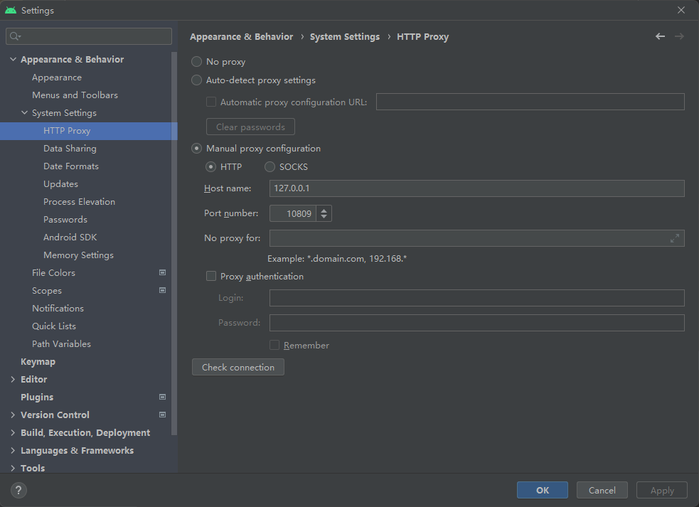
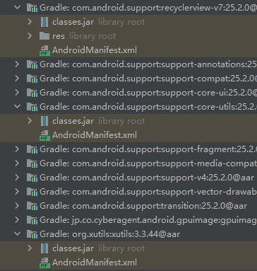
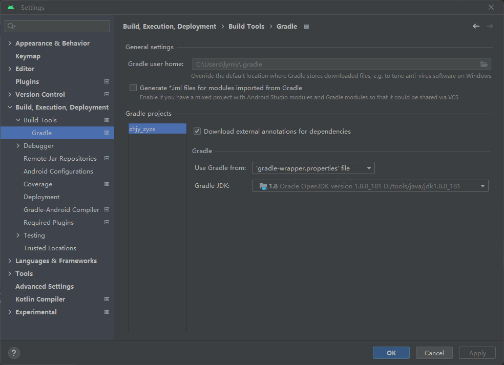

# Android Studio

### 使用代理



貌似这里设置了之后会连同 gradle 也是用代理，可以不用到 gradle.properties 中再去配置。

# Gradle

### 使用国内源

Project: build.gradle

```nginx
// Top-level build file where you can add configuration options common to all sub-projects/modules.

buildscript {

    repositories {
        google()
        maven{ url 'http://maven.aliyun.com/nexus/content/groups/public/'}
    }
    dependencies {
        classpath 'com.android.tools.build:gradle:4.2.2'
        // NOTE: Do not place your application dependencies here; they belong
        // in the individual module build.gradle files
    }
}

allprojects {
    repositories {
        google()
        maven{ url 'http://maven.aliyun.com/nexus/content/groups/public/'}
    }
}

task clean(type: Delete) {
    delete rootProject.buildDir
}

```


### 使用代理

查看代理软件的本地 http 端口

```properties
# gradle.properties
systemProp.http.proxyHost=127.0.0.1
systemProp.http.proxyPort=10809
systemProp.https.proxyHost=127.0.0.1
systemProp.https.proxyPort=10809
```

> [!NOTE]
>
> 删除代理时，注意检查是否有全局配置文件，如`当前用户/.gradle/gradle.properties`。
>
> 可以在 Project - Android 模式 - Gradle Scripts下看到，显示为`Gradle Properties`。

### 运行旧项目

根据 IDE 报错更改 gradle 版本号，如 2022-07-23，gradle 最低 4.6，`com.android.tools.build:gradle`最低 3.2.0

gradle

```properties
# gradle-wrapper.properties
distributionUrl=https\://services.gradle.org/distributions/gradle-4.6-bin.zip
```

`com.android.tools.build:gradle`

```nginx
# build.gradle (Project)
buildscript {
    dependencies {
        classpath 'com.android.tools.build:gradle:3.2.0'

        // NOTE: Do not place your application dependencies here; they belong
        // in the individual module build.gradle files
    }
}
```

然后根据 Android Studio 的提示修改配置文件，可能需要的修改：

删除 local.properties 中的 ndk 配置

```properties
sdk.dir=C\:\\softwares\\android-studio\\sdk
```

Project build.gradle 中把仓库加上

```nginx
buildscript {
    repositories {
        google()
        maven{ url 'http://maven.aliyun.com/nexus/content/groups/public/'}
    }
}

allprojects {
    repositories {
        google()
        maven{ url 'http://maven.aliyun.com/nexus/content/groups/public/'}
    }
}
```

删除 app/build.gradle 的`allprojects`配置，仓库用 Project 的 build.gradle 配置就好

```nginx
allprojects {
    repositories {
        jcenter()
        maven { url 'https://jitpack.io' }
        flatDir {
            dirs 'libs'
        }
    }
}
```

`flatDir`加到`android.repositories`下

```nginx
repositories {
    flatDir {
        dirs 'libs'   // aar放置目录
    }
}
```

配置检查选项，错误时不中断构建，`android`下

```nginx
lintOptions {
    checkReleaseBuilds false
    // Or, if you prefer, you can continue to check for errors in release builds,
    // but continue the build even when errors are found:
    abortOnError false
}
```

删除`android.signingConfigs`属性，用根据 Android Studio 的提示使用证书就行

改完以上几项基本上是可以编译了，但是代码可能各种报错，Android Studio Project 窗口看下External Libraries，很多android/第三方库中可能只有一个 AndroidManifest.xml，正常应该包含一个 classes.jar，可能有其他资源文件：



那么这个工程可能使用的是远古工程目录（Eclipse？），在 app/build.gradle 中应该还有如下的目录配置：

```nginx
sourceSets {
    main {
        manifest.srcFile 'AndroidManifest.xml'
        java.srcDirs = ['src']
        resources.srcDirs = ['src']
        jniLibs.srcDirs = ['libs']
        aidl.srcDirs = ['src']
        renderscript.srcDirs = ['src']
        res.srcDirs = ['res']
        assets.srcDirs = ['assets']
    }
    // Move the build types to build-types/<type>
    // For instance, build-types/debug/java, build-types/debug/AndroidManifest.xml, ...
    // This moves them out of them default location under src/<type>/... which would
    // conflict with src/ being used by the main source set.
    // Adding new build types or product flavors should be accompanied
    // by a similar customization.
    debug.setRoot('build-types/debug')
    release.setRoot('build-types/release')
}
```

```bash
$ tree app -L 1
app
|-- AndroidManifest.xml
|-- app.iml
|-- assets
|-- build.gradle
|-- gen
|-- libs
|-- project.properties
|-- res
`-- src
```

且不管上面的配置对不对了，这个工程目录是有问题的，Module 默认目录：

```bash
$ tree src -L 2
src
|-- androidTest
|   `-- java
|-- main
|   |-- AndroidManifest.xml
|   |-- assets
|   |-- ic_launcher-web.png
|   |-- java
|   `-- res
`-- test
    `-- java
```

直接在 src 下创建`main/java`目录，将源代码`com.xxx`放入`main/java`，将`assets`/`res`/`AndroidManifest.xml`等文件放入`main`，删除 app/build.gradle `android.sourceSets`配置。尝试重新 grade sync 或 Make Project。

> [!TIP]
>
> 可以使用 Android Studio 右键 src 目录 - new - Directory，可以直接创建`main/java`/`test/java`/`androidTest`等目录。

---

还有更离谱的，打开工程，看着它下载了一会各种依赖，完成后发现 Project 窗口中没有显示 app 或其他 module，也没有显示 gradle 文件夹，只有几个文件，gradle sync 后也只显示了个 failed（竟然是绿色的）。

检查 settings.gradle 文件中是否`include`了 module

```nginx
include ':app', ':libksylive'
```

从资源管理器中打开工程目录 - gradle - wrapper - gradle-wrapper.properties

```properties
#Fri Feb 09 10:39:56 CST 2018
distributionBase=GRADLE_USER_HOME
distributionPath=wrapper/dists
zipStoreBase=GRADLE_USER_HOME
zipStorePath=wrapper/dists
distributionUrl=https\://services.gradle.org/distributions/gradle-4.10.1-all.zip
```

查看 gradle 是否版本过低了，截止 2022-09-22，最低版本要求是 4.6，手动改到支持的版本，然后重新打开工程、gradle sync。

### Gradle 升级 4.2.2

gradle/wrapper/gradle-wrapper.properties

```
-distributionUrl=https\://services.gradle.org/distributions/gradle-4.10.1-all.zip
+distributionUrl=https\://services.gradle.org/distributions/gradle-6.7.1-all.zip
```

Project: build.gradle

```nginx
buildscript {

    repositories {
        google()
        maven{ url 'http://maven.aliyun.com/nexus/content/groups/public/'}
    }
    dependencies {
-        classpath 'com.android.tools.build:gradle:3.3.1'
+        classpath 'com.android.tools.build:gradle:4.2.2'
        // NOTE: Do not place your application dependencies here; they belong
        // in the individual module build.gradle files
    }
}
```

Project: build.gradle

```nginx
android {
	repositories {
        flatDir {
            dirs 'libs'   // aar放置目录
        }
    }
}
```

↓

```nginx
android {
	sourceSets {
        main {
            jniLibs.srcDirs = ['libs']
        }
    }
}
```


# 问题/报错

### Manifest merger failed with multiple errors, see logs

```bash
gradlew processDebugManifest --stacktrace
# 可以看到更多信息用:
gradlew processDebugManifest --stacktrace -info -scan -debug
```

如：

```
Element uses-feature#android.hardware.camera.autofocus at AndroidManifest.xml:42:5-44:36 duplicated with el
```

AndroidManifest.xml 中`android.hardware.camera.autofocus`权限重复

### 打包报 Cannot find a version of ‘com.android.support:support-annotations‘ ... 'com.android.support:support-annotations:28.0.0'

app build.gradle 中在`android`中加入：

```gradle
lintOptions {
    checkReleaseBuilds false
    abortOnError false
}
```

> [Cannot find a version of ‘com.android.support:support-annotations‘ that...](https://blog.csdn.net/weixin_54615356/article/details/112858578)

### 修改包名后 adb 运行报 Error: Activity class {com.xxxx.jdspad/com.xxxx.mtxxclasscard.SplashActivity} does not exist.

删除 module build.gradle 中 `android.defaultConfig.applicationId`，不行再删除app下的`build`文件夹

### /lib/arm/libVoAACEncoder.so" has text relocations

/lib/arm/libVoAACEncoder.so" has text relocations 
(https://android.googlesource.com/platform/bionic/+/master/android-changes-for-ndk-developers.md#Text-Relocations-Enforced-for-API-level-23)

so动态链接库的代码并非PIC（Position independent code）

将应用 API level 改为22

> [lib/arm/libVoAACEncoder.so has text relocations问题的解决方案](https://blog.csdn.net/yf1252555020/article/details/83616494)

代码按照报错的信息处理，如：

- `findViewById`强制类型转换
- 安装apk文件方式
- 无需申请权限
- implementation 'com.android.support:appcompat-v7:26.1.0' 版本改为 `22+`
- 删除一些控件不支持的属性，如`roundIcon`

### java.lang.NullPointerException: android.content.pm.ProviderInfo.loadXmlMetaData

使用 FileProvider 创建 uri 时报错

```java
Uri apkUri =
                        FileProvider.getUriForFile(mContext, mContext.getApplicationInfo().packageName + ".provider", result);
```

```log
java.lang.NullPointerException: Attempt to invoke virtual method ‘android.content.res.XmlResourceParser android.content.pm.ProviderInfo.loadXmlMetaData(android.content.pm.PackageManager, java.lang.String)’ on a null object reference
```

`FileProvider.getUriForFile`的第二参数 provider 的`authorities`属性值传递错误，注意对比传入的字符串和 AndroidManifest.xml 中的`provider`配置

> [NullPointerException: Attempt to invoke virtual method ‘android.content.res.XmlResourceParser androi_android_9527_的博客-CSDN博客](https://blog.csdn.net/android_9527_/article/details/107555134)

### External Libraries android/第三方库中可能只有一个 AndroidManifest.xml、代码中引用报错

工程目录有问题，参看上文

### Android Studio SDK Manager 中只有已安装的 SDK，没有未安装的

没有正常连接到 SDK Update Sites，可以在 SDK Update Sites Tab 页中添加国内镜像，或着配置 Android Studio 代理，参看上文

### android.view.ViewRootImpl$CalledFromWrongThreadException: Only the original thread that created a view hierarchy can touch its views. Expected: JavaBridge Calling: main

原因：在 JavaBridge 中 show 了 AlertDialog，在主线程中 dismiss

解决：在主线程中 show 和 dismiss

### Google Play 需要最低的 API level

Project: build.gradle

```nginx
android {
    lintOptions {
        checkReleaseBuilds false
    }
}
```

跳过这项验证

### Unable to make field private static final java.util.Map java.lang.ProcessEnvironment.theCaseInsensitiveEnvironment accessible: module java.base does not "opens java.lang" to unnamed module @3e57cd70

gradle jdk 版本过高

`Settings - Build, Excution, DeployMent - Build Tools - Gradle`，设置合适的 jdk 版本



### make project 时：Failed to read key jsyx_key from store ... DerInputStream.getLength(): lengthTag=109, too big

删除./gradle 和 /build 文件夹，`File - Invalidate Caches`

> [DerInputStream.getLength(): lengthTag=109, too big. - 狂奔的小狮子 - 博客园 (cnblogs.com)](https://www.cnblogs.com/spring87/p/16858948.html)

