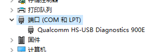
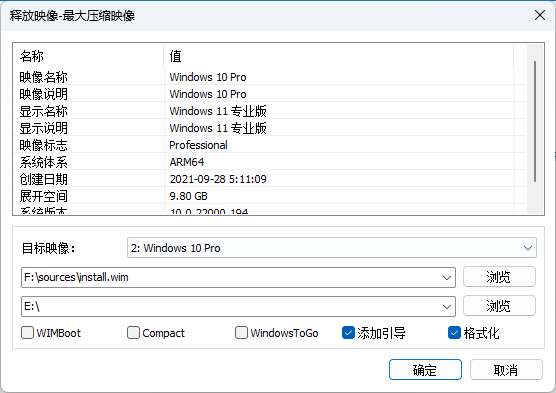

# MIX2S-win

> 官方教程：
>
> [安装教程 | Renegade Project (renegade-project.tech)](https://renegade-project.tech/zh/install)
>
> [【官方】在Mix2s等845设备上安装Win11的新方法~_哔哩哔哩_bilibili](https://www.bilibili.com/video/BV1PZ4y1Z7AZ/?vd_source=cfbed4eef00e94f603d6faffccca7c03)
>
> 其他非常有用的教程：
>
> [MIX2S刷入Windows11Arm教程 - Chr_小屋 (chrxw.com)](https://blog.chrxw.com/archives/2021/07/18/1582.html/comment-page-1?replyTo=623)
>
> [小米 MIX2S 安装 Windows 11 ARM64 双系统踩坑记录 - 知乎 (zhihu.com)](https://zhuanlan.zhihu.com/p/577513622)


> 下载 ARM64 Windows 镜像：
>
> [uupdump.net](https://uupdump.net/known.php?q=windows+11)
>
> [UUP (Unified Update Platform) Generation Project (v2.4.18)](https://uup.rg-adguard.net/)
>
> [原版软件 (itellyou.cn)](https://next.itellyou.cn/Original/)

##### 亲测结果

仅测试了 MSDN 正式版镜像。

- Win11 22H2 + [2210.1-fix](https://github.com/edk2-porting/WOA-Drivers/releases/tag/2210.1-fix)/[v2.0rc2](https://github.com/edk2-porting/WOA-Drivers/releases/tag/v2.0rc2)：开机触屏无效
- Win11 21H2 + [2210.1-fix](https://github.com/edk2-porting/WOA-Drivers/releases/tag/2210.1-fix)：无法开机
- **Win11 21H2 + [v2.0rc2](https://github.com/edk2-porting/WOA-Drivers/releases/tag/v2.0rc2)/[v1.1](https://github.com/edk2-porting/WOA-Drivers/releases/tag/v1.1)：正常**

[2210.1-fix](https://github.com/edk2-porting/WOA-Drivers/releases/tag/2210.1-fix)是一个非常坑爹的驱动，我还以为是我的屏幕不是一个批次的呢:dog:

# 安装 USB 驱动

小米官方 USB 驱动：[图文详解小米手机驱动安装 (miui.com)](https://web.vip.miui.com/page/info/mio/mio/detail?postId=18464849&app_version=dev.20051)

或者通过 MiFlash 工具安装。

高通 USB 驱动（Qualcomm USB Driver）：[Qualcomm USB Driver (HS-USB QDLoader 9008) - Gsm Official](https://www.gsmofficial.com/qualcomm-usb-driver/)

# 备份基带

> [MIX2S刷入WOA导致QCN丢失的恢复方法 - Chr_小屋 (chrxw.com)](https://blog.chrxw.com/archives/2021/09/26/1616.html)
>
> 可能有用的教程：
>
> [[GUIDE\] Backup, edit and restore QCN. Fixing lost IMEI. | XDA Forums](https://xdaforums.com/t/guide-backup-edit-and-restore-qcn-fixing-lost-imei.4101611/)
>
> [小米 MIX2S polaris QCN 备份分享 - General chit-chat 日常闲聊 - Renegade Project (renegade-project.tech)](https://forum.renegade-project.tech/t/mix2s-polaris-qcn/1268)

### root 手机

提取 boot.img → Magisk 修补 → 刷入 boot

### 打开 Diagnostics 模式

```bash
adb shell
# 提权，手机上magisk点击同意
$> su
# 打开Diagnostics模式
#> setprop sys.usb.config diag,adb
```

备管理器里的`端口(COM 和 LPT)`中显示如下说明成功了，如果没显示的话说明需要打高通的HS-USB驱动。



### 使用 QFIL 备份基带

下载 QFIL tool：[QFIL Tool v2.0.3.5 (all version) - Gsm Official](https://www.gsmofficial.com/qfil-tool/)

打开 QFIL，点击`SelectPort...`，选择`Qualcomm HS-USB Android DIAG xxx`

点击`Tools - QCN Backup Restore`，勾选`Enable Multi-SIM`，点击`Backup QCN`，等待完成。

注意妥善保存备份的 qcn 文件。

# 刷入 rec

```
fastboot flash recovery E:\flash\tools\recovery.img
```

> [!NOTE]
>
> 测试 TWRP 和 狐橙可以，LineageOS rec 没有`mkfs.fat`命令。

# 使用 parted 工具分区

手机重启到 rec

### 发送 parted 工具到手机

```bash
# push parted文件到手机
adb push E:\flash\tools\parted /tmp/

adb shell
chomd 755 /tmp/parted
```

### 取消挂载`data`下的分区

```bash
# 查看分区挂载情况
df -h
# 取消挂载分区，如
umount /data
```

> [!TIP]
>
> 或者在 rec 中取消挂载

### 分区

查看分区情况

```bash
polaris:/sbin # parted /dev/block/sda
GNU Parted 3.2
Using /dev/block/sda
Welcome to GNU Parted! Type 'help' to view a list of commands.
(parted)
(parted) print
Model: TOSHIBA THGAF4G9N4LBAIRB (scsi)
Disk /dev/block/sda: 59.1GB
Sector size (logical/physical): 4096B/4096B
Partition Table: gpt
Disk Flags:

Number  Start   End     Size    File system  Name        Flags
 1      24.6kB  41.0kB  16.4kB               switch
 2      41.0kB  73.7kB  32.8kB               ssd
 3      73.7kB  524kB   451kB                bk01
 4      524kB   786kB   262kB                bk02
 5      786kB   1049kB  262kB                bk03
 6      1049kB  1573kB  524kB                keystore
 7      1573kB  2097kB  524kB                frp
 8      2097kB  4194kB  2097kB               bk04
 9      4194kB  8389kB  4194kB               misc
10      8389kB  16.8MB  8389kB               logfs
11      16.8MB  33.6MB  16.8MB               oops
12      33.6MB  50.3MB  16.8MB               devinfo
13      50.3MB  67.1MB  16.8MB               bk05
14      67.1MB  134MB   67.1MB  ext4         persist
15      134MB   201MB   67.1MB  ext4         persistbak
16      201MB   268MB   67.1MB               logdump
17      268MB   403MB   134MB                minidump
18      403MB   1275MB  872MB   ext4         cust
19      1275MB  1342MB  67.1MB               recovery
20      1342MB  1611MB  268MB   ext4         cache
21      1611MB  59.1GB  57.5GB  ext4         userdata
```

在`userdata`分区中分出 windows 所需的`esp`和`系统分区`，剩下空间给`userdata`

> 64GB，留了800MB给ESP分区，留了40GB左右给Windows系统，~~留了4GB左右给PE系统~~，剩下7GB左右给安卓系统。

```bash
#创建820MB大小的esp分区，格式为fat32
mkpart esp fat32 1611MB 2500MB

#创建47GB大小的win分区，格式为NTFS
mkpart win ntfs 2500MB 50GB

#创建7GB大小的userdata分区，格式为ext4
mkpart userdata ext4 50GB 57.5GB

(parted) print
Model: TOSHIBA THGAF4G9N4LBAIRB (scsi)
Disk /dev/block/sda: 59.1GB
Sector size (logical/physical): 4096B/4096B
Partition Table: gpt
Disk Flags:

Number  Start   End     Size    File system  Name        Flags
...
21      1611MB  2500MB  889MB   fat32        esp
22      2500MB  50.0GB  47.5GB  ntfs         win
23      50.0GB  57.5GB  7499MB  ext4         userdata

# 设置esp启动分区
set 21 esp on

(parted) print
Model: TOSHIBA THGAF4G9N4LBAIRB (scsi)
Disk /dev/block/sda: 59.1GB
Sector size (logical/physical): 4096B/4096B
Partition Table: gpt
Disk Flags:

Number  Start   End     Size    File system  Name        Flags
...
21      1611MB  2500MB  889MB   fat32        esp         boot, esp
22      2500MB  50.0GB  47.5GB  ntfs         win
23      50.0GB  57.5GB  7499MB  ext4         userdata
```

因为分区改变了，重启 rec，进入`adb shell`，格式化分区

```bash
#格式化esp分区
mkfs.fat -F32 -s1 /dev/block/by-name/esp
#格式化win分区
mkfs.ntfs -f /dev/block/by-name/win
#格式化userdata分区
mke2fs -t ext4 /dev/block/by-name/userdata
```

# 刷入 Devcfg 分区

下载 Devcfg 文件：[设备 | Renegade Project (renegade-project.tech)](https://renegade-project.tech/zh/devices) 或 http://files.renegade-project.org/devcfg-polaris_FixTS.img

手机进入 fastboot

```bash
fastboot flash devcfg_ab E:\flash\tools\devcfg-polaris_FixTS_3.img
fastboot flash devcfg_a E:\flash\tools\devcfg-polaris_FixTS_3.img
fastboot flash devcfg_b E:\flash\tools\devcfg-polaris_FixTS_3.img
```

# 刷入 UEFI boot

下载 boot-polaris-v2.0rc2.img：[Renegade Project Download (renegade-project.tech)](https://download.renegade-project.tech/)

手机进入 fastboot

```bash
fastboot flash boot boot-polaris-v2.0rc2.img
```

> [!NOTE]
>
> 进行此步骤前，需要在 rec 备份 boot 分区，否则无法进入 Android

重启手机，将进入 UEFI 启动菜单

# 释放 Windows 镜像

### 进入大容量存储模式

使用音量键选择`UEFI Boot Menu`，接着选择`USB Attached SCSI (UAS) Storage` 以进入大容量存储模式。等待一会，电脑上将会出现多个磁盘分区。

### 释放映像

启动Dism++, 选择`文件 -> 释放镜像`，填入`映像路径` 和`安装路径` ，选中`添加引导`和`格式化`，然后点击确定。此时会提示会在xx磁盘xx分区添加引导，注意确认是上面分配的21分区。

映像路径：挂载 Windows ISO 镜像，选中里面的`sources/install.wim`文件

安装路径：系统分区（上面分配的大小约为 47G 的分区）

引导分区：esp分区（上面分配的大小约为 800M 的分区）



# 安装驱动

下载 WOA-Drivers：[Releases · edk2-porting/WOA-Drivers (github.com)](https://github.com/edk2-porting/WOA-Drivers/releases) 或 [Renegade Project Download (renegade-project.tech)](https://download.renegade-project.tech/)

打开 Dism++, **在面板上选择你的手机对应的系统**（请不要选择你的PC的C盘），然后点击`驱动管理 -> 添加驱动`，选择解压好的驱动文件夹，然后等待安装完成。

# 关闭驱动签名认证

### 设置 esp 分区卷标

```bash
diskpart
# 打印磁盘
DISKPART> list disk
# 选择手机对应的最大的磁盘，大概57G
DISKPART> select disk 7
# 打印分区
DISKPART> list part
# 选择esp分区（上面分配的21分区）
DISKPART> select part 21
# 设置卷标
DISKPART> assign letter=J 
DISKPART> exit
```


### 修改 esp 分区的 bcd 文件

```bash
cd /d J:\EFI\Microsoft\Boot
bcdedit /store BCD /set {default} testsigning on
bcdedit /store BCD /set {default} nointegritychecks on
```

> [!NOTE]
>
> 此处应用管理员 cmd，不然提示无权限。

# 进入 windows

强制关机，重启进入 windows 系统。大概8分钟后，进入引导界面。

### 关闭 Windows Defender

太占用 CPU

[Defender Control v2.1 (sordum.org)](https://www.sordum.org/9480/defender-control-v2-1/)

关闭后，观察任务管理器是否还有`Antimalware Service Executable`进程。

### 关闭 Windows 更新

亲测更新后，启动蓝屏

[Windows Update Blocker v1.8 (sordum.org)](https://www.sordum.org/9470/windows-update-blocker-v1-8/)

### 启用无密码远程连接

cmd `regedit`打开注册表编辑器，导航到**HKEY_LOCAL_MACHINE\SYSTEM\CurrentControlSet\Control\Lsa**，再双击打开**“LimitBlankPasswordUse”**（若没有，则手动添加一项），将数值修改为0，重启系统。

> [win10 win11无密码远程桌面连接怎么设置 - Tank电玩&米多贝克 (mi-d.cn)](https://www.mi-d.cn/6114)
