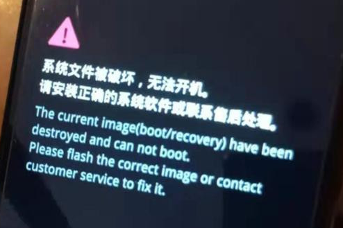

# 一加8刷机

# adb 命令

```bash
# 查看设备
adb devices
# 重启到fastboot
adb reboot bootloader

# 查看设备
fastboot devices
# 重启
fastboot reboot
# 重启到recovery
fastboot reboot recovery
# 运行某个镜像
fastboot boot recovery.img

# 刷分区
fastboot flash boot boot.img
fastboot flash recovery recovery.img

# sideload
# 需要手机在recovery点击：Apply Update - Apply from ADB
# 新刷机应格式化data： Factory Reset - Format data / factory reset
# 刷完之后可以在手机上点击reboot
adb sideload xxx.zip

# 查看当前a/b分区
adb shell getprop ro.boot.slot_suffix
_a

# 查看应用列表
adb shell pm list packages

# 去除叹号
adb shell settings put global captive_portal_server connect.rom.miui.com
# 高版本要这个：
adb shell settings put global captive_portal_https_url https://connect.rom.miui.com/generate_204
```

> [安卓系列全机型刷写原生 去除wifi打叉 去除感叹号方法解析_叹号杀手_安卓机器的博客-CSDN博客](https://blog.csdn.net/u011283906/article/details/126798587)

### 一加

```bash
# 禁用系统更新
adb shell pm disable-user com.oneplus.opbackup
adb shell pm disable-user com.nearme.instant.platform
adb shell pm disable-user com.heytap.cloud

# 启用系统更新
adb shell pm enable com.oneplus.opbackup
```

> [使用ADB禁用系统更新-新手教程 - 一加8系列 - 一加手机社区官方论坛 - 公司门户网 (oneplusbbs.com)](https://www.oneplusbbs.com/forum.php?mod=viewthread&tid=5575868)

# 快捷键

recovery：电源键+音量`-`

fastboot：电源键+音量`-`

强制关机：电源键（8s+）

##### 一加8快捷键

强制关机：电源键+音量`+`

# 一加8 解锁

刷一加官方的包氢/氧/ColorOS不需要解锁

查看是否解锁：重启到fastboot，看上面写的是`locked`还是`unlocked`

```bash
# 手机开发者模式开启oem解锁

adb reboot bootloader
fastboot oem unlock
```

> [!NOTE]
>
> 解锁会格式用户数据，一定记得备份。

# 一加8 刷 Evolution X

翻看了一下 XDA 帖子，说需要 Android 12、OOS12（氧OS12）底包，所以先下载一个最新的氧12包：`一加OnePlus 8 氧OS 12.1 C.33 全量包 | 欧版IN2013`

1. 使用本地升级，刷两遍，确保A/B分区都刷入了这个底包

> [!TIP]
>
> 一加的本地升级需要打开开发者模式才会出现，但也可能是灰色点不了。
>
> 可以用 OPLocalUpdate_For_Android12.apk 来本地升级。
>
> [氧os12没有本地更新 - 一加9系列 - 一加手机社区官方论坛 - 公司门户网 (oneplusbbs.com)](https://www.oneplusbbs.com/forum.php?mod=viewthread&tid=6148220)

2. 手机解锁
3. 刷机

> ***\*First Time Install / Clean Flash (8 & 8 Pro)\****
>
> 1. Be on any version of OOS12 (required firmware is shipped with Evolution X for these devices)
> 2. Download vbmeta, recovery, and rom for your device from [here](https://forum.xda-developers.com/t/rom-alpha-13-0_r3-official-evolution-x-7-0-08-17-2022.4480927/post-87295275)
> 3. Reboot to bootloader
> 4. fastboot flash vbmeta vbmeta.img
>    fastboot flash recovery recovery.img
>    fastboot reboot recovery
> 5. While in recovery, navigate to Apply update -> Apply from ADB (if you experience no touch in recovery, then use the vol & pwr keys. This is a sign of you being on an early version of OOS12. The required firmware will be flashed during installation of the ROM.)
> 6. adb sideload rom.zip (replace "rom" with actual filename)
> 7. Format data, reboot to system & #KeepEvolving
>
> [[ROM\][13.0_r11][OFFICIAL] Evolution X 7.2 [10/29/2022] | XDA Forums (xda-developers.com)](https://forum.xda-developers.com/t/rom-13-0_r11-official-evolution-x-7-2-10-29-2022.4480927/)

```bash
adb reboot bootloader
# 刷vbmeta分区
fastboot flash vbmeta vbmeta.img
# 刷recovery
fastboot flash recovery recovery.img
# 重启到recovery
fastboot reboot recovery

# sideload刷入Evolution X
# 在recovery点击：Apply Update - Apply from ADB
adb sideload xxx.zip
# 格式化data
# 在recovery点击：Factory Reset - Format data / factory reset
# 重启
# 在recovery点击：reboot
```

> [!TIP]
>
> 正常刷类原生大致都是这个步骤。

### 刷 LineageOS 的问题

2022-10-29 我在两次本地升级氧12后，先刷的是 LineageOS，官方wiki的步骤[Install LineageOS on instantnoodle | LineageOS Wiki](https://wiki.lineageos.org/devices/instantnoodle/install)与以上类似，只是需要多刷一个 dtbo 分区。

按照步骤依次刷完`dtbo`/`vbmeta`/`recovery`，重启到 recovery，一加 logo 一闪而过，接着显示：



进入系统或 rec 都会跳到这个界面，只能强制关机，然后进入 fastboot，但是官方救砖工具又不能直接在 fastboot 用:dog:。幸好大侠阿木工具箱里面有一个切换 A/B 分区的功能，切换了之后就进入B分区的 氧OS了。

**立马本地升级了氧OS，把被刷坏的A分区刷成氧OS**，可以使用 adb 命令查看当前分区，确保A分区已经正常运行氧OS了，再继续进行刷机操作。

尝试着刷了 Evolution X 系统，可以正常运行。

我怀疑是 LineageOS 提供的 vbmeta.img 有问题，于是直接刷入 LineageOS 的 recovery，可以正常进入，证明怀疑的没错😉，接着就 sideload zip，开机，一切正常。

所以此次的砖其实问题不大，解决方法有两个：1. 切换到另一分区，2. 找到正常的 vbmeta.img 输入 vbmeta 分区，3. 官方救砖工具，可能是我没操作对:dog:

> [realme x显示系统文件被损坏，无法开机怎么办？ - 知乎 (zhihu.com)](https://www.zhihu.com/question/372361715)

> [!TIP]
>
> 对 A/B 分区的猜测：系统内的升级，如一加本地升级、LineageOS 系统更新，都是在另一分区进行；在 fastboot、recovery 的操作是对当前分区操作。

# 救砖/线刷

下载救砖包，如`线刷救砖包氧11.0.4.4`，解压。

打开 MsmDownloadTool V4.0.exe，选择`Other`，target选择`O2`/`H2`

> 1、解压ROM压缩包->打开MsmDownloadToolV4.0.exe->点Factory选择Other->login;
>
> 注:没工厂账号只能用游客登陆。
>
> 下面列表理应显示"com ..."，即显示9008串口，没有也不要着急，只要驱动安装正确，连上手机就有了。
>
> 2、显示com串口：target选择h2/o2->点start->手机关机->**按住手机音量键+-不放手**->用数据线连接到电脑
>
> ->自动开始下载->**松手**->等待文件下载完成->拔数据线->等待自动重启/按住电源和音量上重启->完成；
>
> 3、不显示com串口：关闭此软件->手机关机->**按住手机音量键+-不放手**->用数据线连接到电脑->重新打开MsmDownloadToolV4.0.exe->显示串口(此时电脑可能会有间歇usb连接和断开的声音，不用理)
>
> ->target选择h2/o2->点start->**松手**->自动开始下载->等待文件下载完成->等待自动重启/按住电源和音量上启-->完成。
>
> [一加8T之高通9008线刷救砖 - 知乎 (zhihu.com)](https://zhuanlan.zhihu.com/p/432940504)


> 第一次打开的话可能会没有这些串口，这时候我们把手机关机，强迫症的话可以双清一下，摁住音量+跟-  然后连接上数据线，会出现一个已连接
>
> [关于一加八9008救砖教程 - 一加8系列 - 一加手机社区官方论坛 - 公司门户网 (oneplusbbs.com)](https://www.oneplusbbs.com/forum.php?mod=viewthread&tid=5495404)

# 系统功能

### 更换授时服务器

类原生默认使用 android.com 授时，国内访问不了，导致无法自动设置时间

> 可以使用[国家授时中心提供的NTP服务](https://link.zhihu.com/?target=https%3A//www.cas.cn/tz/201809/t20180921_4664344.shtml)或者[阿里云的NTP服务](https://link.zhihu.com/?target=https%3A//help.aliyun.com/document_detail/92704.html)
>
> 将 [ntp.ntsc.ac.cn](https://link.zhihu.com/?target=http%3A//ntp.ntsc.ac.cn) 替换成相应的NTP服务器地址即可
>
> 尝试在Android上运行（需root）：
>
> ```bash
> su
> settings put global ntp_server ntp.ntsc.ac.cn
> ```
>
> 或是在ADB上运行（无需root）：
>
> ```bash
> adb shell "settings put global ntp_server ntp.ntsc.ac.cn"
> ```
>
> 由于Android的时间同步服务并不是时刻运行的，可尝试重启后开关一下自动同步时间，应该就会生效了。
>
> [类原生Andorid修改时间同步服务器 - 知乎 (zhihu.com)](https://zhuanlan.zhihu.com/p/32518769)