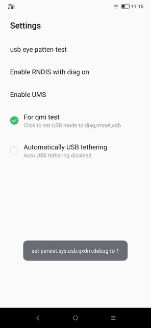
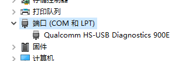
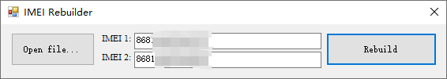

# 基带备份与还原

众所周知，刷 WOA（Windows on Android）容易掉基带。

> 下载 QFIL tool：[QFIL Tool v2.0.3.5 (all version) - Gsm Official](https://www.gsmofficial.com/qfil-tool/)

> [MIX2S刷入WOA导致QCN丢失的恢复方法 - Chr_小屋 (chrxw.com)](https://blog.chrxw.com/archives/2021/09/26/1616.html)
>
> [[GUIDE\] Backup, edit and restore QCN. Fixing lost IMEI. | XDA Forums](https://xdaforums.com/t/guide-backup-edit-and-restore-qcn-fixing-lost-imei.4101611/)
>
> [小米 MIX2S polaris QCN 备份分享 - General chit-chat 日常闲聊 - Renegade Project (renegade-project.tech)](https://forum.renegade-project.tech/t/mix2s-polaris-qcn/1268)

# 打开 Diagnostics 模式

> [!NOTE]
>
> 无论是备份还是还原，打开 Diagnostics 模式都是必要步骤。

### 方式1：拨号盘开启

部分手机可以通过拨号盘进入某些功能，开启 Diagnostics 模式，不过更多应该还是通过 root 吧。

> If you're using an stock ZUI ROM, open dialer and dial *#*#33284#*#*
> In the next screen select "For qmi test"
>
> 

### 方式2：root 手机

提取 boot.img → Magisk 修补 → 刷入 boot

```bash
adb shell
# 提权，手机上magisk点击同意
$> su
# 打开Diagnostics模式
#> setprop sys.usb.config diag,adb
```

备管理器里的`端口(COM 和 LPT)`中显示如下说明成功了，如果没显示的话说明需要打高通的HS-USB驱动。




# 使用 QFIL 备份基带

打开 QFIL，点击`SelectPort...`，选择`Qualcomm HS-USB Android DIAG xxx`

点击`Tools - QCN Backup Restore`，勾选`Enable Multi-SIM`，点击`Backup QCN`，等待完成。

注意妥善保存备份的 qcn 文件。

# 修改别人分享的 qcn 文件

> [!NOTE]
>
> 如果已备份自己的基带，那么就不用进行此步骤。

### 查看自己的 IMEI

在关于手机或者拨号盘`*#06#`查看。

### 方式1：通过高通的工具修改

QualcommIMEIRebuilder下载地址：https://www.mediafire.com/file/euosvxp285tr473/QualcommIMEIRebuilder.rar/file



填上自己的两个 IMEI - Rebuild - 保存

### 方式2：通过16进制编辑器修改

> [小米 MIX2S polaris QCN 备份分享 - General chit-chat 日常闲聊 - Renegade Project](https://forum.renegade-project.tech/t/mix2s-polaris-qcn/1268/3)
>
> [来自 溜溜mvp - 酷安](https://www.coolapk.com/feed/7600508?shareKey=NmQ5OWU5N2FjNzIwNjFjODgwNWY~&shareUid=1034989&shareFrom=com.coolapk.market_11.4.6)

> [!TIP]
>
> 根据高通的工具来看，似乎 MEID 并不重要，修改 IMEI 即可，手机刷入基带后实测可行。

# 使用 QFIL 恢复基带

打开 QFIL，点击`SelectPort...`，选择`Qualcomm HS-USB Android DIAG xxx`

点击`Tools - QCN Backup Restore`，选择 qcn 文件，勾选`Enable Multi-SIM`，点击`Restore QCN`，等待完成后重启手机。
