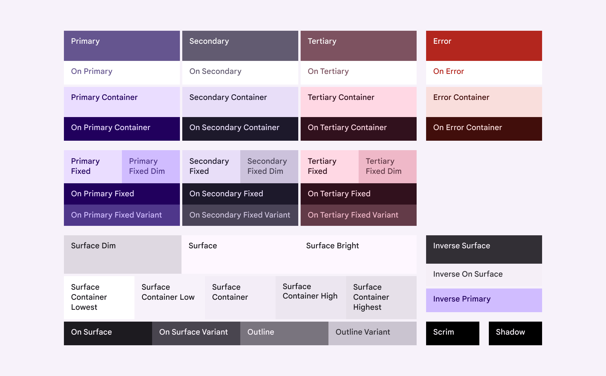
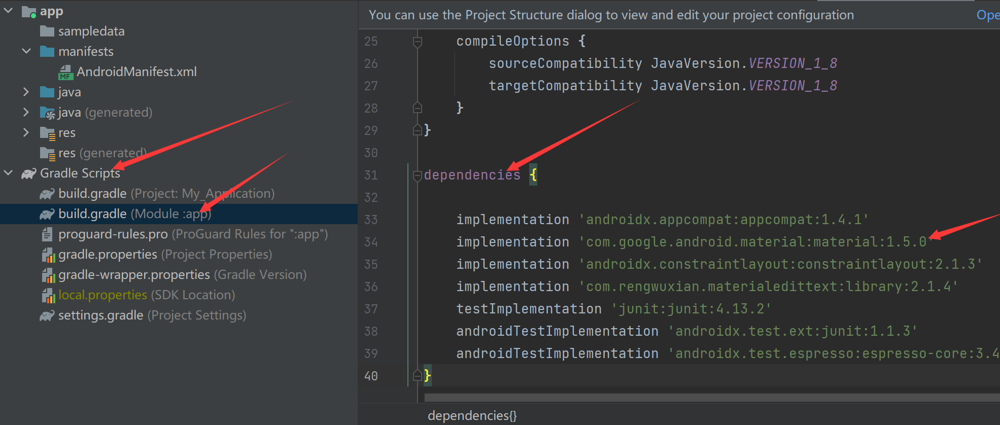
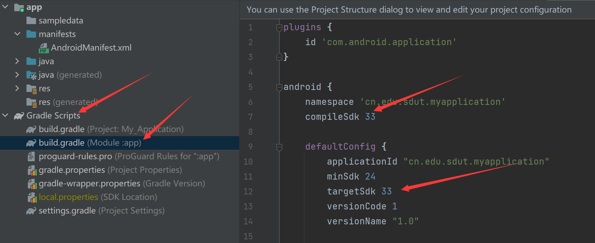
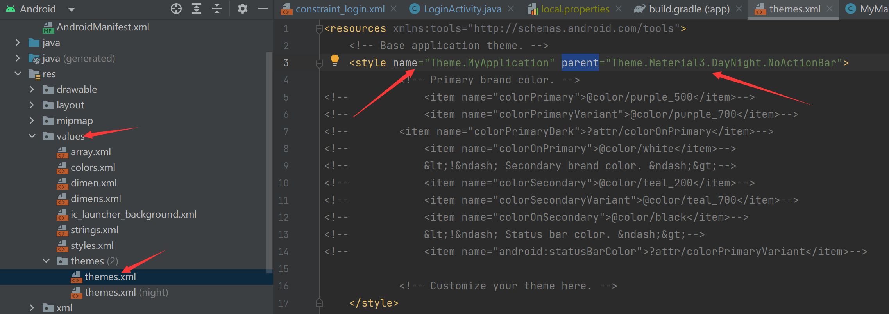

# Material You

即 Material 3

> 官网：[Material Design](https://m3.material.io/)
>
> 官方 java 示例：[material-components/material-components-android: Modular and customizable Material Design UI components for Android (github.com)](https://github.com/material-components/material-components-android/tree/master)
>
> 组件文档：[material-components-android/docs/components at master · material-components/material-components-android (github.com)](https://github.com/material-components/material-components-android/tree/master/docs/components)
>
> 官网主题构造器，可导出：[Material Theme Builder (material-foundation.github.io)](https://material-foundation.github.io/material-theme-builder/)

# 颜色

> - **Surface** – A role used for backgrounds and large, low-emphasis areas of the screen.
>
> - **Primary, Secondary, Tertiary** – Accent color roles used to emphasize or de-emphasize foreground elements.
> - **Container** – Roles used as a fill color for foreground elements like buttons. They should not be used for text or icons.
> - **On** – Roles starting with this term indicate a color for text or icons *on top* of its paired parent color. For example, **on primary** is used for text and icons against the **primary** fill color.
> - **Variant** – Roles ending with this term offer a lower emphasis alternative to its non-variant pair. For example, **outline variant** is a less emphasized version of the **outline** color.
>
> - **Surface**-用于背景和屏幕的大型低强调区域的角色。
> - **Primary, Secondary, Tertiary** - 主要，次要，第三-强调颜色角色，用于强调或强调前景元素。
> - **Container** - 容器-用作按钮等前景元素填充颜色的角色。它们不应用于文本或图标。
> - **On** - 文本或图标在其配对的父颜色之上的颜色。例如，**on primary**用于文本和图标与**primary**填充颜色的对比。
> - **Variant** - 与其非变体对相比较低强调的替代方案。例如，**outline variant**是**outline** 颜色的较低强调版本。
>
> [Color – Material Design 3](https://m3.material.io/styles/color/roles)，文档中讲述了 Material 3 中的颜色详细描述和使用范例。

### Static 静态配色

静态配色，只有白天和夜间两种配色。

> 
> 
> [Static color schemes – Material Design 3](https://m3.material.io/styles/color/static/baseline)：

### Dynamic：静态配色

根据系统主题色（比如从壁纸中取色）形成配色，自动变换，也支持夜间主题。

# 引入方法

> https://m3.material.io/libraries/mdc-android/getting-started

md3和 md2 引入方式是一样，但是需要：

- material库版本到`1.5.0`及以上
- compileSdkVersion，targetSdkVersion设置为 `31`以上
- 使用最新的 Android Studio

具体操作如下：

### 更新Gradle依赖

需要在`build.gradle`中更新Gradle依赖，将material库版本到1.5.0及以上

**build.gradle及修改 的位置**



在`dependencies`里面写入（上面图片可以看到）：

```gradle
implementation 'com.google.android.material:material:1.5.0'
```

In order to use the new Material3 themes and component styles, you should depend on **version 1.5.0 or later**.

### 修改版本Sdk版本

在`build.gradle`中修改`compileSdkVersion`和`targetSdkVersion`到31及以上

**build.gradle及修改 的位置**



将`compileSdk`和`targetSdk`改到31以及以上（上面图片可以看到）

### 修改App主题

将**themes.xml**的`Theme.AppCompat.*`或`Theme.MaterialComponents.*` 改为 `Theme.Material3.*`

静态配色：

1. `Theme.Material3.DayNight` 有标题栏
2. `Theme.Material3.DayNight.NoActionBar`没有标题栏

动态配色：

1. `Theme.Material3.DynamicColors.DayNight`
2. `Theme.Material3.DynamicColors.DayNight`

> [!NOTE]
>
> 同时要删除`res/values-night/themes.xml`，Material 3已经包含日间和夜间模式了，不需要单独配置。
>
> 夜间模式主题配置不当可能造成闪退，比如非 Material 3 主题是不包含`?attr/colorSecondaryContainer`等颜色的，切换夜间模式造成闪退。

**themes.xml及修改 的位置**


```xml
    <style name="XXXXXXX" parent="Theme.Material3.DayNight.NoActionBar">
<!--     上面name="XXXXXXX" 的  XXXXXXX改成自己的原来的   -->
<!--        中间不需要写内容   -->
    </style>
```

设置为`Theme.Material3.*`后部分组件便会自动变成 Material3 样式：

```xml
<Button → MaterialButton
<CheckBox → MaterialCheckBox
<RadioButton → MaterialRadioButton
<TextView → MaterialTextView
<AutoCompleteTextView → MaterialAutoCompleteTextView

```

### 使用动态颜色

我们过去在使用颜色时可能是硬编码，比如这样：

```xml
android:background="@color/colorPrimary"
```

启用md3后，应改为动态访问的方式，比如：

```xml
android:background="?attr/colorPrimary"
```

**至此已经可以在Android 12 上试试动态颜色的效果了。**

---

> [Android12 material you 动态配色_android colorprimary-CSDN博客](https://blog.csdn.net/weixin_50301255/article/details/130389102)
>
> [Android 启用 Material Design 3(Material You) 小白教程 - kingwzun - 博客园 (cnblogs.com)](https://www.cnblogs.com/kingwz/p/17300537.html)

### 编程方式使用颜色

```java
TypedArray ta = context.getTheme().obtainStyledAttributes(
    com.google.android.material.R.style.Theme_Material3_DynamicColors_DayNight,
    new int[] {com.google.android.material.R.attr.colorOnBackground, com.google.android.material.R.attr.colorTertiary});
colorHighlight = ContextCompat.getColor(context, ta.getResourceId(1, 0));
ta.recycle();

h.tvName.setTextColor(colorHighlight);
```

> [使用和获取Android的主题属性 - 简书 (jianshu.com)](https://www.jianshu.com/p/bce8ccabf7e1)

# MaterialCardView

```xml
<?xml version="1.0" encoding="utf-8"?>
<com.google.android.material.card.MaterialCardView xmlns:android="http://schemas.android.com/apk/res/android"
    xmlns:tools="http://schemas.android.com/tools"
    xmlns:app="http://schemas.android.com/apk/res-auto"
    android:id="@+id/card"
    android:layout_width="match_parent"
    android:layout_height="wrap_content"
    android:layout_marginTop="10dp"
    android:layout_marginHorizontal="14dp"
    android:foreground="?attr/selectableItemBackgroundBorderless"
    app:cardBackgroundColor="?attr/colorSurfaceContainer"
    app:cardElevation="0dp"
    app:rippleColor="?attr/colorPrimary"
    app:strokeWidth="0dp">

    <!-- 内部线性布局需要用LinearLayout实现 -->
    <LinearLayout
        android:layout_width="match_parent"
        android:layout_height="wrap_content"
        android:paddingHorizontal="12dp"
        android:paddingVertical="12dp"
        android:orientation="vertical">

        <LinearLayout
            android:layout_width="match_parent"
            android:layout_height="wrap_content"
            android:orientation="horizontal"
            android:gravity="center_vertical">

            <TextView
                android:id="@+id/tv_name"
                android:layout_width="0dp"
                android:layout_weight="1"
                android:layout_height="wrap_content"
                android:color="?attr/colorOnSurfaceVariant"
                android:textSize="18sp"/>

            <ImageView
                android:id="@+id/iv_arrow"
                android:layout_width="24dp"
                android:layout_height="24dp"
                android:src="@drawable/baseline_expand_more_24"
                android:rotation="-90"
                app:tint="?attr/colorOnBackground" />

        </LinearLayout>

    </LinearLayout>

</com.google.android.material.card.MaterialCardView>
```

>     app:strokeColor="@color/color_23d41e" //边框的颜色
>     app:strokeWidth="5dp" //边框的宽度
>     app:cardElevation="8dp" //阴影大小
>     app:cardCornerRadius="8dp"//角度大小
>     app:rippleColor="@color/color_23d41e"//点击波纹效果的颜色和获得焦点颜色
> [Android Material 新控件之更强大的CardView支持自定义边框 MaterialCardView(二)-CSDN博客](https://blog.csdn.net/wu296606241/article/details/121283764)

# 问题

### 在 selector.xml 中无法使用`?attr/xx`

比如设置背景为 selector，在 selector 中使用`?attr/xx`报错，暂无好的解决办法。

> 可以用编程方式实现：监听 + 设置
>
> [Android 多主题切换及 selector/drawable 无法引用 ?attr 属性的问题-CSDN博客](https://blog.csdn.net/weixin_34405332/article/details/88853712)
