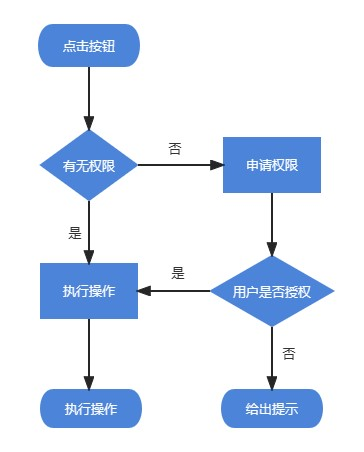

# 动态权限

```java
// 开启录音
// 用户有权限时执行的操作
public void recording() {
    showLoading("正在开启录音...", false);
	// TODO 开启录音
}

// 开启录音
// 无权限时申请权限（在授权回调中执行操作），有权限时执行操作
public void toRecording(){
    if (ContextCompat.checkSelfPermission(ITCPCMActivity.this, Manifest.permission.RECORD_AUDIO) != PackageManager.PERMISSION_GRANTED) {
        ActivityCompat.requestPermissions(ITCPCMActivity.this, new String[]{Manifest.permission.RECORD_AUDIO}, 1);
    } else {
        recording();
    }
}

// 授权回调
// requestCode参数对应ActivityCompat.requestPermissions中第三个参数，可根据它知道是什么地方申请的授权
@Override
public void onRequestPermissionsResult(int requestCode, @NonNull String[] permissions, @NonNull int[] grantResults) {
    switch (requestCode) {
        case 1:
            if (grantResults.length > 0 && grantResults[0] == PackageManager.PERMISSION_GRANTED) {
                recording();
            } else {
                Toast.makeText(this, "请授予麦克风权限，以正常使用录音。", Toast.LENGTH_SHORT).show();
            }
            break;
        default:
    }
}
```

> [!TIP]
>
> 每次调用的时候调用toXXX方法，就可以有权限就执行，没权限申请后执行
> 
> 

