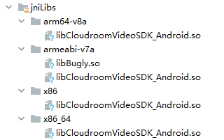

# 引入 jniLibs

Android系统目前支持以下七种不同的CPU架构，每一种都关联着一个相应的ABI。应用程序二进制接口（Application Binary Interface）定义了二进制文件（尤其是.so文件）如何运行在相应的系统平台上，从使用的指令集，内存对齐到可用的系统函数库。

如果项目中使用到了NDK（类似于JDK，因为版权问题谷歌自行开发了NDK），它将会生成.so文件，因此显然你已经在关注它了。如果只是使用Java语言进行编码，你可能在想不需要关注.so文件了吧，因为Java是跨平台的。但事实上，即使你在项目中只是使用Java语言，很多情况下，你可能并没有意识到项目中依赖的函数库或者引擎库里面已经嵌入了.so文件，并依赖于不同的ABI。例如，项目中使用RenderScript支持库，OpenCV，Unity，android-gif-drawable，SQLCipher等，你都已经在生成的APK文件中包含.so文件了，而你需要关注.so文件。

　指令集　　　　　　　　　厂商　　　　位数 
x86(x86)　　　　　　　　　　  Intel　　　　32
x86_64(Intel 64)　　　　　　　Intel　　　　64
arm64-v8a(ARMV8-A)　　　　AMR　　　　64
armeabi(ARM v5)　　　　　　  ARM　　　　32
armeabi-v7a(ARM v7)　　　　 ARM　　　　32
mips　　　　　　　　　　　　 MIPS　　　　32
mips64　　　　　　　　　　　MIPS　　　　64

> [Android jniLibs下目录详解（.so文件） - weizhxa - 博客园 (cnblogs.com)](https://www.cnblogs.com/weizhxa/p/7776509.html)

# 创建 jniLibs 文件夹

在 app 下 /src/main 下创建 jniLibs 文件夹（Android 默认位置），rebuild project

Projects 窗口中切换到 Android，若显示 jniLibs，说明引入成功



# 自定义 jniLibs 目录

如 /app/jniLibs

在 app 下 build.gradle中 android 下配置

```gradle
sourceSets {
    main {
    	jniLibs.srcDirs = ['jniLibs']
    }
}
```

如放在 /app/libs 下，则 jniLibs.srcDirs 中配置为 libs

# 冲突处理

> [Android关于libs，jniLibs库的基本使用说明及冲突解决_wapchief的博客-CSDN博客_jnilibs](https://blog.csdn.net/wapchief/article/details/78229097)

