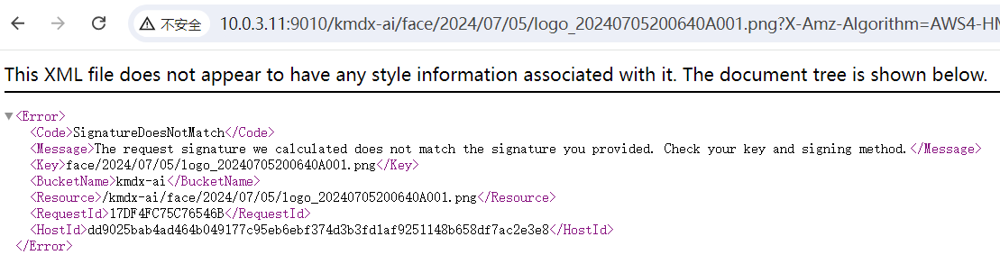

# minio

```
mkdir -p /home/lymly/docker/minio/config
mkdir -p /home/lymly/docker/minio/data
```


```bash
docker run \
-p 9010:9000 \
-p 9090:9090 \
--name minio \
-d --restart=always \
-e "MINIO_ACCESS_KEY=admin" \
-e "MINIO_SECRET_KEY=" \
-v /home/lymly/docker/minio/data:/data \
-v /home/lymly/docker/minio/config:/root/.minio \
 minio/minio server \
/data --console-address ":9090" --address ":9000"
```


# nginx 代理 minio

minio 端口：

Console：控制台，默认 9090

API：接口，默认9000

```nginx
worker_processes  1;

events {
    worker_connections  1024;
}


http {
    include       mime.types;
    default_type  application/octet-stream;

    sendfile        on;
    #tcp_nopush     on;

    #keepalive_timeout  0;
    keepalive_timeout  65;

    #gzip  on;

    # 代理minio外网地址
    # minio控制台地址
    server {
        listen       18081;
        # 代理api
        location /files/{
            proxy_pass http://10.0.3.11:9010/;
        }
        
        # 代理console
		location /minio/ui/ {
		    rewrite ^/minio/ui/(.*) /$1 break;
		    proxy_set_header Host $http_host;
		    proxy_set_header X-Real-IP $remote_addr;
		    proxy_set_header X-Forwarded-For $proxy_add_x_forwarded_for;
		    proxy_set_header X-Forwarded-Proto $scheme;
		    proxy_set_header X-NginX-Proxy true;
		    real_ip_header X-Real-IP;
		    proxy_connect_timeout 300;
		    proxy_http_version 1.1;
		    proxy_set_header Upgrade $http_upgrade;
		    proxy_set_header Connection "upgrade";
		    chunked_transfer_encoding off;
		    proxy_pass http://minio_console;
		} 
    }

}

```

> [!NOTE]
>
> 使用路径代理控制台 console 需要配置 minio 环境变量`MINIO_BROWSER_REDIRECT_URL`，注意这个地址应该是浏览器直接访问地址，比如使用了 nginx 代理，那么这里应该配置 nginx 代理的地址。
>
> ```bash
> docker run \
> -p 9010:9000 \
> -p 9090:9090 \
> --name minio \
> -d --restart=always \
> -e "MINIO_ACCESS_KEY=admin" \
> -e "MINIO_SECRET_KEY=" \
> -e "MINIO_BROWSER_REDIRECT_URL=http://10.0.3.11:9090/minio/ui" \
> -v /home/lymly/docker/minio/data:/data \
> -v /home/lymly/docker/minio/config:/root/.minio \
>  minio/minio server \
> /data --console-address ":9090" --address ":9000"
> ```
>
> [minio自建对象存储（单机版）_minio browser配置地址-CSDN博客](https://blog.csdn.net/qq_27399407/article/details/121361894)

### 代理报错签名错误



minio 接口正常代理即可，无需额外配置，记一次签名错误问题：

##### 获取外链

```java
/**
     * 获取文件外链
     *
     * @param bucketName 存储桶名称
     * @param objectName 文件名
     * @param expires    过期时间 <=7 秒 （外链有效时间（单位：秒））
     * @return 文件外链
     */
public static String getPreSignedObjectUrl(String bucketName, String objectName, Integer expires) throws Exception {
    GetPresignedObjectUrlArgs.Builder builder = GetPresignedObjectUrlArgs.builder();
    if(expires!=null) {
        builder.expiry(expires);
    }
    GetPresignedObjectUrlArgs args = builder
        .bucket(bucketName)
        .object(objectName.replaceAll("^/+", ""))
        .method(Method.GET)
        .build();
    return MinioConfig.minioDownloadClient.getPresignedObjectUrl(args);
}
```

例如我们要获取的对象为桶`bucket-test`的对象名称为`/face/2024/07/05/logo_20240705200640A001.png`的文件，`GetPresignedObjectUrlArgs.builder.object()`方法中传入的对象名称**不能以`/`开头**，而是应该传入`face/2024/07/05/logo_20240705200640A001.png`，**否则直接访问是可以的，使用代理访问就会报签名错误**。

