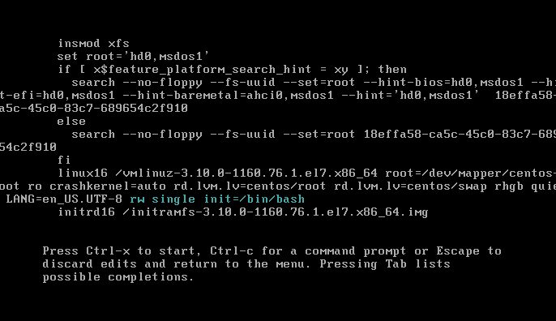
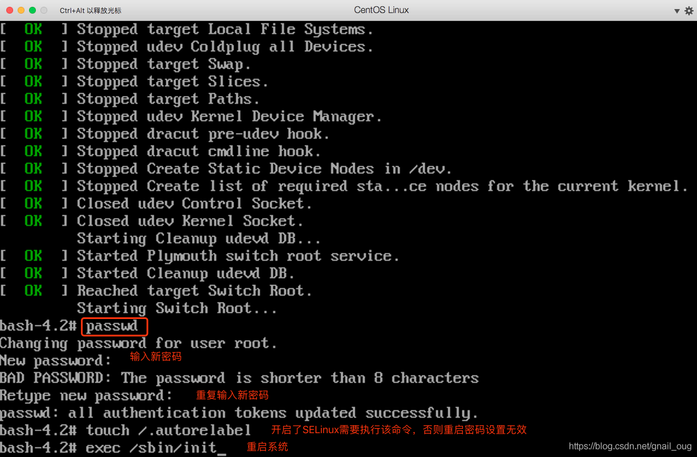

# CentOS

# 配置阿里云源

```bash
yum -y install wget
# 下载Centos-7.repo文件
wget -O /etc/yum.repos.d/CentOS-Base.repo http://mirrors.aliyun.com/repo/Centos-7.repo
# 清除yum缓存
yum clean all
# 缓存阿里云源
yum makecache
# 测试阿里云源 
yum list
```

> [CentOS7配置阿里云镜像源（超详细过程）_KingveyLee的博客-CSDN博客_centos设置阿里云镜像源](https://blog.csdn.net/KingveyLee/article/details/114984534)

# 物理机安装

### 选择`install CentOS`安装报错

U盘盘符名称与安装脚本不一致

在`install CentOS`界面按e

将脚本中U盘盘符名称删除几位，与U盘一致，`ctrl+x`保存

# 设置静态IP

```bash
vim /etc/sysconfig/network-scripts/ifcfg-enp

BOOTPROTO=static
IPADDR="19.37.33.66 # 设置的静态IP地址
NETMASK="255.255.255.0" # 子网掩码 
GATEWAY="19.37.33.1" # 网关地址
DNS1="192.168.241.2"
DNS2="192.168.241.1"
ONBOOT="yes" # 开机启动

# 重启网络服务
systemctl restart network
```

> 貌似可以不用引号

# 系统信息

```bash
[root@192.168.1.1 ~]# cat /proc/version 
Linux version 2.6.32-279.el6.x86_64 (mockbuild@c6b9.bsys.dev.centos.org) (gcc version 4.4.6 20120305 (Red Hat 4.4.6-4) (GCC) ) #1 SMP Fri Jun 22 12:19:21 UTC 2012
[root@192.168.1.1 ~]# uname -a
Linux LAMP1.1 2.6.32-279.el6.x86_64 #1 SMP Fri Jun 22 12:19:21 UTC 2012 x86_64 x86_64 x86_64 GNU/Linux
[root@192.168.1.1 ~]# uname -r
2.6.32-279.el6.x86_64
[root@192.168.1.1 ~]#
[root@192.168.1.1 ~]# cat /etc/issue
CentOS release 6.3 (Final)
Kernel \r on an \m
[root@192.168.1.1 ~]# cat /etc/redhat-release 
CentOS release 6.3 (Final)
[root@192.168.1.1 ~]# getconf LONG_BIT
64
[root@192.168.1.1 ~]# file /bin/ls
/bin/ls: ELF 64-bit LSB executable, x86-64, version 1 (SYSV), dynamically linked (uses shared libs), for GNU/Linux 2.6.18, stripped
```

# 脚本

```bash
vim start.sh

#!/bin/bash
echo 'start...'

chmod 777 start.sh
./start.sh
```

# 忘记密码

系统选择界面按`e`

在设置语言后面加上`rw single init=/bin/bash`



按`ctrl`+`x`重启



# 问题

### 服务器拒绝了密码

使用ssh工具连接服务器，输入密码时提示服务器拒绝了密码

检查 ssh 配置

```bash
vim /etc/ssh/sshd_config
PermitRootLogin yes
PasswordAuthentication yes
```

如果还是无法连接，需要关闭 selinux

```bash
vim /etc/selinux/config

# This file controls the state of SELinux on the system.
# SELINUX= can take one of these three values:
#     enforcing - SELinux security policy is enforced.
#     permissive - SELinux prints warnings instead of enforcing.
#     disabled - No SELinux policy is loaded.
SELINUX=disabled
# SELINUXTYPE= can take one of three values:
#     targeted - Targeted processes are protected,
#     minimum - Modification of targeted policy. Only selected processes are protected. 
#     mls - Multi Level Security protection.
SELINUXTYPE=targeted
```

# 时间同步

### 使用NTP服务时间同步

#### 安装ntp

```bash
yum -y install ntp
```

#### 启动ntp服务

```bash
 systemctl start  ntpd
 systemctl enable  ntpd
```

查看时间

```
date
```

