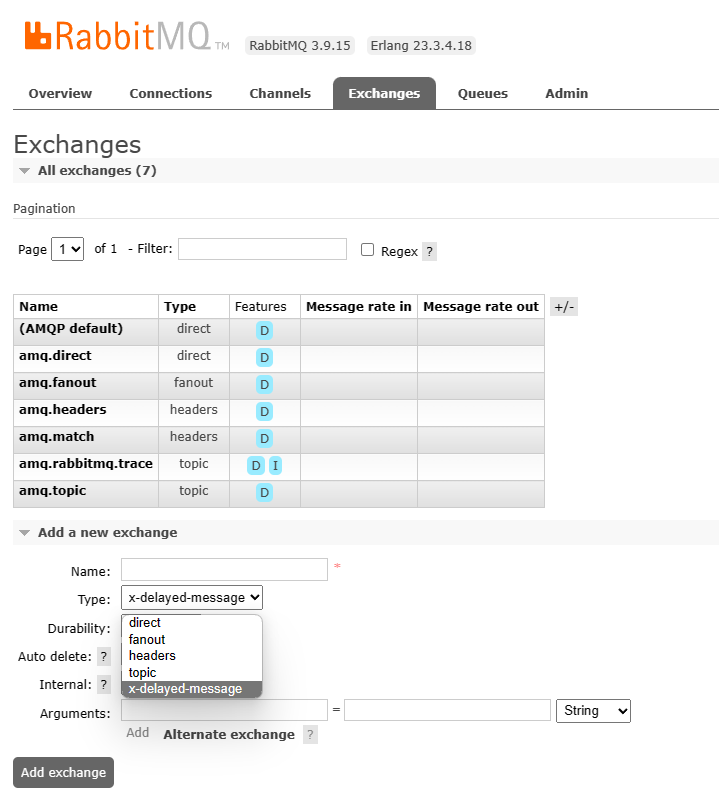

# 安装 RabbitMQ

RabbitMQ 依赖 Erlang，两者的版本对照表：

[RabbitMQ Erlang Version Requirements — RabbitMQ](https://www.rabbitmq.com/which-erlang.html)

# CentOS 7

> RabbitMQ RPM packages for CentOS 7 will be discontinued from May 2022 because that CentOS release series provides outdated versions of OpenSSL and Linux kernel.
>
> RabbitMQ RPM 包从 2022.5 开始将不被支持，因为提供过时的 OpenSSL 和 Linux kernel
>
> [CentOS 7 Support is Discontinued from May, 2022 | RabbitMQ - Blog](https://blog.rabbitmq.com/posts/2022/04/centos-7-support-discontinued/)

最后的 centos 7 rabbitmq rpm 安装包、erlang 安装包：

[Release RabbitMQ 3.9.15 · rabbitmq/rabbitmq-server · GitHub](https://github.com/rabbitmq/rabbitmq-server/releases/tag/v3.9.15)

[Release 23.3.4.18 · rabbitmq/erlang-rpm · GitHub](https://github.com/rabbitmq/erlang-rpm/releases/tag/v23.3.4.18)

```bash
yum install erlang-23.3.4.18-1.el7.x86_64.rpm
[root@localhost ~]# erl -version
Erlang (SMP,ASYNC_THREADS,HIPE) (BEAM) emulator version 11.2.2.17

yum install rabbitmq-server-3.9.15-1.el7.noarch.rpm

# 启动和开机自启
systemctl start rabbitmq-server
systemctl enable rabbitmq-server
```

### 启用 web 管理界面

```bash
# 安装 Web 管理界面的插件：
rabbitmq-plugins enable rabbitmq_management

# 提供 RabbitMQ 用户和对用户使用的权限进行赋权：
chown -R rabbitmq:rabbitmq /var/lib/rabbitmq/

# 分别执行下面的命令：
rabbitmqctl add_user admin StrongPassword
rabbitmqctl set_user_tags admin administrator
rabbitmqctl set_permissions -p / admin ".*" ".*" ".*"
```

当上面命令执行成功后，你可以重启你的 RabbitMQ，然后通过浏览器进行登录。UI 界面使用的端口是 15672。因此访问的 URL 为你服务器的地址 + 15672。

```text
http://Your_Server_IP:15672/
```

> [在 CentOS 7 上安装 RabbitMQ - 知乎 (zhihu.com)](https://zhuanlan.zhihu.com/p/86272543)

### 延迟列队插件

rabbitmq 插件：[Community Plugins — RabbitMQ](https://www.rabbitmq.com/community-plugins.html)

演出列队插件：[GitHub - rabbitmq/rabbitmq-delayed-message-exchange: Delayed Messaging for RabbitMQ](https://github.com/rabbitmq/rabbitmq-delayed-message-exchange)

3.9.x 版本：[Release 3.9.0 · rabbitmq/rabbitmq-delayed-message-exchange · GitHub](https://github.com/rabbitmq/rabbitmq-delayed-message-exchange/releases/tag/3.9.0)

```bash
# 查看rabbitmq插件目录
[root@localhost ~]# rabbitmq-plugins directories -s
Plugin archives directory: /usr/lib/rabbitmq/plugins:/usr/lib/rabbitmq/lib/rabbitmq_server-3.9.15/plugins
Plugin expansion directory: /var/lib/rabbitmq/mnesia/rabbit@localhost-plugins-expand
Enabled plugins file: /etc/rabbitmq/enabled_plugins

# 将下载ez文件放入/usr/lib/rabbitmq/lib/rabbitmq_server-3.9.15/plugins
# 启用插件
[root@localhost ~]# rabbitmq-plugins enable rabbitmq_delayed_message_exchange

# 重启rabbitmq
[root@localhost ~]# systemctl restart rabbitmq-server
```

web 界面中添加 Exchange，type 中包含`x-delayed-message`，说明插件安装成功。


