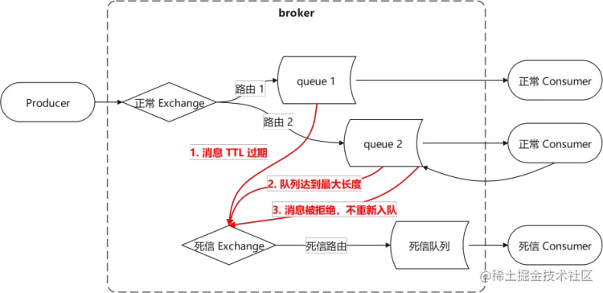
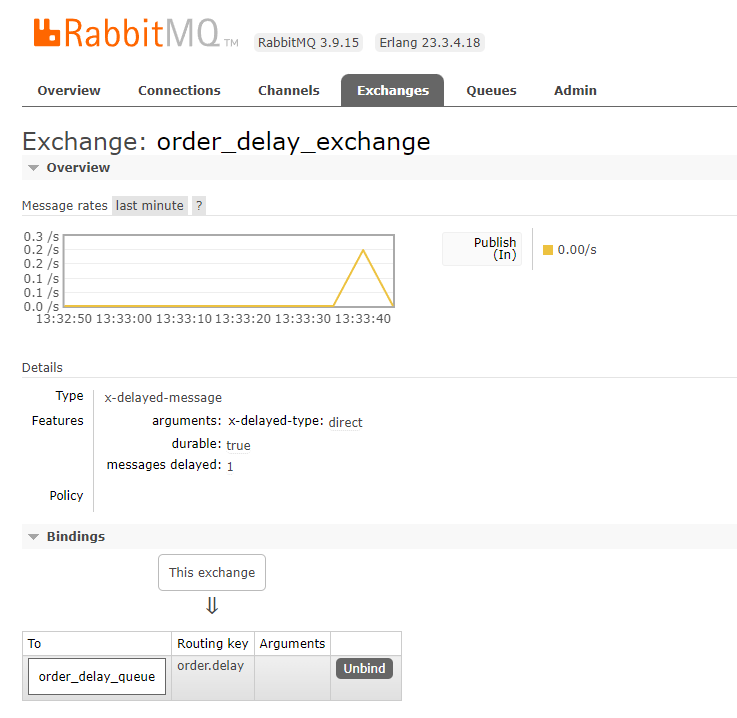
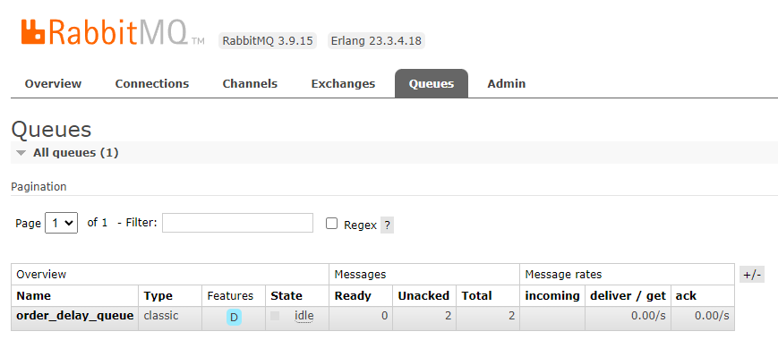

# RabbitMQ 死信列队

死信的来源：

1. 消息被否定确认，使用 `channel.basicNack` 或 `channel.basicReject` ，并且此时`requeue` 属性被设置为`false`。
2. 消息在队列的存活时间超过设置的TTL时间。
3. 消息队列的消息数量已经超过最大队列长度。
4. 直接发消息到死信交换机



“死信”消息会被RabbitMQ进行特殊处理，如果配置了死信队列信息，那么该消息将会被丢进死信队列中，如果没有配置，则该消息将会被丢弃。

> [RabbitMQ手动ACK与死信队列 - 掘金 (juejin.cn)](https://juejin.cn/post/7231766211615752249)

# 订单超时自动取消

这是一个典型的死信列队的应用，相比上述链路，此功能的链路只有：

生产者 → 死信交换机 → 死信路由 → 死信列队 → 消费者

pom.xml 启用 spring boot rabbitmq

```xml
<!-- https://mvnrepository.com/artifact/org.springframework.amqp/spring-rabbit -->
<dependency>
    <groupId>org.springframework.boot</groupId>
    <artifactId>spring-boot-starter-amqp</artifactId>
</dependency>
```

application.yml

```yml
spring:
  rabbitmq:
    host: 192.168.3.200
    port: 5672
    username: admin
    password: StrongPassword
    virtual-host: /
    connection-timeout: 15000
    # 发送确认
    publisher-confirm-type: correlated
    # 路由失败回调
    publisher-returns: true
    template:
      # 必须设置成true 消息路由失败通知监听者，而不是将消息丢弃
      mandatory: true
    listener:
      simple:
#        # 每次从RabbitMQ获取的消息数量
#        prefetch: 1
        default-requeue-rejected: false
        # 每个队列启动的消费者数量，如只配置1，列队中消息将顺序处理，可能造成业务整体向后延迟
        concurrency: 20
        # 每个队列最大的消费者数量
        max-concurrency: 20
        # 手动签收ACK
        acknowledge-mode: manual
        # 当消费者处理抛出异常时，会进行延时重试。延时的时间为上一次的延时 × multiplier因子，try 1 try 2 try 4 try 8 try 16 try
        retry:
          enabled: true
          initial-interval: 1000ms
          max-interval: 200000ms
          multiplier: 2
          max-attempts: 6
```


死信列队、交换机配置：

```yml
xxx:
  rabbitmq:
    order-delay-to-cancel:
      exchange-name: order_delay_exchange
      queue-name: order_delay_queue
      routing-key: order.delay
      order-delay: 20s
```

```java
import lombok.Data;
import org.springframework.boot.context.properties.ConfigurationProperties;
import org.springframework.stereotype.Component;

import java.time.Duration;

@Data
@ConfigurationProperties(prefix = "xxx.rabbitmq.order-delay-to-cancel")
@Component
public class OrderDelayToCancelProperties {
    private String queueName;
    private String exchangeName;
    private String routingKey;
    private Duration orderDelay;
}
```

spring bean 配置

```java
import com.chunshu.bstt.config.properties.OrderDelayToCancelProperties;
import org.springframework.amqp.core.*;
import org.springframework.beans.factory.annotation.Autowired;
import org.springframework.context.annotation.Bean;
import org.springframework.context.annotation.Configuration;

import java.util.HashMap;
import java.util.Map;

@Configuration
public class OrderDelayToCancelConfig {

    @Autowired
    OrderDelayToCancelProperties orderDelayToCancelProperties;

    /**
     * 订单队列 - 接收延迟投递的订单
     *
     * @return
     */
    @Bean
    public Queue orderDelayQueue() {
        return QueueBuilder
                .durable(orderDelayToCancelProperties.getQueueName())
                .build();
    }

    /**
     * 订单交换机-延迟交换机 - 消息延迟一定时间之后再投递到绑定的队列
     *
     * @return
     */
    @Bean
    public Exchange orderDelayExchange() {
        Map<String, Object> args = new HashMap<>(1);
        args.put("x-delayed-type", ExchangeTypes.DIRECT);
        return new CustomExchange(orderDelayToCancelProperties.getExchangeName(), "x-delayed-message", true, false, args);
    }

    /**
     * 订单队列-交换机 绑定
     *
     * @param orderDelayQueue         订单队列
     * @param orderDelayExchange 订单交换机
     * @return
     */
    @Bean
    public Binding orderBinding(Queue orderDelayQueue, Exchange orderDelayExchange) {
        return BindingBuilder
                .bind(orderDelayQueue)
                .to(orderDelayExchange)
                .with(orderDelayToCancelProperties.getRoutingKey())
                .noargs();
    }
}
```

投递消息

```java
rabbitTemplate.convertAndSend(orderDelayToCancelProperties.getExchangeName(), orderDelayToCancelProperties.getOrderRoutingKey(), id, message -> {
    message.getMessageProperties().setDelay((int)orderDelayToCancelProperties.getDelay().toMillis());
    return message;
});
```

消息投递之后，可以在看到死信交换机中有一条`messages delayed`



延时时间结束后，消息进入死信列队



- Ready：待消费的消息
- Unacked：未被确认的消息

消费者：

```java
@RabbitListener(queues = "${xxx.rabbitmq.order-delay-to-cancel.queue-name}")
public void orderCustomer(Long id, Channel channel, Message message) throws IOException, InterruptedException {
    log.info("customer: {}", id);

    TimeUnit.SECONDS.sleep(5);
    log.info("customer customed: {}", id);

    channel.basicAck(message.getMessageProperties().getDeliveryTag(), false);
}
```

# 消费者

### 消息确认

```java
spring.rabbitmq.listener.simple.acknowledge-mode=manual
```

- NONE ： 不确认 ：

  - 1、默认所有消息消费成功，会不断的向消费者推送消息

  - 2、因为 rabbitmq 认为所有消息都被消费成功。所以队列中存在丢失消息风险。

- AUTO：自动确认

  - 1、根据消息处理逻辑是否抛出异常自动发送 ack（正常）和nack（异常）给服务端，如果消费者本身逻辑没有处理好这条数据就存在丢失消息的风险。

  - 2、使用自动确认模式时，需要考虑的另一件事情就是消费者过载。

- MANUAL：手动确认

  - 1、手动确认在业务失败后进行一些操作，消费者调用 ack、nack、reject 几种方法进行确认，如果消息未被 ACK 则发送到下一个消费者或重回队列。

  - 2、ack 用于肯定确认；nack 用于 否定确认 ；reject 用于否定确认（一次只能拒绝单条消息）

##### 手动确认

肯定确认

```java
    /**
     * Acknowledge one or several received
     * messages. Supply the deliveryTag from the {@link com.rabbitmq.client.AMQP.Basic.GetOk}
     * or {@link com.rabbitmq.client.AMQP.Basic.Deliver} method
     * containing the received message being acknowledged.
     * @see com.rabbitmq.client.AMQP.Basic.Ack
     * @param deliveryTag the tag from the received {@link com.rabbitmq.client.AMQP.Basic.GetOk} or {@link com.rabbitmq.client.AMQP.Basic.Deliver}
     * @param multiple true to acknowledge all messages up to and
     * including the supplied delivery tag; false to acknowledge just
     * the supplied delivery tag.
     批量确认，true：确认小于等于delivery tag的消息，false：只确认delivery tag这条消息
     * @throws java.io.IOException if an error is encountered
     */
    void basicAck(long deliveryTag, boolean multiple) throws IOException;
```

否定确认

```java
    /**
     * Reject one or several received messages.
     *
     * Supply the <code>deliveryTag</code> from the {@link com.rabbitmq.client.AMQP.Basic.GetOk}
     * or {@link com.rabbitmq.client.AMQP.Basic.GetOk} method containing the message to be rejected.
     * @see com.rabbitmq.client.AMQP.Basic.Nack
     * @param deliveryTag the tag from the received {@link com.rabbitmq.client.AMQP.Basic.GetOk} or {@link com.rabbitmq.client.AMQP.Basic.Deliver}
     * @param multiple true to reject all messages up to and including
     * the supplied delivery tag; false to reject just the supplied
     * delivery tag.
     * @param requeue true if the rejected message(s) should be requeued rather
     * than discarded/dead-lettered
     * @throws java.io.IOException if an error is encountered
     */
    void basicNack(long deliveryTag, boolean multiple, boolean requeue)
            throws IOException;

    /**
     * Reject a message. Supply the deliveryTag from the {@link com.rabbitmq.client.AMQP.Basic.GetOk}
     * or {@link com.rabbitmq.client.AMQP.Basic.Deliver} method
     * containing the received message being rejected.
     * @see com.rabbitmq.client.AMQP.Basic.Reject
     * @param deliveryTag the tag from the received {@link com.rabbitmq.client.AMQP.Basic.GetOk} or {@link com.rabbitmq.client.AMQP.Basic.Deliver}
     * @param requeue true if the rejected message should be requeued rather than discarded/dead-lettered
     * @throws java.io.IOException if an error is encountered
     */
    void basicReject(long deliveryTag, boolean requeue) throws IOException;
```

否定确认的场景不多,但有时候某个消费者因为某种原因无法立即处理某条消息时,就需要否定确认了.

否定确认时,需要指定是丢弃掉这条消息,还是让这条消息重新排队,过一会再来,又或者是让这条消息重新排队,并尽快让另一个消费者接收并处理它.

重新排队与重试无关，如果只有一个列队，且没有超过消费者并发数，那么这个消费者将不断立即地收到该消息。

> [RabbitMQ(4):消息确认机制详解 - 掘金 (juejin.cn)](https://juejin.cn/post/7029232312197840904)

### 重试

```java
spring:
  rabbitmq:
    listener:
      simple:
        retry:
          enabled: true
          initial-interval: 1000ms
          max-interval: 200000ms
          multiplier: 2
          max-attempts: 6
```

当消费者处理抛出异常时，会进行延时重试。延时的时间为上一次的延时 × multiplier因子：

```java
try 1 try 2 try 4 try 8 try 16 try
```

注意在重试次数耗尽（Exhausted）之前，消费者中的异常不会被抛出，所以只有在重试次数用尽后，在控制台中才能看到异常。

# 综上

在手动确认模式下，消费者：

- 肯定确认：消息被消费
- 否定确认：requeue 重回列队，否则消息被丢弃，因为没有配置这个列队的的死信交换机
- return：消息未被确认，但不会重试，直到重新连接rabbitmq服务端
- 异常：重试，达到重试次数后抛出异常；消息违背确认，重新连接rabbitmq服务端后会再次重试