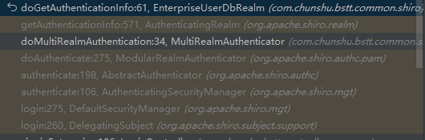
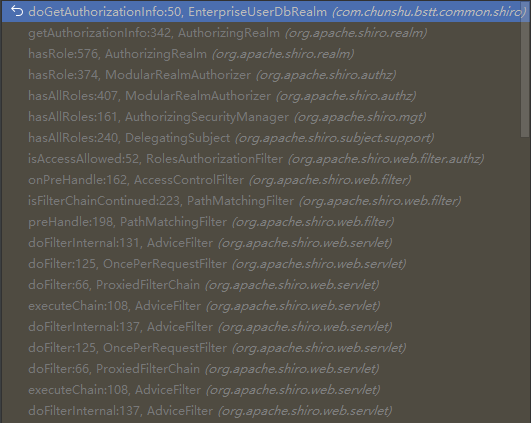

# Shiro 多套用户

看 shiro 之前一定要分清的几个专有名词，不然头都看晕😒：

token 口令：用户登录凭证，一般包含用户名、密码

authenticate [ɔːˈθentɪkeɪt] 认证，用户认证，用于验证用户凭证是否合法，即登录认证

principal [ˈprɪnsəpl] 当事人，委托人：用户登录信息，一般包含当前用户信息、用户类型等

authorize [ˈɔːθəraɪz] 授权：用户拥有的角色、权限

### 登录认证

查看`realm.getAuthenticationInfo(token)`调用堆栈



→ ModularRealmAuthenticator.doAuthenticate(token) （实现）

```java
protected AuthenticationInfo doAuthenticate(AuthenticationToken authenticationToken) throws AuthenticationException {
    this.assertRealmsConfigured();
    Collection<Realm> realms = this.getRealms();
    return realms.size() == 1 ? this.doSingleRealmAuthentication((Realm)realms.iterator().next(), authenticationToken) : this.doMultiRealmAuthentication(realms, authenticationToken);
}
```

此处判断了如果有多个 realm，走`this.doMultiRealmAuthentication(realms, authenticationToken);`

→ ModularRealmAuthenticator.doMultiRealmAuthentication(realms, token)

循环 realm，根据`support`方法找出支持的 realm，调用`realm.getAuthenticationInfo(token)`

→ **Realm.getAuthenticationInfo(token)**

这里就是我们写在 realm 中的`getAuthenticationInfo(token)`，根据 token 中的用户名，查询用户信息和密码，生成认证信息交给 shiro 去认证。

---

使用哪个 realm 进行认证最简单的方式就是重写 realm 的`support(token)`方法，方法中会传入`AuthenticationToken`，也就是一开始在`subject.login`中传入的token。

- 几套用户使用的是不同 token，可以直接根据 token 类型判断

```java
@Override
public boolean supports(AuthenticationToken token) {
    return token instanceof EnterpriseUserToken;
}
```

- 重写 token，添加类型字段区分多套用户，可以在`support`方法中取出类型字段进行判断
- 只使用一个 realm，在`getAuthenticationInfo`中区分用户，返回不同的认证信息

也可以重写 ModularRealmAuthenticator 的`doAuthenticate`或`doMultiRealmAuthentication`，自定义决定使用的 realm

```java
@Bean
public SecurityManager securityManager(SessionManager sessionManager, EhCacheManager ehCacheManager) {
    DefaultWebSecurityManager securityManager = new DefaultWebSecurityManager();
    securityManager.setAuthenticator(modularRealmAuthenticator());
}

@Bean
public ModularRealmAuthenticator modularRealmAuthenticator(){
    ModularRealmAuthenticator modularRealmAuthenticator=new MultiRealmAuthenticator();
    modularRealmAuthenticator.setAuthenticationStrategy(new FirstSuccessfulStrategy());
    return modularRealmAuthenticator;
}
```

不管使用哪种方式，在登录认证时，token是决定用户类型的关键。

##### 表单认证方式

> [Shiro框架针对不同登录界面和不同角色用户_使用shiro做登录后台模块,区分不同角色拥有的功能。_一个有梦想的小白的博客-CSDN博客](https://blog.csdn.net/weixin_42803027/article/details/84836084)

### 登录信息

当前登录人的信息，principal，通过 realm `doGetAuthenticationInfo(token)` 返回的登录信息`new SimpleAuthenticationInfo(shiroUser, password, salt, this.getClass().getSimpleName())`的第一个参数传递给 shiro，可以包含一些当前用户的信息、用户类型等数据。

可以通过`SecurityUtils`获取到：

```java
public static ShiroUser getShiroUser() {
    return (ShiroUser) SecurityUtils.getSubject().getPrincipal();
}
```

### 角色、权限

我们写在 realm 中的`doGetAuthorizationInfo(PrincipalCollection)`方法，用于告知 shiro 该用户拥有哪些角色、权限。当使用`subject.hasRole`或页面 shiro 标签时，该方法会被调用；调用一次后，角色、权限信息会被 shiro 缓存，下次直接从缓存取出。

**当授权未通过时，shiro 会调用下一个 realm 获取权限，直到拥有角色、权限授权或所有 realm 都没有授权。**

所以当我们在`doGetAuthorizationInfo`方法中返回 null 时，shiro 会调用下一个 realm。

---

当我们多套用户使用各自的 realm 进行认证时，我们更倾向于各自使用各自的 realm 进行授权。但 shiro 授权是所有 realm 顺序调用的，就算已经使用自己的 realm 授权、缓存后，下一次需要授权时，其他 realm 的`doGetAuthorizationInfo`方法依然会被调用。

查看调用堆栈：



`ModularRealmAuthorizer`提供了`hasRole`等方法，由它指定 realm，调用 realm 的`getAuthorizationInfo`方法，判断无缓存的话，就调用`doGetAuthorizationInfo`。

一种方法是修改`ModularRealmAuthorizer`，改变 realm 的选择逻辑；另一种是修改`getAuthorizationInfo`，因为它是 realm 中的方法，改起来更方便。

---

realm `doGetAuthenticationInfo(token)`返回的登录认证信息的最后一个参数是 realmName，可以在`getAuthorizationInfo`中判断只认证自己 realm 的权限：

```java
@Override
protected AuthorizationInfo getAuthorizationInfo(PrincipalCollection principals) {
    if(!principals.getRealmNames().contains(this.getClass().getSimpleName())) {
        return null;
    }
    return super.getAuthorizationInfo(principals);
}
```

---

通过上面的调用堆栈，可以看到 shiro ShiroFilterFactoryBean 中的登录、角色、权限判断是通过过滤器来实现的

```java
public class RolesAuthorizationFilter extends AuthorizationFilter {
    public RolesAuthorizationFilter() {
    }

    public boolean isAccessAllowed(ServletRequest request, ServletResponse response, Object mappedValue) throws IOException {
        Subject subject = this.getSubject(request, response);
        String[] rolesArray = (String[])mappedValue;
        if (rolesArray != null && rolesArray.length != 0) {
            Set<String> roles = CollectionUtils.asSet(rolesArray);
            return subject.hasAllRoles(roles);
        } else {
            return true;
        }
    }
}
```

`isAccessAllowed`判断是否放行，`onAccessDenied`处理未放行时的逻辑，如自动登录等。
