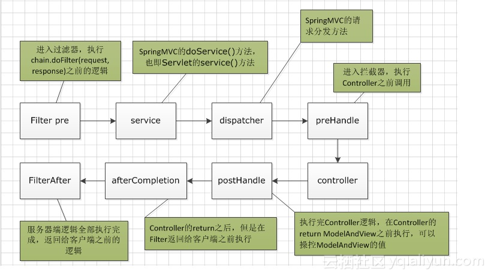
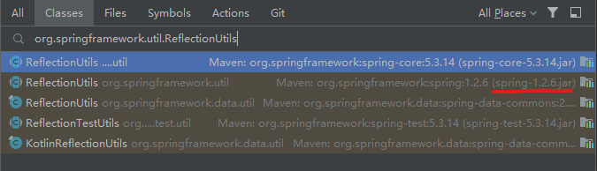
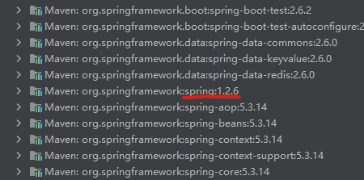

# Spring Boot

过滤器与拦截器




### @ModelAttribute 和 HandlerInterceptor

`@ModelAttribute`，也属于控制器部分，只是在控制器之前执行，所以他们的顺序为：

1. `Interceptor`preHandle
2. `controller`@ModelAttribute
3. `controller`@RequestMapping
4. `Interceptor`postHandle
5. `Interceptor`afterCompletion

### 接口访问控制

##### @ModelAttribute

对控制器内所有接口生效（包括子类控制器），如需要对全部控制器生效，可以加上注解`@ControllerAdvice`

    @ModelAttribute
    public void resApiModel(HttpServletResponse response) throws java.lang.Exception {
        // 强制校验合法性
        if(verify() == null) {
            throw new Exception("访问合法性验证失败");
        };
    }

##### HandlerInterceptor

spring.xml

```xml
<mvc:interceptors>
    <mvc:interceptor>
        <mvc:mapping path="/resApi/**"/>
        <bean class="com.chunshu.config.ResApiInterceptor"></bean>
    </mvc:interceptor>
</mvc:interceptors>
```

ResApiInterceptor

```java
package com.chunshu.config;

import javax.servlet.http.HttpServletRequest;
import javax.servlet.http.HttpServletResponse;

import org.springframework.stereotype.Component;
import org.springframework.web.servlet.HandlerInterceptor;
import org.springframework.web.servlet.ModelAndView;

import com.alibaba.fastjson.JSON;
import com.chunshu.common.result.JsonResult;

@Component
public class ResApiInterceptor implements HandlerInterceptor {

    @Override
    public boolean preHandle(HttpServletRequest httpServletRequest, HttpServletResponse response, Object o) throws Exception {
        if(verify() == false) {
            JsonResult obj = renderError("访问合法性验证失败");
            response.setCharacterEncoding("UTF-8");
            response.setContentType("application/json; charset=utf-8");
            response.getWriter().write(JSON.toJSONString(obj));
            return false;
        }
        return true;
    }

    @Override
    public void postHandle(HttpServletRequest httpServletRequest, HttpServletResponse httpServletResponse, Object o, ModelAndView modelAndView) {
        httpServletResponse.setCharacterEncoding("UTF-8");
        httpServletResponse.setContentType("application/json; charset=utf-8");
    }

    @Override
    public void afterCompletion(HttpServletRequest httpServletRequest, HttpServletResponse httpServletResponse, Object o, Exception e) {
        httpServletResponse.setCharacterEncoding("UTF-8");
        httpServletResponse.setContentType("application/json; charset=utf-8");
    }
}
```

# @PostConstruct 执行顺序

在类B中的`@PostConstruct`进行初始化依赖于A类的`@PostConstruct`初始化。

> [!TIP]
>
> ##### @PostConstruct和@Autowired、[构造函数](https://so.csdn.net/so/search?q=构造函数&spm=1001.2101.3001.7020)的执行顺序
>
> 构造方法 > @Autowired > @PostConstruct
>
> [多个类中 使用@PostConstruct，加载先后顺序_janet1100的博客-CSDN博客_多个postconstruct顺序](https://blog.csdn.net/janet1100/article/details/105657399)

##### 实测`@Order(Ordered.HIGHEST_PRECEDENCE)`无效

> 在spring中，初始化的操作是在管理初始化的BeanPostProcessor中进行的，BPP依次反射调用初始化方法。而执行的顺序却是由beanDefinitionNames这个List控制的，但问题是beanDefinitionNames 并没有根据@Order做排序，也就是不管是MyBean1,MyBean2,其实都是根据扫描BeanDefinition放入beanDefinitionNames列表的顺序初始化的。正**因为MyBean2的位置在配置文件中定义的更靠前，所以它被先扫描加入beanDefinitionNames列表了！**
>
> 总的来说，用户业务bean初始化方法的调用顺序是在扫描bean definition后就确定了的。
>
> [你用@Order控制过Spring的@PostConstruct调用顺序吗？可能写错了 - 知乎 (zhihu.com)](https://zhuanlan.zhihu.com/p/388929292)

##### `@DependsOn`不能用于控制`@PostConstruct`的执行顺序

> @DependsOn合约仅保证已构造bean并已设置属性。这并不能保证调用任何@PostConstruct方法。
>
> 让它工作的方法是让“dependee”类（其他人依赖的类）实现“InitializingBean”类，这需要实现“afterPropertiesSet（）”方法。我将我的“init（）”方法的原始主体放入此方法中。我确认现在在依赖于此的任何类之前执行此操作。
>
> [java - 为什么Spring会忽略我的@DependsOn注释？ - Thinbug](https://www.thinbug.com/q/22178735)

> **`@DependsOn`可以控制bean的创建、初始化（InitializingBean）、销毁方法执行顺序**。
>
> 示例：假如有三个Bean类叫Aaa、Bbb、Ccc分别实现了如下两个接口。
> `org.springframework.beans.factory.InitializingBean`
> `org.springframework.beans.factory.DisposableBean`
>
> Ccc通过@DependsOn指定依赖bean创建的顺序为Bbb > Aaa
>
> ```java
> @DependsOn({"bbb","ccc"})
> @Service
> public class Aaa implements InitializingBean, DisposableBean {
>        private static final Logger logger = LoggerFactory.getLogger(Aaa.class);
> 
>        public Aaa() {
>            logger.info(this.getClass().getName() + " Construction");
>        }
> 
>        @Override
>        public void afterPropertiesSet() throws Exception {
>            logger.info(this.getClass().getName() + " afterPropertiesSet");
>        }
> 
>        @Override
>        public void destroy() throws Exception {
>            logger.info(this.getClass().getName() + " destroy");
>        }
> }
> ```
> 
> [Spring中@DependsOn注解的作用及实现原理解析_java_脚本之家 (jb51.net)](https://www.jb51.net/article/207243.htm)

##### 可以利用spring的依赖关系来处理`@PostConstruct`执行顺序的问题

```java
@Component
public abstract class B {

	/*
	 * 此处注入A以保证A在B之前执行
	 */
	@Autowired
	A a;

	@PostConstruct
	private void init() {
    
    }
}
```

> 多个类中 使用@PostConstruct，加载先后顺序
> 有时候Class A 中@PostConstruct 注解的方法中的代码执行，需要等待Class B 中@PostConstruct 注解方法中的代码执行完后，拿到结果，才能执行，也就是中A中某些代码的执行需要依赖B中代码执后的结果。
> 此时就需要B先执行完，再执行A，
>
> 可以在A中先注入B。
>
> [多个类中 使用@PostConstruct，加载先后顺序_janet1100的博客-CSDN博客_多个postconstruct顺序](https://blog.csdn.net/janet1100/article/details/105657399)

# @RequestMapping 的继承问题

- 子类的`@RequestMapping`注解会覆盖父类的`@RequestMapping`注解，子类配置了`@RequestMapping`之后，父类的`@RequestMapping`（地址、produces等）将失效
- 子类不配置`@RequestMapping`注解，父类地址将会被继承：父类地址 + 子类方法地址

如果接口有统一的前缀，可以把前缀配置在父类：

```java
@CrossOrigin(origins = "*", maxAge = 3600)
@RestController
@RequestMapping(value="/resApi", produces="application/json;charset=UTF-8")
public class BaseApiController extends BaseController {
    
}
```

子类：

```java
@RestController
public class ADS_BController extends BaseApiController {
    
    @RequestMapping("/getXXXX")
    @ResponseBody
    public Object getFlightNo(@RequestParam Date beginTime,@RequestParam Date endTime) {
        return xxx
    }
}
```

接口地址：`/resApi/getXXXX`

---

若子类需要配置另外的前缀，那么就需要在子类重新配置`@RequestMapping`。


# 打包

```bash
mvn clean package '-Dmaven.test.skip=true'
```

### 运行 jar

```bash
java -jar stream_server-0.0.1-SNAPSHOT.jar
# 修改application.yml参数
java -jar stream_server-0.0.1-SNAPSHOT.jar --server.port=8086 --hlsdir=C:\Users\LYML\Desktop\nginx-rtmp-win32\html\hls
```


### 包含外部 jar

将 jar 放在 src/libs/ 下

```xml
<!-- 流程引擎 -->
<dependency>
    <groupId>eCoreFlow</groupId>
    <artifactId>eCoreFlow</artifactId>
    <version>1.0</version>
    <scope>system</scope>
    <systemPath>${pom.basedir}/src/libs/eCoreFlow.jar</systemPath>
</dependency>
```

##### jar 包

```xml
<build>
    <plugins>
        <plugin>
            <groupId>org.springframework.boot</groupId>
            <artifactId>spring-boot-maven-plugin</artifactId>
            <configuration>
                <includeSystemScope>true</includeSystemScope>
            </configuration>
        </plugin>
    </plugins>
</build>
```

##### war 包

```xml
<build>
    <plugins>
        <plugin>
            <groupId>org.springframework.boot</groupId>
            <artifactId>spring-boot-maven-plugin</artifactId>
            <configuration>
                <includeSystemScope>true</includeSystemScope>
            </configuration>
        </plugin>
        <plugin>
            <groupId>org.apache.maven.plugins</groupId>
            <artifactId>maven-war-plugin</artifactId>
            <configuration>
                <webResources>
                    <resource>
                        <directory>src/libs</directory>
                        <targetPath>WEB-INF/lib/</targetPath>
                        <!-- <targetPath>WEB_INF/lib/</targetPath> just for none spring-boot project -->
                        <includes>
                            <include>**/*.jar</include>
                        </includes>
                    </resource>
                </webResources>
            </configuration>
        </plugin>
    </plugins>
</build>
```

> I have a similar issue today, and stuck me half day to fix it.
>
> For most case, using below is fine for developing.
>
> 引入本地 jar 包：
>
> ```xml
> <dependency>
>     <groupId>com.netease</groupId>
>     <artifactId>thrift</artifactId>
>     <version>1.0</version>
>     <scope>system</scope>
>     <systemPath>${project.basedir}/lib/prome-thrift-client-1.0.0.jar</systemPath>
> </dependency>
> ```
>
> If you put the jar to a correct path, then it's fine to run in both **IDEA** and **Eclipse**.
>
> After you deploy the jar to a server or run the jar locally, then it may throws `ClassNotFoundException`.
>
> If you are using spring-boot, you **still need** below plugin:
>
> 使用 IDE 运行正常，但部署到服务器或本地运行 jar 包报`ClassNotFoundException`，如果使用 spring boot，还需要以下插件：
>
> ```xml
> <plugin>
>     <groupId>org.springframework.boot</groupId>
>     <artifactId>spring-boot-maven-plugin</artifactId>
>     <configuration>
>             <includeSystemScope>true</includeSystemScope>
>     </configuration>
> </plugin>
> ```
>
> After run `mvn clean package`, then you can find the jar under `/BOOT_INF/lib`.
>
> Between, if your package is **war**, then you **still need** this plugin:
>
> 如果是 war 包，还需要以下插件：
>
> ```xml
>  <plugin>
>         <groupId>org.apache.maven.plugins</groupId>
>         <artifactId>maven-war-plugin</artifactId>
>         <configuration>
>             <webResources>
>                 <resource>
>                         <directory>lib</directory>
>                         <targetPath>BOOT-INF/lib/</targetPath>
>                         <!-- <targetPath>WEB_INF/lib/</targetPath> just for none spring-boot project -->
>                         <includes>
>                             <include>**/*.jar</include>
>                         </includes>
>                 </resource>
>             </webResources>
>         </configuration>
>  </plugin>
> ```
>
> -----------------Another Way--------------------
>
> You can using this plugin to replace `maven-war-plugin`:
>
> 可以使用这个插件代替`maven-war-plugin`：
>
> ```xml
>  <plugin>  
>       <artifactId>maven-compiler-plugin</artifactId>  
>        <configuration>  
>             <source>1.8</source>  
>             <target>1.8</target>  
>             <compilerArguments>  
>                 <extdirs>${project.basedir}/lib</extdirs>  
>             </compilerArguments>  
>       </configuration>  
> </plugin>  
> ```
>
> And add the resource:
>
> 添加资源：
>
> ```xml
> <resources>  
>     <resource>  
>         <directory>lib</directory>  
>         <targetPath>BOOT-INF/lib/</targetPath>  
>         <includes>  
>             <include>**/*.jar</include>  
>         </includes>  
>     </resource>
>     <resource>
>         <directory>src/main/resources</directory>
>         <targetPath>BOOT-INF/classes/</targetPath>
>     </resource> 
> </resources>
> ```
>
> https://stackoverflow.com/a/50635637

# 其他问题

### idea 打开项目后没有启动选项，手动添加也不行

idea 没有识别到 maven，或者没有加载这个 maven 项目

右侧点击 Maven，可以看到项目列表，如果这里已有，点击左上角的刷新按钮（Reload All Maven Projects）即可；如果没有，点击添加，选择 pom.xml 文件

---

点击 File - Invalidate Cache，重新打开后尝试创建启动项

### Spring Security 登录报 The request was rejected

```
org.springframework.security.web.firewall.RequestRejectedException: The request was rejected because the header value "discount_free_trigger=true; freePromorunningtmr=Fri Jan 02 1970 00:55:18 GMT+0800 (中国标准时间); username=admin; rememberMe=true; password=ok+3soPi0vNGnTPhu0vlQk6N6GzELdMa/4XBTimQfA5kg0D6AayMGzCRCwRnJcMPx9qq+bSpUckANE6/Thzc8Q==" is not allowed.
	at org.springframework.security.web.firewall.StrictHttpFirewall$StrictFirewalledRequest.validateAllowedHeaderValue(StrictHttpFirewall.java:751)
	at org.springframework.security.web.firewall.StrictHttpFirewall$StrictFirewalledRequest.access$000(StrictHttpFirewall.java:605)
	at org.springframework.security.web.firewall.StrictHttpFirewall$StrictFirewalledRequest$1.nextElement(StrictHttpFirewall.java:655)
	at org.springframework.security.web.firewall.StrictHttpFirewall$StrictFirewalledRequest$1.nextElement(StrictHttpFirewall.java:645)
	at org.springframework.http.server.ServletServerHttpRequest.getHeaders(ServletServerHttpRequest.java:148)
	at org.springframework.web.cors.DefaultCorsProcessor.handleInternal(DefaultCorsProcessor.java:115)
	at org.springframework.web.cors.DefaultCorsProcessor.processRequest(DefaultCorsProcessor.java:95)
	at org.springframework.web.filter.CorsFilter.doFilterInternal(CorsFilter.java:87)
	at org.springframework.web.filter.OncePerRequestFilter.doFilter(OncePerRequestFilter.java:117)
	at org.springframework.security.web.FilterChainProxy$VirtualFilterChain.doFilter(FilterChainProxy.java:336)
	at org.springframework.security.web.header.HeaderWriterFilter.doHeadersAfter(HeaderWriterFilter.java:90)
	at org.springframework.security.web.header.HeaderWriterFilter.doFilterInternal(HeaderWriterFilter.java:75)
	at org.springframework.web.filter.OncePerRequestFilter.doFilter(OncePerRequestFilter.java:117)
	at org.springframework.security.web.FilterChainProxy$VirtualFilterChain.doFilter(FilterChainProxy.java:336)
	at org.springframework.security.web.context.SecurityContextPersistenceFilter.doFilter(SecurityContextPersistenceFilter.java:110)
	at org.springframework.security.web.context.SecurityContextPersistenceFilter.doFilter(SecurityContextPersistenceFilter.java:80)
	at org.springframework.security.web.FilterChainProxy$VirtualFilterChain.doFilter(FilterChainProxy.java:336)
	at org.springframework.security.web.context.request.async.WebAsyncManagerIntegrationFilter.doFilterInternal(WebAsyncManagerIntegrationFilter.java:55)
	at org.springframework.web.filter.OncePerRequestFilter.doFilter(OncePerRequestFilter.java:117)
	at org.springframework.security.web.FilterChainProxy$VirtualFilterChain.doFilter(FilterChainProxy.java:336)
	at org.springframework.security.web.FilterChainProxy.doFilterInternal(FilterChainProxy.java:211)
	at org.springframework.security.web.FilterChainProxy.doFilter(FilterChainProxy.java:183)
	at org.springframework.web.filter.DelegatingFilterProxy.invokeDelegate(DelegatingFilterProxy.java:354)
	at org.springframework.web.filter.DelegatingFilterProxy.doFilter(DelegatingFilterProxy.java:267)
	at org.apache.catalina.core.ApplicationFilterChain.internalDoFilter(ApplicationFilterChain.java:189)
	at org.apache.catalina.core.ApplicationFilterChain.doFilter(ApplicationFilterChain.java:162)
	at org.springframework.web.filter.RequestContextFilter.doFilterInternal(RequestContextFilter.java:100)
	at org.springframework.web.filter.OncePerRequestFilter.doFilter(OncePerRequestFilter.java:117)
	at org.apache.catalina.core.ApplicationFilterChain.internalDoFilter(ApplicationFilterChain.java:189)
	at org.apache.catalina.core.ApplicationFilterChain.doFilter(ApplicationFilterChain.java:162)
	at org.springframework.web.filter.FormContentFilter.doFilterInternal(FormContentFilter.java:93)
	at org.springframework.web.filter.OncePerRequestFilter.doFilter(OncePerRequestFilter.java:117)
	at org.apache.catalina.core.ApplicationFilterChain.internalDoFilter(ApplicationFilterChain.java:189)
	at org.apache.catalina.core.ApplicationFilterChain.doFilter(ApplicationFilterChain.java:162)
	at org.springframework.web.filter.CharacterEncodingFilter.doFilterInternal(CharacterEncodingFilter.java:201)
	at org.springframework.web.filter.OncePerRequestFilter.doFilter(OncePerRequestFilter.java:117)
	at org.apache.catalina.core.ApplicationFilterChain.internalDoFilter(ApplicationFilterChain.java:189)
	at org.apache.catalina.core.ApplicationFilterChain.doFilter(ApplicationFilterChain.java:162)
	at org.apache.catalina.core.StandardWrapperValve.invoke(StandardWrapperValve.java:197)
	at org.apache.catalina.core.StandardContextValve.invoke(StandardContextValve.java:97)
	at org.apache.catalina.authenticator.AuthenticatorBase.invoke(AuthenticatorBase.java:541)
	at org.apache.catalina.core.StandardHostValve.invoke(StandardHostValve.java:135)
	at org.apache.catalina.valves.ErrorReportValve.invoke(ErrorReportValve.java:92)
	at org.apache.catalina.core.StandardEngineValve.invoke(StandardEngineValve.java:78)
	at org.apache.catalina.connector.CoyoteAdapter.service(CoyoteAdapter.java:360)
	at org.apache.coyote.http11.Http11Processor.service(Http11Processor.java:399)
	at org.apache.coyote.AbstractProcessorLight.process(AbstractProcessorLight.java:65)
	at org.apache.coyote.AbstractProtocol$ConnectionHandler.process(AbstractProtocol.java:890)
	at org.apache.tomcat.util.net.NioEndpoint$SocketProcessor.doRun(NioEndpoint.java:1743)
	at org.apache.tomcat.util.net.SocketProcessorBase.run(SocketProcessorBase.java:49)
	at org.apache.tomcat.util.threads.ThreadPoolExecutor.runWorker(ThreadPoolExecutor.java:1191)
	at org.apache.tomcat.util.threads.ThreadPoolExecutor$Worker.run(ThreadPoolExecutor.java:659)
	at org.apache.tomcat.util.threads.TaskThread$WrappingRunnable.run(TaskThread.java:61)
	at java.base/java.lang.Thread.run(Thread.java:834)
```

其他项目的 cookie 影响导致，在浏览器地址栏删除 cookie 重试。

### 在 IDE 中启动正常，但 WAR 包放到 tomcat 中启动报 Failed to instantiate WebApplicationInitializer class

```
13-Jul-2022 18:39:47.791 严重 [main] org.apache.catalina.core.StandardContext.startInternal ServletContainerInitializer 处理期间出错
        javax.servlet.ServletException: Failed to instantiate WebApplicationInitializer class
                at org.springframework.web.SpringServletContainerInitializer.onStartup(SpringServletContainerInitializer.java:160)
                at org.apache.catalina.core.StandardContext.startInternal(StandardContext.java:5219)
                at org.apache.catalina.util.LifecycleBase.start(LifecycleBase.java:183)
                at org.apache.catalina.core.ContainerBase.addChildInternal(ContainerBase.java:726)
                at org.apache.catalina.core.ContainerBase.addChild(ContainerBase.java:698)
                at org.apache.catalina.core.StandardHost.addChild(StandardHost.java:696)
                at org.apache.catalina.startup.HostConfig.deployDirectory(HostConfig.java:1185)
                at org.apache.catalina.startup.HostConfig$DeployDirectory.run(HostConfig.java:1933)
                at java.util.concurrent.Executors$RunnableAdapter.call(Executors.java:511)
                at java.util.concurrent.FutureTask.run(FutureTask.java:266)
                at org.apache.tomcat.util.threads.InlineExecutorService.execute(InlineExecutorService.java:75)
                at java.util.concurrent.AbstractExecutorService.submit(AbstractExecutorService.java:112)
                at org.apache.catalina.startup.HostConfig.deployDirectories(HostConfig.java:1095)
                at org.apache.catalina.startup.HostConfig.deployApps(HostConfig.java:477)
                at org.apache.catalina.startup.HostConfig.start(HostConfig.java:1618)
                at org.apache.catalina.startup.HostConfig.lifecycleEvent(HostConfig.java:319)
                at org.apache.catalina.util.LifecycleBase.fireLifecycleEvent(LifecycleBase.java:123)
                at org.apache.catalina.util.LifecycleBase.setStateInternal(LifecycleBase.java:423)
                at org.apache.catalina.util.LifecycleBase.setState(LifecycleBase.java:366)
                at org.apache.catalina.core.ContainerBase.startInternal(ContainerBase.java:946)
                at org.apache.catalina.core.StandardHost.startInternal(StandardHost.java:835)
                at org.apache.catalina.util.LifecycleBase.start(LifecycleBase.java:183)
                at org.apache.catalina.core.ContainerBase$StartChild.call(ContainerBase.java:1396)
                at org.apache.catalina.core.ContainerBase$StartChild.call(ContainerBase.java:1386)
                at java.util.concurrent.FutureTask.run(FutureTask.java:266)
                at org.apache.tomcat.util.threads.InlineExecutorService.execute(InlineExecutorService.java:75)
                at java.util.concurrent.AbstractExecutorService.submit(AbstractExecutorService.java:134)
                at org.apache.catalina.core.ContainerBase.startInternal(ContainerBase.java:919)
                at org.apache.catalina.core.StandardEngine.startInternal(StandardEngine.java:263)
                at org.apache.catalina.util.LifecycleBase.start(LifecycleBase.java:183)
                at org.apache.catalina.core.StandardService.startInternal(StandardService.java:432)
                at org.apache.catalina.util.LifecycleBase.start(LifecycleBase.java:183)
                at org.apache.catalina.core.StandardServer.startInternal(StandardServer.java:930)
                at org.apache.catalina.util.LifecycleBase.start(LifecycleBase.java:183)
                at org.apache.catalina.startup.Catalina.start(Catalina.java:772)
                at sun.reflect.NativeMethodAccessorImpl.invoke0(Native Method)
                at sun.reflect.NativeMethodAccessorImpl.invoke(NativeMethodAccessorImpl.java:62)
                at sun.reflect.DelegatingMethodAccessorImpl.invoke(DelegatingMethodAccessorImpl.java:43)
                at java.lang.reflect.Method.invoke(Method.java:498)
                at org.apache.catalina.startup.Bootstrap.start(Bootstrap.java:345)
                at org.apache.catalina.startup.Bootstrap.main(Bootstrap.java:476)
        Caused by: java.lang.NoSuchMethodError: org.springframework.util.ReflectionUtils.accessibleConstructor(Ljava/lang/Class;[Ljava/lang/Class;)Ljava/lang/reflect/Constructor;
                at org.springframework.web.SpringServletContainerInitializer.onStartup(SpringServletContainerInitializer.java:157)
                ... 40 more
```

注意观察下面的`Caused by`， 此处为`java.lang.NoSuchMethodError: org.springframework.util.ReflectionUtils.accessibleConstructor`，可能是引入了两个相同的spring 包导致（因为新旧版本类方法不一定一致）

在 IDEA 中双击`shift`，在`classes`中搜索缺少方法的类：`org.springframework.util.ReflectionUtils`



可以看到明显是有个`spring-1.2.6.jar`导致冲突了

在 IDEA Project - External Libraries 中也可以看到这个包：



经排查，是`xfire-all`中包含的，排除之

```xml
<!-- https://mvnrepository.com/artifact/org.codehaus.xfire/xfire-all -->
<dependency>
    <groupId>org.codehaus.xfire</groupId>
    <artifactId>xfire-all</artifactId>
    <version>1.2.6</version>
    <exclusions>
        <exclusion>
            <groupId>org.springframework</groupId>
            <artifactId>spring</artifactId>
        </exclusion>
    </exclusions>
</dependency>
```

> [java.lang.NoSuchMethodError: org.springframework.util.ReflectionUtils.doWithLocalFieldsV_one 大白(●—●)的博客-CSDN博客](https://blog.csdn.net/weixin_42292697/article/details/95061324)
