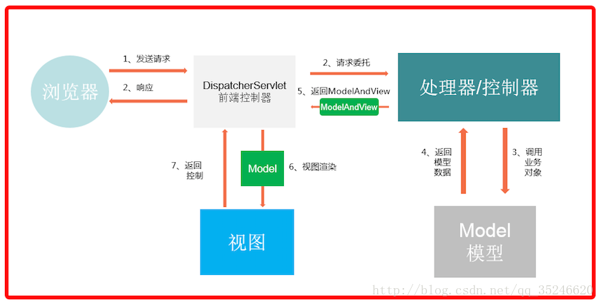

# Spring MVC

Spring Web MVC是一种基于Java的实现了Web MVC设计模式的请求驱动类型的轻量级Web框架，即使用了MVC架构模式的思想，将web层进行职责解耦，基于请求驱动指的就是使用请求-响应模型，框架的目的就是帮助我们简化开发

在Spring MVC框架中，从“Request（请求）”开始，依次进入“DispatcherServlet（核心分发器）” —> “HandlerMapping（处理器映射）” —> “Controller（控制器）” —> “ModelAndView（模型和视图）” —> “ViewResolver（视图解析器）” —> “View（视图）” —> “Response（响应）”结束，其中DispatcherServlet、HandlerMapping和ViewResolver 只需要在XML文件中配置即可，从而大大提高了开发的效率



# 扫描包

添加扫描包后注解才能生效

```xml
<context:component-scan base-package="com.ruiger.controller"/>
```

# 注解

```java
@Component
@Controller
@ResponseBody
@Resource
@Service

@TableName("app_version")
@TableId(value="id_User",type= IdType.UUID)
@TableField(value = "id_Organization")
@TableField(exist=false)

@JSONField(format="yyyy-MM-dd HH:mm")
```

# 参数传递

### param

```java
@RequestParam(value="id" Long id)
```

### json 对象

```java
@RequestBody List<ACClasssForTimeTableTran> finalTimeTableTran
```

##### 前台

```javascript
$.ajax({
    url:"/schedule/generateTimeTable?id=" + coursePlanId,
    type:"post",
    contentType:"application/json;charset=UTF-8",
    data:JSON.stringify(finalTimeTableTran),
    success: function(data){
        
    }
});
```

> [!NOTE]
>
> `@RequestBody`接收参数必须指定`contentType:"application/json;charset=UTF-8"`
>
> ```java
> $.post("/schedule/generateTimeTable", {data: JSON.stringify(data.field)},function success(data){
>    
> }, "json");
> ```
>
> 这种方式传递会报异常：
>
> ```
> org.springframework.web.HttpMediaTypeNotSupportedException: Content type 'application/x-www-form-urlencoded;charset=UTF-8' not supported
> ```

> 对应 Postman 的 raw - json
>
> 此时`@RequestParam`接收的参数应该通过链接传递，不知道有没有别的方式
>
> json 对象转换的注意事项参看 [java - fastjson - json 字符串转对象时 get/set 方法、构造方法的影响](/java/fastjson?id=json-字符串转对象时-getset-方法、构造方法的影响)

# 接口常用配置

```java
package com.chunshu.controller.api;

import java.net.InetAddress;
import java.net.UnknownHostException;
import java.util.Date;
import java.util.List;
import java.util.Map;
import java.util.regex.Pattern;

import javax.servlet.http.HttpServletRequest;
import javax.servlet.http.HttpServletResponse;

import org.apache.log4j.Logger;
import org.springframework.beans.factory.annotation.Autowired;
import org.springframework.web.bind.annotation.CrossOrigin;
import org.springframework.web.bind.annotation.ExceptionHandler;
import org.springframework.web.bind.annotation.RequestMapping;
import org.springframework.web.bind.annotation.RestController;

import com.alibaba.fastjson.JSON;
import com.baomidou.mybatisplus.mapper.EntityWrapper;
import com.chunshu.common.data.common.acquire.DataAcquire;
import com.chunshu.common.data.common.mybatisplus.AcquireEntityWrapper;
import com.chunshu.common.data.common.utils.HttpUtils;
import com.chunshu.common.result.JsonResult;
import com.chunshu.common.utils.StringUtil;
import com.chunshu.controller.common.BaseController;
import com.chunshu.model.exchange.DataExchange;
import com.chunshu.model.exchange.ExchangeLog;
import com.chunshu.service.exchange.IDataExchangeService;
import com.chunshu.service.exchange.IExchangeLogService;

/**
 * 上传的controller
 * 
 */
// 开启跨域
@CrossOrigin(origins = "*", maxAge = 3600)
// ajax请求
@RestController
// 基础路径、规定Content-Type为application/json;charset=UTF-8
@RequestMapping(value="/resApi", produces="application/json;charset=UTF-8")
public class BaseApiController extends BaseController {
	
	public static final String START_TIME_PARAM = "startTime";
	public static final String END_TIME_PARAM = "endTime";
	
	private Logger logger = Logger.getLogger(BaseApiController.class);

	@Autowired
	IDataExchangeService dataExchangeService;
	
	@Autowired
	IExchangeLogService exchangeLogService;
	
	@Autowired
	HttpServletRequest request;
	
	public <T> AcquireEntityWrapper<T> addUpdateParams(AcquireEntityWrapper<T> wrapper){
		String startTime = request.getParameter(START_TIME_PARAM);
		String endTime = request.getParameter(END_TIME_PARAM);
		if(startTime != null) {
			wrapper.ge(DataAcquire.UPDATE_TIME_KEY, StringUtil.getDate(startTime, "yyyy-MM-dd HH:mm:ss"));
		}
		if(endTime != null) {
			wrapper.le(DataAcquire.UPDATE_TIME_KEY, StringUtil.getDate(endTime, "yyyy-MM-dd HH:mm:ss"));
		}
		return wrapper;
	}
	
	/**
	 * 添加日志
	 * @param e
	 * @param dataSize
	 * @return
	 */
	public boolean addLog(DataExchange e, int dataSize) {
		Date now = new Date();
		String ip = getIpAddr();
		
		ExchangeLog log = new ExchangeLog();
		log.setInterfaceId(e.getId());
		log.setInterfaceName(e.getInterfaceName());
		log.setInterfaceInvoke(e.getInterfaceInvoke());
		log.setInterfaceURL(e.getInterfaceURL());
		
		log.setIp(ip);
		try {
			Map<String, String> rtnMap = HttpUtils.converMap(request.getParameterMap());
			log.setParams(JSON.toJSONString(rtnMap));
		} catch (Exception e1) {
			// TODO Auto-generated catch block
			e1.printStackTrace();
		}
		log.setVisitTime(now);
		log.setVolumeInt(dataSize);
		boolean result = exchangeLogService.insertOrUpdate(log);
		
		synchronized (e.getId()) {
			e = dataExchangeService.selectById(e.getId());
			e.setDataVolume((e.getDataVolume() != null ? e.getDataVolume() : 0) + dataSize);
			e.setUpdateTime(now);
			return result & dataExchangeService.insertOrUpdate(e);
		}
	}
	
	/**
	 * 接口访问合法性校验，使用ip、usr、pwd进行合法性校验
	 * @return
	 */
	public DataExchange verify() {
		String url = request.getServletPath();
		String ip = getIpAddr();
		String usr = request.getParameter("usr");
		String pwd = request.getParameter("pwd");
		
		logger.info(String.format("%s: %s %s %s", url, ip, usr, pwd));
		
		List<DataExchange> de = dataExchangeService.selectList(new EntityWrapper<DataExchange>().eq("interfaceURL", url));
		DataExchange iFinal = null;
		for(DataExchange i : de) {
			if(ip == null || usr == null || pwd == null) {
				return null;
			}
			if(StringUtil.isNotEmpty(i.getIp()) && containsIp(i.getIp(), ip) && usr.equals(i.getVisitName()) && pwd.equals(i.getVisitPassword())) {
				iFinal = i;
				break;
			}
		}
		
		if(iFinal == null) {
			return null;
		}
		return iFinal;
	}
	
	/**
	 * 校验ip
	 * 支持通配符，如192.168.3.%,192.168.1.1
	 * @param rule
	 * @param ip
	 * @return
	 */
	public static boolean containsIp(String rule, String ip) {
		return Pattern.matches("("
				// 删除两端空格
				+ rule.replaceAll("(^[\\s,]+|[\\s,]+$)", "")
				// 删除相邻的,
				.replaceAll("[\\s,]+", ",")
				// 将,替换为|
				.replace(",", "|").replace(".", "\\.")
				// 将%替换为.*
				.replace("%", ".*") + ")"
				, ip);
	}
	
	/**
     * 获取访问者真实IP地址
     */
    public String getIpAddr() {
        String ipAddress = request.getHeader("x-forwarded-for");
        if (ipAddress == null || ipAddress.length() == 0 || "unknown".equalsIgnoreCase(ipAddress)) {
            ipAddress = request.getHeader("Proxy-Client-IP");
        }
        if (ipAddress == null || ipAddress.length() == 0 || "unknown".equalsIgnoreCase(ipAddress)) {
            ipAddress = request.getHeader("WL-Proxy-Client-IP");
        }
        if (ipAddress == null || ipAddress.length() == 0 || "unknown".equalsIgnoreCase(ipAddress)) {
            ipAddress = request.getRemoteAddr();
            if ("127.0.0.1".equals(ipAddress) || "0:0:0:0:0:0:0:1".equals(ipAddress)) {
                // 根据网卡取本机配置的IP
                try {
                    ipAddress = InetAddress.getLocalHost().getHostAddress();
                } catch (UnknownHostException e) {
                    e.printStackTrace();
                }
            }
        }
        // 对于通过多个代理的情况，第一个IP为客户端真实IP,多个IP按照','分割
        // "***.***.***.***".length()
        if (ipAddress != null && ipAddress.length() > 15) {
            // = 15
            if (ipAddress.indexOf(",") > 0) {
                ipAddress = ipAddress.substring(0, ipAddress.indexOf(","));
            }
        }
        return ipAddress;
    }
	
	@ExceptionHandler({ Exception.class})
    public Object Exception(HttpServletRequest request, HttpServletResponse response, Exception e) throws Exception {
    	e.printStackTrace();
    	JsonResult obj = renderError(String.format("访问出错，请联系管理员: %s", e.toString()));
    	response.setCharacterEncoding("UTF-8");
        response.setContentType("application/json; charset=utf-8");
    	response.getWriter().write(JSON.toJSONString(obj));
        return null;
    }
}
```

