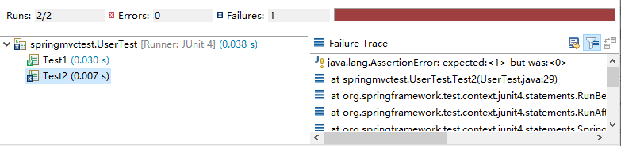

# jUnit 单元测试

# pom.xml

```xml
<!-- https://mvnrepository.com/artifact/junit/junit -->
<dependency>
    <groupId>junit</groupId>
    <artifactId>junit</artifactId>
    <version>4.13.2</version>
    <scope>test</scope>
</dependency>

<dependency>
    <groupId>org.springframework</groupId>
    <artifactId>spring-test</artifactId>
    <version>${spring.version}</version>
</dependency>
```

# 创建 test 文件夹

创建 /src/test/java 文件夹

创建测试类 BaseTest

```java
package springmvctest;

import org.junit.runner.RunWith;
import org.springframework.test.context.ContextConfiguration;
import org.springframework.test.context.junit4.SpringJUnit4ClassRunner;
import org.springframework.test.context.web.WebAppConfiguration;

@RunWith(SpringJUnit4ClassRunner.class)
@WebAppConfiguration
@ContextConfiguration({ "file:src/main/webapp/WEB-INF/dispatcher-servlet.xml" })
public class BaseTest {
	
}

```

测试类继承 BaseTest 即可

```java
package springmvctest;

import org.junit.Test;
import org.springframework.beans.factory.annotation.Autowired;

import com.alibaba.fastjson.JSON;
import com.springmvc.dao.UserDao;
import com.springmvc.model.User;

public class UserTest extends BaseTest {
	@Autowired
	UserDao userDao;
	
	@Test
	public void Test1() {
		User user = userDao.queryById(1);
		System.out.println(JSON.toJSONString(user));
	}
	
	@Test
	public void Test2() {
		User user = new User();
		user.setName("haierya");
		user.setAge(15);
		user.setPassword("password1");
		// 断言，如果两者一致，程序向下运行
		Assert.assertEquals(xx, 1);
		System.out.println(userDao.insertUser(user));
	}
}
```

# 断言

Assert.assertEquals：如果两者一直，程序向下运行，否则中断，抛出异常

```java
Assert.assertEquals(xx, 1);
```

jUnit 窗口

