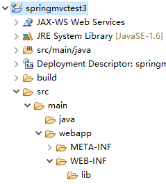
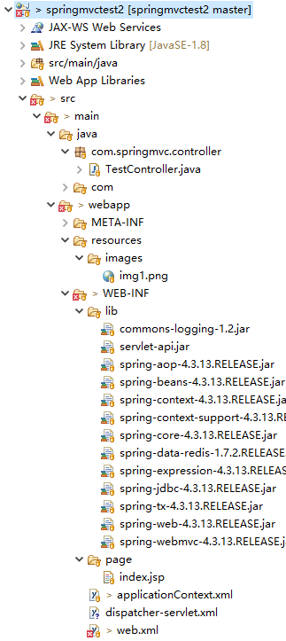

# 创建 Dynamic Web Project 项目

Eclipse - New Project - Dynamic Web Project

Dynamic web module version 选择3.0

> 后续可在项目 Properties Facets 中重新选择
>
> 4.0会导致保存保存web.xml卡住，跟 jdk1.8 不匹配？



# 设置项目的字符集

Properties - Resource - Text file encoding 设为UTF-8

# 创建 web.xml

> 创建工程时可勾选自动创建

在 WEB-INF 下创建 web.xml

```xml
<?xml version="1.0" encoding="UTF-8"?>
<web-app xmlns:xsi="http://www.w3.org/2001/XMLSchema-instance" xmlns="http://java.sun.com/xml/ns/javaee" xsi:schemaLocation="http://java.sun.com/xml/ns/javaee http://java.sun.com/xml/ns/javaee/web-app_3_0.xsd" id="WebApp_ID" version="3.0">
  <display-name>springmvctest3</display-name>
  <welcome-file-list>
    <welcome-file>index.html</welcome-file>
    <welcome-file>index.htm</welcome-file>
    <welcome-file>index.jsp</welcome-file>
    <welcome-file>default.html</welcome-file>
    <welcome-file>default.htm</welcome-file>
    <welcome-file>default.jsp</welcome-file>
  </welcome-file-list>
</web-app>
```

# 测试 web 项目是否搭建成功

在 WEB-INF 下创建 index.jsp

```jsp
<%@ page language="java" contentType="text/html; charset=UTF-8"
    pageEncoding="UTF-8"%>
<!DOCTYPE html>
<html>
	<head>
		<meta charset="UTF-8">
		<title>Hello World</title>
	</head>
	<body>
		<h1>Hello World</h1>
	</body>
</html>
```

在 server 窗口中添加服务器

将项目部署到服务器，启动服务器

浏览器访问

http://127.0.0.1:8080/springmvctest3/index.jsp

若正常显示 jsp，说明 java web 项目搭建成功了

# 集成 Spring MVC

### jar

```
commons-logging-1.2.jar
servlet-api.jar
spring-aop-4.3.13.RELEASE.jar
spring-beans-4.3.13.RELEASE.jar
spring-context-4.3.13.RELEASE.jar
spring-context-support-4.3.13.RELEASE.jar
spring-core-4.3.13.RELEASE.jar
spring-data-redis-1.7.2.RELEASE.jar
spring-expression-4.3.13.RELEASE.jar
spring-jdbc-4.3.13.RELEASE.jar
spring-tx-4.3.13.RELEASE.jar
spring-web-4.3.13.RELEASE.jar
spring-webmvc-4.3.13.RELEASE.jar
```

> HttpServletRequest 无法引入时需要引入 servlet-api.jar，可到 tomcat 中拷

### 配置 web.xml

```xml
<?xml version="1.0" encoding="UTF-8"?>
<web-app xmlns:xsi="http://www.w3.org/2001/XMLSchema-instance" xmlns="http://xmlns.jcp.org/xml/ns/javaee" xsi:schemaLocation="http://xmlns.jcp.org/xml/ns/javaee http://xmlns.jcp.org/xml/ns/javaee/web-app_3_0.xsd" id="WebApp_ID" version="3.0">
  <display-name>springmvctest2</display-name>
    <!-- Spring监听器 -->
  	<listener>
    	<listener-class>org.springframework.web.context.ContextLoaderListener</listener-class>
	</listener>
 	<!-- 防止Spring内存溢出监听器 -->
	<listener>
    	<listener-class>org.springframework.web.util.IntrospectorCleanupListener</listener-class>
	</listener>
    
  	<!-- 编码过滤器，解决POST乱码 -->
	<filter>
	    <filter-name>encoding</filter-name>
	    <filter-class>org.springframework.web.filter.CharacterEncodingFilter</filter-class>
	    <init-param>
	        <param-name>encoding</param-name>
	        <param-value>UTF-8</param-value>
	    </init-param>
	</filter>
	 
	<filter-mapping>
	    <filter-name>encoding</filter-name>
	    <url-pattern>/*</url-pattern>
	</filter-mapping>
	 
    <!-- Spring MVC 分发器 -->
	<servlet>
	    <servlet-name>springmvc</servlet-name>
	     <servlet-class>org.springframework.web.servlet.DispatcherServlet</servlet-class>
	     <init-param>
	        <param-name>namespace</param-name>
             <!-- 指定配置文件 -->
	        <param-value>dispatcher-servlet</param-value>
	    </init-param>
	</servlet>
    
	<!-- 拦截所有请求 -->
	<servlet-mapping>
	    <servlet-name>springmvc</servlet-name>
	    <url-pattern>/</url-pattern>
        <!-- <url-pattern>*.do</url-pattern> -->
	 </servlet-mapping>
</web-app>
```

### 在 WEB-INF 下创建 dispatcher-servlet.xml

```xml
<?xml version="1.0" encoding="UTF-8" ?>
<beans xmlns="http://www.springframework.org/schema/beans"
    xmlns:xsi="http://www.w3.org/2001/XMLSchema-instance" 
    xmlns:p="http://www.springframework.org/schema/p"
    xmlns:context="http://www.springframework.org/schema/context"
    xmlns:util="http://www.springframework.org/schema/util" 
    xmlns:mvc="http://www.springframework.org/schema/mvc"
    xsi:schemaLocation="http://www.springframework.org/schema/beans
       http://www.springframework.org/schema/beans/spring-beans-3.0.xsd
       http://www.springframework.org/schema/context 
       http://www.springframework.org/schema/context/spring-context-3.0.xsd
       http://www.springframework.org/schema/util 
       http://www.springframework.org/schema/util/spring-util-3.0.xsd 
       http://www.springframework.org/schema/mvc 
       http://www.springframework.org/schema/mvc/spring-mvc.xsd
      ">
   
      <!-- 开启注解支持 --> 
       <mvc:annotation-driven></mvc:annotation-driven>
      <!-- 扫描包 -->
      <context:component-scan base-package="com.springmvc.*"></context:component-scan>
      <!-- 静态资源映射，/resources/images/img1.png 映射到 /images/img1.png -->
      <mvc:resources location="/resources/" mapping="/**"/>
 

      <!-- 视图渲染 -->
      <bean class="org.springframework.web.servlet.view.InternalResourceViewResolver">
         <!-- 前缀 -->
         <property name="prefix" value="/WEB-INF/page/"></property>
         <property name="suffix" value=".jsp"></property>
      </bean> 
    
</beans>
```

### 在 WEB-INF 下创建 applicationContext.xml 文件（Spring 必须）

```xml
<?xml version="1.0" encoding="UTF-8" ?>
<beans xmlns="http://www.springframework.org/schema/beans"
    xmlns:xsi="http://www.w3.org/2001/XMLSchema-instance" 
    xmlns:p="http://www.springframework.org/schema/p"
    xmlns:context="http://www.springframework.org/schema/context"
    xmlns:util="http://www.springframework.org/schema/util" 
    xmlns:mvc="http://www.springframework.org/schema/mvc"
    xsi:schemaLocation="http://www.springframework.org/schema/beans
       http://www.springframework.org/schema/beans/spring-beans-3.0.xsd
       http://www.springframework.org/schema/context 
       http://www.springframework.org/schema/context/spring-context-3.0.xsd
       http://www.springframework.org/schema/util 
       http://www.springframework.org/schema/util/spring-util-3.0.xsd 
       http://www.springframework.org/schema/mvc 
       http://www.springframework.org/schema/mvc/spring-mvc.xsd
      ">
    
</beans>
```

### 尝试启动

如控制台不报错说明配置正常

### 创建控制器

在 com.springmvc 包下创建包 controller（与 dispatcher-servlet.xml 中扫描包一致）

在 controller 包下创建 TestController.java

```java
package com.springmvc.controller;

import javax.servlet.http.HttpServletRequest;

import org.springframework.beans.factory.annotation.Autowired;
import org.springframework.stereotype.Controller;
import org.springframework.web.bind.annotation.RequestMapping;
import org.springframework.web.bind.annotation.RequestParam;
import org.springframework.web.bind.annotation.ResponseBody;
import org.springframework.web.servlet.ModelAndView;

@Controller
public class TestController {
	
	@Autowired
	HttpServletRequest request;

	// 视图解析
	@RequestMapping("")
	public ModelAndView view(ModelAndView modelAndView) {
		modelAndView.setViewName("index");
		
		// 项目路径（root上下文）
		String contextPath = request.getContextPath();
		modelAndView.addObject("contextPath", contextPath);
		
		return modelAndView;
	}

	// ajax
	@RequestMapping("/test1")
	@ResponseBody
	public Object view(@RequestParam String name) {
		return "name is " + name;
	}
}
```

> contextPath 可配置为全局，参看 整合 Freemarker ，通过配置 freemarker 视图解析器的 requestContextAttribute 属性，即可在前台直接使用 pageContext.request 对象

### 创建视图

在 WEB-INF 下创建文件夹 page（与 dispatcher-servlet.xml 中视图解析路径一致）

在 page 下创建 index.jsp

```jsp
<%@ page language="java" contentType="text/html; charset=UTF-8" pageEncoding="UTF-8"%>
<html>
    <head>
        <meta charset="UTF-8" />
    </head>
    <body>
        <h1>Hello World</h1>
        
    </body>
</html>
```

> 解析为 html 须使用模板引擎，参看 [整合 Freemarker](整合 Freemarker.html)

### 添加静态资源

在根路径（webapp）下创建文件夹 resources（与 dispatcher-servlet.xml 中静态资源映射location路径一致）

在 resources 下添加测试图片 images/img1.png（对应上面创建视图中 img 标签的路径）

### 测试

最终工程目录：



启动 server

测试视图解析，静态资源映射

http://127.0.0.1:8080/springmvctest2/

测试ajax

http://127.0.0.1:8080/springmvctest2/test1?name=haiyiya

### applicationContext.xml 与 dispatcher-servlet.xml

applicationContext.xml 为 Spring 配置文件，先初始化

dispatcher-servlet.xml 为 Spring MVC 配置文件，后初始化

可以直接使用 Spring MVC，仅把配置信息放在 dispatcher-servlet.xml 中

##### 删除 Spring 监听器，删除 applicationContext.xml

```xml
<listener>
    <listener-class>org.springframework.web.context.ContextLoaderListener</listener-class>
</listener>
```

##### 在启动时初始化 Spring MVC

在 Spring MVC servlet 中加上 \<load-on-startup>1\</load-on-startup>

```xml
<servlet>
    <servlet-name>springmvc</servlet-name>
    <servlet-class>org.springframework.web.servlet.DispatcherServlet</servlet-class>
    <init-param>
        <param-name>namespace</param-name>
        <param-value>dispatcher-servlet</param-value>
    </init-param>
    <load-on-startup>1</load-on-startup>
</servlet>
```


> dispatcher-servlet.xml（在你的项目中也可能写作springmvc-serlvet.xml、spring-serlvet.xml等等）和applicationContext.xml中的根元素都是<beans>，两者也同样都可以托管java bean，那么两者的区别何在呢？
>
> 1.两者的区别：
>
> spring允许你使用树形的结构定义多个上下文，而applicationContext.xml定义的是“root webapp context”,直译过来就是根应用上下文。而dispatcher-servlet.xml定义一个servlet的应用上下文，是applicationContext.xml上下文的子类。在初始化时，applicationContext.xml首先初始化，而dispatcher-servlet.xml在对应的servlet实例化时启动，因此applicationContext.xml初始化在前，而dispatcher-servlet.xml初始化在后。即使将spring servlet设置为<load-on-startup>1</load-on-startup>，即servlet在应用启动时初始化，dispatcher-servlet.xml的初始化也会在根上下文之后。在一个应用中，可以有多个像dispatcher-servlet.xml一样的上下文，每一个各自服务于一个spring的servlet，比如spring1-servlet.xml用于名字为spring1的servlet，spring2-servlet.xml用于名字为spring2的servlet，并通过在web.xml中的配置进行绑定，如下：
>
> web.xml:
>
> <!-- spring1 servlet -->
>
> <servlet>
>
> <servlet-name>spring1</servlet-name>
> <servlet-class>org.springframework.web.servlet.DispatcherServlet</servlet-class>
>         <init-param>   
> <param-name>contextConfigLocation</param-name>
> <!-- 指定spring1-servlet.xml为spring1这个servlet的配置文件 -->
>         <param-value>/WEB-INF/spring1-servlet.xml</param-value>
> </init-param>
> </servlet>
> <servlet-mapping>
> <servlet-name>spring1</servlet-name>              
> <url-pattern>/spring1/</url-pattern>
> </servlet-mapping>
>
> <!-- spring2 servlet -->
> <servlet>
> <servlet-name>spring2</servlet-name>
> <servlet-class>org.springframework.web.servlet.DispatcherServlet</servlet-class>          
> <init-param>   
> <param-name>contextConfigLocation</param-name>
> <!-- 指定spring2-servlet.xml为spring2这个servlet的配置文件 -->
> <param-value>/WEB-INF/spring2-servlet.xml</param-value></init-param>
> </servlet>
>
> <servlet-mapping>
>
> <servlet-name>spring2</servlet-name> 
>
> <url-pattern>/spring2/</url-pattern>
>
> </servlet-mapping>
> 从示例中可以看出，我们分别定义了两个spring servlet，第一个叫spring1，其配置文件为spring1-servlet.xml，其上下文也就是
> spring1-servlet.xml；第二个叫spring2，其上下文为spring2-servlet.xml。
>
> 2.依赖注入：
>
> spring-servlet.xml中的bean可以引用父类applicationContext.xml上下文中的bean，例如在spring-servlet.xml中定义了一个bean,类名叫A,A类中有一个成员变量是B类的对象，而B类又是applicationContext.xml中的Bean，那么通过@resouce @autowired等注解或者在配置文件中声明都可以引用到B类的这个bean，但是反之则不行。比如B类中有一个A类的成员变量，通过@resource等方式来引用spring-servlet.xml中的A类的bean，在运行时会报错，提示要注入的bean不存在。其实很容易理解，前面说过，applicationContext.xml初始化在先，因此applicationContext.xml中的bean实例化在先，无法获得spring-servlet.xml的bean。不仅如此，也可能由于spring的servlet对应的上下文是子类，可能有多个，因此在spring1-servlet.xml和spring2-servlet.xml中可能有相同的bean类（比如类型相同、id、name都相同），如果作为父类的applicationContext.xml需要子类的bean，那么spring框架应该从哪个子类中获得bean呢？有可能 spring的开发者出于这种考虑，设计了父类上下文中的bean不能引用子类上下文中的bean。
>
> 3.dispatch-servlet.xml与applicationContext.xml写成一个文件
>
> 可以把这两个文件写成一个，比如spring-servlet.xml，然后在web.xml声明根应用上下文为spring-servlet.xml，如下：
>
>  
>
>
>  <listener>
>      <listener-class>org.springframework.web.context.ContextLoaderListener</listener-class>
>    </listener>
>    <context-param>
>      <param-name>contextConfigLocation</param-name>
>      <param-value>WEB-INF/spring-servlet.xml</param-value>
>    </context-param>
>
>
>  <servlet>
>
>  <servlet-name>spring</servlet-name>
>
>  <servlet-class>org.springframework.web.servlet.DispatcherServlet</servlet-class>       
>  </servlet>
>  <servlet-mapping>
>  <servlet-name>spring</servlet-name>              
>  <url-pattern>/</url-pattern>
>  </servlet-mapping>
>
> 这样spring-servlet.xml同时也具有原来的applicationContext.xml的作用。
>
> 但是根据上文，我们知道根上下文是在应用启动时初始化，而servlet对应的上下文随servlet初始化，他们是两个上下文，因此即便是写成同一个文件，也只是使用spring-servlet.xml同时充当根上下文对象，省去了一个xml文件，但是spring-servlet.xml仍会初始化两遍：第一遍是作为根上下文随应用启动时初始化，第二遍是作为spirng servlet对应的上下文随名称为spring的servlet初始化。即如果在spring-servlet.xml声明了一个bean，这个bean会在应用启动时，spring-servlet.xml作为根上下文初始化时，创建一个；然后在servlet启动时，spring-servlet.xml又作为servlet的上下文初始化时，再创建一个。当然，简单的springMVC应用一般只有一个spring servlet，因此applicationContext.xml也可以不用，而把所有的bean都注册到spring servlet对应的上下文，即把web.xml中的
>
> <listener>
>     <listener-class>org.springframework.web.context.ContextLoaderListener</listener-class>
>   </listener>
>
> 这段代码去掉，只保留spring-servlet.xml文件。这种情况下，如果有些bean需要在应用启动时初始化，那么设置spring servlet为<load-on-startup>1</load-on-startup>即可
> ————————————————
> 版权声明：本文为CSDN博主「mr_orange_klj」的原创文章，遵循CC 4.0 BY-SA版权协议，转载请附上原文出处链接及本声明。
> 原文链接：https://blog.csdn.net/mr_orange_klj/article/details/78633626

### 修改 Eclipse 配置

##### 修改 Dynamic Web Module 版本、java 版本

项目右键 - Properties - Project Facets

##### 修改部署路径

Properties - Deployment Assembly

##### 修改 java 编译路径

Properties - Java Build Path - Default output folder

```
// springmvctest2/build/classes
springmvctest2/src/main/webapp/WEB-INF/classes
```

##### 转换为 maven 工程

项目右键 - Configure - Convert to Maven Project

将 jar 信息填入pom.xml

```xml
<project xmlns="http://maven.apache.org/POM/4.0.0" xmlns:xsi="http://www.w3.org/2001/XMLSchema-instance" xsi:schemaLocation="http://maven.apache.org/POM/4.0.0 https://maven.apache.org/xsd/maven-4.0.0.xsd">
  <modelVersion>4.0.0</modelVersion>
  <groupId>springmvctest</groupId>
  <artifactId>springmvctest</artifactId>
  <version>0.0.1-SNAPSHOT</version>
  <packaging>war</packaging>
  <build>
    <plugins>
      <plugin>
        <artifactId>maven-compiler-plugin</artifactId>
        <version>3.8.1</version>
        <configuration>
          <source>1.8</source>
          <target>1.8</target>
        </configuration>
      </plugin>
      <plugin>
        <artifactId>maven-war-plugin</artifactId>
        <version>3.2.3</version>
      </plugin>
    </plugins>
  </build>    
  <properties>
      <spring.version>4.3.13.RELEASE</spring.version>
      <servlet.version>3.1.0</servlet.version>
    </properties>
  <dependencies>
	    <!-- Spring Begin -->
	    <dependency>
	        <groupId>org.springframework</groupId>
	        <artifactId>spring-webmvc</artifactId>
	        <version>${spring.version}</version>
	    </dependency>
	    <dependency>
	      <groupId>org.springframework</groupId>
	      <artifactId>spring-context-support</artifactId>
	      <version>${spring.version}</version>
	    </dependency>
	    <!-- Spring End -->
	
	    <!-- Servlet Begin -->
	    <dependency>
	        <groupId>javax.servlet</groupId>
	        <artifactId>javax.servlet-api</artifactId>
	        <version>${servlet.version}</version>
	    </dependency>
	    <!-- Servlet End -->
	</dependencies>
</project>
```

删除原 lib 文件夹

等待 build 完成，重启服务