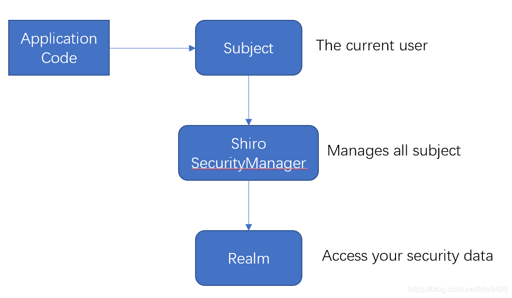
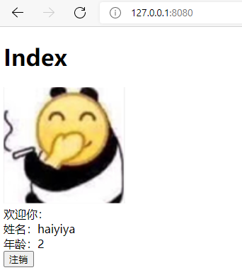
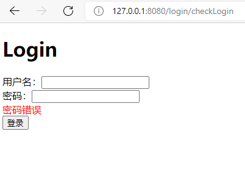

# 整合 Shiro

Shiro是Apache 旗下的一个简单易用的权限框架，可以轻松的完成 认证、授权、加密、会话管理、与 Web 集成、缓存等，这里只进行简单的介绍，详细的介绍请查阅官方文档，先来看下Shiro如何工作的



可以看到：应用代码直接交互的对象是 Subject，也就是说 Shiro 的对外 API 核心就是 Subject；其每个 API 的含义：

Subject：主体，代表了当前 “用户”，这个用户不一定是一个具体的人，与当前应用交互的任何东西都是 Subject，所有 Subject 都绑定到 SecurityManager，与 Subject 的所有交互都会委托给 SecurityManager

SecurityManager：安全管理器；即所有与安全有关的操作都会与 SecurityManager 交互；且它管理着所有 Subject；它是 Shiro 的核心，它负责与他组件进行交互，可以把它看成 DispatcherServlet 前端控制器

Realm：域，Shiro 从 Realm 获取安全数据（如用户、角色、权限），就是说 SecurityManager 要验证用户身份，那么它需要从 Realm 获取相应的用户进行比较以确定用户身份是否合法；也需要从 Realm 得到用户相应的角色 / 权限进行验证用户是否能进行操作；可以把 Realm 看成 DataSource，即安全数据源

记住一点，Shiro 不会去维护用户、权限；需要我们自己去设计 / 提供；然后通过相应的接口注入给 Shiro 即可。

> [Apache Shiro | Simple. Java. Security.](https://shiro.apache.org/10-minute-tutorial.html)
>
> [Shiro权限控制(一):Spring整合Shiro_kity9420的专栏-CSDN博客](https://blog.csdn.net/kity9420/article/details/88909426)

# pom.xml

```xml
<!-- shiro 包-->
<dependency>
    <groupId>org.apache.shiro</groupId>
    <artifactId>shiro-core</artifactId>
    <version>1.2.2</version>
</dependency>

<dependency>
    <groupId>org.apache.shiro</groupId>
    <artifactId>shiro-web</artifactId>
    <version>1.2.2</version>
</dependency>

<dependency>
    <groupId>org.apache.shiro</groupId>
    <artifactId>shiro-ehcache</artifactId>
    <version>1.2.2</version>
</dependency>

<dependency>
    <groupId>org.apache.shiro</groupId>
    <artifactId>shiro-quartz</artifactId>
    <version>1.2.2</version>
</dependency>

<dependency>
    <groupId>org.apache.shiro</groupId>
    <artifactId>shiro-spring</artifactId>
    <version>1.2.2</version>
</dependency>
```

# dispatcher-servlet.xml

```xml
<!-- 安全管理器 -->
<bean id="securityManager" class="org.apache.shiro.web.mgt.DefaultWebSecurityManager">
    <property name="realm" ref="userShiroRealm"/>
</bean>

<!-- 自定义域 -->
<bean id="userShiroRealm" class="com.springmvc.common.shiro.UserShiroRealm">
</bean>

<!-- Shiro的web过滤器 -->
<bean id="shiroFilter" class="org.apache.shiro.spring.web.ShiroFilterFactoryBean">
    <property name="securityManager" ref="securityManager"/>
    <!-- 未登录跳转地址 -->
    <property name="loginUrl" value="/login" />
    <!-- 无权限跳转地址 -->
    <property name="unauthorizedUrl" value="/login"/>
    <!-- url过滤器，anon表示无需登陆，如登陆，authc表示登陆才可访问 -->
    <property name="filterChainDefinitions">
        <value>
            /login/** = anon
            <!-- 默认需要登陆才可访问，不配置shiro无效 -->
            /**=authc
        </value>
    </property>
</bean>
```

# 在 web.xml 中配置拦截器

```xml
<filter>
    <filter-name>shiroFilter</filter-name>
    <filter-class>
        org.springframework.web.filter.DelegatingFilterProxy
    </filter-class>
    <init-param>
        <param-name>targetFilterLifecycle</param-name>
        <param-value>true</param-value>
    </init-param>
</filter>
<filter-mapping>
    <filter-name>shiroFilter</filter-name>
    <url-pattern>/*</url-pattern>
</filter-mapping>
```

> 此处拦截器的名称应与 dispatcher-servlet.xml 一致

# Realm

自定义域 com.springmvc.common.shiro.UserShiroRealm

```java
package com.springmvc.common.shiro;

import org.apache.shiro.SecurityUtils;
import org.apache.shiro.authc.AuthenticationException;
import org.apache.shiro.authc.AuthenticationInfo;
import org.apache.shiro.authc.AuthenticationToken;
import org.apache.shiro.authc.SimpleAuthenticationInfo;
import org.apache.shiro.authc.UnknownAccountException;
import org.apache.shiro.authc.UsernamePasswordToken;
import org.apache.shiro.authz.AuthorizationInfo;
import org.apache.shiro.authz.SimpleAuthorizationInfo;
import org.apache.shiro.realm.AuthorizingRealm;
import org.apache.shiro.subject.PrincipalCollection;
import org.springframework.beans.factory.annotation.Autowired;
import org.springframework.stereotype.Component;

import com.springmvc.model.User;
import com.springmvc.service.IUserService;

@Component
public class UserShiroRealm extends AuthorizingRealm {
	@Autowired
	private IUserService userService;
	
//	public void setUserService(IUserService userService) {
//		this.userService = userService;
//	}

    // 授权
	@Override
	protected AuthorizationInfo doGetAuthorizationInfo(PrincipalCollection principals) {
		User user = (User)SecurityUtils.getSubject().getPrincipal();
		
		SimpleAuthorizationInfo info = new SimpleAuthorizationInfo();
		if(user != null) {
			info.addRole("admin");
			info.addStringPermission("user:add");
		}
		return info;
	}

    // 验证
	@Override
	protected AuthenticationInfo doGetAuthenticationInfo(AuthenticationToken autToken) throws AuthenticationException {
		// 取出用户名（为简便，使用id-password验证登陆）
		UsernamePasswordToken userPwdToken = (UsernamePasswordToken) autToken;
		String uid = userPwdToken.getUsername();

        // 查询用户信息，并进行是否存在、是否锁定等校验
		User user = userService.queryById(Integer.valueOf(uid));
		if (null == user) {
			throw new UnknownAccountException("用户不存在！");
		}
//		if(user.getIsBlack() == null || user.getIsBlack() == 1) {
//			throw new LockedAccountException("您的账号已被禁止登陆！");
//		}
		
        // 构造验证信息
		SimpleAuthenticationInfo authenticationInfo = new SimpleAuthenticationInfo(user,
				user.getPassword(), user.getName());

		return authenticationInfo;
	}
}
```

`SimpleAuthenticationInfo`参数：

1. 用户对象，可根据需要传用户或用户名等，使用`SecurityUtils.getSubject().getPrincipal()`取出
2. 密码，用于与`UsernamePasswordToken`中的`password`比较决定验证是否通过
3. salt，盐，用于密码加密
4. realm 名称

> But what if their login attempt fails? You can catch all sorts of specific exceptions that tell you exactly what happened and allows you to handle and react accordingly:
>
> ```java
> try {
>     currentUser.login( token );
>     //if no exception, that's it, we're done!
> } catch ( UnknownAccountException uae ) {
>     //username wasn't in the system, show them an error message?
> } catch ( IncorrectCredentialsException ice ) {
>     //password didn't match, try again?
> } catch ( LockedAccountException lae ) {
>     //account for that username is locked - can't login.  Show them a message?
> }
>     ... more types exceptions to check if you want ...
> } catch ( AuthenticationException ae ) {
>     //unexpected condition - error?
> }
> ```

# 登录接口及页面

### /

登陆成功后跳转的主页面，根据 shiroFilter`filterChainDefinitions`的配置，未登录直接访问此页面将会跳转到 `loginUrl`，即`/logon`

```java
@RequestMapping("")
public ModelAndView view(ModelAndView modelAndView) {
    modelAndView.setViewName("index");
    // 传递当前登录人的信息到前台
    modelAndView.addObject("user", (User)SecurityUtils.getSubject().getPrincipal());
    return modelAndView;
}
```


### /login

shiroFilter 中未登录跳转的 `loginUrl`

```java
@RequestMapping("/login")
public ModelAndView login(ModelAndView modelAndView) {
    modelAndView.setViewName("login");
    return modelAndView;
}
```

### /login/checkLogin

验证登陆的接口，`UsernamePasswordToken`中传递的用户名、密码应与`UserShiroRealm.doGetAuthenticationInfo`方法中的验证方式相对应

登陆成功后重定向到主页面`\`；登陆失败解析到 login 视图，同时将异常信息通过`msg`传递到页面，此处捕获的异常与`UserShiroRealm.doGetAuthenticationInfo`方法中抛出的异常一致

```java
@RequestMapping(value = "/login/checkLogin", method = RequestMethod.POST)
public ModelAndView checkLogin(ModelAndView modelAndView, @RequestParam("id") String id,
                               @RequestParam("password") String password) {
    modelAndView.setViewName("login");
    try {
        UsernamePasswordToken token = new UsernamePasswordToken(id, password);
        Subject subject = SecurityUtils.getSubject();
        subject.login(token);
        modelAndView.setViewName("redirect:/");
    } catch ( UnknownAccountException uae ) {
        modelAndView.addObject("msg", "用户不存在");
        //username wasn't in the system, show them an error message?
    } catch ( IncorrectCredentialsException ice ) {
        modelAndView.addObject("msg", "密码错误");
        //password didn't match, try again?
    } catch ( LockedAccountException lae ) {
        modelAndView.addObject("msg", "用户已被锁定");
        //account for that username is locked - can't login.  Show them a message?
    } catch ( AuthenticationException ae ) {
        modelAndView.addObject("msg", "登陆验证异常");
        //unexpected condition - error?
    } catch ( Exception ae ) {
        modelAndView.addObject("msg", "登陆验证异常");
    }
    return modelAndView;
}
```

### /logout

注销接口

```java
@RequestMapping(value = "/logout", method = RequestMethod.GET)
public ModelAndView logout(ModelAndView modelAndView){
    Subject subject = SecurityUtils.getSubject();
    if(subject.isAuthenticated()) {
        subject.logout();
    }
    modelAndView.setViewName("login");
    modelAndView.addObject("msg", "已注销");
    return modelAndView;
}
```

### login 视图

```html
<!DOCTYPE html>
<html>
    <head>
        <meta charset="UTF-8" />
    </head>
    <body>
        <h1>Login</h1>
        <form action="/login/checkLogin" method="post">
            用户名：<input type="text" name="id"><br/>
            密码：<input type="password" name="password"><br/>
            <span style="color: red">${msg!}</span><br>
            <input type="submit" value="登录">
        </form>
    </body>
</html>
```

### index 视图，主页面

```html
<!DOCTYPE html>
<html>
    <head>
        <meta charset="UTF-8" />
    </head>
    <body>
        <h1>Index</h1>
        
        
        
        <div>欢迎你：</div>
        <div>姓名：${user.name}</div>
        <div>年龄：${user.age}</div>
        
        <a href="/logout"><button type="button">注销</button></a>
    </body>
</html>
```

# 测试

1. 未登录访问主页面应跳转到登录页

2. 登录成功

   

3. 注销、密码错误等提示

   

# 密码加密

shiro`HashedCredentialsMatcher`支持加盐和哈希多次迭代，生成64位特征值（SHA-256）存储为密码

> ### Salting
>
> Prior to Shiro 1.1, salts could be obtained based on the end-user submitted [`AuthenticationToken`](https://shiro.apache.org/static/1.2.3/apidocs/org/apache/shiro/authc/AuthenticationToken.html) via the now-deprecated [`getSalt(AuthenticationToken)`](https://shiro.apache.org/static/1.2.3/apidocs/org/apache/shiro/authc/credential/HashedCredentialsMatcher.html#getSalt(org.apache.shiro.authc.AuthenticationToken)) method. This however could constitute a security hole since ideally salts should never be obtained based on what a user can submit. User-submitted salt mechanisms are *much* more susceptible to dictionary attacks and **SHOULD NOT** be used in secure systems. Instead salts should ideally be a secure randomly-generated number that is generated when the user account is created. The secure number should never be disseminated to the user and always kept private by the application.
>
> 盐值不应该由用户提供，应该使用用户创建时随机生成的、不向用户提供的、由程序私有的数字

> ## MD5 & SHA-1 Notice
>
> [MD5](http://en.wikipedia.org/wiki/MD5) and [SHA-1](http://en.wikipedia.org/wiki/SHA_hash_functions) algorithms are now known to be vulnerable to compromise and/or collisions (read the linked pages for more). While most applications are ok with either of these two, if your application mandates high security, use the SHA-256 (or higher) hashing algorithms and their supporting implementations.
>
> MD5 和 SHA-1 容易被碰撞影响，SHA-256 具有更高的安全性

### 在 Realm 中配置 hash 算法和迭代次数

```xml
<!-- 自定义域 -->
<bean id="userShiroRealm" class="com.springmvc.common.shiro.UserShiroRealm">
    <property name="credentialsMatcher">
        <bean class="org.apache.shiro.authc.credential.HashedCredentialsMatcher">
            <!-- 加密算法 -->
            <property name="hashAlgorithmName" value="SHA-256"></property>
            <!-- 加密次数 -->
            <property name="hashIterations" value="1024"></property>
        </bean>
    </property>
</bean>
```

### Realm 中生成验证信息时加盐

```java
// 使用id的字符串作为盐
ByteSource salt = ByteSource.Util.bytes(String.valueOf(user.getId()));
SimpleAuthenticationInfo authenticationInfo = new SimpleAuthenticationInfo(user, user.getPassword(), salt, user.getName());
```

### 生成加密后的密码

在创建用户或修改密码时生成加密密码

```java
public static final String md5(String password, Serializable userId){
    //加密方式
    String hashAlgorithmName = "SHA-256";
    //盐：为了即使相同的密码不同的盐加密后的结果也不同
    ByteSource salt = ByteSource.Util.bytes(String.valueOf(userId));
    ByteSource byteSalt = ByteSource.Util.bytes(salt);
    //密码
    Object source = password;
    //加密次数
    int hashIterations = 1024;
    SimpleHash result = new SimpleHash(hashAlgorithmName, source, byteSalt, hashIterations);
    return result.toString();
}
```

# 使用 ehcache 缓存

每次我们刷新页面，或者每次进行权限验证时，都需要进行查询该用户的所有的权限数据， 花费了大量的时间，查询相同的数据。 所以，我们需要缓存。 如果我们想查询的数据，在缓存里面，就直接从缓存里面拿 ，如果缓存中不存在想查询的数据，那么才从数据库中查询。 注意，当授权信息发生改变时，需要清理缓存，不然会一直使用原先的旧权限数据。

集成 ehcache 参看[集成EhCache](/Spring_MVC/集成EhCache.md)

### dispatcher-servlet.xml

```xml
<!-- 使用cacheManagerFactory创建shiro ehcache的缓存管理器 --> 
<bean id="shiroCacheManager" class="org.apache.shiro.cache.ehcache.EhCacheManager"> 
    <property name="cacheManager" ref="cacheManagerFactory" /> 
</bean>

<!-- 会话ID生成器 -->
<bean id="sessionIdGenerator" class="org.apache.shiro.session.mgt.eis.JavaUuidSessionIdGenerator"/>

<!-- sessionDAO保存认证信息 -->
<bean id="sessionDAO" class="org.apache.shiro.session.mgt.eis.EnterpriseCacheSessionDAO">
    <property name="activeSessionsCacheName" value="shiro-activeSessionCache" />
    <property name="cacheManager" ref="shiroCacheManager" />
    <property name="sessionIdGenerator" ref="sessionIdGenerator"/>
</bean>

<!-- 会话管理器，设定会话超时及保存 -->
<bean id="sessionManager" class="org.apache.shiro.web.session.mgt.DefaultWebSessionManager">
    <!-- 全局会话超时时间（单位毫秒），默认30分钟 -->
    <property name="globalSessionTimeout" value="1800000" />
    <!-- 删除失效的session -->
    <property name="deleteInvalidSessions" value="true"/>
    <property name="sessionDAO" ref="sessionDAO"/>
</bean>
```

### ehcache.xml

```xml
<defaultCache
              maxEntriesLocalHeap="0"
              eternal="true"
              timeToIdleSeconds="0"
              timeToLiveSeconds="0"
              overflowToDisk="true"
              diskPersistent="true"
              />
```

### 清理缓存

当授权信息变化时，应清理缓存，让shiro重新加载权限信息；或者重新登录亦可以

##### 在 UserShiroRealm 中定义清理缓存方法

```java
/**
 * 清除缓存
 */
public void clearCache() {
    System.out.println("清除缓存数据");
    Subject subject=SecurityUtils.getSubject();
    // 调用子类去清理缓存
    super.clearCache(subject.getPrincipals());
}
```

在需要调用的地方自动注入 UserShiroRealm，调用`clearCache`方法即可

> [Shiro整合EhCache缓存(九)_两个蝴蝶飞-CSDN博客](https://blog.csdn.net/yjltx1234csdn/article/details/106121159)

# Shiro Session 失效时间设置无效

> shiro session 默认失效时间30分钟

### Shiro sessionManager 全局 session 超时时间

```xml
<bean id="sessionManager" class="org.apache.shiro.web.session.mgt.DefaultWebSessionManager">
    <!-- 全局会话超时时间（单位毫秒），默认30分钟 -->
    <property name="globalSessionTimeout" value="3600000" />
    <!-- 删除失效的session -->
    <property name="deleteInvalidSessions" value="true"/>
    <property name="sessionDAO" ref="sessionDAO"/>
</bean>
```

注意要在 securityManager 中配置 sessionManager

```xml
<bean id="securityManager" class="org.apache.shiro.web.mgt.DefaultWebSecurityManager">
	<property name="cacheManager" ref="shiroCacheManager" />
	<property name="realm" ref="myRealm" />
	<property name="sessionManager" ref="sessionManager"></property>
</bean>
```

> 经测试，web.xml 中配置无效，
>
> ```xml
> <session-config>
>  <session-timeout>30</session-timeout>
> </session-config>
> ```

### Ehcache 配置

ehcache 配置不当会导致 session 被 ehcache 删除

```xml
<?xml version="1.0" encoding="UTF-8"?>
<ehcache xmlns:xsi="http://www.w3.org/2001/XMLSchema-instance"
         xsi:noNamespaceSchemaLocation="ehcache.xsd"
         updateCheck="false" monitoring="autodetect"
         dynamicConfig="true" >
         
    <diskStore path="java.io.tmpdir/ehcache"/>

    <defaultCache
		maxEntriesLocalHeap="0"
		eternal="true"
		timeToIdleSeconds="0"
		timeToLiveSeconds="0"
		overflowToDisk="true"
		diskPersistent="true"
    />
</ehcache>
```

> ehcache自作主张导致session未过期而删除，未通知session调度器。正确的做法是只有session调度器 有权删除，ehcache不能自行删除，这就要求ehcache中session的空闲时间为永久、如果内存不够就写到磁盘，如果要求重启jvm session不丢失，还需要diskPersistent=true。顺便说一下，session调度器默认是每隔1小时，执行一次。
> 正确的配置应该为
>
> ```xml
> <cache name="shiro-activeSessionCache" 
>     maxEntriesLocalHeap="0"  <!--内存中不限制数量-->
>     eternal="true"  <!--永久-->
>     timeToIdleSeconds="0" <!--空闲时间为永久-->
>     timeToLiveSeconds="0" <!--存活时间为永久-->
>     overflowToDisk="true" <!--如果内存不够则写到磁盘，持久化以防止session丢失-->
>     diskPersistent="true" <!--重启jvm，session不丢失-->
> />
> ```
>
>
> 其实在shiro-ehcache.jar中，有个ehcache.xml（对应java中的net.sf.ehcache.config.CacheConfiguration），里边的注释也明确说明了这个问题
>
> We want eternal="true" and no timeToIdle or timeToLive settings because Shiro manages session
>       expirations explicitly.  If we set it to false and then set corresponding timeToIdle and timeToLive properties,
>       ehcache would evict sessions without Shiro's knowledge, which would cause many problems
>      (e.g. "My Shiro session timeout is 30 minutes - why isn't a session available after 2 minutes?"
>             Answer - ehcache expired it due to the timeToIdle property set to 120 seconds.)
>
> ```xml
> diskPersistent=true since we want an enterprise session management feature - ability to use sessions after
> even after a JVM restart.
> <cache name="shiro-activeSessionCache"
>     maxElementsInMemory="10000"
>     overflowToDisk="true"
>     eternal="true"
>     timeToLiveSeconds="0"
>     timeToIdleSeconds="0"
>     diskPersistent="true"
>     diskExpiryThreadIntervalSeconds="600"/>
> ```
> **总结**
>
> 设置session过期时间不起作用，是因为ehcache自行删除导致；
> redis/ehcache与session的运作机制搞懂了。缓存只用来存储session，不能自行删除，session调度器负责check session有效性，如果过期，则明确指示redis/ehcache删除session。
>
> 版权声明：本文为CSDN博主「QQ_851228082」的原创文章，遵循CC 4.0 BY-SA版权协议，转载请附上原文出处链接及本声明。
> 原文链接：https://blog.csdn.net/wangjun5159/article/details/89875746

# 启用注解

### dispatcher-servlet.xml

```xml
<!-- 配置 Bean 后置处理器: 会自动的调用和 Spring 整合后各个组件的生命周期方法. -->
<bean id="lifecycleBeanPostProcessor" class="org.apache.shiro.spring.LifecycleBeanPostProcessor" />

<!-- 启用shrio授权注解拦截方式，AOP式方法级权限检查 -->
<bean class="org.springframework.aop.framework.autoproxy.DefaultAdvisorAutoProxyCreator" depends-on="lifecycleBeanPostProcessor">
    <property name="proxyTargetClass" value="true" />
</bean>
<!-- 权限注解的通知器 -->
<bean class="org.apache.shiro.spring.security.interceptor.AuthorizationAttributeSourceAdvisor">
    <property name="securityManager" ref="securityManager" />
</bean>
```

> [Shiro权限控制(三):Shiro注解权限验证_kity9420的专栏-CSDN博客_shiro 注解权限控制](https://blog.csdn.net/kity9420/article/details/89198613)
>
> [aop:config在shiro权限注解中发挥的作用_wangjun5159的专栏-CSDN博客](https://blog.csdn.net/wangjun5159/article/details/51889628)

### 在接口上加上注解

```java
@RequiresRoles(value={"admin"},logical=Logical.OR)
@RequestMapping("/test2")
@ResponseBody
public Object test3(@RequestParam Integer id) {
    return userDao.queryById(id);
}
```

> `RequiresAuthentication`:使用该注解标注的类，实例，方法在访问或调用时，当前Subject必须在当前session中已经过认证
> <br>
> `RequiresGuest`:使用该注解标注的类，实例，方法在访问或调用时，当前Subject可以是“gust”身份，不需要经过认证或者在原先的session中存在记录。
> <br>
> `RequiresPermissions`:当前Subject需要拥有某些特定的权限时，才能执行被该注解标注的方法。如果当前Subject不具有这样的权限，则方法不会被执行。
> <br>
> `RequiresRoles`:当前Subject必须拥有所有指定的角色时，才能访问被该注解标注的方法。如果当天Subject不同时拥有所有指定角色，则方法不会执行还会抛出AuthorizationException异常。
> <br>
> `RequiresUser`:当前Subject必须是应用的用户，才能访问或调用被该注解标注的类，实例，方法。
>
> [shiro注解权限控制-5个权限注解 - lamsey16 - 博客园 (cnblogs.com)](https://www.cnblogs.com/limingxian537423/p/7928234.html)

```java
@RequiresPermissions(value={"evaluatingTeaching:add","evaluatingTeaching:edit"},logical=Logical.OR)
@RequiresRoles(value={"G=qxzxry/O=ynstsjy","G=xxzyjsry/O=ynstsjy"},logical=Logical.OR)
```

##### logical

value 之间的逻辑关系，默认`AND`，`AND`：与，`OR`：或

### 测试

在 UserShiroRealm 中注释掉 admin 角色

```java
@Override
protected AuthorizationInfo doGetAuthorizationInfo(PrincipalCollection principals) {
    User user = (User)SecurityUtils.getSubject().getPrincipal();

    SimpleAuthorizationInfo info = new SimpleAuthorizationInfo();
    if(user != null) {
        // info.addRole("admin");
        info.addStringPermission("user:add");
    }
    return info;
}
```

登录后浏览器访问`/test1`接口，此时应抛出`UnauthorizedException`异常，说明注解生效


# Spring 的异常处理器

`@ExceptionHandler({ Exception.class})`可以捕获控制器类中异常，可以实现无权限、报错跳转自定义页面

```java
// 无权限、授权异常跳转到403.html
@ExceptionHandler({ UnauthorizedException.class, AuthorizationException.class })
public Object authorizationException(HttpServletRequest request, HttpServletResponse response, Exception e) throws Exception {
    e.printStackTrace();
    if (HttpUtils.isAjaxRequest(request)) {
        JSONObject obj = new JSONObject();
        obj.put("msg", "您无权限访问，请联系管理员");
        response.setCharacterEncoding("UTF-8");
        response.setContentType("application/json; charset=utf-8");
        response.getWriter().write(JSON.toJSONString(obj));
        return null;
    } else {
        return UrlBasedViewResolver.REDIRECT_URL_PREFIX + "/403.html";
    }
}

// 异常跳转到403.html
@ExceptionHandler({ Exception.class})
public Object Exception(HttpServletRequest request, HttpServletResponse response, Exception e) throws Exception {
    e.printStackTrace();
    if (HttpUtils.isAjaxRequest(request)) {
        JSONObject obj = new JSONObject();
        obj.put("msg", "访问出错，请联系管理员");
        response.setCharacterEncoding("UTF-8");
        response.setContentType("application/json; charset=utf-8");
        response.getWriter().write(JSON.toJSONString(obj));
        return null;
    } else {
        return UrlBasedViewResolver.REDIRECT_URL_PREFIX + "/500.html";
    }
}
```

> 卸载控制器父类中，可以实现所有子类控制器的异常跳转

# 启动页面标签

### pom.xml

```xml
<!-- https://mvnrepository.com/artifact/net.mingsoft/shiro-freemarker-tags -->
<dependency>
    <groupId>net.mingsoft</groupId>
    <artifactId>shiro-freemarker-tags</artifactId>
    <version>1.0.2</version>
</dependency>

<!-- https://mvnrepository.com/artifact/org.owasp.encoder/encoder -->
<dependency>
    <groupId>org.owasp.encoder</groupId>
    <artifactId>encoder</artifactId>
    <version>1.2.3</version>
</dependency>
```

### 扩展 FreeMarkerConfigurer

```java
package com.springmvc.common.freemarker;
import com.jagregory.shiro.freemarker.ShiroTags;
import freemarker.template.TemplateException;
import org.springframework.web.servlet.view.freemarker.FreeMarkerConfigurer;

import java.io.IOException;

/**
 * 继承FreeMarkerConfigurer类,重写afterPropertiesSet()方法；
 * 集成shiroTags标签
 * Created by zsc on 2016/1/5.
 */
public class ShiroTagFreeMarkerConfigurer extends FreeMarkerConfigurer {

    @Override
    public void afterPropertiesSet() throws IOException, TemplateException {
        super.afterPropertiesSet();
        this.getConfiguration().setSharedVariable("shiro", new ShiroTags());
    }

}
```

### 更改 dispatcher-servlet.xml 中的 freemarker 配置类

```xml
<!-- 注册freemarker配置类，更改为我们扩展的ShiroTagFreeMarkerConfigurer -->
<!-- <bean id="freeMarkerConfigurer" class="org.springframework.web.servlet.view.freemarker.FreeMarkerConfigurer"> -->
<bean id="freeMarkerConfigurer" class="com.springmvc.common.freemarker.ShiroTagFreeMarkerConfigurer">
    <!-- ftl模版文件路径  -->
    <property name="templateLoaderPath" value="/WEB-INF/page/"></property>
    <!-- 页面编码 -->
    <property name="defaultEncoding" value="utf-8" />
</bean>
```

### 页面标签

```xml
<@shiro.hasPermission name="user:view">
    
</@shiro.hasPermission>
```

> `guest`：验证当前用户是否为“访客”，即未认证（包含未记住）的用户；shiro标签：`<shiro:guest></shiro:guest>`  ；freemark中： `<@shiro.guest>  </@shiro.guest>`
>
> `user`：认证通过或已记住的用户 shiro标签：`<shiro:user> </shiro:user>`  ；freemark中： `<@shiro.user> </@shiro.user>` 
>
> `authenticated`：已认证通过的用户。不包含已记住的用户，这是与user标签的区别所在。 shiro标签：`<shiro:authenticated> </shiro:authenticated>`；freemark中： `<@shiro.authenticated></@shiro.authenticated>`
>
> `notAuthenticated`：未认证通过的用户。与authenticated标签相对。 shiro标签：`<shiro:notAuthenticated> </shiro:notAuthenticated>`；freemark中： `<@shiro.notAuthenticated></@shiro.notAuthenticated>`
>
> `principal`：输出当前用户信息，通常为登录帐号信息  shiro标签：`Hello,  <@shiro.principal property="name" />`  ；freemarker中： `Hello,  <@shiro.principal property="name" />, how are you today?`    
>
> `hasRole`：验证当前用户是否属于该角色 ，shiro标签： `<shiro:hasRole name="administrator"> Administer the system </shiro:hasRole>` ；freemarker中：`<@shiro.hasRole name=”admin”>Hello admin!</@shiro.hasRole>` 
>
> `hasAnyRoles`：验证当前用户是否属于这些角色中的任何一个，角色之间逗号分隔 ，shiro标签： `<shiro:hasAnyRoles name="admin,user,operator"> Administer the system </shiro:hasAnyRoles>` ；freemarker中：`<@shiro.hasAnyRoles name="admin,user,operator">Hello admin!</@shiro.hasAnyRoles>`
>
> `hasPermission`：验证当前用户是否拥有该权限 ，shiro标签： `<shiro:hasPermission name="/order:*"> 订单 </shiro:hasPermission>` ；freemarker中：`<@shiro.hasPermission name="/order:*">订单/@shiro.hasPermission>` 
>
> `lacksRole`：验证当前用户不属于该角色，与hasRole标签想反，shiro标签： `<shiro:hasRole name="admin"> Administer the system </shiro:hasRole>` ；freemarker中：`<@shiro.hasRole name="admin">Hello admin!</@shiro.hasRole>` 
>
> `lacksPermission`：验证当前用户不拥有某种权限，与hasPermission标签是相对的，shiro标签： `<shiro:lacksPermission name="/order:*"> trade </shiro:lacksPermission>` ；freemarker中：`<@shiro.lacksPermission name="/order:*">trade</@shiro.lacksPermission>` 
>
> [freemarker集成shiro标签 - Mr.Liu’blog - 博客园 (cnblogs.com)](https://www.cnblogs.com/liuyingke/p/7723238.html)

