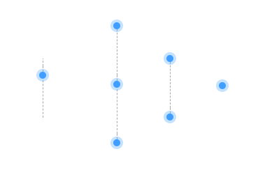

# css

Cascading Style Sheets：层叠样式表

# 样式选择器

```css
/* id */
#test
/* class */
.test
/* 标签 */
div
/* 属性 */
input[type="checkbox"]

/* 一个元素同时包含 */
input.test[type="checkbox"]
/* 子元素 */
.test div
/* 下一级 */
.test>div
```

# 伪类

Pseudo-classes

```css
/* 兄弟元素中的第一个/最后一个 */
:first-child
:last-child
```

### nth-child

> :nth-child
>
> [概述](https://developer.mozilla.org/zh-CN/docs/Web/CSS/:nth-child#概述)
>
> **`:nth-child(an+b)`** 这个 [CSS 伪类](https://developer.mozilla.org/zh-CN/docs/Web/CSS/Pseudo-classes)首先找到所有当前元素的兄弟元素，然后按照位置先后顺序从 1 开始排序，选择的结果为 CSS 伪类:nth-child 括号中表达式（an+b）匹配到的元素集合（n=0，1，2，3...）。示例：
>
> - `0n+3` 或简单的 `3` 匹配第三个元素。
> - `1n+0` 或简单的 `n` 匹配每个元素。（兼容性提醒：在 Android 浏览器 4.3 以下的版本 `n` 和 `1n` 的匹配方式不一致。`1n` 和 `1n+0` 是一致的，可根据喜好任选其一来使用。）
> - `2n+0` 或简单的 `2n` 匹配位置为 2、4、6、8...的元素（n=0 时，2n+0=0，第 0 个元素不存在，因为是从 1 开始排序)。你可以使用关键字 **`even`** 来替换此表达式。
> - `2n+1` 匹配位置为 1、3、5、7...的元素。你可以使用关键字 **`odd`** 来替换此表达式。
> - `3n+4` 匹配位置为 4、7、10、13...的元素。
>
> `a` 和 `b` 都必须为整数，并且元素的第一个子元素的下标为 1。换言之就是，该伪类匹配所有下标在集合 { an + b; n = 0, 1, 2, ...} 中的子元素。另外需要特别注意的是，`an` 必须写在 `b` 的前面，不能写成 `b+an` 的形式。

根据一组兄弟元素的序号选择元素，用`an+b`描述，元素序号从1开始，a、b为整数，n从0开始

`3`：第三行

`n+3`：第三行及以后

`-n+3`：前三行

`2n+1`/`odd`：奇数行

`2n`/`even`：偶数行

### nth-last-child

和 [`:nth-child`](https://developer.mozilla.org/zh-CN/docs/Web/CSS/:nth-child) 基本一致，但它是从*结尾*计数，而不是从开始计数。

`3`：倒数第三行

`n+3`：倒数第三行及以前

`-n+3`：倒数三行

`2n+1`/`odd`：倒数奇数行

`2n`/`even`：倒数偶数行

# 实例

### 时间线



- 第一个元素显示下半段虚线
- 最后一个元素显示上半段虚线
- 中间元素显示整段虚线
- 只有一个元素时不显示虚线

```css
/* 基础样式 */
.timeline-item:before{
    content: "";
    position: absolute;
    left: 8rpx;
    top: 0;
    z-index: 0;
    height: 100%;
    border-right: 2rpx dashed #aaa;
}

/* 第一个元素，只有一个元素时不启用 */
.timeline-item:first-child:not(:last-child):before {
    height: 87%;
    top: unset;
    bottom: 0;
}

/* 最后一个元素，只有一个元素时不启用 */
.timeline-item:last-child:not(:first-child):before {
    height: 13%;
}

/* 只有一个元素时，高度为0 */
.timeline-item:first-child:last-child:before {
    height: 0;
}
```

> [!TIP]
>
> 样式表中的同名样式，下面的样式会覆盖上面的样式

### 绝对定位居中

```css
.text {
	position: absolute;
    top: 50%;
    left: 50%;
    transform: translate(-50%, -50%);
}
```

可根据需要设置`top`、`left`、`translateX/translateY`来水平或垂直居中。

> [!TIP]
>
> 也不仅用于居中，如设置了`translateX(-50%)`之后，可用`left`来调节元素中心所在的位置。

### 渐变色字

<span style="font-family: SegoeUI-SemiBold,Helvetica,Arial,sans-serif; font-size: 57px; line-height: 74px; background: -webkit-linear-gradient(353.97deg,#D83B01 -9.63%,#8F5AD4 29.04%,#0860C7 101.1%); background: oldlinear-gradient(353.97deg,#D83B01 -9.63%,#8F5AD4 29.04%,#0860C7 101.1%) -moz-; background: -o-linear-gradient(353.97deg,#D83B01 -9.63%,#8F5AD4 29.04%,#0860C7 101.1%); background: linear-gradient(96.03deg,#D83B01 -9.63%,#8F5AD4 29.04%,#0860C7 101.1%); -webkit-background-clip: text; -webkit-text-fill-color: transparent; -moz-background-clip: text; -o-background-clip: text; background-clip: text; text-fill-color: transparent;">Office 现在是 Microsoft 365</span>

```css
{
    font-family: SegoeUI-SemiBold,Helvetica,Arial,sans-serif;
    font-size: 57px;
    line-height: 74px;
    background: -webkit-linear-gradient(353.97deg,#D83B01 -9.63%,#8F5AD4 29.04%,#0860C7 101.1%);
    background: oldlinear-gradient(353.97deg,#D83B01 -9.63%,#8F5AD4 29.04%,#0860C7 101.1%) -moz-;
    background: -o-linear-gradient(353.97deg,#D83B01 -9.63%,#8F5AD4 29.04%,#0860C7 101.1%);
    background: linear-gradient(96.03deg,#D83B01 -9.63%,#8F5AD4 29.04%,#0860C7 101.1%);
    -webkit-background-clip: text;
    -webkit-text-fill-color: transparent;
    -moz-background-clip: text;
    -o-background-clip: text;
    background-clip: text;
    text-fill-color: transparent;
}
```

> [登录 | Microsoft 365 (office.com)](https://www.office.com/)
