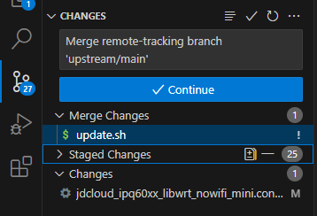

# git

# 初次配置

```bash
git config --global user.name "lyml"
git config --global user.email "1074325187@qq.com"
```

生成 SSH Key

```bash
ssh-keygen -o
cat ~/.ssh/id_rsa.pub
```

将公钥配置到 git 服务器

# 命令

```bash
# 暂存所有文件
git add <file>
git add .
# 取消暂存的文件
git reset <file>
git reset
# 提交
git commit -m 'init'
# 拉取
git pull origin master
# # 推送（-u 表示下次可以使用 git push 推送到上次的远程地址）
git push -u origin master
# 强制推送（本地仓库覆盖远程）
git push -f origin master

# 回滚到某一版本（提交），本地资源库回到某一版本
git reset --hard 752c8cf43498a64488fd560cd22e72d2aa361e87
# 重置为本地的最新版本
git reset --hard head
# 回滚到某一版本（提交），本地 commit 被撤回
git reset --soft 752c8cf43498a64488fd560cd22e72d2aa361e87

# 查看提交记录（按 q 退出）
git log
# 查看远程地址
git remote -v
# 查看远程分支，红色为所在分支
git branch -a
# 查看修改内容
git status

# 添加远程地址
git remote add origin git@github.com:haiyiya/ddd.git
# 删除远程地址
git remote remove origin

# 添加safe文件夹
git config --global --add safe.directory D:/projects/jds_web/nzxxx_jwt

# 删除本地分支
git branch -d localBranchName
# 删除远程分支
git push origin --delete remoteBranchName
```

> [Git 操作——如何删除本地分支和远程分支 (freecodecamp.org)](https://www.freecodecamp.org/chinese/news/how-to-delete-a-git-branch-both-locally-and-remotely/)

# 新建项目

### 新工程提交到git

```bash
git init
git remote add origin git@github.com:haiyiya/ddd.git
git add .
git commit -m "init"
git push -u origin master
```

### 保留旧项目提交记录

更换远端地址即可

```bash
git clone xxx
git remote remove origin
git remote add origin 新 git 地址
git push -u master origin
```


# 大小写重命名

git 默认大小写不敏感，修改文件名大小写提交的办法

```bash
# 重命名：Index.html -> 1Index.html
git add .
# 重命名：1Index.html -> index.html
git add .
```

或使用 git 命令

```bash
git mv -f src/views/List/Home.vue  src/views/list/Home.vue
git mv -f src/views/List/About.vue  src/views/list/About.vue
```

# 冲突处理

自己修改过的文件，其它人也修改并且提交了

```bash
# 查看本地修改的文件
git status
# 拉取
git pull

# 若报错
# 暂存、提交
git add .
git commit -m ''
# 拉取
git pull
# 处理冲突信息
# 在编辑器中合并或者手动处理<<<< HEAD 本地修改 ======= 远程修改 >>>>>>块

# 提交合并
git add .
git commit -m 'merge'
git push
```

> [git上多人对同一文件修改，发生冲突，如何合并_dair6的博客-CSDN博客_git 2个人同时改了一个文件,要同时合并dev,但相互又不能合并](https://blog.csdn.net/dair6/article/details/120724629)

在拉取代码后，如果存在冲突，ide 或者 git 日志会提示，处理方式：

IDE中，点击 git - **resolve conflicts（解决冲突）**，会弹出窗口列出有冲突的文件，选择文件，点击 merge，会弹出代码合并窗口，左侧为本地，右侧为远程，中间为合并后的代码。

如果不想合并，可以点击 git - **mark as merged（视为已合并）**，但是代码中会存在`<<<< HEAD 本地修改 ======= 远程修改 >>>>>>`的冲突块，一定会引起报错，一般不这样操作。

> [!TIP]
>
> 上述加粗的是 git 专有名词，一般在各种 IDE、github 等都通用。

# 分支

### 分支情况

```bash
# 查看所有分支（本地和远端）
git branch -a
```


- 白色、绿色为本地分支，`* 绿色名称`表示当前分支
- `remotes/`开头、红色为远程分支

```bash
# 查看所有本地分支，主要展示本地分支与远程跟踪分支的情况
git branch -vv
* master  7a8b9c1 [origin/master: ahead 1] 更新了README文件
  develop 4d5e6f7 [origin/develop: behind 2] 添加了新功能
```

- 本地分支和与之关联的远程分支，如果本地分支没有，`* 绿色名称`表示当前分支
- 本地分支与远程跟踪分支的情况，如 master 比远程跟踪分支多一个提交

### 创建分支

- 已有远程分支

```bash
# 创建本地分支，并跟踪远程分支
git checkout -b dev origin/dev
```

- 没有远程分支

```bash
# 创建新分支
git branch fix
# 切换分支
git checkout fix
# 提交分支
git push origin fix
```

> [!TIP]
>
> 若直接`git checkout dev`，会进入分支游离状态。
>

### 合并分支

本地合并：将 fix 分支合并到 master 分支

```bash
# 更新fix分支
git checkout fix
git pull origin fix

# 切换并更新master分支
git checkout master
git pull origin master

# 合并，合并fix分支到当前，即master
git merge fix
# 取消合并
git merge --abort
```

> [!TIP]
>
> 可以直接 pull 其他分支，直接合并远程分支的代码

> [!TIP]
>
> 

### 提交合并

```bash
# 冲突处理

# 提交合并
git add .
git commit -m "merge fix"
git push origin master
```

> [!TIP]
>
> 以上操作在idea的工具栏`git`菜单或者工程右键`git`菜单均可以操作，非常方便
>
> 切换分支：branchs - 选择一个分支 - checkout
>
> 合并分支：git - merge - 选择一个分支
>
> 冲突处理：git - resolve conflicts（有冲突未处理时才会出现此项）

### 没有相同的祖先的合并

git merge dev 报错：fatal: refusing to merge unrelated histories

表示当前分支和 dev 没有相同的祖先分支，比如当前分支是一个新建的分支，git 默认不允许合并

```bash
# 允许没有相同的祖先的合并
git merge dev --allow-unrelated-histories
```

> [!TIP]
>
> 执行后，需要填入一个初始化的 comment，这里类似 Linux vi 编辑器，填入后`Esc` - `wq`。

### 删除分支

```bash
# 删除本地分支
> git branch -d dev-lym
Deleted branch dev-lym (was 32d44bf).
# 删除远程分支
> git push origin -d dev-lym
To github.com:lymwhen/iperf.git
 - [deleted]         dev-lym
```

# Tag 标签

可以用 tag 来标示一些重要的节点，且与很多功能关联

- github 发布 release 需要关联 tag
- 可以使用 tag 作为流水线、部署触发条件

```bash
git tag  # 列出tag，前面有蓝点表示已推送到远程
git show <tagname>  # 查看标签的详细信息

git tag <tagname>  # 给当前提交添加标签
git tag <tagname> <commit>  # 给特定的提交添加标签
git tag -a <tagname> -m "tag message"  # 创建一个带注解的标签，并添加消息
git tag -a <tagname> <commit> -m "tag message"  # 给特定的提交创建一个带注解的标签，并添加消息

git push origin <tagname>  # 推送单个标签
git push origin --tags  # 推送所有标签

git tag -d <tagname>  # 删除本地标签
git push origin :refs/tags/<tagname>  # 删除远程标签

git checkout <tagname>  # 检出标签
```


# 撤回

### 撤回 push

```bash
git log 查看提交记录（按q退出）
本地回滚
git reset --soft 752c8cf43498a64488fd560cd22e72d2aa361e87
覆盖线上（覆盖后线上即无法看到之后的提交了）
git push -f origin master
重新 commit、push
```

> 如果仅是 commit，未 push，则 push 不需要 -f

### 撤回合并

`git reset --soft`提示

```bash
Cannot do a soft reset in the middle of a merge
```

```bash
git reset --merge
git reset --soft 752c8cf43498a64488fd560cd22e72d2aa361e87
```

# 取消文件追踪

### 文件未提交

即只是add

```bash
# 取消某一文件
git reset .metadata
# 取消全部文件
git reset .
# 重置到某一版本
git reset --soft head
```

### 文件已被提交

```bash
# 查看取消文件追踪，只是查看，并不会产生效果
git rm -r -n cached .metadata
# 取消文件追踪
git rm -r cached .metadata
# 取消文件追踪，同时删除本地文件
git rm -r --f .metadata 
```

### 在 .gitignore 文件中添加

```
/.metadata
```

### 提交

```bash
git add .
git push origin master
```

> [!TIP]
>
> 可以使用`git status`查看已被追踪或未被追踪的文件情况


# 不安全 https

```
warning: ----------------- SECURITY WARNING ----------------
warning: | TLS certificate verification has been disabled! |
warning: ---------------------------------------------------
warning: HTTPS connections may not be secure. See https://aka.ms/gcmcore-tlsverify for more information.
```

或

```
SEC_E_UNTRUSTED_ROOT
```

### 解决方式

```
git config --global http.sslVerify false
```


# 使用代理

```bash
# 查询代理
git config --get --global http.proxy
# 设置代理
git config --global http.proxy 127.0.0.1:10809
# 单个项目设置代理
git config http.proxy 127.0.0.1:10809
# 取消
git config --unset --global http.proxy

# 关闭https证书校验
git config --global http.sslVerify false

# 替换git协议为http（待求证）
git config --global url."https://".insteadOf git://
```

> [!NOTE]
>
> http.proxy仅用于代理用于http协议，即远程链接为`https://`时

> Git支持四种协议 1 ，而除本地传输外，还有：git://, ssh://, 基于HTTP协议，这些协议又被分为哑协议（HTTP协议）和智能传输协议。对于这些协议，要使用代理的设置也有些差异：
>
> 1. 使用 `git协议` 时，设置代理需要配置 `core.gitproxy`
> 2. 使用 `HTTP协议` 时，设置代理需要配置 `http.proxy`
> 3. 而是用 `ssh协议` 时，代理需要配置ssh的 `ProxyCommand` 参数
>
> [Windows下git设置代理服务器 - wavemelody - 博客园 (cnblogs.com)](https://www.cnblogs.com/mymelody/p/6132728.html)

# Tree

> 安装 tree：[Windows下如何使用tree命令生成目录树 - 简书 (jianshu.com)](https://www.jianshu.com/p/7002eee46561)

git bash 的 tree 要比 windows 自带的 tree 要强大得多

```bash
tree src
# 显示3层
tree -L 3
tree src -L 3
```


# eclipse

### push/pull报错，命令行正常

eclipse 的 git 插件版本太高

Help - Install New Softwares - already installed

搜索 git，卸载 Git integration for Eclipse 开头的插件（它们的版本号是一样的）

如 5.11.0 -> 5.7.0

Install New Softwares - add - 2020-03 http://download.eclipse.org/releases/2020-03

搜索 git，安装上面卸载的插件（Git integration for Eclipse 开头的插件，注意版本号变为了5.7.0）

### pull报错 Nothing to fetch

打开 Git Repositories 窗口，检查配置

```ini
[core]
repositoryformatversion = 0
filemode = false
logallrefupdates = true
[branch "master"]
remote = origin
merge = refs/heads/master
rebase = false
[remote "origin"]
url = git@codeup.aliyun.com:chunshu/yyzhxy.git
fetch = +refs/heads/*:refs/remotes/origin/*
```

### author/commiter不对

git 用户配置不对

```bash
git config --global user.name "lyml"
git config --global user.email "10743187@qq.com"
```

# 更新上游

```bash
# 克隆自己的仓库，查看分支
git clone git@github.com:lymwhen/wrt_release.git
git branch -a
# 添加上游分支
git remote add upstream https://github.com/ZqinKing/wrt_release.git
git branch -a
# 拉取上游分支
git fetch upstream
# 切换到用于合并的分支
git chechout main
# 合并上游的更新
git merge upstream/main
```

如果存在冲突，git命令行会提示：

```
$ git merge upstream/main
Auto-merging .github/workflows/release_wrt.yml
Auto-merging update.sh
CONFLICT (content): Merge conflict in update.sh
Automatic merge failed; fix conflicts and then commit the result.
```

可打开IDE处理冲突



Merge Changes：合并更改，即合并时存在冲突，需要手动处理的文件

Stated Changes：暂存的更改，来自上游的没有冲突的文件

Changes：更改，没有`add`的更改，比如自己在编辑器进行的更改，不在此次合并范围内

打开需要处理冲突的文件，IDE中会显示Current Changes（当前分支的更改）、Incoming Changes（来自合并的更改），根据需要选择需要保留的部分，当然也可以全都保留，并手动编辑

处理完毕后，点击Merge Changes或具体文件右侧的`+`号，它将会变为Stated Changes，期间编辑器可能会问你是否确定暂存更改，如何确认冲突处理完毕了，那么就可以点击确定


当Merge Changes中没有文件，即表示冲突处理完毕，可以 commit、push了

### 在 github 中操作

在仓库分支上会看到自己 fork 的分支相对上游的情况：


此时代表自己领先 11 个提交，9个提交落后

点击`9 commits behind`，可以看到上游新增的 9 个提交，可以创建 PR 用于更新上游的提交。如果没有冲突，可以自动合并完成，如果有冲突，会提示：


此时需要`Files Changed`tab页中，手动处理
