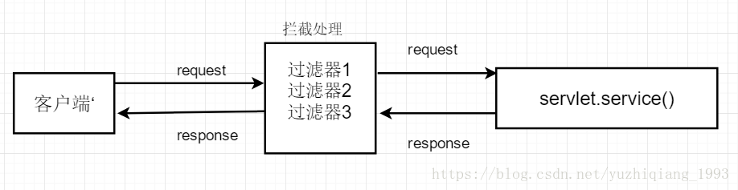

# 过滤器

过滤器实际上就是对web资源进行拦截，做一些处理后再交给下一个过滤器或servlet处理。通常都是用来拦截request进行处理的，也可以对返回的response进行拦截处理

**应用场景**：自动登录、统一设置编码格式、访问权限控制、敏感字符过滤等



> [Java Web之过滤器（Filter）_喻志强的博客-CSDN博客_filter](https://blog.csdn.net/yuzhiqiang_1993/article/details/81288912)

> 登录拦截
>
> [Javaweb 过滤器与重定向的关系_zhi_it_coder的博客-CSDN博客_过滤器中重定向](https://blog.csdn.net/zhi_it_coder/article/details/109013535)

# 去掉路径上带有的;jsessionid=

web.xml

```xml
<filter>
    <filter-name>jsessionidFilter</filter-name>
    <filter-class>com.chunshu.config.JsessionidFilter</filter-class>
</filter>
<filter-mapping>
    <filter-name>jsessionidFilter</filter-name>
    <url-pattern>/*</url-pattern>
</filter-mapping>
```

com.chunshu.config.JsessionidFilter

```java
package com.chunshu.config;
import java.io.IOException;
import java.util.regex.Pattern;
import javax.servlet.Filter;
import javax.servlet.FilterChain;
import javax.servlet.FilterConfig;
import javax.servlet.ServletException;
import javax.servlet.ServletRequest;
import javax.servlet.ServletResponse;
import javax.servlet.http.HttpServletRequest;
import javax.servlet.http.HttpServletResponse;
/**
 * 解决路径上带有;jsessionid=的问题
 * @author lymly
 *
 */
public class JsessionidFilter implements Filter {
	@Override
	public void init(FilterConfig filterConfig) throws ServletException {
	}
	@Override
	public void doFilter(ServletRequest request, ServletResponse response, FilterChain chain)
			throws IOException, ServletException {
		if (request instanceof HttpServletRequest && response instanceof HttpServletResponse) {
			HttpServletRequest req = (HttpServletRequest) request;
			HttpServletResponse resp = (HttpServletResponse) response;
			String requestURI = req.getRequestURL().toString();
			
			if (Pattern.compile("(?=.*;jsessionid\\=[0-9a-zA-Z]{32}).*").matcher(requestURI).matches()) {
				// 替换路径上的;jsessionid
				requestURI = requestURI.replaceAll(";jsessionid\\=[0-9a-zA-Z]{32}", "");
				// 重定向
				resp.sendRedirect(requestURI);
				return;
			}
		}
        // 执行链，交由下一个过滤器处理
		chain.doFilter(request, response);
	}
	@Override
	public void destroy() {
		
	}
}
```

> [请求路径上带有或出现jsessionid的处理办法_愉快淡定的博客-CSDN博客](https://blog.csdn.net/qq_39727959/article/details/106350249)
>
> [JavaWeb实现登录拦截（Filter拦截器） - 知乎 (zhihu.com)](https://zhuanlan.zhihu.com/p/362739408)
>
> [Java Web之过滤器（Filter）_喻志强的博客-CSDN博客_filter](https://blog.csdn.net/yuzhiqiang_1993/article/details/81288912)