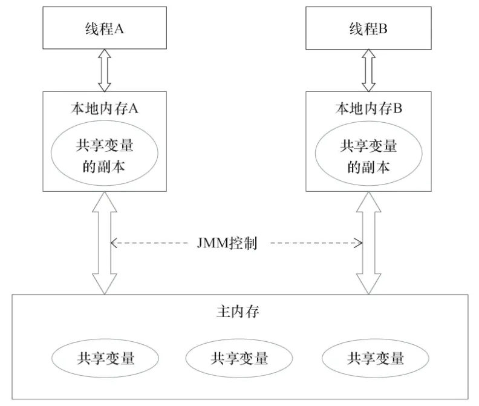

# 并发编程

# JMM (Java Memory Model)

JMM就是Java内存模型(java memory model)。因为在不同的硬件生产商和不同的操作系统下，内存的访问有一定的差异，所以会造成相同的代码运行在不同的系统上会出现各种问题。所以**java内存模型(JMM)屏蔽掉各种硬件和操作系统的内存访问差异，以实现让java程序在各种平台下都能达到一致的并发效果。**

Java内存模型规定**所有的变量都存储在主内存**中，包括实例变量，静态变量，但是不包括局部变量和方法参数。每个线程都有自己的工作内存，**线程的工作内存保存了该线程用到的变量和主内存的副本拷贝，线程对变量的操作都在工作内存中进行**。**线程不能直接读写主内存中的变量**。



可以通过同步机制（控制不同线程间操作发生的相对顺序）来解决或者通过volatile关键字使得每次volatile变量都能够强制刷新到主存，从而对每个线程都是可见的。

> [java内存模型以及happens-before规则 - 简书 (jianshu.com)](https://www.jianshu.com/p/d52fea0d6ba5)

### 重排序

为了提高性能，编译器和处理器常常会对指令进行重排序。

[java内存模型以及happens-before规则 - 简书 (jianshu.com)](https://www.jianshu.com/p/d52fea0d6ba5)

### as-if-serial 语义

通俗的讲：**重排序遵循变量之间的依赖关系，不会改变程序单线程执行的结果**

不管怎么重排序（编译器和处理器为了提供并行度），（单线程）程序的执行结果不能被改变。编译器，runtime和处理器都必须遵守as-if-serial语义。as-if-serial语义把单线程程序保护了起来，**遵守as-if-serial语义的编译器，runtime和处理器共同为编写单线程程序的程序员创建了一个幻觉：单线程程序是按程序的顺序来执行的**。比如上面计算圆面积的代码，在单线程中，会让人感觉代码是一行一行顺序执行上，实际上A,B两行不存在数据依赖性可能会进行重排序，即A，B不是顺序执行的。as-if-serial语义使程序员不必担心单线程中重排序的问题干扰他们，也无需担心内存可见性问题。

> [java内存模型以及happens-before规则 - 简书 (jianshu.com)](https://www.jianshu.com/p/d52fea0d6ba5)

### happens-before 规则

面对指令重排序对可见性的调整，volatile 采用 Happens-Before 规则解决：

1. 任何原始执行顺序中，在 volatile 变量写指令之前的其他变量读写指令，在重新排序后，不可以被放到 volatile 写指令之后。 所有原本就应该 volatile 变量写指令前发生的其他变量读写指令，必须依然在其之前发生（Happens-Before）。
2. 任何原始执行顺序中，在 volatile 变量读指令之后的其他变量读写指令，在重新排序后，不可以被放到 volatile 读指令之前。

> [如何理解 JAVA 中的 volatile 关键字 - 腾讯云开发者社区-腾讯云 (tencent.com)](https://cloud.tencent.com/developer/article/1894413)
>
> [java内存模型以及happens-before规则 - 简书 (jianshu.com)](https://www.jianshu.com/p/d52fea0d6ba5)

### as-if-serial VS happens-before

1. as-if-serial语义保证单线程内程序的执行结果不被改变，happens-before关系保证正确同步的多线程程序的执行结果不被改变。
2. as-if-serial语义给编写单线程程序的程序员创造了一个幻境：单线程程序是按程序的顺序来执行的。happens-before关系给编写正确同步的多线程程序的程序员创造了一个幻境：正确同步的多线程程序是按happens-before指定的顺序来执行的。
3. as-if-serial语义和happens-before这么做的目的，都是为了在不改变程序执行结果的前提下，尽可能地提高程序执行的并行度。

# 三大规则

并发编程中的三大特性：原子性、有序性、可见性

### 原子性

原子性是指一个操作要么完成，要么不完成，不能中断，不会被其他线程干扰。

一个简单的实例是：100个线程通过原子性操作对变量（初始值0）+1，运行结束后其结果为100。

##### Java多线程原子性

Java多线程环境下的原子操作是相对访问共享变量操作而言的，原子操作是不可分割的，原子性表现为：

- 访问（读、写）某个共享变量的操作从执行线程以外的任何线程来看，该操作要么已经执行结束要么尚未发生，其他线程不会“看到”该操作执行了部分的中间效果；

- 访问同一组共享变量的原子操作是不能够被交错的。

综上，程序的原子性指整个程序中的所有操作，要么全部完成，要么全部不完成，不可能停滞在中间某个环节；原子性操作指**原子性在一个操作是不可中断的，要么全部执行成功要么全部执行失败**，有着“同生共死”的感觉。在多个线程一起执行的时候，一个操作一旦开始，就不会被其他线程所干扰。

##### JVM内存模型中定义了八种原子操作

`lock`（锁定）：作用于主内存中的变量，它把一个变量标识为一个线程独占的状态；

`unlock`（解锁）:作用于主内存中的变量，它把一个处于锁定状态的变量释放出来，释放后的变量才可以被其他线程锁定

`read`（读取）：作用于主内存的变量，它把一个变量的值从主内存传输到线程的工作内存中，以便后面的load动作使用；

`load`（载入）：作用于工作内存中的变量，它把read操作从主内存中得到的变量值放入工作内存中的变量副本

`use`（使用）：作用于工作内存中的变量，它把工作内存中一个变量的值传递给执行引擎，每当虚拟机遇到一个需要使用到变量的值的字节码指令时将会执行这个操作；

`assign`（赋值）：作用于工作内存中的变量，它把一个从执行引擎接收到的值赋给工作内存的变量，每当虚拟机遇到一个给变量赋值的字节码指令时执行这个操作；

`store`（存储）：作用于工作内存的变量，它把工作内存中一个变量的值传送给主内存中以便随后的write操作使用；

`write`（操作）：作用于主内存的变量，它把store操作从工作内存中得到的变量的值放入主内存的变量中。

上面的这些指令操作是相当底层的，可以作为扩展知识面掌握下。那么如何理解这些指令了?比如，把一个变量从主内存中复制到工作内存中就需要执行read,load操作，将工作内存同步到主内存中就需要执行store,write操作。注意的是：**java内存模型只是要求上述两个操作是顺序执行的并不是连续执行的**。也就是说read和load之间可以插入其他指令，store和writer可以插入其他指令。比如对主内存中的a,b进行访问就可以出现这样的操作顺序：read a,read b, load b,load a。即组合使用并不能保证原子性，例如：

```java
int a = 10; //1
a++; //2
int b=a; //3
a = a+1; //4
```

上面这四个语句中只**有第1个语句是原子操作**，将10赋值给线程工作内存的变量a,而语句2（a++），实际上包含了三个操作：1. 读取变量a的值；2：对a进行加一的操作；3.将计算后的值再赋值给变量a，而这三个操作无法构成原子操作。对语句3,4的分析同理可得这两条语句不具备原子性。

##### synchronized

synchronized 具有原子性，在同一时刻只能由一个线程获取锁，其他线程只能等待。

##### volatile 不保证原子性

### 有序性

在java内存模型中说过，为了性能优化，编译器和处理器会进行指令重排序；也就是说java程序天然的有序性可以总结为：**如果在本线程内观察，所有的操作都是有序的；如果在一个线程观察另一个线程，所有的操作都是无序的**。

出于计算性能的考虑，JVM 和 CPU 允许在保证程序语义一致的范围类，对程序内的指令进行重排序。举个例子：

```javascript
int a = 1;
int b = 2;

a++;
b++;
```

该代码在经过重排序后可能会变成：

```javascript
int a = 1;
a++;

int b = 2;
b++;
```

##### synchronized

synchronized 具有序性，它虽然无法禁止块内指令重排，但：

- synchronized 会在代码块前后插入内存屏障，禁止块间指令重排
- 在同一时刻只能由一个线程获取锁，相当于块内单线程执行，指令重排不会影响执行结果

synchronized 保证了块内单线程执行，同时块间有序，因此保证了有序性

> [Java synchronized 能防止指令重排序吗？ - 简书 (jianshu.com)](https://www.jianshu.com/p/a2d5426a3b40)

##### volatile

volatile 具有有序性，volatile 通过插入内存屏障禁止指令排重

> 在单例模式的实现上有一种双重检验锁定的方式（Double-checked Locking）。代码如下：
>
> ```java
>public class Singleton {
>  private Singleton() { }
>  private volatile static Singleton instance;
>     public Singleton getInstance(){
>         if(instance==null){
>             synchronized (Singleton.class){
>                 if(instance==null){
>                     instance = new Singleton();
>                 }
>             }
>         }
>         return instance;
>     }
>    }
>    ```
> 
> 这里为什么要加volatile了？我们先来分析一下不加volatile的情况，有问题的语句是这条：
>
> > instance = new Singleton();
>
> 这条语句实际上包含了三个操作：1.分配对象的内存空间；2.初始化对象；3.设置instance指向刚分配的内存地址。
>
> 如果2、3重排，就可能导致其他线程获取到空的实例。
>
> [三大性质总结：原子性，有序性，可见性 - 简书 (jianshu.com)](https://www.jianshu.com/p/cf57726e77f2)
>
> [13.synchronized总结：怎么保证可见性、有序性、原子性？_码农小陈的学习笔记的博客-CSDN博客_synchronized可见性](https://blog.csdn.net/chenzengnian123/article/details/122686371)

### 可见性

可见性是指当一个线程修改了共享变量后，其他线程能够立即得知这个修改。

##### synchronized

synchronized 具有可见性，当线程获取锁时会从主内存中获取共享变量的最新值，释放锁的时候会将共享变量同步到主内存中。

##### volatile

volatile 具有可见性，对 volatile 变量的读取和写入都是直接从主内存进行，一个线程对 volatile 变量的修改会立即对其他线程可见。

### 综上

synchronized 具有原子性、有序性、可见性，但不能禁止指令重排。

volatile 具有有序性、可见性。

> [Java synchronized 能防止指令重排序吗？ - 简书 (jianshu.com)](https://www.jianshu.com/p/a2d5426a3b40)
>
> [volatile 关键字（修饰变量） - 希希里之海 - 博客园 (cnblogs.com)](https://www.cnblogs.com/weixuqin/p/11425488.html)

对于 volatile 单独使用的场景（单独保证原子性）：

- 运算结果并不依赖变量的当前值，或者能够确保只有单一的线程修改变量的值

运算结果并不依赖变量的当前值：volatile 变量用于记录其他变量的计算结果，不参与计算，即单纯用于读写。

只有单一的线程修改变量的值：单一线程计算产生 volatile 变量的值， volatile 变量可以参与计算，其他线程只能读取。

- 变量不需要与其他的状态变量共同参与不变约束

这是一句相当令人费解的话，大概意思应该是由于 volatile 变量的可见性，它的值是立即刷新的，在复合逻辑判断的过程中，volatile 变量的值可能已经被改变，可能产生错误的判断结果，即该复合判断失去了原子性。如`a && b`，判断b的时候，a可能已经被修改为了false。


# volatile 变量的可见性测试

使用两个线程交替改变变量x的值，期待的情况是`A`/`B`被交替打印

```java
public class VolatileTest1 {

   private static char x = 'A';

   public static void main(String[] args) {

      new Thread(() -> {
         while(true) {
            if(x == 'A') {
               System.out.println('A');
               x = 'B';
            }
         }
      }).start();

      new Thread(() -> {
         while(true) {
            if(x == 'B') {
               System.out.println('B');
               x = 'A';
            }
         }
      }).start();
   }
}
```

会发现仅仅打印了几次之后，就停止了打印。

每个线程会将主内存中的共享变量拷贝到自己的工作内存，对这个变量的修改并不会立即写会主内存，即不会立即对其他线程可见。

对变量添加 volatile 关键字：

```java
private static volatile char x = 'A';
```

再次运行可以发现`A`/`B`被交替打印

### 对象使用 volatile 关键字

对象c中有一变量x，c为一个共享变量

```java
public class VolatileTest11 {

	private static volatile C c;

	public static void main(String[] args) {
		c = new C();

		new Thread(() -> {
			while(true) {
				if(c.x == 'A') {
					System.out.println('A');
					c.x = 'B';
				}
			}
		}).start();

		new Thread(() -> {
			while(true) {
				if(c.x == 'B') {
					System.out.println('B');
					c.x = 'A';
				}
			}
		}).start();
	}

	static class C {
		public char x = 'A';
	}
}
```

`A`/`B`被交替打印。

---

用一个线程的本地变量c1持有c的引用，并改变c1中的x

```java
new Thread(() -> {
    C c1 = c;
    while(true) {
        if(c1.x == 'B') {
            System.out.println('B');
            c1.x = 'A';
        }
    }
}).start();
```

仅仅打印了几次之后，就停止了打印。

---

将本地引用c1放入循环内，也就是每次判断前都执行

```java
new Thread(() -> {
    C c1 = c;
    while(true) {
        if(c1.x == 'B') {
            System.out.println('B');
            c1.x = 'A';
        }
    }
}).start();
```

`A`/`B`被交替打印

---

不将本地引用c1放入循环内，将c设为非 volatile 变量，将x设为 volatile 变量

```java
private static C c;

static class C {
    public volatile char x = 'A';
}
```

`A`/`B`被交替打印

---

一开始感觉很诡异，其实规律很显然了：

- 直接通过 volatile 变量的引用对它或它的属性进行修改，可以保证可见性

- 通过本地变量引用 volatile 变量或变量内对象，对本地引用的修改无法保证可见性

  但每次修改前重新获取本地引用，可以保证可见性，猜测是由于 volatile 插入内存屏障的关系，导致之前的修改被刷新到了主内存

- 直接对属性添加 volatile 关键字，无论是否是通过类的本地引用，都可以保证可见性
