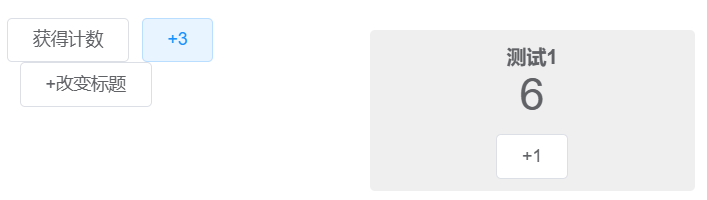

# 组件封装

众所周知 vue 无论页面还是组件都是组件，:dog:，是组件可以做页面，也可以做组件。所以都支持 vue 的`created`/`mounted`/`beforeDestroy`等生命周期函数，都可以引入 node js 库。

# 示例 Count 组件

组件 Count.vue

```html
<template>
  <div class="count">
    <div class="title">{{title}}</div>
    <div>{{curValue}}</div>
    <el-button v-on:click="add(1)">+1</el-button>
  </div>
</template>

<script>
export default {
  name: "Count",
  props: {
    title: {
      type: String,
      default: 'Count'
    }
  },
  watch: {
    curValue(v) {
      this.$emit('onCountUpdate', v)
      if(v === 17) {
        this.$emit('update:title', '惊喜' + this.curValue + '!!')
      }
    }
  },
  data() {
    return {
      curValue: 0
    }
  },
  methods: {
    add(v) {
      this.curValue = this.curValue + v
    }
  }
}
</script>
<style>
.count {
  padding: 10px;
  margin: 10px;
  text-align: center;
  background: #00000010;
  border-radius: 4px;
}
.title {
  font-size: 16px;
  font-weight: bold;
}
</style>
```

使用

```html
<template>
  <div class="app-container">
    <el-row class="mt-20">
      <el-col :span="12">
        <el-button v-on:click="getCount">获得计数</el-button>
        <el-button v-on:click="add3">+3</el-button>
        <el-button v-on:click="changeTitle">+改变标题</el-button>
      </el-col>
      <el-col :span="12">
        <Count class="count" ref="count" :title.sync="countTitle" @onCountUpdate="onCountUpdate"></Count>
      </el-col>
    </el-row>
  </div>
</template>

<script>
import Count from '@/views/system/user/Count.vue'

export default {
  name: "User",
  data() {
    return {
      countTitle: '测试计数器',
    };
  },
  methods: {
    onCountUpdate(v) {
      this.$modal.msgSuccess(v);
    },
    getCount() {
      let curValue = this.$refs.count.curValue
      this.$modal.msgSuccess(curValue);
    },
    add3() {
      this.$refs.count.add(3)
    },
    changeTitle() {
      let titles = ['测试1', '测试2']
      let i
      this.countTitle = (i = titles.indexOf(this.countTitle)) >= 0
        ? titles[(i + 1) % titles.length]
        : titles[0]
    }
  }
};
</script>

<style scoped>
.count::v-deep {
  font-size: 36px;
}
</style>
```




### 组件属性 props：使用父组件变量、`sync`修饰符

组件对 props 只能使用，不能修改。如果需要修改，需要通过该数据的拥有者（父组件）进行修改。

`sync`关键字主要用于**子组件（通知父组件）对 props 属性进行修改**。

子组件

```javascript
this.$emit('update:title', '惊喜' + this.curValue + '!!')
```

即通知父组件修改`title`属性

父组件

```javascript
:title.sync="countTitle"
```

父组件的`countTitle`数据会同时被修改。如果父组件没有使用`sync`修饰组件属性，子组件的修改通知将不会生效。

> [前端 - 走近 Vue 的 .sync 修饰符 - 探索Vue的世界 - SegmentFault 思否](https://segmentfault.com/a/1190000022025204)

### 组件事件

```javascript
// 普通事件
this.$emit('onCountUpdate', v)
// 改变sync属性
this.$emit('update:title', '惊喜' + this.curValue + '!!')
```

### 外部获取组件实例，调用组件数据/方法

```javascript
this.$refs.count.xxx
```

### 外部 css 在子组件中生效`::deep`

```css
<style scoped>
.count::v-deep {
  font-size: 36px;
}
</style>
```

### 组件的元素呈现

子组件通过`<Count class="count".../>`放到页面中，F12 检查元素发现，

- 会被替换为子组件中`<Template>`包裹的内容
- `class`会被赋予`<Template>`中的根元素

所以对组件调整样式，也就是对子组件`<Template>`中的根元素调整样式。

# Flv 播放器

封装 xgplayer v2.0

```html
<template>
  <div class="player-container">
    <div class="inner-container" :class="{checked: checked}">
      <div v-show="state === 'playing'" class="inner-player" ref="player"></div>
      
      <div v-if="state === 'pre-loading'" class="pre-loading-message">{{loadingMessage}}</div>
    </div>
  </div>
</template>

<script>
import util from 'xgplayer/src/utils/util';
import FlvJsPlayer from 'xgplayer-flv.js';

export default {
  name: "FlvPlayer",
  props: {
    url: {
      type: String,
      default: null
    },
    checked: {
      type: Boolean,
      default: false
    }
  },
  data() {
    return {
      player: null,
      // init, pre-loading, playing
      state: 'init',
      loadingMessage: '正在连接...',
      config: null
    };
  },
  beforeDestroy() {
    this.destroyPlayer()
  },
  activated() {
    if(this.player && this.player.paused) {
      this.player.play()
    }
  },
  methods: {
    play(config) {
      console.log('play: ', config)
      if (!config.url) {
        return
      }
      this.config = config
      this.state = 'playing'

      if (this.player) {
        this.player.src = config.url

      } else {
        this.player = new FlvJsPlayer({
          el: this.$refs.player,
          // id: 'kk-mse',
          url: config.url,
          // url: 'wss://xxx.com/transcode12/3YSCA44452MLL66_03bb852c4bee7f5b0d419ba4a124b6ce.live.flv?secret=d756cc5f02f74c6286fa2bcfcb2fd0b6',
          // url: 'https://lf9-cdn-tos.bytecdntp.com/cdn/expire-1-M/byted-player-videos/1.0.0/xgplayer-demo.mp4',
          // fitVideoSize: 'auto',
          fluid: true,
          autoplay: true,
          volume: 0,
          // height: '100%',
          // width: '100%',
          isLive: true,
          playsinline: false,
          // cssFullscreen: true,
          screenShot: {
            saveImg: true,
            quality: 0.92,
            type: 'image/png',
            format: '.png'
          },
          whitelist: [''],
          ignores: ['time', 'loading'],
          closeVideoClick: true,
          // errorTips: '<span class="app-error">无视频源</span>',
          customConfig: {
            isClickPlayBack: false
          },
          flvOptionalConfig: {
            enableWorker: true,
            enableStashBuffer: true, //启用缓存
            stashInitialSize: 4096, //缓存大小4m
            lazyLoad: false,
            lazyLoadMaxDuration: 40 * 60,
            autoCleanupSourceBuffer: true,
            autoCleanupMaxBackwardDuration: 35 * 60,
            autoCleanupMinBackwardDuration: 30 * 60
          } //flv.js可选配置项 [flv.js配置](https://github.com/bilibili/flv.js/blob/master/docs/api.md#config)
        })

        let closeBtn = util.createDom('div', '<i class="el-icon-close"></i>', {}, 'btn-close');
        closeBtn.addEventListener('click', () => {
          this.destroyPlayer();
        });
        this.player.root.appendChild(closeBtn);
      }
    },
    destroyPlayer() {
      if(this.player) {
        if (this.player.fullscreen)
          this.player.exitFullscreen(this.player.root)
        this.player.destroy();
        this.player = null
      }
      this.state = 'init'
      this.$emit('onDestroyPlayer', this.config)
    }
  },
};
</script>

<style>
.player-container {
  display: inline-block;
}

.inner-container {
  width: 100%;
  height: 100%;
  overflow: hidden;
  position: relative;
  overflow: hidden;
}

.inner-player {
  position: absolute;
  left: 0;
  top: 0;
  width: 100% !important;
  height: 100% !important;
  padding-top: 0 !important;
}

.inner-player video {
  height: 100% !important;
  object-fit: fill !important;
}

.init-logo {
  position: absolute;
  left: 50%;
  top: 50%;
  transform: translate(-50%, -50%);
  z-index: 500;
}

.pre-loading-message {
  position: absolute;
  left: 50%;
  top: 50%;
  transform: translate(-50%, -50%);
  z-index: 500;
  font-size: 16px;
  font-weight: bold;
  color: #666;
}

.btn-close {
  position: absolute;
  top: 3px;
  right: 5px;
  z-index: 500;
  font-size: 26px;
  font-weight: bold;
  color: #FFF;
  display: none;
  cursor: pointer;
}

.inner-container:hover .btn-close {
  display: block;
}

.btn-close:hover {
  color: #1890ff
}
</style>

```


# Hls 播放器

封装 hls.js

```javascript
<template>
  <div class="container">
    <div>{{count}}</div>
    <button v-on:click="add">add</button>
  </div>
</template>

<script>
// 引入js库
import Hls from 'hls.js'

export default {
  name: 'CountTest',
  data() {
    return {
      count: 0,
    }
  },
  props: {
    // 属性，add的间隔
    addInterval: {
      type: Number,
      required: false,
      default () {
        return 1
      }
    }
  },
  components: {
  },
  mounted() {
  },
  methods: {
    // 方法
    checkHls() {
      return Hls.isSupported();
    },
    add(){
      this.count += this.addInterval
      // 事件/回调
      this.$emit('onCountUpdate', this.count)
    },
  },
  beforeDestroy() {
  }
}
</script>

<style>
.container{
  color: #666
}
</style>

```

外部使用

```javascript
<template>
  <div id="app">
    <button v-on:click="test4">test4</button>
    <count-test ref="count" :addInterval="2" @onCountUpdate="onCountUpdate"></count-test>
  </div>
</template>

<script>
// 引用组件
import CountTest from './CountTest.vue'

export default {
  name: 'App',
  data() {
    return {
    }
  },
  components: {
    CountTest
  },
  methods: {
    test4() {
      // 调用组件方法，使用ref获得组件实例（对应组件的ref属性）
      console.log(this.$refs.count.checkHls())
    },
    // 组件的事件/回调
    onCountUpdate(count){
      console.log(count)
    }
  }
}
</script>

<style>
html, body {
  height: 100%;
  margin: 0;
}
#app {
  font-family: Avenir, Helvetica, Arial, sans-serif;
  -webkit-font-smoothing: antialiased;
  -moz-osx-font-smoothing: grayscale;
  text-align: center;
  color: #2c3e50;
  margin-top: 60px;
  height: 100%;
}
</style>

```

> [组件基础 — Vue.js (vuejs.org)](https://v2.cn.vuejs.org/v2/guide/components.html)
>
> [3分钟了解 vue props type类型_时光机上敲代码的博客-CSDN博客_props的type](https://blog.csdn.net/web_ding/article/details/120655431)
