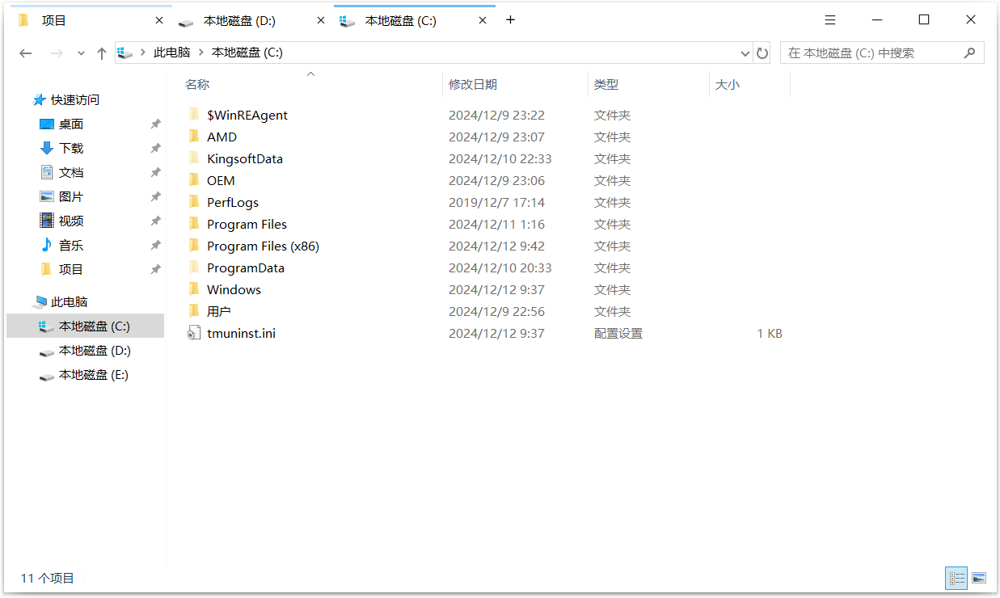

# 360 文件夹

难得 360 竟然也有良心软件，冒着巨大风险在新系统安装试用，发现竟然出奇的好用，测试版本为 <a target="_blank" href="杂谈/assets/forum_64d0c27100577_360FileSetup11.0.0.1100.zip" download>360 文件夹 11.0.0.1100</a>。

优点：

- 比 Qttabbar 更好看
- 比同类软件更流畅一点，首次打开只比原版资源管理器慢一丢
- 从 IDE 等，打开文件所在位置时，可以定位到文件（滚动到并选中）
- 从桌面其他应用新打开资源管理器时，可以丝滑的添加标签页，而不会出现一个窗口一闪而没的情况
- 对文件夹右键 - 新窗口打开，新弹出了一个窗口，而且没有在新标签打开某文件夹的方法。但是可以通过对标签右键 - 复制窗口，然后操作，算是一个不错的解决方案

缺点：

- 任务栏图标太丑
- 标签比起其他同类软件，但是跟 win10 风格实在不搭

无论功能还是外观，已经秒杀同类软件，可以作为长期使用了。

# 替换应用图标

将 360 文件夹的图标替换为 windows 资源管理器的图标，那就美滋滋了，而 Resource Hacker 完美的可以解决这个问题。

打开`C:\Windows\explorer.exe`，很容易在图标组中找到应用图标，右键 - `Save .ico Resources...`，即可保存多图标 ico 文件，windows 资源管理器图标：<a target="_blank" href="杂谈/assets/icon-explorer.ico">icon-explorer.ico</a>。

打开`C:\Users\lymly\AppData\Roaming\360FileBrowser\360FileBrowser.exe`，在图标组找到图标，右键 - `Replace Icon...` ，选择用来替换的图标，确定，保存。

它会自动替换原文件。

极有可能需要刷新图标缓存：

```bat
rem 关闭Windows外壳程序explorer

taskkill /f /im explorer.exe

rem 清理系统图标缓存数据库

attrib -h -s -r "%userprofile%\AppData\Local\IconCache.db"

del /f "%userprofile%\AppData\Local\IconCache.db"

attrib /s /d -h -s -r "%userprofile%\AppData\Local\Microsoft\Windows\Explorer\*"

del /f "%userprofile%\AppData\Local\Microsoft\Windows\Explorer\thumbcache_32.db"
del /f "%userprofile%\AppData\Local\Microsoft\Windows\Explorer\thumbcache_96.db"
del /f "%userprofile%\AppData\Local\Microsoft\Windows\Explorer\thumbcache_102.db"
del /f "%userprofile%\AppData\Local\Microsoft\Windows\Explorer\thumbcache_256.db"
del /f "%userprofile%\AppData\Local\Microsoft\Windows\Explorer\thumbcache_1024.db"
del /f "%userprofile%\AppData\Local\Microsoft\Windows\Explorer\thumbcache_idx.db"
del /f "%userprofile%\AppData\Local\Microsoft\Windows\Explorer\thumbcache_sr.db"

rem 清理 系统托盘记忆的图标

echo y|reg delete "HKEY_CLASSES_ROOT\Local Settings\Software\Microsoft\Windows\CurrentVersion\TrayNotify" /v IconStreams
echo y|reg delete "HKEY_CLASSES_ROOT\Local Settings\Software\Microsoft\Windows\CurrentVersion\TrayNotify" /v PastIconsStream

rem 重启Windows外壳程序explorer

start explorer
```

# win10 风格

在替换 360 图标时，偶然发现`360FileBrowser_Theme.ui`文件，猜测为主题文件，发现它是 zip 方式打包，其内包含 xml 布局文件、png/svg 图片文件。进行一番探索进一步发现：

- bkcolor：背景色
- inset：外边距，上右下左
- tooltip：鼠标悬浮提示，类似 title
- foreimage：前景图，也就是默认状态下的图片
- hotbgcolor：hover 颜色
- pushedbgcolor：选中颜色
- visible：是否显示
- font：字体，值为一个数字，应该是开始是定义的几个`Font`标签索引

修改处：

- 修改窗体背景色为白色，标签没有默认背景，所以就是窗体背景色
- 修改 hover 和选中标签背景图为炫酷 win10 风格，取色自 win10 资源管理器和任务栏
- 修改右上角按钮宽度与 win10 一致（47）
- 标签标题与关闭按钮之间有一`text_mask`文件，用于通过蒙版实现立体效果，win10 断然不需要立体效果，将其改为全`#FFFFFF`颜色，使蒙版无效
- 新建标签按钮风格格格不入，将其线条改细，同时增大点击区域
- 精简标签右键菜单
- 隐藏收藏栏星星图标，我还能不知道那是收藏吗:dog:
- 隐藏右上角标签计数

最终效果极其炫酷，而且非常 win10 🥰



略微美中不足之处：

- 标签关闭按钮点击区域太小，但标签并不在布局文件中定义，只能替换图片资源，但无法修改大小
- 前进后退按钮之间间距过宽，但似乎无法调整

其他事项：

- 资源管理器原选项：左侧快速访问 - 右键 - 选项