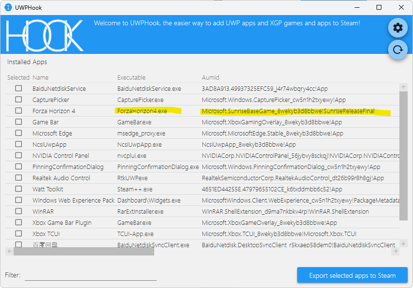

# Moonlight

##### 客户端：

Moonlight：[Moonlight Game Streaming: Play Your PC Games Remotely (moonlight-stream.org)](https://moonlight-stream.org/)

##### 串流服务：

Sunshine：供 Moonlight 使用的自建游戏串流服务。

官网：[LizardByte](https://app.lizardbyte.dev/?lng=en)

文档：[Sunshine documentation (lizardbyte.dev)](https://docs.lizardbyte.dev/projects/sunshine/en/latest/)

Shield：英伟达的串流服务，已经停止服务，而且 sunshine 的效果足够好，就不考虑了。

Steam Link：最大带宽 100M，而且实测手机效果非常好，但电视画面、声音延迟很大。

### 安装 Sunshine

下载安装包，一直下一步即可。

安装好后，打开开始菜单的 sunshine 或浏览器打开[https://localhost:47990/](https://localhost:47990/)，注意允许不安全的 https。

### 安装 Moonlight

moonlight 支持 PC、Android 等端。

##### 客户端设置

- 内网带宽 1000M的话，直接把码率拉到 150M，可以提高画面清晰度
- 如果客户端支持高刷新率，可以开启高刷，选择支持的刷新率

正常来说，就可以在手机上用虚拟手柄或者在电视上插入手柄串流游戏了。

- 按 xbox 的西瓜键可以打开 steam 大屏幕模式

### 添加非 steam 游戏到 steam

普通游戏：steam 左下角添加游戏...

xbox 游戏：下载 UWPHook，勾选游戏，比如地平线4，点击右下角`Export selected apps to steam`，重启 steam 后，可以在库中看到游戏。

# 串流到电视 + 手柄

问题历程😌

### 手柄连接电视 + moonlight

<!-- panels:start -->

<!-- div:left-panel -->

利用 Moonlight 自带的手柄功能，steam 游戏和 xbox 地平线4 都能正常，但是没有手柄震动。

结论：**Moonlight 模拟的是 xbox 360 手柄，不支持震动。**

<!-- div:right-panel -->

> [!RESULT]
>
> - ✅ steam 大屏幕：moonlight
> - ✅ steam 游戏：moonlight
>   - ✖️ 震动
> - ✅ 非 steam 游戏：moonlight
>   - ✖️ 震动
> - ✅ 桌面：moonlight
>   - ✅ 自由运行游戏

<!-- panels:end -->

---

### 手柄连接电视 + virtualhere 

<!-- panels:start -->

<!-- div:left-panel -->

电视作为服务端，插手柄，PC 作为客户端，远程使用手柄。

steam 游戏和震动都正常，但 xbox 地平线4 识别不到手柄，似乎把手柄当键盘了

结论：**似乎 virtualhere 并不能完美的映射 xbox 手柄。**

<!-- div:right-panel -->

> [!RESULT]
>
> - ✅ steam 大屏幕：steam 输入
> - ✅ steam 游戏：steam 输入
>   - ✅ 震动
> - ✖️ 非 steam 游戏：手柄被识别为键盘
>   - ✖️ 震动
> - ✅ 桌面：steam 输入
>   - ✖️ 自由运行游戏：手柄被识别为键盘

<!-- panels:end -->

---

### 手柄连接 PC + steam 输入

<!-- panels:start -->

<!-- div:left-panel -->

使用 USB 延长线将手柄直接连接到 PC

steam 游戏和震动都正常，但 xbox 地平线4 手柄和键鼠冲突，不能正常控制。

结论：**steam 输入和 xbox 手柄冲突。**这个与延长线无关，**steam 输入和 非 steam 游戏有冲突**。

验证方式：游戏中推动右摇杆，屏幕上鼠标会移动，说明存在冲突。

<!-- div:right-panel -->

> [!RESULT]
>
> - ✅ steam 大屏幕：steam 输入
> - ✅ steam 游戏：steam 输入
>   - ✅ 震动
> - ❌ 非 steam 游戏：原生输入 + steam 输入冲突
>   - ✅ 震动
> - ✅ 桌面：steam 输入
>   - ❌ 自由运行游戏：原生输入 + steam 输入冲突

<!-- panels:end -->

---

### 手柄连接 PC + steam 输入（手柄）

<!-- panels:start -->

<!-- div:left-panel -->

作为上一问题的一个解决方案：

steam - 设置 - 控制器 - 非游戏控制器布局 - 桌面布局 - 编辑 - 点击当前按键布局 - 模板 - 选择手柄 - 应用布局。此时右摇杆应该不能控制鼠标了，测试 steam 游戏和 xbox 地平线4 游戏和震动都正常。

> [!TIP]
>
> 此处可以通过在 steam 添加非 steam 游戏的方式打开游戏。

结论：可以解决手柄和键鼠冲突，**但是会导致手柄无法控制鼠标操作游戏和 steam 之外的东西，因为这个操作依赖于 steam 控制器的非游戏桌面布局**

<!-- div:right-panel -->

> [!RESULT]
>
> - ✅ steam 大屏幕：steam 输入
> - ✅ steam 游戏：steam 输入
>   - ✅ 震动
> - ✅ 非 steam 游戏：原生输入
>   - ✅ 震动
> - ✖️ 桌面：steam 输入（手柄布局）无法控制桌面
>   - ✖️ 自由运行游戏

<!-- panels:end -->

---

### 手柄连接 PC + steam 输入 + sunshine 启停 steam

<!-- panels:start -->

<!-- div:left-panel -->

前两种连接方式都无法完整识别到 xbox one s 手柄，无法完美支持 xbox 地平线4 的震动，所以否决，只能采用最麻烦最原始的延长线方案了。:dog:，而且经过测试，10m 延长线几乎没有延迟，也算比较完美了。

经过多方查阅，无法完美兼容非 steam 游戏和 steam 键鼠输入，两者只能选其一，而 steam 输入是很不方便开启和关闭切换的，所以只能从 sunshine 上来解决了，在运行非 steam 游戏之前，强行停止 steam。

##### Desktop

由于采用手柄连接 PC，无法使用 Moonlight 的手柄输入，要控制电脑必须依赖 steam，所以此处要打开 steam。同时切换分辨率。

command

```cmd
C:\Program Files (x86)\Steam\Steam.exe
```


##### Forza Horizon 4

关闭 steam，切换分辨率，启动地平线4

do

```cmd
cmd /C "taskkill /f /im steam* 2>nul || exit /b 0"
```

> [!NOTE]
>
> 由于`taskkill`命令可能有没找到进程，返回非 0 退出代码，导致启动失败，所以需要设置退出代码：`exit /b 0`

> [!TIP]
>
> cmd 中`errorlevel`表示上一个命令的退出代码，0表示成功，非0表示失败。可以使用`exit /b 0`设置退出代码。
>
> ```cmd
> > taskkill /f /im steam*
> 错误: 没有找到进程 "steam*"。
> > echo %errorlevel%
> 128
> > ipconfig
> ...
> > echo %errorlevel%
> 0
> ```


<!-- div:right-panel -->

> [!RESULT]
>
> - ✅ steam 大屏幕：steam 输入
> - ✅ steam 游戏：steam 输入
>   - ✅ 震动
> - ✅ 非 steam 游戏：原生输入
>   - ✅ 震动
> - ✅ 桌面：steam 输入
>   - ❌ 自由运行游戏：原生输入 + steam 输入冲突

<!-- panels:end -->

---

### PC 连接手柄 + steam 输入（手柄） + 手柄伴侣

<!-- panels:start -->

<!-- div:left-panel -->

手柄伴侣：Controller Companion，能够替代 steam 输入（键鼠）进行桌面控制，且**可以用快捷键启用/停用，不会造成游戏时冲突**。

<!-- div:right-panel -->

> [!RESULT]
>
> - ✅ steam 大屏幕：steam 输入
> - ✅ steam 游戏：steam 输入/手柄伴侣
>   - ✅ 震动
> - ✅ 非 steam 游戏：原生输入/手柄伴侣
>   - ✅ 震动
> - ✅ 桌面：手柄伴侣
>   - ✅ 自由运行游戏：原生输入/手柄伴侣

<!-- panels:end -->

---

# Sunshine 配置

由于`PC 连接手柄 + steam 输入（手柄布局） + 手柄伴侣`方案已经不依赖 steam 输入（键鼠）了，所以不存在冲突，不再需要启动/关闭 steam。

##### Sunshine 中文

Configurations - lacate - 选择简体中文，重启 sunshine。

### 设置分辨率

启动串流时设置为客户端分辨率，关闭串流时恢复电脑分辨率。

do

```cmd
cmd /C D:\tools\qres\qres.exe /x:%SUNSHINE_CLIENT_WIDTH% /y:%SUNSHINE_CLIENT_HEIGHT%
```

undo

```cmd
cmd /C D:\tools\qres\qres.exe /x:2560 /y:1080
```

> [!NOTE]
>
> 使用 qres 工具实现。

### 启动 UWP

command

```cmd
E:\tools\UWPHook\UWPHook.exe Microsoft.SunriseBaseGame_8wekyb3d8bbwe!SunriseReleaseFinal ForzaHorizon4.exe
```

> [!TIP]
>
> UWP 应用的启动参数可以打开 UWPHook 查看。
>
> 

> [!NOTE]
>
> cmd 中打开 UWP 应用的方式还有：
>
> ```cmd
> explorer shell:AppsFolder\Microsoft.SunriseBaseGame_8wekyb3d8bbwe!SunriseReleaseFinal
> ```
>
> 但用这个命令无法正常串流启动游戏，提示受 DRM 保护的内容。
