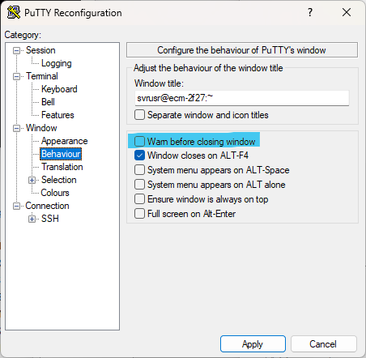
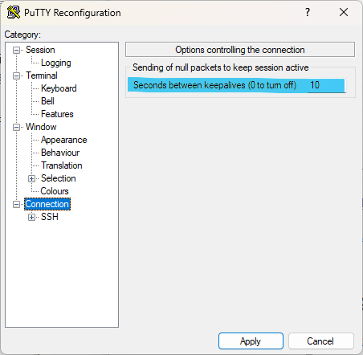
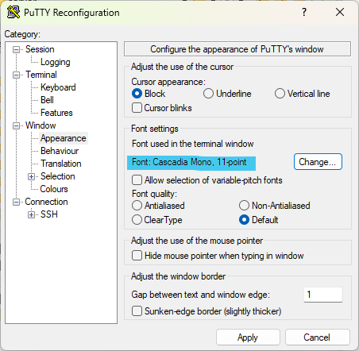
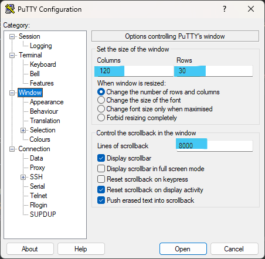
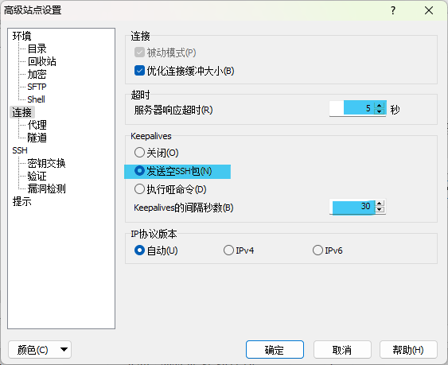
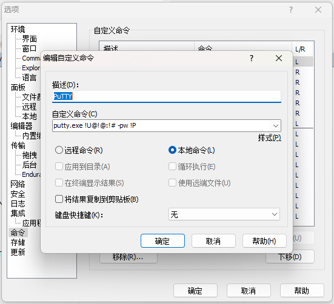

# SSH


# PuTTY

### 配置不生效问题

配置后，重新打开 PuTTY，发现配置又没在了。修改完配置之后，需要切回`Session`，点击`Default Settings`，点击`Save`按钮。

### 建议配置

##### 关闭时不弹窗提示

比较烦人



> [!TIP]
>
> 其实 PuTTY 正经的关闭是`Ctrl + D`。
>
> [6.1.1 关闭Putty窗口时警告 -PuTTY中文站](http://www.putty.wang/putty-closejg/)

##### 间隔几秒发送空包保持 Session



### 和 Windows Terminal 一样炫酷的界面和字体

字体：`Cascadia Mono`

字形：`Regular`/`常规`

字号：11



长宽、回滚行数



### 配色


```reg
Windows Registry Editor Version 5.00

[HKEY_CURRENT_USER\Software\SimonTatham\PuTTY\Sessions\Default%20Settings]
"Colour0"="238,255,255"
"Colour1"="255,255,255"
"Colour2"="33,33,33"
"Colour3"="33,33,33"
"Colour4"="0,0,0"
"Colour5"="255,255,255"
"Colour6"="0,0,0"
"Colour7"="84,84,84"
"Colour8"="255,119,167"
"Colour9"="255,119,167"
"Colour10"="138,236,148"
"Colour11"="138,236,148"
"Colour12"="255,203,107"
"Colour13"="255,203,107"
"Colour14"="57,181,255"
"Colour15"="55,181,255"
"Colour16"="199,146,234"
"Colour17"="199,146,234"
"Colour18"="136,252,255"
"Colour19"="136,252,255"
"Colour20"="255,255,255"
"Colour21"="255,255,255"

```

保存为`.reg`格式，双击运行导入注册表。

> [PuTTY 颜色主题设置 2 | Tao Zhang's Blog (zhangtao75.github.io)](https://zhangtao75.github.io/2020/02/02/PuTTY-Color-Themes2/)
>
> [mbadolato/iTerm2-Color-Schemes: Over 250 terminal color schemes/themes for iTerm/iTerm2. Includes ports to Terminal, Konsole, PuTTY, Xresources, XRDB, Remmina, Termite, XFCE, Tilda, FreeBSD VT, Terminator, Kitty, MobaXterm, LXTerminal, Microsoft's Windows Terminal, Visual Studio, Alacritty (github.com)](https://github.com/mbadolato/iTerm2-Color-Schemes/tree/master)
>
> [AlexAkulov/putty-color-themes: PuTTY Color Themes (github.com)](https://github.com/AlexAkulov/putty-color-themes)

### 命令行

> [Using PuTTY - PuTTY 命令行](https://the.earth.li/~sgtatham/putty/0.80/htmldoc/Chapter3.html#using-cmdline)

```bash
putty.exe [-ssh | -ssh-connection | -telnet | -rlogin | -supdup | -raw] [user@]host
```

```bash
putty.exe -ssh -P 22 -l usr -pw password 127.0.0.1
putty.exe usr@127.0.0.1 -pw password 127.0.0.1
```

> [!TIP]
>
> PuTTY 自带的命令行工具`plink`可以使用和`putty`相同的参数，不过使用 Windows Terminal + `plink`时，在 Linux 服务器中按`Ctrl + C`就连整个 SSH 都退掉了。

# WinSCP

### 老是掉线问题

放着一会不用，就会掉线，等待（卡住）15s之后，才会提示重新连接。

- 改短这个超时时间
- 自动保活（keepalives）

遗憾的是这个必须每个站点都设一遍:dog:

`站点设置 - 高级 - 连接`



> [WinSCP断线时间设置，解决总是短线重连卡顿的问题 - 老马奇遇记 (z197.com)](https://z197.com/blog/set-disconnection-reconnection-time.html)

### 免密 sudo 用户 root 权限

新建会话 - 右键会话 - 编辑 - 高级，环境 - SFTP，SFTP服务器设为：

```bash
sudo /usr/libexec/sftp-server
```

参看[Linux/服务器安全 - 使用非-root-用户登录](Linux/服务器安全?id=使用非-root-用户登录)

### 从 WinSCP 中快速连接 SSH

WinSCP 中自带一个`命令 - 在 PuTTY 中打开`，不过还要输密码，略显鸡肋。不过`选项 - 命令`中有个自定义命令的功能，可以直接用 PuTTY 登录服务器，再配上上面的配置，没 xshell 什么事了🥰

> [Custom Commands - 自定义命令 :: WinSCP](https://winscp.net/eng/docs/custom_command)

```bash
# 某些情况连不上
putty.exe !U@!@:!# -pw !P
# 改成这个可以解决
putty.exe -ssh -P !# -l !U -pw !P !@
```



### Tar/UnTar

原自定义命令：

```bash
# tar
tar -cz  -f "!?压缩文件名(&A)：?archive.tgz!" !&
# untar
tar -xz --directory="!?解压到目录(&E)：?.!" -f "!"
```

为方便 + 免密 sudo 可以这么改：

```bash
# tar
sudo tar -cz -f "archive.tgz" !&
# untar
sudo tar -xz --directory="." -f "!"
```

