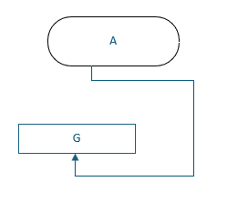

# Visio

设置形状格式：点击形状样式右下角，即可在右侧打开

# 形状

形状即 visio 中的各种图形，默认左侧会展示形状，在更多形状中，可以获得更多类型的形状，如服务器、防火墙等。

# 流程图

### 步骤图框

工具 - 文字，在画布上拉出一个矩形，输入文字即可。

点击图标，设置形状样式中，线条选择实线，可调整弧度

### 连接线

工具 - 连接线，鼠标连接图框即可。

> [!TIP]
>
> 控制连接线的弯折方向
>
> 点击连接线，鼠标移到控制点上，可以看到鼠标变为移动箭头样式，按住`shift`键，可以增加弯折拐点，然后自由控制弯折方向。
>
> 
>
> 

### 直线

工具中，有个形状的下拉，展开选择直线

### 弧线

工具中，有个形状的下拉，展开选择弧线。

> [!TIP]
>
> 圆弧方向控制：鼠标拖弧线时，应按照圆弧的轨迹拖，这样圆弧方向就会与预期一致。
>
> 

# 组合

选中组成组合的元素，右键 - 组合 - 组合，这样会将他们组成一个形状。

右键 - 组合 - 取消组合，可以拆分组合。