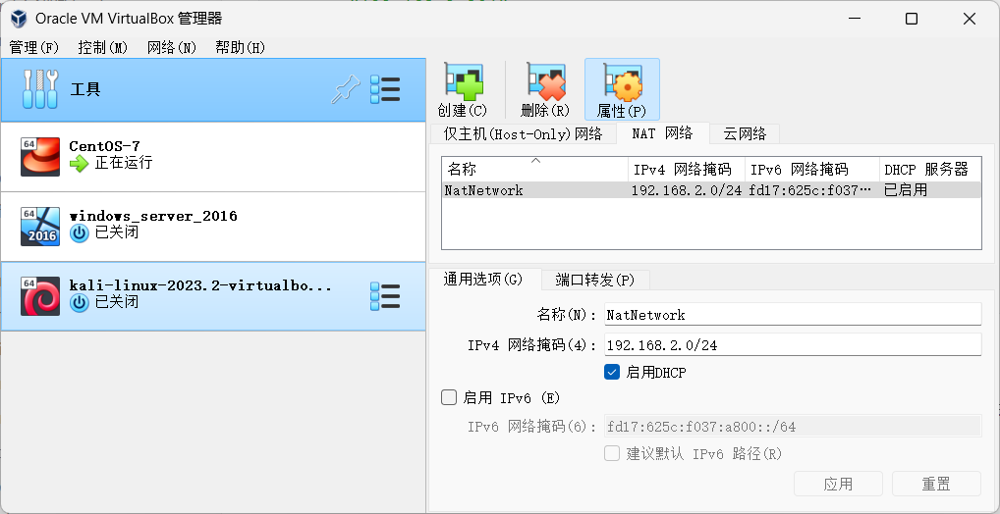
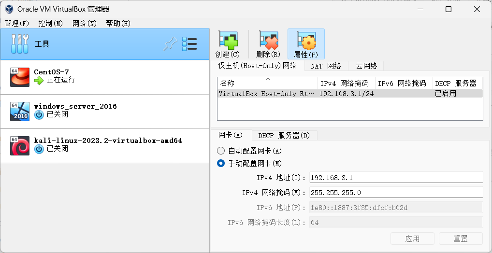
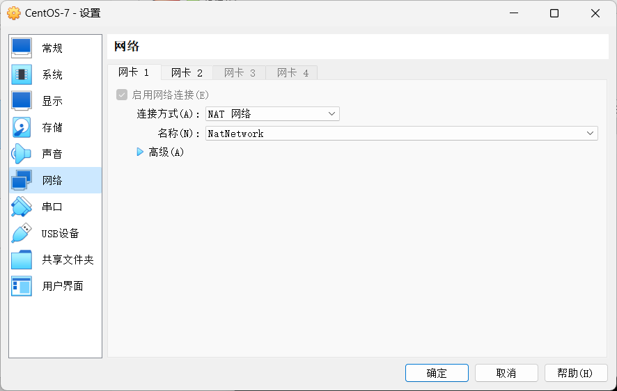
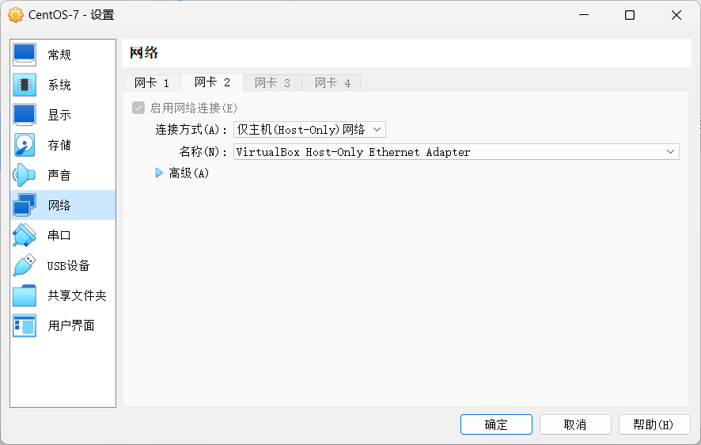
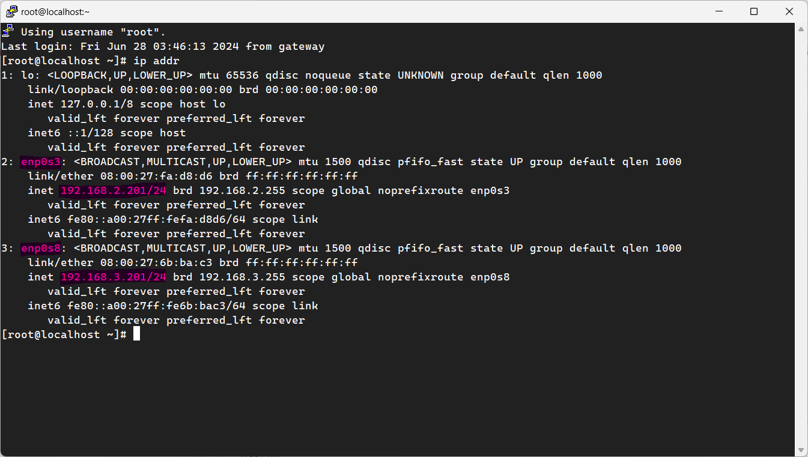

# VirtualBox

### 安装组件

安装 VirtualBox 时，选择所需要的组件

- 如果使用`桥接模式`，可只选桥接
- 如果使用`NAT`，需要选择`Host-Only`

> [!TIP]
>
> - 桥接模式：虚拟机桥接到网卡，直接连入局域网，与主机平级
> - NAT：网络地址转换，用于虚拟机上网
> - Host-Only：仅主机，用于虚拟机与主机互访

# 桥接模式

优点：

- 虚拟机与主机、其他虚拟机、局域网中的其他设备互访方便

缺点：

- 比较依赖于局域网，如果主机连入了另一个网络需要重新配置虚拟机 IP
- 有的网络可能不支持桥接

虚拟机设置 - 网络，选择桥接，选择主机联网的网卡

```properties
vim /etc/sysconfig/network-scripts/ifcfg-enp0s3

TYPE=Ethernet
PROXY_METHOD=none
BROWSER_ONLY=no
BOOTPROTO=static
DEFROUTE=yes
IPADDR="192.168.2.201"
NETMASK="255.255.255.0"
GATEWAY="192.168.2.1"
DNS1="114.114.114.114"
DNS2="4.2.2.1"
NAME=enp0s3
DEVICE=enp0s3
ONBOOT=yes

# 重启网卡
systemctl restart network
```

# NAT + Host-Only

通常虚拟机上网和与主机互访都是必要的，所以这两个一起使用，作为**虚拟机的两个网卡**。

### 配置全局 NAT 网络

管理 - 工具 - 网络管理器



### 配置全局 Host-Only 网络



### 设置虚拟机网卡

虚拟机设置 - 网络

网卡1



网卡2



### 配置虚拟机

```properties
ip addr
```



可以看到，给虚拟机配置`NAT`和`Host-Only`两个网络（网卡）

- enp0s3：NAT 网络（192.168.2.0段），用于虚拟机上网，可以随便给它配置一个 ip，与主机互访用不到
- enp0s8：Host-Only 网络（192.168.3.0段），用于与主机互访，需要配置一个我们记得的 ip

```properties
vim /etc/sysconfig/network-scripts/ifcfg-enp0s3
```

enp0s3

```properties
TYPE=Ethernet
PROXY_METHOD=none
BROWSER_ONLY=no
BOOTPROTO=static
DEFROUTE=yes
IPADDR="192.168.2.201"
NETMASK="255.255.255.0"
GATEWAY="192.168.2.1"
DNS1="114.114.114.114"
DNS2="4.2.2.1"
NAME=enp0s3
DEVICE=enp0s3
ONBOOT=yes
```

enp0s8

```properties
TYPE=Ethernet
PROXY_METHOD=none
BROWSER_ONLY=no
BOOTPROTO=static
DEFROUTE=yes
IPADDR="192.168.3.201"
NETMASK="255.255.255.0"
GATEWAY="192.168.3.1"
DNS1="114.114.114.114"
DNS2="4.2.2.1"
NAME=enp0s8
DEVICE=enp0s8
ONBOOT=yes
```

> [!TIP]
>
> 如果在`/etc/sysconfig/network-scripts`下找不到对应网卡的配置文件，可以复制其他网卡的配置文件，**注意文件名后缀、`NAME`、`DEVICE`**与`ip addr`中的网卡名对应。

主机访问虚拟机：192.168.3.201

虚拟机访问主机：192.168.3.1

> [VirtualBox 使用 NAT网络、仅主机（Host-only）网络 实现双网卡上网并与宿主机连接。_virtualbox host only-CSDN博客](https://blog.csdn.net/u010606397/article/details/115350392)

# 问题

### ssh 连接特别慢

```bash
sudo vi /etc/ssh/sshd_config
在 vi 中, 将注释掉的 #UseDNS=yes 改为 UseDNS=no
systemctl restart sshd
```

> [解决: ssh 远程登录虚拟机 Linux 速度很慢的问题 · Issue #136 · jwenjian/ghiblog (github.com)](https://github.com/jwenjian/ghiblog/issues/136)