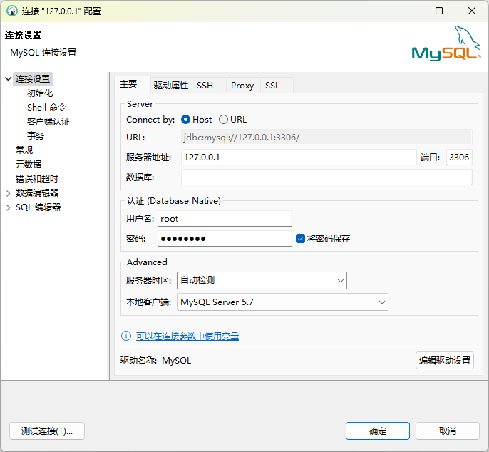
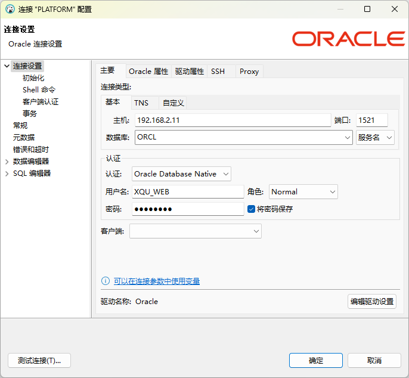
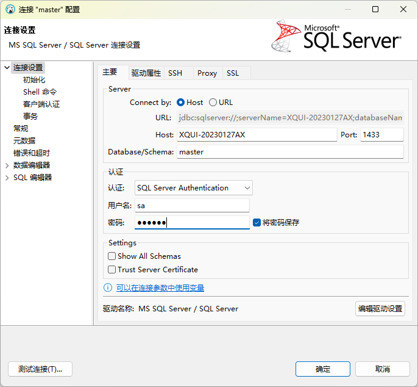
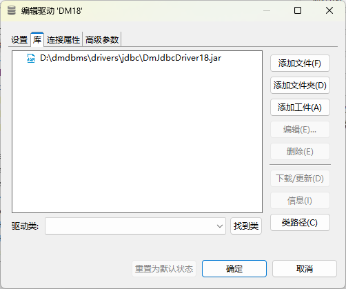
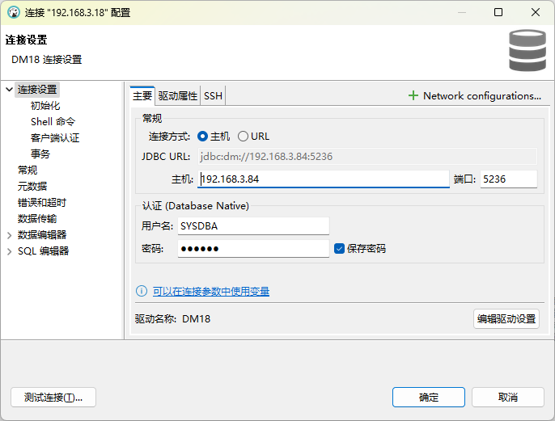

# dbeaver

# 更换驱动下载仓库

不然驱动下载太慢

`窗口 - 首选项 - 连接 - 驱动 - MAVEN - 添加`

添加阿里云仓库地址：

```
https://maven.aliyun.com/repository/central
https://maven.aliyun.com/repository/public
```

点击`向上`按钮，将阿里云仓库移动到最前面

> [仓库服务 (aliyun.com)](https://developer.aliyun.com/mvn/guide)

> [!ATTENTION]
>
> 需要重启客户端生效。

# 连接

##### mysql



##### oracle



##### SQL Server



### 达梦

`数据库 - 驱动管理器 `，新建

##### 设置

- 驱动名称：`DM18`
- 驱动类型：`Generic`
- 类名：`dm.jdbc.driver.DmDriver`
- URL 模板：`jdbc:dm://{host}:{port}`
- 默认端口：`5236`

##### 库



> [!TIP]
>
> 如果安装了达梦数据库，可以在安装目录中找到驱动`D:\dmdbms\drivers\jdbc\DmJdbcDriver18.jar`。

##### 连接



# 操作


### 操作有点反人类

- 编辑表字段，应该展开表，双击下面的列
- 设置主键要在`约束`标签中设置

