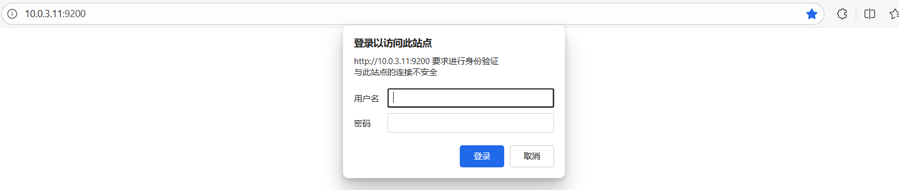
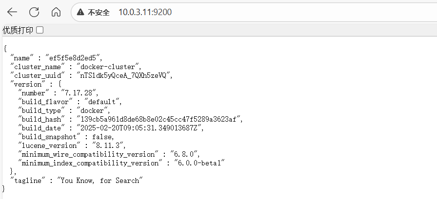
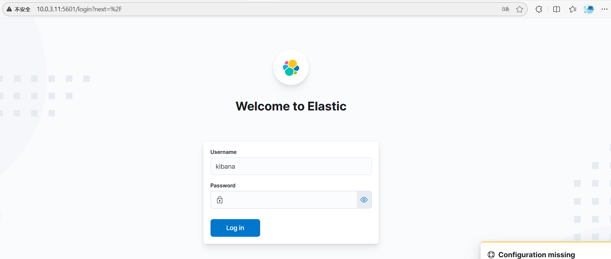
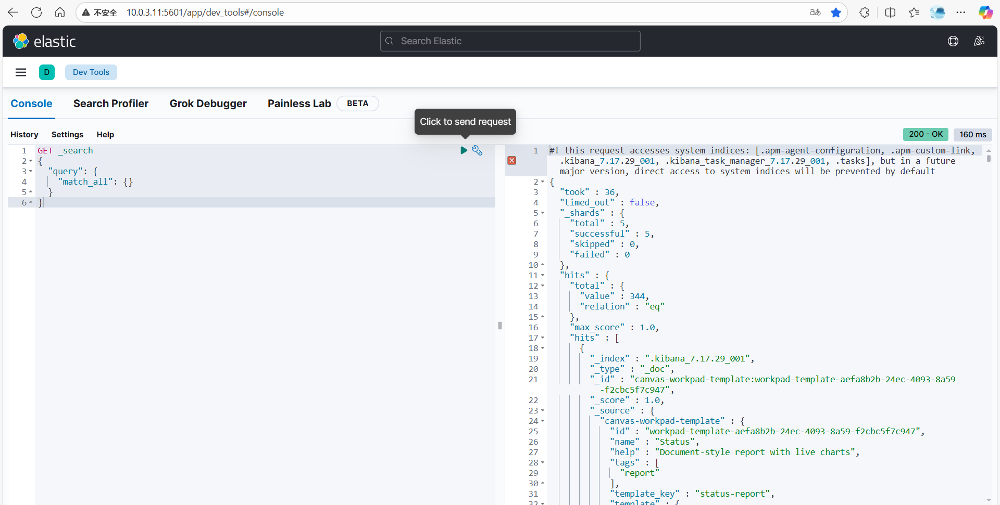
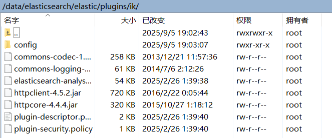

# ElasticSearch

# Docker Compose安装

```yml
name: 'elasticsearch'

services:
  es:
    image: 'elasticsearch:7.17.28'
    container_name: es
    restart: always
    ports:
      - '9200:9200'
      - '9300:9300'
    volumes:
      - ./elastic/data:/usr/share/elasticsearch/data
      - ./elastic/plugins:/usr/share/elasticsearch/plugins
      - ./elastic/elasticsearch.yml:/usr/share/elasticsearch/config/elasticsearch.yml
    environment:
      - discovery.type=single-node
      - "ES_JAVA_OPTS=-Xms1g -Xmx1g"
    ulimits:
      memlock:
        soft: -1
        hard: -1
    networks:
      - es-net
  kibana:
    image: 'kibana:7.17.28'
    container_name: kibana
    restart: always
    ports:
      - '5601:5601'
    environment:
      - 'ELASTICSEARCH_HOSTS=http://es:9200'
    volumes:
      - ./elastic/kibana.yml:/usr/share/kibana/config/kibana.yml
    networks:
      - es-net
networks:
  es-net:
    name: es-net
    driver: bridge
```

elasticsearch.yml

```yml
cluster.name: "docker-cluster"
network.host: 0.0.0.0
http.cors.enabled: true
http.cors.allow-origin: "*"
http.cors.allow-headers: Authorization
xpack.security.enabled: true
xpack.security.transport.ssl.enabled: true
```

kibana.yml

```yml
#
# ** THIS IS AN AUTO-GENERATED FILE **
#

# Default Kibana configuration for docker target
server.host: "0.0.0.0"
server.shutdownTimeout: "5s"
elasticsearch.hosts: [ "http://elasticsearch:9200" ]
monitoring.ui.container.elasticsearch.enabled: true
elasticsearch.username: "kibana"
elasticsearch.password: "password"
```

> [!NOTE]
>
> 很多组件环境变量`environment`的优先级会高于 yml 配置文件，例如：
>
> - es 中我没注意在`environment`中配置了`xpack.security.enabled: false`，然后我在 yml 配置文件中怎么配都不生效:dog:，而且在容器中执行`./bin/elasticsearch-setup-passwords interactive`报错：
>
>   ```bash
>   Unexpected response code [405] from calling GET
>   http://172.17.0.2:9200/_security/_authenticate?pretty It doesn’t look
>   like the X-Pack security feature is enabled on this Elasticsearch
>   node. Please check if you have enabled X-Pack security in your
>   elasticsearch.yml configuration file.
>   
>   ERROR: X-Pack Security is disabled by configuration.
>   ```
>
> - kibana 中的 es 地址配置

> [!NOTE]
>
> 首次启动查看 es 日志
>
> ```bash
> docker logs -f --tail=200 es
> ```
>
> 可能会报错：
>
> ```log
> AccessDeniedException: /usr/share/elasticsearch/data/nodes
> ```
>
> 需要将 es 的目录权限放大：
>
> ```bash
> chmod -R 775 elastic/*
> ```
>
> [docker中启动ES报错：AccessDeniedException: /usr/share/elasticsearch/data/nodes_nested: accessdeniedexception-CSDN博客](https://blog.csdn.net/mah666/article/details/121153036)

访问 es：[http://10.0.3.11:9200/](http://10.0.3.11:9200/)





访问 kibana dev_tools：[http://10.0.3.11:5601/app/dev_tools#/console](http://10.0.3.11:5601/app/dev_tools#/console)





> [基于Docker安装Elasticsearch【保姆级教程、内含图解】_docker elasticsearch-CSDN博客](https://blog.csdn.net/Acloasia/article/details/130683934)
>
> [SpringBoot整合Elasticsearch(最新最全，高效安装到使用)-CSDN博客](https://blog.csdn.net/whatevery/article/details/132062101)

### 配置密码

```bash
[root@localhost elasticsearch]# docker exec -it es /bin/bash
root@74a04fc0b865:/usr/share/elasticsearch# ./bin/elasticsearch-setup-passwords interactive
Initiating the setup of passwords for reserved users elastic,apm_system,kibana,kibana_system,logstash_system,beats_system,remote_monitoring_user.
You will be prompted to enter passwords as the process progresses.
Please confirm that you would like to continue [y/N]y


Enter password for [elastic]:
Reenter password for [elastic]:
Enter password for [apm_system]:
Reenter password for [apm_system]:
Enter password for [kibana_system]:
Reenter password for [kibana_system]:
Enter password for [logstash_system]:
Reenter password for [logstash_system]:
Enter password for [beats_system]:
Reenter password for [beats_system]:
Enter password for [remote_monitoring_user]:
Reenter password for [remote_monitoring_user]:
Changed password for user [apm_system]
Changed password for user [kibana_system]
Changed password for user [kibana]
Changed password for user [logstash_system]
Changed password for user [beats_system]
Changed password for user [remote_monitoring_user]
Changed password for user [elastic]

```

> [【主流技术】详解 SpringBoot 集成 ElasticSearch7.x 全过程 - CodeBlogMan - 博客园](https://www.cnblogs.com/CodeBlogMan/p/17849878.html)

### 安装分词器

下载分词器：

[GitHub - infinilabs/analysis-ik: 🚌 The IK Analysis plugin integrates Lucene IK analyzer into Elasticsearch and OpenSearch, support customized dictionary.](https://github.com/infinilabs/analysis-ik?spm=a2c6h.12873639.article-detail.8.364e77468fBrmB)

[Index of: analysis-ik/stable/](https://release.infinilabs.com/analysis-ik/stable/)

在上述的 plugins 目录中创建目录 ik，将分词器解压后放入



```bash
# 重启es和kibana
docker restart es
docker restart kibana
# 进入容器查看分词器是否安装成功
docker exec -it es /bin/bash
root@ef5f5e8d2ed5:/usr/share/elasticsearch# elasticsearch-plugin list
ik
```

> [一文教会你 分词器elasticsearch-analysis-ik 的安装使用【自定义分词库】-阿里云开发者社区](https://developer.aliyun.com/article/1589546)

# 控制台测试

```json
# 测试分词器
GET _analyze
{ "analyzer": "ik_max_word", "text": "折上折满减"}

# 创建订单
PUT /shop_order
{
  "mappings": {
    "properties": {
      "order_id":    { "type": "keyword" },
      "user_name":   { "type": "keyword" },
      "prod_name":   { "type": "text", "analyzer": "ik_max_word" },
      "amount":      { "type": "double" },
      "status":      { "type": "keyword" },
      "pay_time":    { "type": "date", "format": "yyyy-MM-dd HH:mm:ss" },
      "province":    { "type": "keyword" },
      "city":        { "type": "keyword" }
    }
  }
}

# 灌数据
POST /shop_order/_bulk
{"index":{}}
{"order_id":"o001","user_name":"Alice","prod_name":"苹果iPhone 15 256G 蓝色","amount":6999,"status":"paid","pay_time":"2024-06-01 10:12:00","province":"广东","city":"深圳"}
{"index":{}}
{"order_id":"o002","user_name":"Bob","prod_name":"小米14 Pro 12GB+256GB 白色","amount":4999,"status":"paid","pay_time":"2024-06-01 11:30:00","province":"江苏","city":"南京"}
{"index":{}}
{"order_id":"o003","user_name":"Cathy","prod_name":"华为P70 512G 金色","amount":6488,"status":"canceled","pay_time":"2024-06-02 09:45:00","province":"上海","city":"上海"}
{"index":{}}
{"order_id":"o004","user_name":"Dave","prod_name":"iPad Air 5 64G 粉色","amount":4799,"status":"paid","pay_time":"2024-06-02 14:20:00","province":"浙江","city":"杭州"}
{"index":{}}
{"order_id":"o005","user_name":"Ella","prod_name":"索尼WH-1000XM5 降噪耳机","amount":2399,"status":"paid","pay_time":"2024-06-03 08:15:00","province":"北京","city":"北京"}
{"index":{}}
{"order_id":"o006","user_name":"Frank","prod_name":"戴尔XPS13 笔记本 i7 16G","amount":9999,"status":"paid","pay_time":"2024-06-03 13:50:00","province":"四川","city":"成都"}
{"index":{}}
{"order_id":"o007","user_name":"Grace","prod_name":"雷蛇游戏鼠标 炼狱蝰蛇","amount":299,"status":"paid","pay_time":"2024-06-04 10:05:00","province":"广东","city":"广州"}
{"index":{}}
{"order_id":"o008","user_name":"Henry","prod_name":"iPhone 15 ProMax 1T 原色","amount":11999,"status":"paid","pay_time":"2024-06-04 16:30:00","province":"广东","city":"深圳"}
{"index":{}}
{"order_id":"o009","user_name":"Ivy","prod_name":"小米手环8 NFC","amount":269,"status":"canceled","pay_time":"2024-06-05 11:00:00","province":"湖北","city":"武汉"}
{"index":{}}
{"order_id":"o010","user_name":"Jack","prod_name":"AirPods Pro 2 降噪","amount":1899,"status":"paid","pay_time":"2024-06-05 19:20:00","province":"江苏","city":"苏州"}
{"index":{}}
{"order_id":"o011","user_name":"Kate","prod_name":"华为MateBook X Pro","amount":8999,"status":"paid","pay_time":"2024-06-06 12:10:00","province":"上海","city":"上海"}
{"index":{}}
{"order_id":"o012","user_name":"Leo","prod_name":"Switch OLED 日版","amount":2599,"status":"paid","pay_time":"2024-06-06 15:45:00","province":"浙江","city":"宁波"}
{"index":{}}
{"order_id":"o013","user_name":"Mary","prod_name":"罗技MX Master 3S 鼠标","amount":699,"status":"paid","pay_time":"2024-06-07 09:30:00","province":"北京","city":"北京"}
{"index":{}}
{"order_id":"o014","user_name":"Nick","prod_name":"Tesla 车载充电器","amount":499,"status":"paid","pay_time":"2024-06-07 14:00:00","province":"广东","city":"佛山"}
{"index":{}}
{"order_id":"o015","user_name":"Olivia","prod_name":"大疆Mini 3 无人机","amount":3688,"status":"paid","pay_time":"2024-06-08 10:50:00","province":"四川","city":"成都"}
{"index":{}}
{"order_id":"o016","user_name":"Peter","prod_name":"索尼A7M4 机身","amount":15999,"status":"canceled","pay_time":"2024-06-08 16:20:00","province":"江苏","city":"无锡"}
{"index":{}}
{"order_id":"o017","user_name":"Queen","prod_name":"Apple Watch S9 45mm","amount":3199,"status":"paid","pay_time":"2024-06-09 11:10:00","province":"广东","city":"东莞"}
{"index":{}}
{"order_id":"o018","user_name":"Rose","prod_name":"小米13 Ultra 512G","amount":6499,"status":"paid","pay_time":"2024-06-09 18:30:00","province":"湖北","city":"宜昌"}
{"index":{}}
{"order_id":"o019","user_name":"Sam","prod_name":"iPad Pro 12.9 1T","amount":12999,"status":"paid","pay_time":"2024-06-10 12:40:00","province":"浙江","city":"温州"}
{"index":{}}
{"order_id":"o020","user_name":"Tom","prod_name":"雷蛇黑寡妇键盘 V4","amount":1299,"status":"paid","pay_time":"2024-06-10 20:00:00","province":"上海","city":"上海"}
{"index":{}}
{"order_id":"o021","user_name":"Uma","prod_name":"华为FreeBuds Pro 3","amount":1199,"status":"paid","pay_time":"2024-06-11 09:20:00","province":"北京","city":"北京"}
{"index":{}}
{"order_id":"o022","user_name":"Vivian","prod_name":"Kindle Oasis 32G","amount":2399,"status":"canceled","pay_time":"2024-06-11 15:50:00","province":"江苏","city":"常州"}
{"index":{}}
{"order_id":"o023","user_name":"Will","prod_name":"DJI Mic 2 收音器","amount":1999,"status":"paid","pay_time":"2024-06-12 10:30:00","province":"广东","city":"珠海"}
{"index":{}}
{"order_id":"o024","user_name":"Xena","prod_name":"LG 27寸 4K显示器","amount":2999,"status":"paid","pay_time":"2024-06-12 17:00:00","province":"四川","city":"绵阳"}
{"index":{}}
{"order_id":"o025","user_name":"Yoyo","prod_name":"iPhone 15 128G 绿色","amount":5999,"status":"paid","pay_time":"2024-06-13 11:50:00","province":"广东","city":"惠州"}
{"index":{}}
{"order_id":"o026","user_name":"Zack","prod_name":"小米平板6 Pro 键盘套装","amount":2799,"status":"paid","pay_time":"2024-06-13 19:10:00","province":"湖北","city":"荆州"}
{"index":{}}
{"order_id":"o027","user_name":"Amy","prod_name":"华为路由 BE3 Pro","amount":599,"status":"paid","pay_time":"2024-06-14 08:40:00","province":"浙江","city":"嘉兴"}
{"index":{}}
{"order_id":"o028","user_name":"Brian","prod_name":"索尼PS5 光驱版","amount":3899,"status":"canceled","pay_time":"2024-06-14 14:20:00","province":"上海","city":"上海"}
{"index":{}}
{"order_id":"o029","user_name":"Cindy","prod_name":"Apple TV 4K 128G","amount":999,"status":"paid","pay_time":"2024-06-15 10:00:00","province":"北京","city":"北京"}
{"index":{}}
{"order_id":"o030","user_name":"David","prod_name":"iPad mini 6 256G","amount":4999,"status":"paid","pay_time":"2024-06-15 16:30:00","province":"广东","city":"中山"}

# 查询数据
GET shop_order/_search
{
  "query": {
    "bool": {
      // 硬过滤，同时算分
      // 与filter的区别：都是必须匹配，但是must会算分，例如province为“上海上海”，相关度会比“上海”高
      "must": [
        {"match": {"province": "上海"}}  
      ],
      // 加分，华为排前，其次是小米，再次是其他
      "should": [
        {"match": {"prod_name": "华为"}},
        {"match": {"prod_name": "小米"}}
      ],
      // 黑白过滤，不算分
      "filter": [
        {"term": {"status": "paid"}},
        {"range": {"amount": {"gte": 6000}}},
        // 一个filter中只能有一个字段
        {"range": {
            "pay_time": {
              "gte": "2024-06-01 12:10:00",
              "lte": "2024-06-22 12:10:00"
            }
          }
        }
      ]
    }
  },
  // 如果不指定，结果会按分数（相关度）排序
  "sort": [{"pay_time": "desc"}],
  // 如果不指定，结果中的_source会返回所有字段
  "_source": ["order_id","prod_name","amount","pay_time","province"]
}

# 聚合
GET shop_order/_search
{
  "size": 0,
  "aggs": {
    "month_sales": {
      "date_histogram": {"field": "pay_time", "calendar_interval": "day"},
      "aggs": {
        "total_money": {"sum": {"field": "amount"}},
        "order_count": {"value_count": {"field": "order_id"}}
      }
    }
  }
}
```

