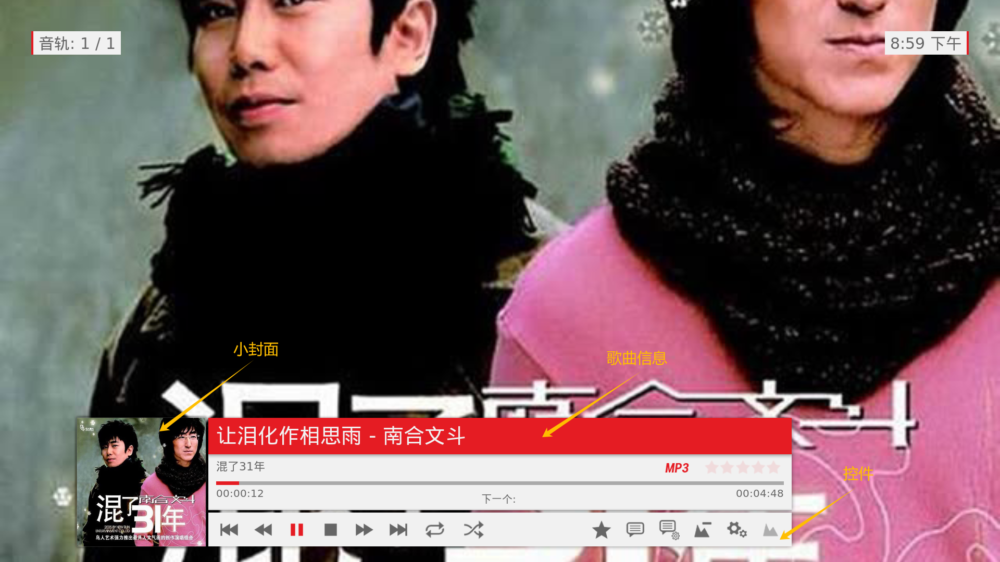
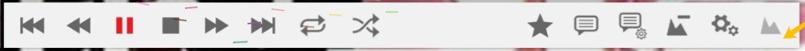
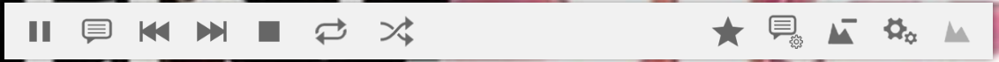
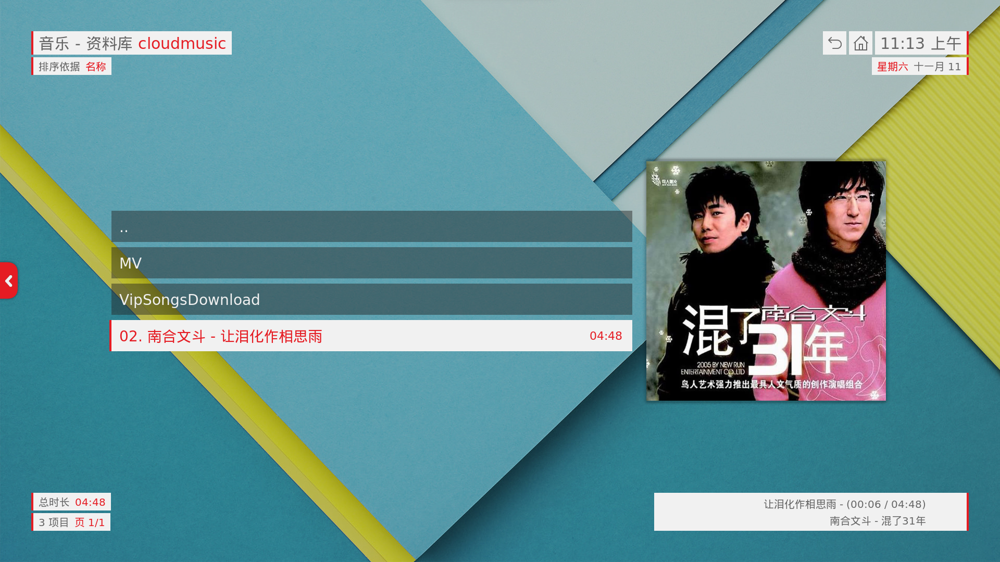
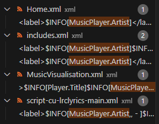
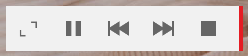
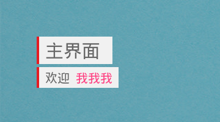

# Kodi skin-unity

Kodi 是一款相当强大的开源 TV 软件，包含了音乐、视频、电视、图片、游戏等功能，拥有强大的插件系统，且官方插件商店的插件都是免费且开源的，可玩性可以说是相当强了。

Unity 是一款设计相当前卫的皮肤，Material Design 风格，界面相当优美，还可以自定义菜单。

音乐使用 chen310 大佬的网易云插件[chen310/plugin.audio.music163: 网易云音乐 Kodi 插件 (github.com)](https://github.com/chen310/plugin.audio.music163)，在电视上用手机的 VIP，着实很爽，但播放界面有点操蛋：

- 打开播放页，歌曲信息和歌词叠加显示，歌词还有背景框:dog:，等一会才会只显示歌词，而且背景一片黑
- 返回关闭歌词，然后一片黑，再返回才退出播放页

用了 chen310 大佬修改的 Unity 皮肤[【图片】在 Kodi 中使用网易云音乐插件听歌【kodi吧】_百度贴吧 (baidu.com)](https://tieba.baidu.com/p/8021470008)：

- 歌词背景框没了
- 歌词居中
- 歌词有歌曲图片背景了

但：

- 打开播放页，歌曲信息和歌词叠加显示，等一会才会只显示歌词
- 返回关闭歌词，然后一片黑，再返回才退出播放页

看来大佬已经把难搞的部分搞好了，开源的么，整来看看能不能解决下剩余的问题。

zip 解包大佬修改的 skin.unity，打开代码一看，全是布局文件，拿界面中的文字去搜索，根本找不到，拿布局文件名去搜索，也是找不到，完全不知道是怎么调用的。。。

经过研究，玩明白的：

# 开发手册

> 开发目录：[Category:Skin development - Official Kodi Wiki](https://kodi.wiki/view/Category:Skin_development)
>
> 开发手册：[Skinning Manual - Official Kodi Wiki](https://kodi.wiki/view/Skinning_Manual)
>
> 内置变量：[Kodi Documentation: Infolabels and Boolean conditions (xbmc.github.io)](https://xbmc.github.io/docs.kodi.tv/master/kodi-base/d5/d11/modules__infolabels_boolean_conditions.html)
>
> 内置方法：[Kodi Documentation: List of built-in functions (xbmc.github.io)](https://xbmc.github.io/docs.kodi.tv/master/kodi-base/d0/d3e/page__list_of_built_in_functions.html)
>
> 官方论坛：[Kodi Community Forum (3)](https://forum.kodi.tv/)

歌曲封面图：`$INFO[MusicPlayer.offset(0).Cover]`

还有外面再套一层`$INFO[]`的，不知道是何意

逻辑表达式：

```java
// 与
Player.ShowInfo + Window.IsActive(MusicOSD)
// 或
Player.ShowInfo | Window.IsActive(MusicOSD)
// 非
!Player.ShowInfo
// 嵌套
[Player.ShowInfo | Window.IsVisible(script-cu-lrclyrics-main.xml)] + Window.IsActive(MusicOSD)
```

设置项：`Skin.HasSetting(HideVisualizationFanart)`

是否有可视化插件：`String.IsEmpty(Window(Visualisation).Property(ArtistSlideshow.Image))`

歌曲控件是否显示：`Window.IsActive(MusicOSD)`

歌词是否打开：`Window.IsVisible(script-cu-lrclyrics-main.xml)`

### Window | 窗口

全部窗口：[Kodi Development: WindowIDs (xbmc.github.io)](https://xbmc.github.io/docs.kodi.tv/master/kodi-dev-kit/window_ids.html)

窗口是否可见：`Window.IsVisible(SelectDialog)`

### Control | 控件

```xml
<control type="image">
    <description>Fanart Image for Artist</description>
    <aspectratio>scale</aspectratio>
    <fadetime>400</fadetime>
    <animation effect="fade" start="0" end="100" time="400">WindowOpen</animation>
    <animation effect="fade" start="100" end="0" time="300">WindowClose</animation>
    <animation effect="fade" start="100" end="75" condition="Control.IsVisible(2)">Conditional</animation>
    <left>0</left>
    <top>0</top>
    <width>100%</width>
    <height>100%</height>
    <texture background="true">$INFO[MusicPlayer.offset(0).Cover]</texture>
    <visible>String.IsEmpty(Window(Visualisation).Property(ArtistSlideshow.Image)) + !Skin.HasSetting(HideVisualizationFanart)</visible>
</control>
```

居中：`<centerleft>50%</centerleft>`（中心距左边50%，可不就是居中么）

被显示时的动画：`<animation effect="fade" start="0" end="100" time="200">Visible</animation>`

被隐藏时的动画：`<animation effect="fade" start="100" end="0" time="200">Hidden</animation>`

> ### Tags available to all controls | 控件标签
>
> |    Tag(s)    |                          Definition                          |
> | :----------: | :----------------------------------------------------------: |
> | description  | Only used to make things clear for the skinner. Not read by Kodi at all. |
> |     type     |                     The type of control.                     |
> |      id      | Specifies the control's id. The value this takes depends on the control type, and the window that you are using the control on. There are special control id's that must be present in each window. Any other controls that the skinner adds can be any id they like. Any controls that the skinner specifies content needs not have an id unless it's needed for animation purposes. For instance, most image and label controls don't need an id if the skinner specifies they're content. |
> |     left     | Specifies where the left edge of the control should be drawn, relative to it's parent's left edge. If an "r" is included (eg 180r) then the measurement is taken from the parent's right edge (in the left direction). This can be an absolute value or a %. |
> |     top      | Specifies where the top edge of the control should be drawn, relative to it's parent's top edge. If an "r" is included (eg 180r) then the measurement is taken from the parent's bottom edge (in the up direction). This can be an absolute value or a %. |
> |    right     | Specifies where the right edge of the control should be drawn. This can be an absolute value or a %. |
> |    bottom    | Specifies where the bottom edge of the control should be drawn. This can be an absolute value or a %. |
> |  centerleft  | Aligns the control horizontally at the given coordinate measured from the left side of the parent control. This can be an absolute value or a %. |
> | centerright  | Aligns the control horizontally at the given coordinate measured from the right side of the parent control. This can be an absolute value or a %. |
> |  centertop   | Aligns the control vertically at the given coordinate measured from the top side of the parent control. This can be an absolute value or a %. |
> | centerbottom | Aligns the control vertically at the given coordinate measured from the bottom side of the parent control. This can be an absolute value or a %. |
> |    width     | Specifies the width that should be used to draw the control. You can use <width>auto</width> for labels (in grouplists) and button/togglebutton controls. |
> |    height    | Specifies the height that should be used to draw the control. |
> |   visible    | Specifies a condition as to when this control will be visible. Can be true, false, or a condition. See [Conditional Visibility](https://kodi.wiki/view/Conditional_Visibility) for more information. Defaults to true. |
> |  animation   | Specifies the animation to be run when the control enters a particular state. See [Animating your skin](https://kodi.wiki/view/Animating_your_skin) for more information. |
> |    camera    | Specifies the location (relative to the parent's coordinates) of the camera. Useful for the 3D animations such as rotatey. Format is `<camera x="20" y="30" />`. 'r' values and % are also supported. |
> |    depth     | Specifies the 3D stereoscopic depth of a control. possible values range from -1.0 to 1.0, which brings control "to back" and "to front". |
> | colordiffuse | This specifies the color to be used for the texture basis. It's in hex AARRGGBB format. If you define `<colordiffuse>FFFF00FF</colordiffuse>` (magenta), the image will be given a magenta tint when rendered. Defaults to FFFFFFFF (no tint). You can also specify this as a name from the [colour theme](https://kodi.wiki/view/Colour_themes). |
>
> ### Tags available to focusable controls | 可聚焦控件特有标签
>
> In addition, any control that is focusable (e.g. a buttoncontrol) will have the following tags available.
>
> |     Tags      |                          Definition                          |
> | :-----------: | :----------------------------------------------------------: |
> |     onup      | Specifies the `<id>` of the control that should be moved to when the user moves up off this control. Can point to a control group (which remembers previous focused items). |
> |    ondown     | Specifies the `<id>` of the control that should be moved to when the user moves down off this control. Can point to a control group (which remembers previous focused items). |
> |    onleft     | Specifies the `<id>` of the control that should be moved to when the user moves left off this control. Can point to a control group (which remembers previous focused items). |
> |    onright    | Specifies the `<id>` of the control that should be moved to when the user moves right off this control. Can point to a control group (which remembers previous focused items). |
> |    onback     | Specifies the `<id>` of the control that should be focussed when the user presses the back key. Can point to a control group (which remembers previous focused items). |
> |    oninfo     | Specifies the built-in function that should be executed when the user presses the info key. |
> |    onfocus    | Specifies the built-in function that should be executed when the control is focussed. |
> |   onunfocus   | Specifies the built-in function that should be executed when the control is loses focus. |
> |    hitrect    | Specifies the location and size of the "focus area" of this control (relative to the parent's coordinates) used by the mouse cursor. Format is `<hitrect x="20" y="30" w="50" h="10" />` |
> | hitrectcolor  | This adds the ability to visualize hitrects for controls. When visible and there's a <hitrectcolor> tag, it will paint a colored rectangle over the actual control. Colors can be specified in AARRGGBB format or a name from the color theme. |
> |    enable     | Specifies a condition as to when this control will be enabled. Can be true, false, or a condition. See [Conditional Visibility](https://kodi.wiki/view/Conditional_Visibility) for more information. Defaults to true. |
> | pulseonselect | This specifies whether or not a button type will "pulse" when it has focus. This is done by varying the alpha channel of the button. Defaults to true. |
>
> 全部属性：[Default control tags - Official Kodi Wiki](https://kodi.wiki/view/Default_control_tags)

> [Kodi Development: Skin Development (xbmc.github.io)](https://xbmc.github.io/docs.kodi.tv/master/kodi-dev-kit/skin_parts.html)

连官方都说皮肤复杂，看了半天，可算是大概了解它怎么运作的了：页面操作逻辑、调用是程序固定的，皮肤只是可以修改界面、动画等，所以单纯从皮肤里，是找不到调用逻辑的

### 页面

播放页：`xml\MusicVisualisation.xml`

音乐控件：`xml\MusicOSD.xml`

歌词：`xml\script-cu-lrclyrics-main.xml`

# 播放页面的黑色改为歌曲封面

在播放页中可以看到这样一段：

```xml
<control type="visualisation" id="2">
    <description>visualisation</description>
    <left>0</left>
    <top>0</top>
    <width>100%</width>
    <height>100%</height>
    <visible>!String.IsEmpty(Visualisation.Name)</visible>
</control>
<control type="image">
    <description>Fanart Image for Artist</description>
    <aspectratio>scale</aspectratio>
    <fadetime>400</fadetime>
    <animation effect="fade" start="0" end="100" time="400">WindowOpen</animation>
    <animation effect="fade" start="100" end="0" time="300">WindowClose</animation>
    <animation effect="fade" start="100" end="75" condition="Control.IsVisible(2)">Conditional</animation>
    <left>0</left>
    <top>0</top>
    <width>100%</width>
    <height>100%</height>
    <texture background="true">$INFO[Player.Art(fanart)]</texture>
    <visible>String.IsEmpty(Window(Visualisation).Property(ArtistSlideshow.Image)) + !Skin.HasSetting(HideVisualizationFanart)</visible>
</control>
<control type="image">
    <aspectratio>scale</aspectratio>
    <fadetime>400</fadetime>
    <animation effect="fade" start="0" end="100" time="400">WindowOpen</animation>
    <animation effect="fade" start="100" end="0" time="300">WindowClose</animation>
    <animation effect="fade" start="100" end="75" condition="Control.IsVisible(2)">Conditional</animation>
    <left>0</left>
    <top>0</top>
    <width>100%</width>
    <height>100%</height>
    <texture background="true">$INFO[Window(Visualisation).Property(ArtistSlideshow.Image)]</texture>
    <visible>!String.IsEmpty(Window(Visualisation).Property(ArtistSlideshow.Image)) + !Skin.HasSetting(HideVisualizationFanart) + !Skin.HasSetting(DisableArtistSlideshow)</visible>
</control>
```

共有三个大小100%的控件

- 第一个是可视化
- 第二个是在可视化插件没有图片的情况显示个什么`Player.Art?`
- 第三个是在可视化插件有图片的情况显示可视化的图片

不知道可视化图片是个什么，就改第二个吧

```xml
<control type="image">
    <description>Fanart Image for Artist</description>
    <aspectratio>scale</aspectratio>
    <fadetime>400</fadetime>
    <animation effect="fade" start="0" end="100" time="400">WindowOpen</animation>
    <animation effect="fade" start="100" end="0" time="300">WindowClose</animation>
    <animation effect="fade" start="100" end="75" condition="Control.IsVisible(2)">Conditional</animation>
    <left>0</left>
    <top>0</top>
    <width>100%</width>
    <height>100%</height>
    <texture background="true">$INFO[MusicPlayer.offset(0).Cover]</texture>
    <visible>String.IsEmpty(Window(Visualisation).Property(ArtistSlideshow.Image)) + !Skin.HasSetting(HideVisualizationFanart)</visible>
</control>
```

这里显示着图，大佬改的歌词界面的图就没必要了，删掉这一段：

```xml
<control type="image">
    <description>background image</description>
    <top>-80</top>
    <width>100%</width>
    <height>100%</height>
    <aspectratio>scale</aspectratio>
    <animation effect="fade" start="0" end="100" time="300">WindowOpen</animation>
    <animation effect="fade" start="100" end="0" time="200">WindowClose</animation>
    <texture colordiffuse="C2AAAAAA">$INFO[MusicPlayer.offset(0).Cover]</texture>
</control>
```

这样一改效果就好多了

# 歌曲信息显示



我更希望播放页面这样：

- 一直显示歌曲信息（默认或从歌词返回后）
- 显示歌词时隐藏歌曲信息

播放页往下找，可以看到这样一个控件

```xml
<control type="group">
    <centerleft>50%</centerleft>
    <top>283r</top>
    <width>1140</width>
```

观察里面的控件，包含了小封面、歌手、歌曲、时间等信息，这一块就是歌曲信息，他的`visible`属性为：

```java
[Skin.HasSetting(AlwaysShowMusicInfo) | Player.ShowInfo | Window.IsActive(MusicOSD)] + ![Window.IsVisible(AddonSettings) | Window.IsVisible(SelectDialog) | Window.IsVisible(VisualisationPresetList) | Window.IsVisible(PVROSDChannels) | Window.IsVisible(PVRChannelGuide) | Window.IsVisible(PVRRadioRDSInfo) | Window.IsVisible(Addon)]
```

逻辑是：皮肤设置了总是展示歌曲信息，或控件显示，或`Player.ShowInfo`，并且没有打开窗口时，显示歌曲信息，要修改这里就很简单了：

- 在显示的情况中添加歌词未显示
- 在隐藏的情况中添加歌词显示

```java
[Skin.HasSetting(AlwaysShowMusicInfo) | Player.ShowInfo | Window.IsActive(MusicOSD) | !Window.IsVisible(script-cu-lrclyrics-main.xml)] + ![Window.IsVisible(script-cu-lrclyrics-main.xml) | Window.IsVisible(AddonSettings) | Window.IsVisible(SelectDialog) | Window.IsVisible(VisualisationPresetList) | Window.IsVisible(PVROSDChannels) | Window.IsVisible(PVRChannelGuide) | Window.IsVisible(PVRRadioRDSInfo) | Window.IsVisible(Addon)]
```

### OSD 处理

经上述修改，测试发现，歌曲信息已经按预期显示隐藏，但控件部分不受控制，原因是**控件并未包含在上述的 control 中，而是独立的名为`MusicOSD`的控件**，以目前的掌握程度，这个控件的显示隐藏似乎很难去控制了（或者不能控制）。

既然如此，那就从它带来的影响着手解决了：小封面的高度 = 歌曲信息 + OSD，所以 OSD 隐藏掉后会很难看，解决办法：

- OSD 显示时，小封面的高度 = 歌曲信息 + OSD
- OSD 隐藏时，小封面的高度 = 歌曲信息

真是一个天才的想法🥰

复制一份小封面并修改位置大小信息：

```xml
<control type="image">
    <description>cover image</description>
    <left>-250</left>
    <top>-2</top>
    <width>263</width>
    <height>263</height>
    <visible>Window.IsActive(musicosd)</visible>
    <animation effect="fade" start="0" end="100" time="200">Visible</animation>
    <animation effect="fade" start="100" end="0" time="200">Hidden</animation>
    <texture fallback="DefaultAlbumCover.png">$INFO[MusicPlayer.offset(0).Cover]</texture>
    <aspectratio aligny="bottom">keep</aspectratio>
    <bordertexture border="8">ThumbShadow.png</bordertexture>
    <bordersize>8</bordersize>
</control>
<control type="image">
    <description>cover image</description>
    <left>-180</left>
    <top>-2</top>
    <width>193</width>
    <height>193</height>
    <visible>!Window.IsActive(musicosd)</visible>
    <animation effect="fade" start="0" end="100" time="200">Visible</animation>
    <animation effect="fade" start="100" end="0" time="200">Hidden</animation>
    <texture fallback="DefaultAlbumCover.png">$INFO[MusicPlayer.offset(0).Cover]</texture>
    <aspectratio aligny="bottom">keep</aspectratio>
    <bordertexture border="8">ThumbShadow.png</bordertexture>
    <bordersize>8</bordersize>
</control>
```

计算方式：PS 测量小封面高 247px（控件中`width`属性包含边框，所以不一致），歌曲信息高 177px，存在 70px 的差值，所以

- 宽高直接减去 70
- 小封面相对父控件左位置为负，更小的封面应该少负 70

再加上显示隐藏动画，效果可以说是非常板扎了🥰

后记：OSD 无法控制显示，但它内部的控件都在`MusicOSD`文件中，所以隐藏还是可以控制的

### 播放控件按钮修改

对于现代人来说，播放、歌词、上一曲、下一曲才是最重要的



修改播放页`MusicOSD`



### 删除歌词右下角来源

虽然尊重版权，但视觉上有点太影响了，删掉吧🥰

`xml\script-cu-lrclyrics-main.xml`

```xml
<control type="group">
    <visible>String.IsEmpty(Window(Home).Property(culrc.hidedialog))</visible>
    <animation effect="fade" start="100" end="0" time="200" condition="!String.IsEmpty(Window(Home).Property(culrc.hidedialog)) + ![Window.IsActive(musicosd) | Player.ShowInfo]">Conditional</animation>
    <control type="label">
        <description>Scraper label</description>
        <visible>false</visible>
        <left>300</left>
        <top>780</top>
        <width>1300</width>
        <height>30</height>
        <label>$LOCALIZE[21870]: $INFO[Control.GetLabel(200)]</label>
        <font>font12</font>
        <align>right</align>
        <aligny>center</aligny>
        <textcolor>white</textcolor>
        <shadowcolor>black</shadowcolor>
    </control>
    <!-- ** Required ** Do not change <id> or <type> (name of the used scraper and optionally the number of found lyrics) -->
    <control type="label" id="200">
        <description>Scraper label</description>
        <visible>false</visible>
    </control>
</control>
```


# TV 右上角按钮无法获得焦点

在 TV 端通过方向键操作，无法使右上角按钮获得焦点。当在菜单中进了很深的层级，通过主页按钮可以很方便的直接回到主页，然后进入相应功能又回到原来的层级，这个改进很有必要。



这个看起来比较复杂的修改，实际上一点也不简单。

### kodi 焦点的原理

既然改焦点，必然需要改了个简单页面简单测试下焦点的原理

- `onleft`属性指定了焦点在这个控件上时，按左键焦点转移到的控件`id`，其他方向同理
- 当一个（不可聚焦的）父控件获得焦点时，焦点会自动转移到子控件，且获得焦点的为第一个或上次最后失去焦点的控件
- 当一个不可见的控件获得焦点时，焦点会顺着方向往后传递，如滚动条（这点存疑）

### 寻找右上角按钮

根据文件名猜想`Home`应该是主页，布局非常复杂，强行从里面看也没有看到右上角按钮。但是看到了有两个`id`分别为`9002`和`9007`的大控件的`onup/ondown`是 915，猜想很可能是右上角控件，因为首页按到最上和最下焦点都会跳到右上角。搜索`id="915"`，是时钟`Clock`控件（`xml\includes.xml`），不难找出它 include 的`MainWindowMouseButtons`控件就是按钮，也定义在这个文件中，其中包含着关闭、收藏、返回、主页按钮，焦点转移到`915`，就是转移到右上角按钮。

```xml
<include name="Clock">
    <control type="grouplist" id="915">
        <right>60</right>
        <top>60</top>
        <width>654</width>
        <height>100</height>
        <align>right</align>
        <orientation>horizontal</orientation>
        <itemgap>5</itemgap>
        <animation effect="slide" start="0,0" end="-50,0" time="100" condition="Player.Muted">conditional</animation>
        <include>MainWindowMouseButtons</include>
        <include content="DynamicRightBreadcrumb">
            <param name="breadcrumb-right" value="0" />
            <param name="breadcrumb-top" value="0" />
            <param name="breadcrumb-align" value="left" />
            <param name="breadcrumb1-label" value="$INFO[System.Time(hh:mm)]$INFO[System.Time(xx), ,]" />
        </include>
    </control>
    <control type="group">
        <visible>![Window.IsActive(visualisation) | Window.IsActive(fullscreenvideo)]</visible>
        <include content="DynamicRightBreadcrumb">
            <param name="breadcrumb-top" value="110" />
            <param name="breadcrumb-height" value="34" />
            <param name="breadcrumb-font" value="breadcrumb.secondary" />
            <param name="breadcrumb1-label" value="$INFO[System.Date(MMM)] $INFO[System.Date(dd)]" />
            <param name="breadcrumb2-label" value="$INFO[System.Date(DDD)]" />
            <param name="breadcrumb2-visible" value="true" />
        </include>
    </control>
</include>
```


### 寻找列表页

首先当然的想去寻找这个页面，但是并没有找到，猜想很可能是组件复用，包括中间的列表，毕竟很多页面都有这样的列表。我们比较了解的特征是（右下角）当前播放音乐，可以从这里入手搜索引用它的地方找到这个页面。

从音乐播放页面得知歌手是`MusicPlayer.Artist`，搜索，只有很少的地方引用



排除首页（独特的当前音乐样式）、排除音乐播放页、歌词，就是它了`xml\includes.xml`，从名称和布局分析，确认这个组件叫`CommonNowPlaying`。

搜索`CommonNowPlaying`，从搜索结果的名称看，这些很可能就是各个模块的页面了。

> [!TIP]
>
> 查找`include`时
>
> - `<include name="CommonNowPlaying">`: 定义的地方
> - `<include>CommonNowPlaying</include>`: 引用的地方

从名称和布局分析，音乐列表页是`xml\MyMusicNav.xml`。

### 修改列表焦点逻辑

从布局看，这个页面引用了大量的公共组件，包括当前播放、时钟等，本身的控件只有左侧的侧滑菜单。这就导致这里只能控制焦点从侧滑菜单转移出去，而我们想要的操作是在列表按右焦点转移到右上角按钮，即**修改焦点从列表转移出去的方式**，这就必须去修改列表控件了。

##### 引用的组件

```xml
<!--views-->
<control type="group">
    <include>Window_OpenClose_Animation</include>
    <include>CommonRootView</include>
    <!-- view id = 50 -->
    <include>FullWidthList</include>
    <!-- view id = 51 -->
    <include>ThumbnailView</include>
    <!-- view id = 500 -->
    <include>MusicInfoListView</include>
    <!-- view id = 506 -->
    <include>AlbumWrapView2_Fanart</include>
    <!-- view id = 509 -->
    <include>MusicVideoInfoListView</include>
    <!-- view id = 511 -->
    <include>ArtistMediaListView</include>
    <!-- view id = 512 -->
    <include>AlbumInfoListView</include>
    <!-- view id = 513 -->
    <include>AddonInfoListView1</include>
    <!-- view id = 550 -->
    <include>AddonInfoThumbView1</include>
    <!-- view id = 551 -->
</control>
```

> [!NOTE]
>
> 注意注释的对应关系，`id`注释是写在控件的下方，这里一度水到我:dog:

##### 侧滑菜单

```xml
<!--buttons grouplist-->
<control type="grouplist" id="9000">
    <left>10</left>
    <width>375</width>
    <height>100%</height>
    <onleft>9000</onleft>
    <onright>50</onright>
    <onup>9000</onup>
    <ondown>9000</ondown>
    <onback>50</onback>
```

从焦点看，上下方向焦点都在侧滑菜单列表内，向右和返回焦点转移到`id="50"`的控件，即`CommonRootView`，根据软件内的操作，这个就是列表组件。

搜索打开`CommonRootView`控件（`xml\ViewsFileMode.xml`），可以看到列表、大列表、缩略图等布局控件都在这个控件里面。

焦点向右转移的方向是：列表 → 自身滚动条 → 侧滑菜单的视图项（`id="2"`）

> [!TIP]
>
> 这也就解释了为什么在侧滑菜单视图项上面加按钮，展开侧滑菜单是焦点总是在视图项上。

改法就很简单了，只需要修改滚动条焦点向右的转移即可，注意列表、大列表、缩略图等方式每个滚动条都要修改

```xml
<!--scrollbar-->
<control type="scrollbar" id="650">
    <left>1012</left>
    <top>5</top>
    <bottom>5</bottom>
    <onleft>50</onleft>
    <onright>915</onright>
    <orientation>vertical</orientation>
</control>
```

> [!NOTE]
>
> 这里测试发现，缩略图方式`ThumbnailView`
>
> - 滚动条显示时，焦点右移正常
> - 滚动条不显示时，焦点无法右移
>
> 可以修改上移时焦点转移到右上角按钮，注意这里修改的是父级控件
>
> ```xml
> <include name="ThumbnailView">
>     <!--all content-->
>     <control type="group">
>         <visible>Control.IsVisible(500)</visible>
>         <include>VisibleFadeEffect</include>
>         <include condition="String.IsEqual(Skin.AspectRatio,4:3)">TallListContainer</include>
>         <include condition="!String.IsEqual(Skin.AspectRatio,4:3)">ShortListContainer</include>
>         <centerleft>50%</centerleft>
>         <width>1671</width>
>         <!--content list-->
>         <control type="panel" id="500">
>             <include condition="String.IsEqual(Skin.AspectRatio,4:3)">TallListContainer</include>
>             <include condition="!String.IsEqual(Skin.AspectRatio,4:3)">ShortListContainer</include>
>             <left>0</left>
>             <right>12</right>
>             <onleft>2</onleft>
>             <onright>600</onright>
>             <onup>915</onup>
>             <ondown>500</ondown>
>             <viewtype label="21371">list</viewtype>
>             <pagecontrol>600</pagecontrol>
>             <scrolltime>200</scrolltime>
>             <preloaditems>2</preloaditems>
>             <itemlayout condition="!Container.Content(Movies) + !Container.Content(Seasons) + !Container.Content(TVShows) + !Container.Content(Sets)" height="233" width="233">
> ```
>
> 

右上角菜单焦点逻辑修改：

返回：焦点往右跳到主页按钮、往下跳到列表页

```xml
<onleft>50</onleft>
<onright>923</onright>
<onup>9002</onup>
<ondown>50</ondown>
```

主页：焦点往左跳到返回按钮、往下跳到列表页，往右跳到自己，即焦点只能用左键移回列表

```xml
<onleft>922</onleft>
<onright>923</onright>
<onup>9002</onup>
<ondown>50</ondown>
```

### 修改右上角按钮

事实上，可以按遥控器的返回，返回键也是不需要的；更需要的是全屏按钮。

```xml
<control type="group" id="918">
    <width>45</width>
    <height>45</height>
    <visible>![Window.IsActive(Home) | Window.IsVisible(LoginScreen.xml)] + system.getbool(input.enablemouse) + Player.HasMedia</visible>
    <animation effect="fade" time="250" condition="!Window.IsVisible(DialogVolumeBar.xml) + Window.Previous(Home)">WindowOpen</animation>
    <animation effect="fade" time="250" condition="!Window.IsVisible(DialogVolumeBar.xml) + Window.Next(Home)">WindowClose</animation>
    <control type="button" id="922">
        <description>full screen button</description>
        <left>0</left>
        <top>0</top>
        <width>45</width>
        <height>45</height>
        <label>1036</label>
        <font></font>
        <onclick>fullscreen</onclick>
        <texturefocus colordiffuse="$INFO[Skin.String(color.500)]">backgrounds/white.png</texturefocus>
        <texturenofocus colordiffuse="$INFO[Skin.String(color.tertiary)]">backgrounds/white.png</texturenofocus>
        <onleft>50</onleft>
        <onright>923</onright>
        <onup>9002</onup>
        <ondown>50</ondown>
    </control>
    <control type="image">
        <description>Fullscreen Icon</description>
        <left>0</left>
        <top>0</top>
        <width>45</width>
        <height>45</height>
        <aspectratio>keep</aspectratio>
        <texture colordiffuse="$INFO[Skin.String(color.text)]">icon_fullscreen.png</texture>
        <visible>!Control.HasFocus(922)</visible>
    </control>
    <control type="image">
        <description>Fullscreen Icon</description>
        <left>0</left>
        <top>0</top>
        <width>45</width>
        <height>45</height>
        <aspectratio>keep</aspectratio>
        <texture colordiffuse="white">icon_fullscreen.png</texture>
        <visible>Control.HasFocus(922)</visible>
    </control>
</control>
```

> [!TIP]
>
> 全屏按钮图标
>
> 

# 首页控件修改



放下必要的按钮 + 一个全屏按钮

`xml\Home.xml`

```xml
<control type="group">
    <visible>!VideoPlayer.Content(LiveTV)</visible>
    <top>-5</top>
    <left>-5</left>
    <control type="button" id="603">
        <left>-10</left>
        <top>5</top>
        <width>45</width>
        <height>45</height>
        <label></label>
        <onleft>608</onleft>
        <onright>605</onright>
        <onup>9007</onup>
        <ondown>9000</ondown>
        <onclick>fullscreen</onclick>
    </control>
    <control type="image">
        <description>Fullscreen Icon</description>
        <left>-4</left>
        <top>12</top>
        <width>32</width>
        <height>32</height>
        <aspectratio>keep</aspectratio>
        <texture colordiffuse="$INFO[Skin.String(color.text)]">icon_fullscreen.png</texture>
        <visible>!Control.HasFocus(603)</visible>
    </control>
    <control type="image">
        <description>Fullscreen Icon</description>
        <left>-4</left>
        <top>12</top>
        <width>32</width>
        <height>32</height>
        <aspectratio>keep</aspectratio>
        <texture colordiffuse="white">icon_fullscreen.png</texture>
        <visible>Control.HasFocus(603)</visible>
    </control>
    <control type="togglebutton" id="605">
        <left>45</left>
        <top>15</top>
        <width>25</width>
        <height>25</height>
        <label></label>
        <texturefocus colordiffuse="$INFO[Skin.String(color.500)]">OSDPauseNF.png</texturefocus>
        <texturenofocus colordiffuse="$INFO[Skin.String(color.text)]">OSDPauseNF.png</texturenofocus>
        <usealttexture>Player.Paused | Player.Forwarding | Player.Rewinding</usealttexture>
        <alttexturefocus colordiffuse="$INFO[Skin.String(color.500)]">OSDPlayNF.png</alttexturefocus>
        <alttexturenofocus colordiffuse="$INFO[Skin.String(color.text)]">OSDPlayNF.png</alttexturenofocus>
        <onleft>603</onleft>
        <onright>606</onright>
        <onup>9007</onup>
        <ondown>9000</ondown>
        <onclick>PlayerControl(Play)</onclick>
    </control>
    <control type="button" id="606">
        <left>90</left>
        <top>15</top>
        <width>25</width>
        <height>25</height>
        <label></label>
        <texturefocus colordiffuse="$INFO[Skin.String(color.500)]">OSDPrevTrackNF.png</texturefocus>
        <texturenofocus colordiffuse="$INFO[Skin.String(color.text)]">OSDPrevTrackNF.png</texturenofocus>
        <onleft>605</onleft>
        <onright>607</onright>
        <onup>9007</onup>
        <ondown>9000</ondown>
        <onclick>PlayerControl(Previous)</onclick>
    </control>
    <control type="button" id="607">
        <left>135</left>
        <top>15</top>
        <width>25</width>
        <height>25</height>
        <label></label>
        <texturefocus colordiffuse="$INFO[Skin.String(color.500)]">OSDNextTrackNF.png</texturefocus>
        <texturenofocus colordiffuse="$INFO[Skin.String(color.text)]">OSDNextTrackNF.png</texturenofocus>
        <onleft>606</onleft>
        <onright>608</onright>
        <onup>9007</onup>
        <ondown>9000</ondown>
        <onclick>PlayerControl(Next)</onclick>
    </control>
    <control type="button" id="608">
        <left>180</left>
        <top>15</top>
        <width>25</width>
        <height>25</height>
        <label></label>
        <texturefocus colordiffuse="$INFO[Skin.String(color.500)]">OSDStopNF.png</texturefocus>
        <texturenofocus colordiffuse="$INFO[Skin.String(color.text)]">OSDStopNF.png</texturenofocus>
        <onleft>607</onleft>
        <onright>603</onright>
        <onup>9007</onup>
        <ondown>9000</ondown>
        <onclick>down</onclick>
        <onclick>PlayerControl(Stop)</onclick>
    </control>
</control>
```

原操作逻辑为：主页菜单上移会移动到控件中间的播放按钮，原因是它们的`onup/ondown`为播放按钮的 id `603`，此处感觉全屏按钮更常用，所以将全屏按钮的逻辑改为`603`。调整按钮顺序后，需要处理按钮的焦点转移逻辑。

删除下方的全屏背景和按钮。

# 首页显示当前播放歌曲封面

几乎每个页面都 include 了`CommonBackground`（`xml\IncludesBackgroundBuilding.xml`），基本上可以确认背景在这个控件处理。

```xml
<!-- global background -->
<control type="multiimage">
    <left>0</left>
    <top>0</top>
    <width>100%</width>
    <height>100%</height>
    <imagepath background="true" fallback="special://skin/extras/backgrounds/SKINDEFAULT.jpg">$VAR[BackgroundVar]</imagepath>
    <aspectratio>scale</aspectratio>
    <fadetime>450</fadetime>
    <loop>yes</loop>
    <include>fanartSpeed</include>
    <include condition="Skin.HasSetting(RandomizeBackground)">RandomizeImages</include>
    <visible>![Player.HasVideo + !Skin.HasSetting(ShowBackgroundVideo)] | [Window.IsVisible(MovieInformation) + !Skin.HasSetting(HideWindowedTrailer)] | Window.IsActive(TVChannels)</visible>
</control>
```

这个就是默认背景，在下方加上歌曲背景

```xml
<control type="image">
    <description>Fanart Image for Artist</description>
    <aspectratio>scale</aspectratio>
    <left>0</left>
    <top>0</top>
    <width>100%</width>
    <height>100%</height>
    <texture background="false">$INFO[MusicPlayer.offset(0).Cover]</texture>
    <visible>Player.HasAudio</visible>
</control>
```

默认背景的显示逻辑看起来蛮复杂，兼容处理：

```java
!Player.HasAudio | [![Player.HasVideo + !Skin.HasSetting(ShowBackgroundVideo)] | [Window.IsVisible(MovieInformation) + !Skin.HasSetting(HideWindowedTrailer)] | Window.IsActive(TVChannels)]
```

# i18n

`language`文件夹中存放着各种语言的字符串，如简体中文`resource.language.zh_ch`，英语`resource.language.en_us`。

挑选自己用到的语言添加即可，注意 id 不要重复

```properties
msgctxt "#31940"
msgid "Welcome"
msgstr "Welcome"
```


# 修改左上角标题


Kodi 的鼎鼎大名已经印在我心里了，这里就不用显示了，另外可以修改下用户名称。

`Home`（`xml/Home.xml`）中的标题：

```xml
<!--breadcrumbs-->
<include content="DynamicLeftBreadcrumb">
    <param name="breadcrumb1-label" value="Kodi" />
    <param name="breadcrumb2-label" value="[LOWERCASE]$LOCALIZE[10000][/LOWERCASE]" />
    <param name="breadcrumb2-visible" value="true" />
</include>
<include content="DynamicLeftBreadcrumb">
    <param name="breadcrumb-top" value="110" />
    <param name="breadcrumb-height" value="34" />
    <param name="breadcrumb-font" value="breadcrumb.secondary" />
    <param name="breadcrumb1-label" value="$LOCALIZE[31940]" />
    <param name="breadcrumb2-label" value="$INFO[System.ProfileName]" />
    <param name="breadcrumb2-visible" value="true" />
</include>
```

显然，标题的每一行就是对`DynamicLeftBreadcrumb`（`xml/includes.xml`）的一次引用，直接修改即可。

```xml
<include content="DynamicLeftBreadcrumb">
    <param name="breadcrumb1-label" value="[LOWERCASE]$LOCALIZE[10000][/LOWERCASE]" />
    <param name="breadcrumb2-label" value="" />
    <param name="breadcrumb2-visible" value="true" />
</include>
<include content="DynamicLeftBreadcrumb">
    <param name="breadcrumb-top" value="110" />
    <param name="breadcrumb-height" value="34" />
    <param name="breadcrumb-font" value="breadcrumb.secondary" />
    <param name="breadcrumb1-label" value="$LOCALIZE[31940]" />
    <param name="breadcrumb2-label" value="$LOCALIZE[31941]" />
    <param name="breadcrumb2-visible" value="true" />
</include>
```

### 添加新的样式

```xml
	<include name="DynamicLeftBreadcrumb">
		<param name="breadcrumb-left" default="60" />
		<param name="breadcrumb-top" default="60" />
		<param name="breadcrumb-width" default="604" />
		<param name="breadcrumb-height" default="45" />
		<param name="breadcrumb-font" default="breadcrumb" />
		<param name="breadcrumb1-label" default="" />
		<param name="breadcrumb1-visible" default="true" />
		<param name="breadcrumb2-label" default="" />
		<param name="breadcrumb2-visible" default="false" />
		<param name="breadcrumb3-label" default="" />
		<param name="breadcrumb3-visible" default="false" />
		<param name="breadcrumb4-label" default="" />
		<param name="breadcrumb4-visible" default="false" />
				...
				<!--breadcrumb 1 label-->
				<control type="button" id="1">
					<width max="500">auto</width>
					<height>$PARAM[breadcrumb-height]</height>
					<font>$PARAM[breadcrumb-font]</font>
					<label>$PARAM[breadcrumb1-label]</label>
					<include>LeftBreadcrumbCommonValues</include>
					<visible>$PARAM[breadcrumb1-visible]</visible>
				</control>
				<!--breadcrumb 2 label-->
				<control type="button" id="1">
					<width max="500">auto</width>
					<height>$PARAM[breadcrumb-height]</height>
					<font>$PARAM[breadcrumb-font]</font>
					<label>$PARAM[breadcrumb2-label]</label>
					<disabledcolor>$INFO[Skin.String(color.500)]</disabledcolor>
					<include>LeftBreadcrumbCommonValues</include>
					<visible>$PARAM[breadcrumb2-visible]</visible>
				</control>
        		...
```

控件的实现方式相当巧妙，控件中有4个`button`，事实上当`label`用啦，根据 4 组参数传入分别决定他们的文字、显示隐藏，第一个默认显示，后三个默认隐藏。每个页面 include 多个控件显示多行标题；传入多组参数在标题中显示多种样式的文本，如'Kodi'和红色的'主界面'。

如果我们需要一个独特的样式（比如颜色），新增一个控件，再新增一组参数即可。

```xml
<param name="breadcrumb5-label" default="" />
<param name="breadcrumb5-visible" default="false" />

<!--breadcrumb 5 label-->
<control type="button" id="1">
    <width max="500">auto</width>
    <height>$PARAM[breadcrumb-height]</height>
    <font>$PARAM[breadcrumb-font]</font>
    <label>$PARAM[breadcrumb5-label]</label>
    <disabledcolor>FFFF4081</disabledcolor>
    <include>LeftBreadcrumbCommonValues</include>
    <visible>$PARAM[breadcrumb5-visible]</visible>
</control>
```

使用

```xml
<include content="DynamicLeftBreadcrumb">
    <param name="breadcrumb-top" value="110" />
    <param name="breadcrumb-height" value="34" />
    <param name="breadcrumb-font" value="breadcrumb.secondary" />
    <param name="breadcrumb1-label" value="$LOCALIZE[31940]" />
    <param name="breadcrumb5-label" value="$LOCALIZE[31941]" />
    <param name="breadcrumb5-visible" value="true" />
</include>
```



# 高级设置

> ```xml
> <advancedsettings>
>     <loglevel hide="true">2</loglevel>
> </advancedsettings>
> ```
>
> [advancedsettings.xml - Official Kodi Wiki](https://kodi.wiki/index.php?title=Advancedsettings.xml)

> [!NOTE]
>
> 官网提示：advancedsettings.xml 默认不存在，需要手动在`userdata`目录创建。
>
> The Userdata folder is a subfolder of the ***[Kodi Data Folder](https://kodi.wiki/view/Kodi_data_folder)*** and is located as shown in the table below.
>
> |        Operating system         |                       Userdata Folder                        |
> | :-----------------------------: | :----------------------------------------------------------: |
> |           **Android**           | Android/data/org.xbmc.kodi/files/.kodi/userdata/ *(see [note](https://kodi.wiki/view/Userdata#Android_location))* |
> |             **iOS**             |    /private/var/mobile/Library/Preferences/Kodi/userdata/    |
> |          **LibreELEC**          |                   /storage/.kodi/userdata/                   |
> |            **Linux**            |                      ~/.kodi/userdata/                       |
> |             **Mac**             | /Users/<your_user_name>/Library/Application Support/Kodi/userdata/ |
> |     **Nvidia Shield (SMB)**     | smb://<nvidiashieldurl>/internal/Android/data/org.xbmc.kodi/files/.kodi/userdata |
> |            **OSMC**             |                  /home/osmc/.kodi/userdata/                  |
> |            **tvOS**             |    /private/var/mobile/Library/Preferences/Kodi/userdata/    |
> |           **Windows**           |                   %APPDATA%\Kodi\userdata                    |
> |      **Windows Portable**       |  <*Install location chosen by you*>\portable_data\userdata\  |
> | **Windows via Microsoft Store** | %LOCALAPPDATA%\Packages\XBMCFoundation.Kodi_4n2hpmxwrvr6p\LocalCache\Roaming\Kodi\ |
> |        **Windows Xbox**         | %LOCALAPPDATA%\Packages\XBMCFoundation.Kodi_4n2hpmxwrvr6p\LocalCache\Roaming\Kodi\ |
>
> [Userdata - Official Kodi Wiki](https://kodi.wiki/view/Userdata)

### 缓存图片的最大分辨率

某天突然发现歌曲封面出奇的高清，随后便又一如既往的模糊，打印大佬的网易云插件歌曲接口报文，打开歌曲封面连接，发现分辨率高达`3000*3000`，不能看邓紫棋的美照这怎么行。

研究半天无果，在官方论坛发了一个帖子询问[How to make the image control display high-resolution image？ (kodi.tv)](https://forum.kodi.tv/showthread.php?tid=375033&pid=3171997#pid3171997)，没想到过了一个多小时就收到大佬[Hitcher](https://forum.kodi.tv/member.php?action=profile&uid=27820)的回复🤩

> Use `imageres` for advanced settings so the image is cached at a higher resolution.
>
> [https://kodi.wiki/index.php?title=Advanc...l#imageres](https://kodi.wiki/index.php?title=Advancedsettings.xml#imageres)
>
> Note: This will only affect newer images so you might want to delete the `Thumbnails` folder and `Texturesxx.db` file so they get recached.
>
> 清除图片缓存：删除`userdata`下`Thumbnails`文件夹和`Texturesxx.db`文件

> Specify the maximum resolution that [cached artwork](https://kodi.wiki/view/Artwork/Cache#Texture_optimization) (other than fanart / 16:9 images) should be resized to in pixels. The width is automatically calculated as being 16/9*height. The image will be resized to fit within this size. e.g. an image that is 2000x500 will be cached at size 1280x320. An image that is 500x800 will be cached at size 450x720 using the default value of 720.
>
> 如设置 720，按`16:9`换算，即`1280*720`，宽或高超过的图片，会被等比例压缩到不超过此分辨率。
>
> ```xml
> <imageres>720</imageres>
> ```

所以如果在 1080p 屏幕上原分辨率显示，应设置`1920`。
