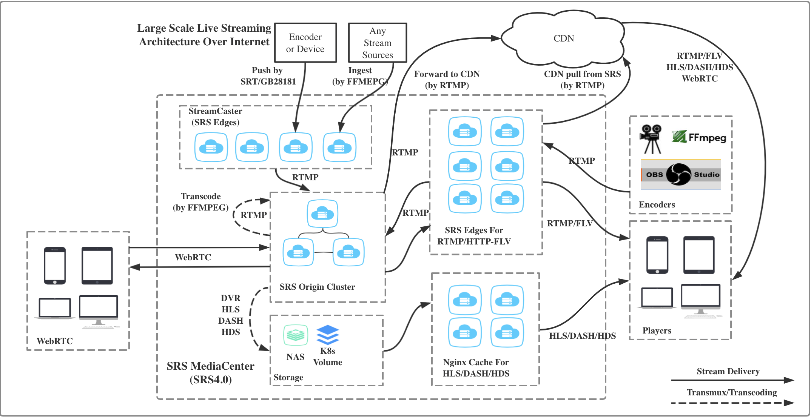

# 配置

使用 systemctl 管理的 srs 服务的配置文件位于`.conf/srs.conf`。

```nginx
# main config for srs.
# @see full.conf for detail config.

# rtmp推/拉流端口
listen              1935;
max_connections     1000;
#srs_log_tank        file;
#srs_log_file        ./objs/srs.log;
daemon              on;
# api配置
http_api {
    enabled         on;
    listen          1985;
}
# http流配置
http_server {
	# 此处关闭即关闭http端口
    enabled         off;
    listen          18080;
    dir             ./objs/nginx/html;
    # https配置
	https{
		enabled on;
		listen 18443;
        key ./conf/server.key;
        cert ./conf/server.crt;
	}
}
rtc_server {
    enabled on;
    listen 8000; # UDP port
    # @see https://github.com/ossrs/srs/wiki/v4_CN_WebRTC#config-candidate
    candidate $CANDIDATE;
}
vhost __defaultVhost__ {
	# hls配置
    hls {
        enabled         on;
    }
    # http-flv配置
    http_remux {
        enabled     on;
        mount       [vhost]/[app]/[stream].flv;
    }
    rtc {
        enabled     on;
        # @see https://github.com/ossrs/srs/wiki/v4_CN_WebRTC#rtmp-to-rtc
        rtmp_to_rtc off;
        # @see https://github.com/ossrs/srs/wiki/v4_CN_WebRTC#rtc-to-rtmp
        rtc_to_rtmp off;
    }
    // http回调配置，回调地址改为https即可回调到https接口
    http_hooks {
        enabled         on;
        # 推流连接
        on_connect      https://192.168.3.106:8443/srs/api/v1/clients;
        on_close        https://192.168.3.106:8443/srs/api/v1/clients;
        # 推流
        on_publish      https://192.168.3.106:8443/srs/api/v1/streams;
        on_unpublish    https://192.168.3.106:8443/srs/api/v1/streams;
        # 播放
        on_play         https://192.168.3.106:8443/srs/api/v1/sessions;
        on_stop         https://192.168.3.106:8443/srs/api/v1/sessions;
    }
}
```

目录中的其他配置文件是其他功能的配置示例，如 rtc、集群等。可以指定配置文件，在一台服务器启动多个 srs 服务，要保证配置文件中的 pid 不重复。

```bash
./objs/srs -c conf/http.flv.live.conf &
```

# 鉴权

可以利用 http callback 功能实现推流、播放鉴权

> 服务器端定制的实现方式，就是HTTP回调。譬如当客户端连接到SRS时，回调指定的http地址，这样可以实现验证功能。
>
> 关于Token认证，即基于http回调的认证，参考：[Token Authentication](https://github.com/ossrs/srs/wiki/v4_CN_DRM#token-authentication)
>
> [v4_CN_HTTPCallback · ossrs/srs Wiki (github.com)](https://github.com/ossrs/srs/wiki/v4_CN_HTTPCallback#https-callback)

接口返回`0`表示鉴权通过，返回其他，如`1`表示失败

##### http 回调消息体

```log
2022-05-06 10:59:35  INFO SrsApiController.clients:21 : {"app":"live","tcUrl":"rtmp://192.168.3.180/live","vhost":"__defaultVhost__","stream":"live3","param":"?token=11350-768715","ip":"192.168.3.106","action":"on_connect","pageUrl":"","server_id":"vid-14a82k7","client_id":"1760y012"}
2022-05-06 10:59:35  INFO SrsApiController.streams:31 : {"app":"live","tcUrl":"rtmp://192.168.3.180/live","vhost":"__defaultVhost__","stream":"live3","param":"?token=11350-768715","ip":"192.168.3.106","action":"on_publish","server_id":"vid-14a82k7","client_id":"1760y012"}
2022-05-06 10:59:36  INFO SrsApiController.streams:31 : {"app":"live","vhost":"__defaultVhost__","stream":"live3","param":"?token=11350-768715","ip":"192.168.3.106","action":"on_unpublish","server_id":"vid-14a82k7","client_id":"1760y012"}
2022-05-06 10:59:36  INFO SrsApiController.clients:21 : {"app":"live","vhost":"__defaultVhost__","recv_bytes":347479,"ip":"192.168.3.106","action":"on_close","server_id":"vid-14a82k7","send_bytes":4166,"client_id":"1760y012"}

2022-05-06 14:33:43  INFO SrsApiController.sessions:147 : [z4398hex] sessions: {"app":"live","vhost":"__defaultVhost__","stream":"97165dd0-2adb-4569-8cdc-c889f5f67b80","param":"","ip":"192.168.3.106","action":"on_play","pageUrl":"","server_id":"vid-14a82k7","client_id":"z4398hex"}
2022-05-06 14:33:43  INFO SrsApiController.sessions:147 : [7smnl29t] sessions: {"app":"live","vhost":"__defaultVhost__","stream":"97165dd0-2adb-4569-8cdc-c889f5f67b80","param":"","ip":"192.168.3.106","action":"on_play","pageUrl":"","server_id":"vid-14a82k7","client_id":"7smnl29t"}

```

# 录制

可以利用 http callback 功能实现~~控制是否录制~~

on_dvr 在完成录制之后回调，因此可以实现获取存储文件位置。

> [v4_CN_DVR · ossrs/srs Wiki (github.com)](https://github.com/ossrs/srs/wiki/v4_CN_DVR)

# 集群

> 关于源站集群的设计参考[Issue#464](https://github.com/ossrs/srs/issues/464#issuecomment-306082751)。 源站集群主要解决大量推流的情况，比如需要推1万路流。
>
> 
>
> **Remark: 源站集群只支持RTMP协议，如果需要HTTP-FLV，可以加一个Edge将RTMP转成HTTP-FLV。**
>
> [Cluster: Origin Cluster for Fault Tolarence and Load Balance, 源站热备和负载均衡集群 · Issue #464 · ossrs/srs (github.com)](https://github.com/ossrs/srs/issues/464#issuecomment-306082751)

> SRS的Edge提供访问时回源机制，在CDN/VDN等流众多的应用场景中有重大意义， forward/ingest方案会造成大量带宽浪费。同时，SRS的Edge能对接所有的RTMP源站服务器， 不像FMS的Edge只能对接FMS源站（有私有协议）；另外，SRS的Edge支持SRS源站的所有逻辑 （譬如转码，转发，HLS，DVR等等），也就是说可以选择在源站切片HLS，也可以直接在 边缘切片HLS。
>
> 备注：Edge一般负载高，SRS支持的并发足够跑满千兆网带宽了。
>
> Edge的主要应用场景：
>
> - CDN/VDN大规模集群，客户众多流众多需要按需回源。
> - 小规模集群，但是流比较多，需要按需回源。
> - 骨干带宽低，边缘服务器强悍，可以使用多层edge，降低上层BGP带宽。
>
> 注意：edge可以从源站拉流，也可以将流转发给源站。也就是说，播放edge上的流时，edge会 回源拉流；推流到edge上时，edge会直接将流转发给源站。
>
> 注意：若只需要中转流给源站，不必用forward，直接使用edge模式即可。可以直接支持推流 和拉流的中转，简单快捷。Forward应用于目标服务器是多个，譬如将一路流主动送给多路服务 器；edge虽然配置了多台服务器，但是只用了一台，有故障时才切换。
>
> 注意：优先使用edge，除非知道必须用forward，才使用forward。
>
> [v1_CN_Edge · ossrs/srs Wiki (github.com)](https://github.com/ossrs/srs/wiki/v1_CN_Edge)

简言之，SRS集群有两种方式，edge（边缘服务器）和 forward

##### edge

edge 的回源机制：edge可以从源站拉流，也可以将流转发给源站。基于转发实现可以向任一源站/边缘服务器推流，从任一源站/边缘拉流播放，而实际上提供服务的服务器只有一台。

##### forward

将流发送多个服务器，造成带宽浪费。Forward应用于目标服务器是多个，譬如将一路流主动送给多路服务器。

# 源站/边缘集群

### 源站（origin）

```nginx
# conf/origin.conf
listen              19351;
max_connections     1000;
pid                 objs/origin.pid;
srs_log_file        ./objs/origin.log;

http_server {
    enabled         on;
    listen          80;
    dir             ./objs/nginx/html;
}

vhost __defaultVhost__ {
}
```

> [v4_CN_SampleRTMPCluster · ossrs/srs Wiki (github.com)](https://github.com/ossrs/srs/wiki/v4_CN_SampleRTMPCluster)

### 源站集群配置

```nginx
http_api {
    enabled         on;
    listen          9090;
}
vhost __defaultVhost__ {
    cluster {
        # The cluster mode, local or remote.
        #       local: It's an origin server, serve streams itself.
        #       remote: It's an edge server, fetch or push stream to origin server.
        # default: local
        mode            local;

        # For origin(mode local) cluster, turn on the cluster.
        # @remark Origin cluster only supports RTMP, use Edge to transmux RTMP to FLV.
        # default: off
        # TODO: FIXME: Support reload.
        origin_cluster      on;

        # For origin (mode local) cluster, the co-worker's HTTP APIs.
        # This origin will connect to co-workers and communicate with them.
        # please read: https://github.com/ossrs/srs/wiki/v4_CN_OriginCluster
        # TODO: FIXME: Support reload.
        coworkers           192.168.3.181:9090;
    }
}
```

> [!TIP]
>
> 集群配置中的 coworkers 指集群中其它源站的 http api 地址，多个地址用空格隔开。因此源站集群必须开启 http api。

> - mode: 集群的模式，对于源站集群，值应该是local。
> - origin_cluster: 是否开启源站集群。
> - coworkers: 源站集群中的其他源站的HTTP API地址。
>
> Remark: 如果流不在本源站，会通过HTTP API查询其他源站是否有流。如果流其他源站，则返回RTMP302重定向请求到该源站。如果所有源站都没有流则返回错误。
>

### 边缘（edge）

```nginx
# conf/edge.conf
listen              19351;
max_connections     1000;
pid                 objs/edge.pid;
srs_log_file        ./objs/edge.log;

http_server {
    enabled         on;
    listen          80;
    dir             ./objs/nginx/html;
}

vhost __defaultVhost__ {
    cluster {
        mode            remote;
        origin          192.168.3.180:19351 192.168.3.181:19351;
    }
}
```

> 推荐在源站集群前面挂一系列的Edge服务器，参考[这里](https://github.com/ossrs/srs/issues/464#issuecomment-366169962)，Edge服务器可以转换协议，支持RTMP和HTTP-FLV，同时支持源站故障时自动切换，不中断客户端。
>
> [v4_CN_OriginCluster · ossrs/srs Wiki (github.com)](https://github.com/ossrs/srs/wiki/v4_CN_OriginCluster)
>
> [Cluster: Origin Cluster for Fault Tolarence and Load Balance, 源站热备和负载均衡集群 · Issue #464 · ossrs/srs (github.com)](https://github.com/ossrs/srs/issues/464#issuecomment-306082751)
>
> [Cluster: Origin Cluster for Fault Tolarence and Load Balance, 源站热备和负载均衡集群 · Issue #464 · ossrs/srs (github.com)](https://github.com/ossrs/srs/issues/464#issuecomment-366169487)
>
> [srs系列九——源站+边缘站集群模式_李王家的翠花的博客-CSDN博客_srs架构](https://blog.csdn.net/liwangcuihua/article/details/114635985)

### 集群效果

- 推流到任一源站，当前源站、任一边缘可播放
- 推流到任一边缘，其中一个源站、任一边缘可播放

> 不要直接播放源站集群的流。
>
> 源站集群一定不能从某个源站，要从边缘拉流
>
> [源站集群，直接从源站拉流会失败 · Issue #2045 · ossrs/srs (github.com)](https://github.com/ossrs/srs/issues/2045)

测试故障切换：

推流到 edge1，回源到了 origin1，从 edge1 和 edge2 均可播放

关闭 origin1 服务器，已经开始直播的不会重新回源到 origin2，只有 edge2 可以播放

新开始直播会回源到 origin2，edge1 和 edge2 均可播放

### 源站集群的负载均衡

配置集群`cluster`或者配置源站的最大连接数

> The origin must be a cluster which know each other, please read [#464](https://github.com/ossrs/srs/issues/464)
> Or, there is a more smple solution: user config the max connection on origin and redirect to next when exceed.
>
> Origin can use RTMP 302, defined by Adobe to let edge to redirect to another origin.
> About the RTMP 302, please read [#369](https://github.com/ossrs/srs/issues/369)
>
> [How to loadbalance on a Origin - Edge configuration? · Issue #482 · ossrs/srs (github.com)](https://github.com/ossrs/srs/issues/482)

### 集群 FLV

edge 集群方式支持 RTMP 和 FLV，在源站和边缘配置`http_server`和`http_remux`即支持 FLV。

```nginx
http_server {
    enabled         on;
    listen          80;
    dir             ./objs/nginx/html;
}

vhost __defaultVhost__ {
    http_remux {
        enabled     on;
        mount       [vhost]/[app]/[stream].flv;
    }
}
```

> [v4_CN_SampleHttpFlvCluster · ossrs/srs Wiki (github.com)](https://github.com/ossrs/srs/wiki/v4_CN_SampleHttpFlvCluster)

### 集群 HLS

非常完整的 HLS 配置介绍：

> [v4_CN_DeliveryHLS · ossrs/srs Wiki (github.com)](https://github.com/ossrs/srs/wiki/v4_CN_DeliveryHLS)

---

> [v4_CN_SampleHlsCluster · ossrs/srs Wiki (github.com)](https://github.com/ossrs/srs/wiki/v4_CN_SampleHlsCluster)

文档描述似乎是不支持上述的 edge 方式集群，而是源站 + nginx边缘方式。这种方式如果源站是集群方式（cluster），不知道 nginx 边缘应该如何配置。

> 如果把边缘的HLS和HTTP-FLV看成一种结构，也就是触发时切片（FLV是停止播放就删除，而HLS可以采用超时），并且HLS可以共享切片（FLV不必共享），那么是没有冲突的，实际上要等所有的客户端（RTMP断开，HLS超时，HTTP-FLV断开）都断开，才认为这个回源应该清理了。
>
> 也就是说，对于RTMP和FLV都可以使用断开，而HLS则是超时作为断开，这样三种分发在边缘就可以统一起来，没有矛盾的了。
>
> 
>
> I named this feature: HLS+.
> Right now, SRS support origin and edge cluster; we can push RTMP to origin, delivery RTMP and HTTP-FLV on edge cluster.
>
> But the HLS is dvr to disk and delivery by HTTP cluster, I think it's possible to remux the HLS on edge server. That is, the HLS+ is delivery HLS on edge server, which remux HLS realtime.
> With HLS+, we can push RTMP to origin, delivery RTMP, HTTP-FLV and HLS on edge server, without any external cluster.
>
> ‎目前，SRS 支持源站和边缘集群；我们可以将 RTMP 推送到源站，在边缘集群上交付 RTMP 和 HTTP-FLV。‎
>
> 但是 HLS 是 dvr 到磁盘并通过 HTTP 集群交付的，我认为可以在边缘服务器上生成 HLS 。也就是说，HLS+ 是在边缘服务器上交付 HLS，它实时重新加载 HLS。‎
>
> ‎借助 HLS+，我们可以将 RTMP 推送到源站，在边缘服务器上交付 RTMP、HTTP-FLV 和 HLS，而无需任何外部群集。‎
>
> [HLS+: Support HLS Edge Cluster, 支持HLS边缘服务器集群 · Issue #466 · ossrs/srs (github.com)](https://github.com/ossrs/srs/issues/466)

在边缘节点配置`http_server`和`hls`，测试可以播放，会在被访问的边缘创建切片。不需要在源站配置，因为 hls 不属于流，而是物理切片，是一种 http 资源，它在边缘实时生成。

```
http_server {
    enabled         on;
    listen          80;
    dir             ./objs/nginx/html;
}

vhost __defaultVhost__ {
    hls {
        enabled         on;
    }
}
```

---

> 边缘集群（Edge Cluster）就是为了解决很多人观看的问题，可以支持非常多的人观看直播流。注意：
>
> - SRS Edge只支持直播流协议，比如RTMP或HTTP-FLV等，参考[RTMP Edge Cluster](https://github.com/ossrs/srs/wiki/v4_CN_SampleRTMPCluster)。
> - SRS Edge不支持HLS或DASH等切片的直播流，本质上它们不是流，就是文件分发。
> - SRS Edge不支持WebRTC的流分发，这不是Edge设计的目标，WebRTC有自己的集群方式，参考[#2091](https://github.com/ossrs/srs/issues/2091)。
>
> 本文描述的就是HLS或DASH等切片的边缘集群，基于NGINX实现，所以也叫NGINX Edge Cluster。
>
> [v4_CN_NginxForHLS · ossrs/srs Wiki (github.com)](https://github.com/ossrs/srs/wiki/v4_CN_NginxForHLS)

貌似SRS 自带的 Edge HLS 只解决了上述的 HLS 集群播放的问题：

> 文档描述似乎是不支持上述的 edge 方式集群，而是源站 + nginx边缘方式。这种方式如果源站是集群方式（cluster），不知道 nginx 边缘应该如何配置。

> 一定不能只配置成纯Proxy，这样会把负载透传到SRS，系统支持的客户端数目，还是SRS支持的数目。
>
> 开启Cache后，无论NGINX多少负载，SRS都只有一个流。这样我们可以扩展多个NGINX，实现支持非常多的观看并发了。
>
> 比如1Mbps的HLS流，1000个客户端播放NGINX，那么NGINX的带宽就是1Gbps，而SRS只有1Mbps。
>
> [v4_CN_NginxForHLS · ossrs/srs Wiki (github.com)](https://github.com/ossrs/srs/wiki/v4_CN_NginxForHLS)、

客户端播放的上限是这个生成 HLS 切片的 edge 服务器的连接数，要解决大量分发的问题，仍然需要使用 nginx 的缓存和反向代理（带有缓存的反向代理）。即在 edge 外部再配置 nginx edge 集群？

### 最终集群效果

集群下推流/播放测试情况：

- RTMP 推流到任一源站，当前源站、任一边缘可 RTMP/FLV/HLS 播放
- RTMP 推流到任一边缘，其中一个源站、任一边缘可 RTMP/FLV/HLS 播放

基本上实现了集群的初步使用，可以 RTMP 推流到任一服务器，使用任一边缘播放。

### TODO

- 源站集群的故障切换，上文测试发现直播中的流不会自动切换，仅有新直播的流会切换；
- 用于大量 hls 分发的 nginx edge 集群；
- 推流/播放鉴权，集群下 http callback 在源站和边缘的回调情况，hls 是否仅在边缘回调；若在 edge 外部配置 nginx edge 集群，怎样处理鉴权问题；

# 问题

### defaultVhost

当 vhost 没有匹配到时，将会使用`__defaultVhost__`

> [RTMP的URL/Vhost规则_幽雨雨幽的博客-CSDN博客_rtmp url](https://blog.csdn.net/ai2000ai/article/details/72771461)

### 如果已配置 defaultVhost，仍报错 no vhost

检查配置文件是否有误，例如配置项后没有写分号

# 各种问题

> [FAQ: Never file an issue unless read it 提新Issue前必看，否则会被删除 · Issue #2716 · ossrs/srs (github.com)](https://github.com/ossrs/srs/issues/2716)