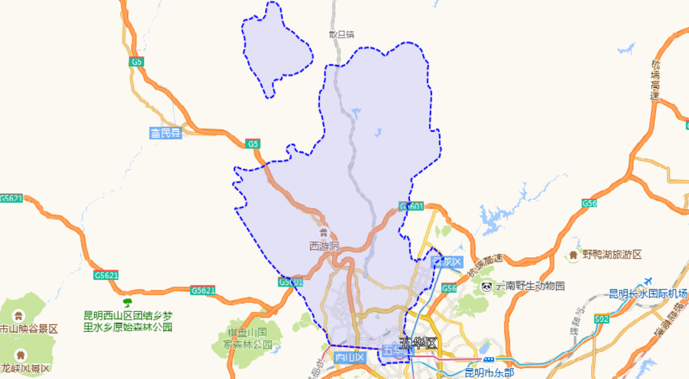
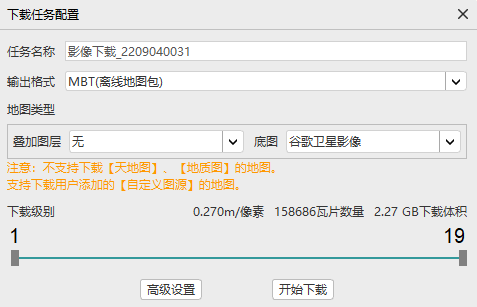
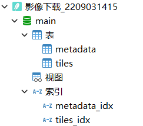
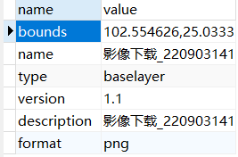
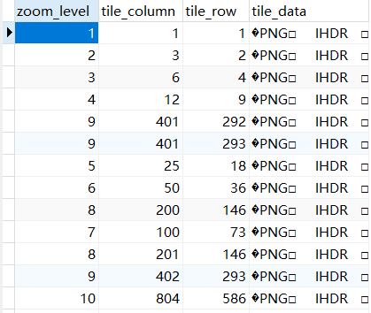

# MBTiles 地图服务

> # MBTiles Specification
>
> MBTiles is a specification for storing arbitrary tiled map data in [SQLite](http://sqlite.org/) databases for immediate usage and for efficient transfer. MBTiles files, known as **tilesets**, must implement the specification below to ensure compatibility with devices.
>
> # Versions
>
> - [1.3](https://github.com/mapbox/mbtiles-spec/blob/master/1.3/spec.md)
> - [1.2](https://github.com/mapbox/mbtiles-spec/blob/master/1.2/spec.md)
> - [1.1](https://github.com/mapbox/mbtiles-spec/blob/master/1.1/spec.md)
> - [1.0](https://github.com/mapbox/mbtiles-spec/blob/master/1.0/spec.md)
>
> # Concept
>
> MBTiles is a compact, restrictive specification. It supports only tiled data, including vector or image tiles and interactivity grid tiles. Only the Spherical Mercator projection is supported for presentation (tile display), and only latitude-longitude coordinates are supported for metadata such as bounds and centers.
>
> It is a minimum specification, only specifying the ways in which data must be retrievable. Thus MBTiles files can internally compress and optimize data, and construct views that adhere to the MBTiles specification.
>
> Unlike [Spatialite](http://www.gaia-gis.it/spatialite/), GeoJSON, and Rasterlite, MBTiles is not raw data storage. It is storage for tiled data, like rendered map tiles.
>
> One MBTiles file represents a single tileset, optionally including grids of interactivity data. Multiple tilesets (layers, or maps in other terms) can be represented by multiple MBTiles files.
>
> ## UTFGrid
>
> The MBTiles specification previously contained the [UTFGrid specification](https://github.com/mapbox/utfgrid-spec). It was removed in version 1.2 and moved into its own specification with synced version numbers, so MBTiles 1.2 is compatible with UTFGrid 1.2. The specs integrate but do not require each other for compliance.
>
> 
>
> # MBTiles Specification
>
> MBTiles 是一种规范，用于在 [SQLite](http://sqlite.org/) 数据库中存储任意平铺地图数据，以便立即使用和高效传输。MBTiles 文件（称为**切片集**）必须实现以下规范，以确保与设备的兼容性。
>
> # 版本
>
> - [1.3](https://github.com/mapbox/mbtiles-spec/blob/master/1.3/spec.md)
> - [1.2](https://github.com/mapbox/mbtiles-spec/blob/master/1.2/spec.md)
> - [1.1](https://github.com/mapbox/mbtiles-spec/blob/master/1.1/spec.md)
> - [1.0](https://github.com/mapbox/mbtiles-spec/blob/master/1.0/spec.md)
>
> # 概念
>
> MBTiles 是一个紧凑的限制性规范。它仅支持切片数据，包括矢量或图像切片以及交互性网格切片。仅支持球面墨卡托投影进行表示（切片显示），仅支持纬度-经度坐标用于元数据（如边界和中心）。
>
> 它是一个最低规范，仅指定必须检索数据的方式。因此，MBTiles 文件可以在内部压缩和优化数据，并构造符合 MBTiles 规范的视图。
>
> 与 [Spatialite](http://www.gaia-gis.it/spatialite/)、GeoJSON 和 Rasterlite 不同，MBTiles 不是原始数据存储。它是切片数据的存储，例如渲染的地图切片。
>
> 一个 MBTiles 文件表示单个切片集，可以选择包括交互数据的网格。多个切片集（图层或其他术语中的地图）可由多个 MBTiles 文件表示。
>
> ## UTFGrid
>
> MBTiles 规范以前包含 [UTFGrid 规范](https://github.com/mapbox/utfgrid-spec)。它在版本1.2中被删除，并移动到自己的规范中，具有同步的版本号，因此MBTiles 1.2与UTFGrid 1.2兼容。这些规范集成，但不需要彼此兼容。
>
> [studentdsx/mbtiles-spec: specification documents for the MBTiles tileset format (github.com)](https://github.com/studentdsx/mbtiles-spec)

# 下载 MBTiles

下载[图新地球 LSV_高清卫星地图_卫星影像_DEM下载_国产谷歌地球_天地图_GIS数据应用处理_图新地球 4 (tuxingis.com)](http://www.tuxingis.com/locaspace.html)，默认的天地图数据不支持下载，但支持自定义图源数据下载。

自定义图源：

> [【白嫖福利】离线地图瓦片下载，一键发布服务实现共享，WebGIS神技_哔哩哔哩_bilibili](https://www.bilibili.com/video/BV1mQ4y1m7d7/?spm_id_from=333.788&vd_source=cfbed4eef00e94f603d6faffccca7c03)
>
> [谷歌卫星影像、地形、矢量、专题图下载神器+100余个图源_哔哩哔哩_bilibili](https://www.bilibili.com/video/av379364101?vd_source=cfbed4eef00e94f603d6faffccca7c03)

将下载的图源复制到`LocaSpaceViewer 4 (64位)\LocaSpaceViewer4\Resource\Layer`下


重新打开软件，可以在`底图数据`tab看到导入的图源


选择图源后出现在左侧的`场景数据`中，勾选图源，可以在右侧看到加载的地图数据。

---

在左侧`搜索-地名搜索`中，勾选`高德`，输入区域名称，如“五华区”，点击搜索，右侧地图中该区域会被选中



点击`底图数据 - 数据下载 - 影像/地图`，弹出窗口中点击`选择面`，鼠标点击地图中选中的区域

在弹出窗口中选择输出格式为`MBT`，选择底图，调整要下载的缩放级别，后即可开始下载



下载完成后，地图数据为一个`.mbtiles`文件，可以直接在 sqlite 中打开，不需要用户名密码。







对应`XYZ`方式，`z`为 zoom_level（缩放级别）、`x`为 tile_row（行号）、`y`为 tile_column（列号）。

# 使用 .mbtiles 文件创建地图服务

看起来`.mbtiles`文件结构挺简单的，就是根据`z`、`x`、`y`查询数据，返回图片，怎么找个服务器这么难捏:dog:

> # light-mbtiles-server
>
> 一个极其轻量的，MBTiles矢量&栅格瓦片地图数据发布服务器，支持pbf、jpg/jpeg、png格式瓦片。并且提供北京市矢量数据，中国4-10级影像数据，全球影像数据的mbtiles格式下载。
>
> #### **load data**
>
> 下载地图和影像数据后放置在mbtiles文件夹下，数据下载地址：| you should downloaded the map and image data are placed under the mbtiles folder, download address:
>
> [felix0917/light-mbtiles-server: 一个极其轻量的MBTiles矢量&栅格瓦片地图数据发布服务器。 (github.com)](https://github.com/felix0917/light-mbtiles-server)

将下载的`.mbtiles`文件放入`mbtiles`文件夹中，最好重命名一下，如`wuhua.mbtiles`

```bash
npm install
npm run start
```

访问瓦片数据测试，浏览器访问 http://127.0.0.1:3000/wuhua/1/1/0.png

> [!NOTE]
>
> 一开始对`z`、`x`、`y`具体不太了解，访问不到找了半天原因，最后看了下代码，`y`的构成方式为：
>
> ```javascript
> // Flip Y coordinate because MBTiles files are TMS.
> y = (1 << z) - 1 - y;
> ```
>
> 所以要使最后`z`、`x`、`y`都为1（因为我下载了1级瓦片），应该分别传1、1、0。

### 疑难问题

`npm install`