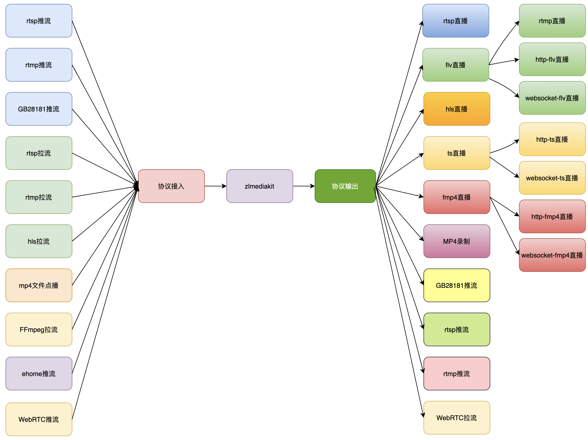

# Ubuntu 安装

> ## 项目特点
>
> - 基于C++11开发，避免使用裸指针，代码稳定可靠，性能优越。
> - 支持多种协议(RTSP/RTMP/HLS/HTTP-FLV/WebSocket-FLV/GB28181/HTTP-TS/WebSocket-TS/HTTP-fMP4/WebSocket-fMP4/MP4/WebRTC),支持协议互转。
> - 使用多路复用/多线程/异步网络IO模式开发，并发性能优越，支持海量客户端连接。
> - 代码经过长期大量的稳定性、性能测试，已经在线上商用验证已久。
> - 支持linux、macos、ios、android、windows全平台。
> - 支持画面秒开、极低延时([500毫秒内，最低可达100毫秒](https://github.com/ZLMediaKit/ZLMediaKit/wiki/延时测试))。
> - 提供完善的标准[C API](https://github.com/ZLMediaKit/ZLMediaKit/tree/master/api/include),可以作SDK用，或供其他语言调用。
> - 提供完整的[MediaServer](https://github.com/ZLMediaKit/ZLMediaKit/tree/master/server)服务器，可以免开发直接部署为商用服务器。
> - 提供完善的[restful api](https://github.com/ZLMediaKit/ZLMediaKit/wiki/MediaServer支持的HTTP-API)以及[web hook](https://github.com/ZLMediaKit/ZLMediaKit/wiki/MediaServer支持的HTTP-HOOK-API)，支持丰富的业务逻辑。
> - 打通了视频监控协议栈与直播协议栈，对RTSP/RTMP支持都很完善。
> - 全面支持H265/H264/AAC/G711/OPUS。
> - 功能完善，支持集群、按需转协议、按需推拉流、先播后推、断连续推等功能。
> - 极致性能，单机10W级别播放器，100Gb/s级别io带宽能力。
> - 极致体验，[独家特性](https://github.com/ZLMediaKit/ZLMediaKit/wiki/ZLMediakit独家特性介绍)
> - [谁在使用zlmediakit?](https://github.com/ZLMediaKit/ZLMediaKit/issues/511)
> - 全面支持ipv6网络
>
> ## 项目定位
>
> - 移动嵌入式跨平台流媒体解决方案。
> - 商用级流媒体服务器。
> - 网络编程二次开发SDK。
>
> 
>
> [ZLMediaKit/ZLMediaKit: WebRTC/RTSP/RTMP/HTTP/HLS/HTTP-FLV/WebSocket-FLV/HTTP-TS/HTTP-fMP4/WebSocket-TS/WebSocket-fMP4/GB28181/SRT server and client framework based on C++11 (github.com)](https://github.com/ZLMediaKit/ZLMediaKit)
>
> [快速开始 · ZLMediaKit/ZLMediaKit Wiki (github.com)](https://github.com/ZLMediaKit/ZLMediaKit/wiki/快速开始)

功能较 SRS 是要强大的，除了 rtmp/webrtc 推拉流、flv/hls 流分发、集群外，还支持了 rtsp、更多的分发协议格式、mp4 点播、gb28181 sip 协议推流、拉流代理等功能。

开始安装之前设置静态IP、更换国内镜像源、更新软件

# 安装

```bash
#国内用户推荐从同步镜像网站gitee下载 
git clone --depth 1 https://gitee.com/xia-chu/ZLMediaKit
cd ZLMediaKit
#千万不要忘记执行这句命令
git submodule update --init

# 安装编译器
sudo apt-get install build-essential
sudo apt-get install cmake

# 安装依赖
sudo apt-get install libssl-dev
sudo apt-get install libsdl-dev
sudo apt-get install libavcodec-dev
sudo apt-get install libavutil-dev
sudo apt-get install ffmpeg

# 构建和编译项目
cd ZLMediaKit
mkdir build
cd build
#macOS下可能需要这样指定openss路径：cmake .. -DOPENSSL_ROOT_DIR=/usr/local/Cellar/openssl/1.0.2j/
cmake ..
make -j4

# 运行
cd ZLMediaKit/release/linux/Debug
#通过-h可以了解启动参数
./MediaServer -h
#以守护进程模式启动
./MediaServer -d &
```

> [!TIP]
>
> 在 ubuntu 会遇到非 root 用户无法使用 1024 一下端口的问题，可将`MediaServer`所有者设为 root，并授予`u+s`权限（执行文件时临时获得 root 权限）。
>
> ```bash
> sudo chown root MediaServer
> sudo chmod u+s MediaServer
> ```

# 测试

查看配置文件：[ZLMediaKit/config.ini at master · ZLMediaKit/ZLMediaKit (github.com)](https://github.com/zlmediakit/ZLMediaKit/blob/master/conf/config.ini)

> ```bash
> #!!!!此配置文件为范例配置文件，意在告诉读者，各个配置项的具体含义和作用，
> #!!!!该配置文件在执行cmake时，会拷贝至release/${操作系统类型}/${编译类型}(例如release/linux/Debug) 文件夹。
> #!!!!该文件夹(release/${操作系统类型}/${编译类型})同时也是可执行程序生成目标路径，在执行MediaServer进程时，它会默认加载同目录下的config.ini文件作为配置文件，
> #!!!!你如果修改此范例配置文件(conf/config.ini)，并不会被MediaServer进程加载，因为MediaServer进程默认加载的是release/${操作系统类型}/${编译类型}/config.ini。
> #!!!!当然，你每次执行cmake，该文件确实会被拷贝至release/${操作系统类型}/${编译类型}/config.ini，
> #!!!!但是一般建议你直接修改release/${操作系统类型}/${编译类型}/config.ini文件，修改此文件一般不起作用,除非你运行MediaServer时使用-c参数指定到此文件。
> ```
>
> 意思就是源码中 /conf/config.ini 仅供参考，编译时会复制到 release 目录，所以要改就改 release/${操作系统类型}/${编译类型}/config.ini

在配置文件中可以看到：

`[api].secret`：用于调用[MediaServer支持的HTTP API · ZLMediaKit/ZLMediaKit Wiki (github.com)](https://github.com/ZLMediaKit/ZLMediaKit/wiki/MediaServer支持的HTTP-API)的校验参数

`[general].mediaServerId`：服务器唯一id，用于触发hook时区别是哪台服务器，比如 wvp 中配置 ZLM 服务器

各种协议的 port：http api、推拉流端口。（http api 和 http 拉流端口是同一个）

---

> 测试参考的文档：
>
> [ZLMediaKit推流测试 · ZLMediaKit/ZLMediaKit Wiki (github.com)](https://github.com/ZLMediaKit/ZLMediaKit/wiki/ZLMediaKit推流测试)
>
> [播放url规则 · ZLMediaKit/ZLMediaKit Wiki (github.com)](https://github.com/ZLMediaKit/ZLMediaKit/wiki/播放url规则)
>
> 以`rtsp://somedomain.com:554/live/0?token=abcdefg&field=value`为例,该url分为以下几个部分：
>
> - `协议(scheam)` : rtsp协议,默认端口554
> - `虚拟主机(vhost)` : somedomain.com,该字段既可以是域名也可以是ip，如果是ip则对应的虚拟主机为`__defaultVhost__`
> - `服务端口号(port)` : 554,如果不指定端口号，则使用协议默认端口号
> - `应用名(app)` : live
> - `流ID(streamid)` : 0
> - `参数(args)` : token=abcdefg&field=value

流分发的格式为：

```
# flv
https://xxx/app/streamid.live.flv
# hls
https://xxx/app/streamid/hls.m3u8
```

> [播放url规则 · ZLMediaKit/ZLMediaKit Wiki (github.com)](https://github.com/ZLMediaKit/ZLMediaKit/wiki/播放url规则)

### 推流分发

OBS 或者 ffmpeg 推流到

```bash
rtmp://192.168.3.208/live/live1
```

播放：

```bash
rtmp://192.168.3.208/live/live1
rtsp://192.168.3.208/live/live1
http://192.168.3.208/live/live1.live.flv
https://192.168.3.208/live/live1.live.flv
http://192.168.3.208/live/live1/hls.flv
https://192.168.3.208/live/live1/hls.flv
```

### 拉流代理测试

> ### 12、`/index/api/addStreamProxy`
>
> - 功能：动态添加rtsp/rtmp/hls拉流代理(只支持H264/H265/aac/G711负载)
> - 范例：[http://127.0.0.1/index/api/addStreamProxy?vhost=`__defaultVhost__`&app=proxy&stream=0&url=rtmp://live.hkstv.hk.lxdns.com/live/hks2](http://127.0.0.1/index/api/addStreamProxy?vhost=__defaultVhost__&app=proxy&stream=0&url=rtmp://live.hkstv.hk.lxdns.com/live/hks2)
> - 参数：
>
> | 参数             | 参数类型 | 释意                                                         | 是否必选 |
> | ---------------- | -------- | ------------------------------------------------------------ | -------- |
> | secret           | `string` | api操作密钥(配置文件配置)，如果操作ip是127.0.0.1，则不需要此参数 | Y        |
> | vhost            | `string` | 添加的流的虚拟主机，例如`__defaultVhost__`                   | Y        |
> | app              | `string` | 添加的流的应用名，例如live                                   | Y        |
> | stream           | `string` | 添加的流的id名，例如test                                     | Y        |
> | url              | `string` | 拉流地址，例如rtmp://live.hkstv.hk.lxdns.com/live/hks2       | Y        |
> | retry_count      | `int`    | 拉流重试次数，默认为-1无限重试                               | N        |
> | rtp_type         | `int`    | rtsp拉流时，拉流方式，0：tcp，1：udp，2：组播                | N        |
> | timeout_sec      | `int`    | 拉流超时时间，单位秒，float类型                              | N        |
> | `enable_hls`     | `0/1`    | 是否转换成hls协议                                            | N        |
> | `enable_mp4`     | `0/1`    | 是否允许mp4录制                                              | N        |
> | `enable_rtsp`    | `0/1`    | 是否转rtsp协议                                               | N        |
> | `enable_rtmp`    | `0/1`    | 是否转rtmp/flv协议                                           | N        |
> | `enable_ts`      | `0/1`    | 是否转http-ts/ws-ts协议                                      | N        |
> | `enable_fmp4`    | `0/1`    | 是否转http-fmp4/ws-fmp4协议                                  | N        |
> | `enable_audio`   | `0/1`    | 转协议时是否开启音频                                         | N        |
> | `add_mute_audio` | `0/1`    | 转协议时，无音频是否添加静音aac音频                          | N        |
> | `mp4_save_path`  | `string` | mp4录制文件保存根目录，置空使用默认                          | N        |
> | `mp4_max_second` | `int`    | mp4录制切片大小，单位秒                                      | N        |
> | `hls_save_path`  | `string` | hls文件保存保存根目录，置空使用默认                          | N        |
>
> - 响应：
>
>   ```json
>   {
>      "code" : 0,
>      "data" : {
>         "key" : "__defaultVhost__/proxy/0"  # 流的唯一标识
>      }
>   }
>   ```
> 
> [MediaServer支持的HTTP API · ZLMediaKit/ZLMediaKit Wiki (github.com)](https://github.com/ZLMediaKit/ZLMediaKit/wiki/MediaServer支持的HTTP-API#12indexapiaddstreamproxy)

使用 ZLM 的分发功能或者其他流媒体服务器分发一个流出来，如`rtmp://192.168.3.200/live/live1`

postman post 测试：

http://192.168.3.208/index/api/addStreamProxy?vhost=__defaultVhost__&app=proxy&stream=live1&url=rtmp://192.168.3.200/live/live1

然后 vlc 播放`proxy/live1`的 rtmp/rtsp/hls/flv 等多种协议格式的流测试。

# webrtc

ZLM 默认不包含 webrtc，需要自行编译加入。

##### openssl 安装 (openssl版本要求1.1以上)

```bash
wget https://www.openssl.org/source/openssl-1.1.1k.tar.gz
tar -xvzf openssl-1.1.1k.tar.gz
yum install -y zlib zlib-devel perl-CPAN
./config shared --openssldir=/usr/local/openssl --prefix=/usr/local/openssl
make && make install
sudo ln -s /usr/local/lib/libssl.so.1.1 /usr/lib/libssl.so.1.1
sudo ln -s /usr/local/lib/libcrypto.so.1.1 /usr/lib/libcrypto.so.1.1

ln -s /usr/local/openssl/bin/openssl  /usr/local/bin/openssl # 替换系统openssl，非必须
openssl version -a
```

##### libsrtp安装

```bash
tar -xvzf libsrtp-2.3.0.tar.gz
cd libsrtp-2.3.0
./configure --enable-openssl --with-openssl-dir=/usr/local/openssl
make -j8 && make install
```

##### 编译

```bash
#国内用户推荐从同步镜像网站gitee下载 
git clone --depth 1 https://gitee.com/xia-chu/ZLMediaKit
cd ZLMediaKit
#千万不要忘记执行这句命令
git submodule update --init

mkdir build
cd build
cmake .. -DENABLE_WEBRTC=true  -DOPENSSL_ROOT_DIR=/usr/local/openssl  -DOPENSSL_LIBRARIES=/usr/local/openssl/lib
cmake --build . --target MediaServer
```

##### 修改配置文件

```properties
[rtc]
#rtc播放推流、播放超时时间
timeoutSec=15
#本机对rtc客户端的可见ip，作为服务器时一般为公网ip，置空时，会自动获取网卡ip
externIP=192.168.3.208
#rtc udp服务器监听端口号，所有rtc客户端将通过该端口传输stun/dtls/srtp/srtcp数据，
#该端口是多线程的，同时支持客户端网络切换导致的连接迁移
#需要注意的是，如果服务器在nat内，需要做端口映射时，必须确保外网映射端口跟该端口一致
port=8000
#设置remb比特率，非0时关闭twcc并开启remb。该设置在rtc推流时有效，可以控制推流画质
rembBitRate=1000000
```

> [zlm启用webrtc编译指南 · ZLMediaKit/ZLMediaKit Wiki (github.com)](https://github.com/ZLMediaKit/ZLMediaKit/wiki/zlm启用webrtc编译指南)
>
> [ZLMediaKit webRTC编译与测试_一只海星的博客-CSDN博客_webrtc zlmedia](https://blog.csdn.net/haysonzeng/article/details/116754065)

##### 测试页

```
https://192.168.3.208/
```

测试发现，ZLM 对 webrtc 支持多条音轨，例如屏幕分享时，既添加电脑音轨，又添加麦克风音轨，且转换的 rtmp/flv 等流中也包含了所有音轨（不确定是否一条音轨）。而 srs 采用这种方式会报错（push API 400）。

```javascript
// 屏幕和电脑声音
var stream = await navigator.mediaDevices.getDisplayMedia({
    audio: true,
    video: {
        width: {ideal: 1920, max: 1920},
        height: {ideal: 1080, max: 1080}
    }
});
$.each(stream.getTracks(), function(i, v){
    peerConnection.addTrack(v);
});

// 麦克风
let streamMicroPhone = await navigator.mediaDevices.getUserMedia({ video: false, audio: true })
streamMicroPhone.getTracks().forEach(track => {
    peerConnection.addTrack(track);
})
```

> [webrtc 浏览器启用麦克风将其当做 audio track 传给对方 | Zach Ke's Notes (kebingzao.com)](https://kebingzao.com/2022/07/04/webrtc-add-microPhone-track/)

### webrtc 断线重连

一直有疑惑 webrtc 断线怎么重连，直到看到这个：

> 参考这个：https://developer.mozilla.org/en-US/docs/Web/API/WebRTC_API/Session_lifetime#ICE_restart
>
> ICE重启
> 有时，在WebRTC会话的生命周期中，网络状况会发生变化。例如，其中一个用户可能会从蜂窝网络过渡到WiFi网络，或者网络可能会拥塞。发生这种情况时，ICE代理可能会选择执行ICE重新启动。这是网络连接重新协商的过程，与初始ICE协商执行的方式完全相同，但有一个例外：媒体继续在原始网络连接上流动，直到新的网络连接启动并运行。然后媒体转移到新的网络连接，旧的关闭。
>
> 不同的浏览器在不同的条件下支持ICE重启。例如，由于网络拥塞，并非所有浏览器都会执行ICE重启。
>
> 有两个级别的ICE重新启动：完全ICE重新启动会导致会话中的所有媒体流重新协商。部分ICE重新启动允许ICE重新协商特定媒体流，而不是一次性重新谈判所有媒体流。但是，有些浏览器还不支持部分ICE重启。 <<<你如何触发每个？>>>
>
> 如果您需要以某种方式更改连接的配置（例如更改为不同的ICE服务器集），则可以在重新启动ICE之前通过使用更新的RTCConfiguration字典调用RTCPeerConnection.setConfiguration（）来重新启动ICE之前完成此操作。
>
> 要显式触发ICE重新启动，只需调用RTCPeerConnection.createOffer（），指定iceRestart选项的值为true，即可启动协商过程。然后像以往一样处理连接过程。
>
> [DataChannel断网重连 · Issue #3 · JumpingYang001/webrtc (github.com)](https://github.com/JumpingYang001/webrtc/issues/3#issuecomment-388746806)

> [@Janron](https://github.com/Janron) , 你可以试下这个demo：https://webrtc.github.io/samples/src/content/peerconnection/restart-ice/
> 如果demo没问题，那就是你的代码写得有问题。
> 如果demo有问题，那可能是bug，类似这个：[webrtc/samples#863](https://github.com/webrtc/samples/issues/863)
>
> [DataChannel断网重连 · Issue #3 · JumpingYang001/webrtc (github.com)](https://github.com/JumpingYang001/webrtc/issues/3#issuecomment-396118501)

简单说是通过 ICE 重启导致会话中的所有媒体流重新协商，达到重连的目的。

- 隐式：使用更新的RTCConfiguration字典调用`RTCPeerConnection.setConfiguration()`
- 显式：调用`RTCPeerConnection.createOffer()`，指定iceRestart选项的值为true，然后像以往一样处理连接过程

大佬的 demo 中重启 ICE 的核心代码：

```javascript
offerOptions.iceRestart = true;
pc1.createOffer(offerOptions).then(onCreateOfferSuccess, onCreateSessionDescriptionError);
```

Android 代码：

```java
// 显示
MediaConstraints cons = new MediaConstraints();
if(isRestart){
    cons.mandatory.add(new MediaConstraints.KeyValuePair("IceRestart", "true"));
}
// 创建offer
peerConnection.createOffer(new SdpObserver() {...}, cons);
```

使用 Android 向 ZLM 服务器 webrtc 推流，在 web 端播放观看，ICE 状态为：

```log
D/peer: remote onSignalingChange "STABLE"
D/peer: remote onIceGatheringChange "GATHERING"
D/peer: remote onIceCandidate {"adapterType":"UNKNOWN"...
D/peer: remote onIceCandidate {"adapterType":"UNKNOWN"...
D/peer: remote onIceCandidate {"adapterType":"UNKNOWN"...
D/peer: remote onIceCandidate {"adapterType":"UNKNOWN"...
D/answer setRemoteSDP: onSetSuccess
D/peer: remote onIceConnectionChange "CONNECTED"
D/peer: remote onIceGatheringChange "COMPLETE"
```

断开 wifi 后立即重新打开，大概2s后

```log
D/peer: remote onIceConnectionChange "DISCONNECTED"
```

再过几秒

```log
2022-10-12 17:33:53.430 8260-8348/com.chunshu.srstest D/peer: remote onIceConnectionChange "FAILED"
```

测试在`DISCONNECTED`时，显式重启 ICE，播放端可以继续播放，即重连成功

```log
D/peer: remote onIceGatheringChange "GATHERING"
D/peer: remote onIceCandidate {"adapterType":"UNKNOWN","sdp":"candidate:1489091541 1 udp 2122260223 192.168.3.213 40859 typ host generation 4 ufrag Yq0W network-id 3 network-cost 10","sdpMLineIndex":0,"sdpMid":"0","serverUrl":""}
D/peer: remote onIceCandidate {"adapterType":"UNKNOWN","sdp":"candidate:1510613869 1 udp 2122129151 127.0.0.1 45311 typ host generation 4 ufrag Yq0W network-id 1","sdpMLineIndex":0,"sdpMid":"0","serverUrl":""}
D/peer: remote onIceGatheringChange "COMPLETE"
D/peer: remote onIceConnectionChange "COMPLETED"
```

在`FAILED`时，显式重启 ICE，播放端不会继续播放，也会打印以上日志，但后面陆续打印`DISCONNECTED`、`FAILED`。

猜想推流与点对点连接不一样的是对端的等待时间，长时间未重连上，服务端已经关闭了连接？

猜想一种重连思路：`DISCONNECTED`时立马重启 ICE，`FAILED`时重新创建会话

##### 其他问题

> [重新连接WebRTC对等连接的正确步骤？ - 问答 - 腾讯云开发者社区-腾讯云 (tencent.com)](https://cloud.tencent.com/developer/ask/sof/211797)

