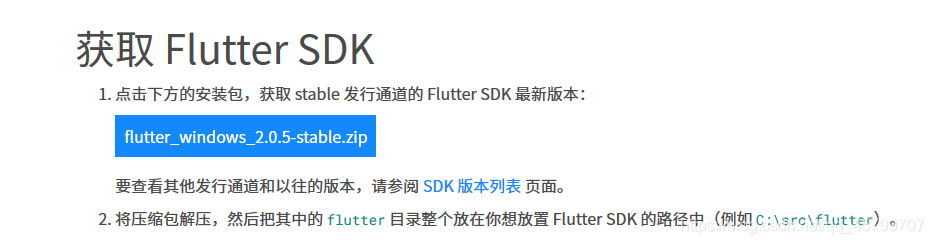
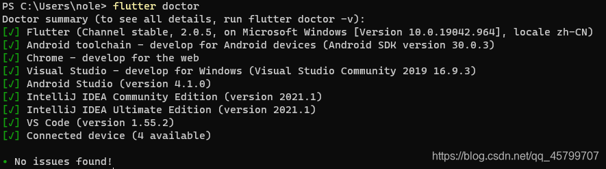

# bujuan

> 一个支持Android、iOS、MacOS、Windows、Linux的三方播放器。

# 环境搭建

### Flutter

首先进入下载地址下载最新的 FlutterSDK：[Flutter 下载地址](https://flutter.cn/docs/get-started/install/windows)


解压存放。

##### 添加镜像以及环境变量

添加镜像

右击 此电脑->属性->高级系统设置->环境变量
在 用户变量 新建两个变量

```
变量名：FLUTTER_STORAGE_BASE_URL
变量值：https://storage.flutter-io.cn
变量名：PUB_HOSTED_URL
变量值：https://pub.flutter-io.cn
```

path 变量中添加`flutter/bin`

##### 检查 Flutter 环境

运行 flutter doctor 命令



首次运行可能会有几个叉号，一般是没装 chrome ，Android studio或者VScode没装插件或者没同意安卓sdk那个协议导致的，比如

- Android Studio SDK Manager 中，安装SDK 和 cmdLine-tool，取消勾选`Hide Obsolete Packages`，就可以看到还没有安装的组件。注意不要用代理，以为代理上不了`dl.google.com`，导致一直加载不出来。
- VS 安装 Rust 就会自动安装。

### Rust

下载Rust：[Rust 程序设计语言 (rust-lang.org)](https://www.rust-lang.org/zh-CN/)，一直下一步，它最终会安装 Windows SDK 和 VS。

### Flutter Rust Bridge

> [Quickstart | flutter_rust_bridge (cjycode.com)](https://cjycode.com/flutter_rust_bridge/quickstart)

```bash
cargo install flutter_rust_bridge_codegen
```

# 打包


```bash
flutter build apk --release
```


### rust 使用国内镜像

在 `$HOME/.cargo/config.toml` （没有则新建）添加以下内容：

```
source.crates-io]
replace-with = 'ustc'

[source.ustc]
registry = "git://mirrors.ustc.edu.cn/crates.io-index"
```

重新打包可能会在`Updating ustc index`卡很久，耐心等待就好

### 打包卡在`blocking waiting for lock file...`

删除`$HOME/.cargo/.package-cache`

### rustup 镜像环境变量

```
# 清华大学
RUSTUP_DIST_SERVER=https://mirrors.tuna.tsinghua.edu.cn/rustup

# 中国科学技术大学
RUSTUP_DIST_SERVER=https://mirrors.ustc.edu.cn/rust-static
RUSTUP_UPDATE_ROOT=https://mirrors.ustc.edu.cn/rust-static/rustup

# 上海交通大学
RUSTUP_DIST_SERVER=https://mirrors.sjtug.sjtu.edu.cn/rust-static/
```

> [Rust Rustup cargo配置国内镜像源 - 简书 (jianshu.com)](https://www.jianshu.com/p/876b1cca26d8)

用于

```
rustup target add armv7-linux-androideabi
rustup target install armv7-linux-androideabi
```

打包中途报错：

```
error[E0463]: can't find crate for `core`
  |
  = note: the `armv7-linux-androideabi` target may not be installed
  = help: consider downloading the target with `rustup target add armv7-linux-androideabi`
  = help: consider building the standard library from source with `cargo build -Zbuild-std`
```

```
Some errors have detailed explanations: E0405, E0408, E0412, E0425, E0432, E0463, E0531.
error: could not compile `once_cell` due to 235 previous errors
note: If the build failed due to a missing target, you can run this command:
note:
note:     rustup target install armv7-linux-androideabi
```

