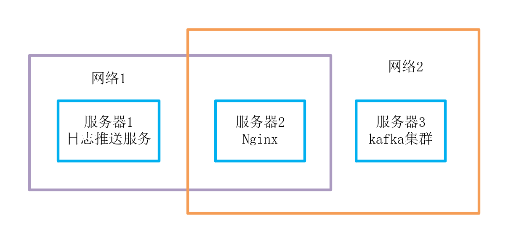
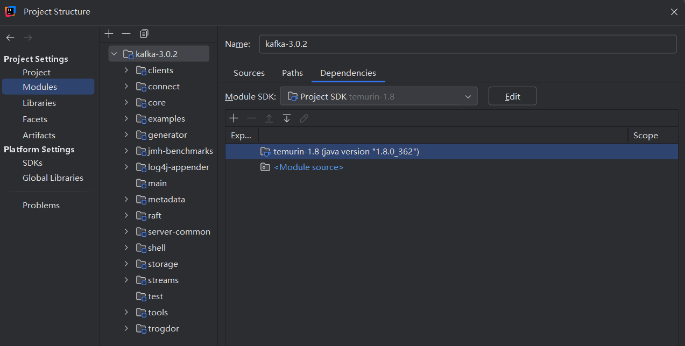

# Kafka Clients 代理

需求：网络1和2之间不互通，要从服务器1推送日志到到服务器3

不可抗力:dog:：

- 由于服务器1为生产环境应用服务器，日志不对外开放，所以日志推送服务只能部署在服务器1，且不可以通网络2
- 服务器3为审计部门系统，所以配置不可更改

方案：新加了一台通两个网络的服务器2，部署 nginx，反向代理 kafka 集群。正常来说，kafka 基于 tcp 通信，nginx 也支持 tcp 代理，图示结构应该没有问题。



**but**，众所周知，kafka 生产者客户端与 kafka 集群的交互过程为：

1. **配置和初始化**：
   - 生产者客户端通过配置参数（如 `bootstrap.servers`、`key.serializer`、`value.serializer` 等）进行初始化。
   - `bootstrap.servers` 提供了 Kafka 集群中初始的 broker 列表，用于建立连接。
2. **建立连接**：
   - 生产者客户端使用提供的配置参数创建与 Kafka 集群的连接。
   - 它首先连接到 `bootstrap.servers` 列表中的一个 broker。
3. **获取元数据**：
   - 生产者客户端发送元数据请求（`MetadataRequest`）到已连接的 broker。
   - 元数据请求返回集群中所有 broker 的信息，包括它们的主机和端口，以及所有主题和分区的信息。
4. **选择分区领导者**：
   - 如果消息需要发送到特定主题的分区，生产者客户端会根据元数据确定该分区的领导者（leader）broker。
   - Kafka 使用分区来提高并行处理能力，每个分区都有一个 leader 和可能的多个 follower。
5. **消息发送**：
   - 生产者客户端将消息发送到分区的领导者 broker。
   - Kafka 生产者支持同步和异步两种发送模式：
     - **同步发送**：`send()` 方法会等待 broker 的确认响应，然后返回发送结果。
     - **异步发送**：`send()` 方法会立即返回一个 `Future` 对象，生产者可以在将来的某个时间点检查发送结果。
6. **确认响应**：
   - 领导者 broker 处理消息，将其追加到分区日志中，并复制到所有 follower brokers（如果配置了副本）。
   - 一旦消息被成功处理，领导者 broker 会向生产者客户端发送确认响应。
7. **错误处理和重试**：
   - 如果发送失败（例如，由于网络问题或 broker 故障），生产者客户端会根据配置的重试策略进行重试。
   - 重试可能涉及重新选择分区的领导者或连接到不同的 brokers。

在获取元数据这一步，从服务端获取到的 metadata （元数据 ）中包含 broker（构成 kafka 集群的单个节点）列表信息：

```bash
# broker 信息
broker.id=1
############################# Socket Server Settings #############################
listener.security.protocol.map=LOCAL_LISTENER:PLAINTEXT,INTERNAL_LISTENER:SASL_PLAINTEXT,EXTERNAL_LISTENER:SSL
listeners=LOCAL_LISTENER://192.168.1.23:9092,INTERNAL_LISTENER://192.168.1.23:9093,EXTERNAL_LISTENER://192.168.1.23:9092
advertised.listeners=INTERNAL_LISTENER://192.168.1.23:9093,EXTERNAL_LISTENER://192.168.1.23:9092
```

然后客户端会使用 broker 中`advertised.listeners - EXTERNAL_LISTENER`（外部监听器）地址与服务端进行通信。

也就是说 nginx 对`bootstrap.servers`的代理，仅仅用于初始化和获取元数据，后续仍然会使用服务端配置的真实地址进行通信:dog:。

解决方案：

- 修改服务端`advertised.listeners - EXTERNAL_LISTENER`为域名，在客户端配置 hosts 将域名指向 nginx，参看：[Kafka:用nginx做kafka集群代理（非http）-腾讯云开发者社区-腾讯云](https://cloud.tencent.com/developer/article/1750382)、[Kafka集群与nginx结合使用指引 - 墨天轮](https://www.modb.pro/db/131779)
- 在 iptables 或硬件防火墙配置网络地址转发（NAT），将网络2 ip:port 流量转发到 网络1的nginx
- 修改 kafka 客户端源码，对 metadata 中的地址进行更改

目前情况不可以修改服务端的配置，且已知`advertised.listeners - EXTERNAL_LISTENER`配置为 IP，也不可随意对生产系统配置 iptables，只能采用修改源码方式了。


# nginx 配置

nginx 服务器 IP：172.10.1.40

```nginx
user  nginx;
worker_processes  auto;

error_log  /var/log/nginx/error.log notice;
pid        /var/run/nginx.pid;


events {
    worker_connections  1024;
}

stream {
    upstream tcp9093 {
        server 192.168.1.23:9092;
    }
    upstream tcp9094 {
        server 192.168.1.24:9092;
    }
    upstream tcp9095 {
        server 192.168.1.25:9092;
    }

    server {
        listen 9093;
        proxy_connect_timeout 8s;
        proxy_timeout 24h;
        proxy_pass tcp9093;
    }
    server {
        listen 9094;
        proxy_connect_timeout 8s;
        proxy_timeout 24h;
        proxy_pass tcp9094;
    }
    server {
        listen 9095;
        proxy_connect_timeout 8s;
        proxy_timeout 24h;
        proxy_pass tcp9095;
    }

}
```

# 集成

pom.xml

```xml
<dependency>
    <groupId>org.springframework.kafka</groupId>
    <artifactId>spring-kafka</artifactId>
</dependency>
```

application.yml

```yml
spring:
  kafka:
    bootstrap-servers: 172.10.1.40:9093,172.10.1.40:9094,172.10.1.40:9095
    producer:
      key-serializer: org.apache.kafka.common.serialization.StringSerializer
      value-serializer: org.springframework.kafka.support.serializer.JsonSerializer
      properties:
        sasl.mechanism: PLAIN
        security.protocol: SASL_PLAINTEXT
        sasl.jaas.config: org.apache.kafka.common.security.plain.PlainLoginModule required username="user" password="password";
```

KafkaProducerService

```java
@Service
@Slf4j
public class KafkaProducerService {

    @Autowired
    private KafkaTemplate<String, Object> kafkaTemplate;

    public void send(String topic, Object data) {
        kafkaTemplate.send(topic, data);
    }
}
```

调用

```java
@Component
@Slf4j
public class TestService {

    @Autowired
    UEBAKafkaProducerService uebaKafkaProducerService;

    @PostConstruct
    public void init() {
        AppLogEntity e = JSON.parseObject("{\"LOG_ID\":\"162385\"}",
                AppLogEntity.class);
        uebaKafkaProducerService.send("topic-test", e);
    }
}
```

发现报错：

```log
[Producer clientId=producer-1] Connection to node 2 (192.168.1.23/192.168.1.23:9092) could not be established. Broker may not be available.
[Producer clientId=producer-1] Connection to node 2 (192.168.1.24/192.168.1.24:9092) could not be established. Broker may not be available.
[Producer clientId=producer-1] Connection to node 2 (192.168.1.25/192.168.1.25:9092) could not be established. Broker may not be available.
```

kafka 客户端会反复尝试连接集群中的各个地址，而日志中的`192.168.1.`地址，就是元数据中返回的 broker 地址。

# 分析需要修改的源码位置

所幸查询到一篇很有用的文章：[聊聊 Kafka：Producer Metadata 读取与更新机制-阿里云开发者社区](https://developer.aliyun.com/article/1323912)，讲述了Producer Metadata 的读取与更新机制，相关信息存储在`Metadata`、`MetadataCache`变量中。

尝试查看他们是何时构造的，在代码中输入类名，利用 IDEA 的自动 import 功能，引入最有可能的类`org.apache.kafka.clients.xx`，在其构造方法中打上断点。调用推送方法，调试运行，在断点转到上层（IDEA调试界面向上箭头的按钮），层层查看变量中是否包含来自服务端的`192.168.1.`地址，很容易就定位到`Metadata.handleMetadataResponse`方法，这个方法用于处理服务端返回的元数据信息。

这里获得 nodes 中，就包含了 3个 node，其中的地址就是`192.168.1.`地址

```
Map<Integer, Node> nodes = metadataResponse.brokersById();
```

可以尝试修改这些 node 中的地址为 nginx 代理地址。

# 编译源码

通常修改之前，先将原本的源码进行编译，确认没有问题之后再进行修改。

从项目的 External Libraries（外部依赖）中看到，只引入了 kafka-clients:3.0.2，也就是客户端部分。

在 github 查看 kafka 的源码 [apache/kafka: Mirror of Apache Kafka](https://github.com/apache/kafka) 发现，clients（客户端）部分位于 clients 目录中，并不是一个单独的项目，而是与整个项目一体的，也就是要编译整个项目，才能获得客户端部分。在 tags 中找到 [Release 3.0.2 · apache/kafka](https://github.com/apache/kafka/releases/tag/3.0.2) ，下载源码。

README.md

```
We build and test Apache Kafka with Java 8, 11 and 16. We set the `release` parameter in javac and scalac
to `8` to ensure the generated binaries are compatible with Java 8 or higher (independently of the Java version
used for compilation). Java 8 support has been deprecated since Apache Kafka 3.0 and will be removed in Apache
Kafka 4.0 (see [KIP-750](https://cwiki.apache.org/confluence/pages/viewpage.action?pageId=181308223) for more details).

Scala 2.12 and 2.13 are supported and 2.13 is used by default. Scala 2.12 support has been deprecated since
Apache Kafka 3.0 and will be removed in Apache Kafka 4.0 (see [KIP-751](https://cwiki.apache.org/confluence/pages/viewpage.action?pageId=181308218)
for more details). See below for how to use a specific Scala version or all of the supported Scala versions.
```

这里说了，使用 JDK8+、scala 2.13

### 配置

安装 scala 2.13，并配置环境变量`%SCALA_HOME%`，并将 bin 目录加入`path`，运行`scala -version`检查，并在 IDEA 中安装`scala`插件。

使用 idea 打开项目，`File - Project Structure`





gradle/wrapper/gradle-wrapper.properties 中 gradle 下载地址换成腾讯的镜像地址，可以快很多

```properties
distributionUrl=https://mirrors.cloud.tencent.com/gradle/gradle-7.1.1-all.zip
```

建议使用代理，在`settings - System Settings - HTTP Proxy`中配置后，gradle 会自动使用代理。

配置完成后需要重启 IDEA，接下来就是漫长 import。

### 编译

项目目录下没有 Window 可执行的 gradle 文件，用 everything 搜索刚刚下载的`7.1.1`，可以找到 gradle 的 bat 文件

```bash
# 编译jar
C:\Users\user1\.gradle\wrapper\dists\gradle-7.1.1-all\xxxxxx\gradle-7.1.1\bin\gradle.bat jar
```

编译完成后，我们所需要的客户端 jar 位于`clients/build/libs/kafka-clients-3.0.2.jar`

### 集成测试

官方版本的客户端是由`spring-kafka`自动引入，所以我们需要屏蔽其中的`kafka-clients`

```xml
<dependency>
    <groupId>org.springframework.kafka</groupId>
    <artifactId>spring-kafka</artifactId>
    <exclusions>
        <exclusion>
            <groupId>org.apache.kafka</groupId>
            <artifactId>kafka-clients</artifactId>
        </exclusion>
    </exclusions>
</dependency>
```

集成我们自己编译的 clients，将 jar 拷贝到`src/libs`下，配置 pom.xml

```xml
<dependency>
    <groupId>org.apache.kafka</groupId>
    <artifactId>kafka-clients</artifactId>
    <version>3.0.2</version>
    <scope>system</scope>
    <systemPath>${pom.basedir}/src/libs/kafka-clients-3.0.2.jar</systemPath>
</dependency>
```

运行发现一切正常，这就可以开始着手修改了

# 修改源码

定位到上面找到的 Metadata 类的`List<Node>`位置，发现 Node 类中的`host`、`port`属性都是`final`修改的，将其变为可更改的，并暴漏一个修改方法

Node

```java
public class Node {

    ...
    private String host;
    private int port;

    public void setHostAndPort(String host, int port) {
        this.host = host;
        this.port = port;
    }
    ...
```

 Metadata

创建一个地址转换的 Map，并提供添加、移除方法：

```java
private static final Map<String, String> brokerNat = new HashMap<>();

public synchronized static void addBrokerNat(String from, String to) {
    brokerNat.put(from, to);
}

public synchronized static void removeBrokerNat(String from) {
    brokerNat.remove(from);
}
```

Metadata.handleMetadataResponse 方法中，在获得`List<Node>`之后，判断地址是否在上述的转换 Map 中，如果在，对 Node 的`host`和`port`进行修改：

```java
Map<Integer, Node> nodes = metadataResponse.brokersById();
for(Map.Entry<Integer, Node> entry : nodes.entrySet()) {
    Node node = entry.getValue();
    String curHostAndPort = String.format("%s:%d", node.host(), node.port());
    if(brokerNat.containsKey(curHostAndPort)) {
        String[] arr = brokerNat.get(curHostAndPort).split(":");
        node.setHostAndPort(arr[0], Integer.parseInt(arr[1]));
    }
}
```

### 使用

```yml
spring:
  kafka:
    bootstrap-servers: 172.10.1.40:9093,172.10.1.40:9094,172.10.1.40:9095
    broker-nat: 192.168.1.23:9092,192.168.1.24:9092,192.168.1.25:9092
    ...
```


```java
@Service
@Slf4j
public class KafkaProducerService {

    @Autowired
    private KafkaTemplate<String, Object> kafkaTemplate;

    @Value("${spring.kafka.bootstrap-servers}")
    String[] kafkaBootstrapServers;

    @Value("${spring.kafka.broker-nat}")
    String[] kafkaBrokerNat;

    @PostConstruct
    private void init() {
        if(kafkaBrokerNat != null) {
            for (int i = 0; i < kafkaBrokerNat.length; i++) {
                Metadata.addBrokerNat(kafkaBrokerNat[i], kafkaBootstrapServers[i]);
            }
        }

        kafkaTemplate.setProducerListener(new ProducerListener() {

            @Override
            public void onError(ProducerRecord producerRecord, org.apache.kafka.clients.producer.RecordMetadata recordMetadata, Exception exception) {
                log.error("Message send Error : " + producerRecord.toString());
            }

            @Override
            public void onSuccess(ProducerRecord producerRecord, org.apache.kafka.clients.producer.RecordMetadata recordMetadata) {
//                log.info("Message send success : " + producerRecord.toString());
            }
        });
    }

    public void send(String topic, Object data) {
        kafkaTemplate.send(topic, data);
    }
}
```

