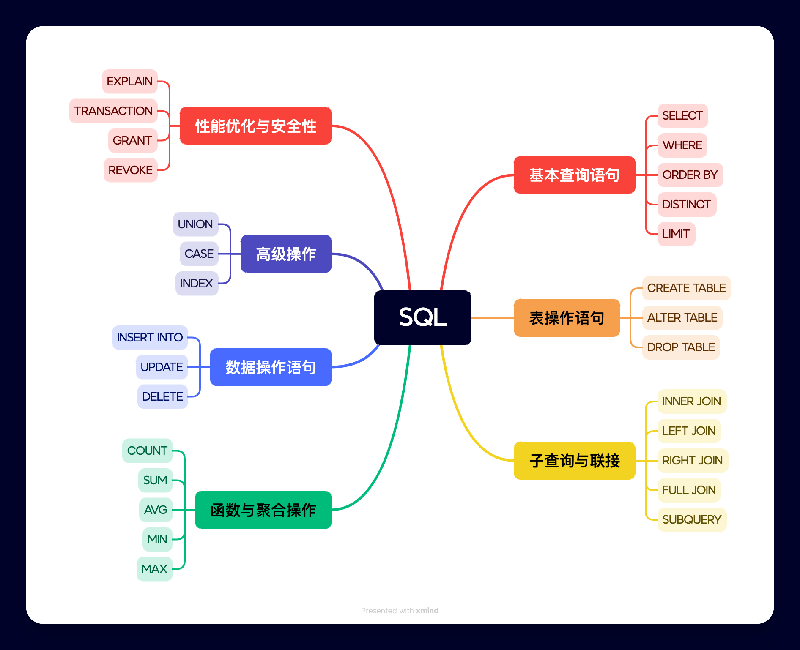

# 数据库

### 术语

SQL：Structured Query Language，是一种用于管理和操作关系数据库的标准语言，包括数据查询、数据插入、数据更新、数据删除、数据库结构创建和修改等功能。

---

Table：数据表

Derived Table：派生表，From 子句中的子查询，在 explain 中，派生表也会在 table 列显示

---

explain：执行计划，用于 SQL 性能分析

---

Statement：一条SQL语句，它是与数据库交互的基本单位。如`INSERT`/`SELECT`/`UPDATE`/`DELETE`

MySQL中的Statement可以分为以下几种：

- DDL语句：数据定义语言，用来创建、修改、删除数据库、表、列等元素。
- DML语句：数据操作语言，用来对表中的数据进行操作，如插入、更新、删除等。
- DQL语句：数据查询语言，用来查询表中的数据，如SELECT语句。
- DCL语句：数据控制语言，用来控制数据库的访问权限、事务处理等，如GRANT和REVOKE语句。

JDBC 中同样提供了 Statement 接口，它允许我们向数据库发送SQL查询和更新语句，并从数据库中获取结果。Statement接口有多个子接口和实现类，常用的有以下几种：

Statement：用于执行普通的SQL语句，不带有参数。

PreparedStatement：用于执行预编译的SQL语句，可以带有参数，防止SQL注入攻击。

CallableStatement：用于执行数据库存储过程。

---

子句：SQL 语句中的语法构成部分，如`WITH`/`FROM`/`JOIN`

### mysql 与 oracle 差异

#### 对null排序

oracle 视为最大

mysql 视为最小