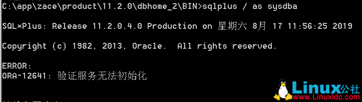

# sqlplus

# 安装 Instant Client

下载 Instant Client（plsql 只支持 32 位的 oracle 客户端）

> [Instant Client 下载 | Oracle 中国](https://www.oracle.com/cn/database/technology/instant-client.html)

至少下载 basic 和 sqlplus，下载后合并到一个文件夹

# 连接

```bash
E:\oracle\product\11.1.0\db_1\BIN>sqlplus /?

SQL*Plus: Release 11.1.0.6.0 - Production on 星期三 1月 19 15:34:38 2022

Copyright (c) 1982, 2007, Oracle.  All rights reserved.


SQL*Plus: Release 11.1.0.6.0 - Production

Copyright (c) 1982, 2007, Oracle.  All rights reserved.

使用 SQL*Plus 执行 SQL, PL/SQL 和 SQL*Plus 语句。

用法 1: sqlplus -H | -V

    -H             显示 SQL*Plus 版本和
                   用法帮助。
    -V             显示 SQL*Plus 版本。

用法 2: sqlplus [ [<option>] [<logon>] [<start>] ]

  <option> 为: [-C <version>] [-L] [-M "<options>"] [-R <level>] [-S]

    -C <version>   将受影响的命令的兼容性设置为
                   <version> 指定的版本。该版本具有
                   "x.y[.z]" 格式。例如, -C 10.2.0
    -F             为 RAC 环境启用故障转移模式。
    -L             只尝试登录一次, 而不是
                   在出错时再次提示。
    -M "<options>" 设置输出的自动 HTML 标记。选项
                   的格式为:
                   HTML [ON|OFF] [HEAD text] [BODY text] [TABLE text]
                   [ENTMAP {ON|OFF}] [SPOOL {ON|OFF}] [PRE[FORMAT] {ON|OFF}]
    -R <level>     设置受限模式, 以禁用与文件系统交互的
                    SQL*Plus 命令。级别可以
                   是 1, 2 或 3。最高限制级别为 -R 3, 该级别
                   禁用与文件系统交互的
                   所有用户命令。
    -S             设置无提示模式, 该模式隐藏
                   命令的 SQL*Plus 标帜, 提示和回显
                   的显示。

  <logon> 为: (<username>[/<password>][@<connect_identifier>] | /)
              [AS SYSDBA | AS SYSOPER | AS SYSASM] | /NOLOG | [EDITION=value]

    指定数据库帐户用户名, 口令和数据库连接
    的连接标识符。如果没有连接
    标识符, SQL*Plus 将连接到默认数据库。

    AS SYSDBA, AS SYSOPER 和 AS SYSASM 选项是数据库
    管理权限。

    <connect_identifier> 的形式可以是 Net 服务名
    或轻松连接。

      @[<net_service_name> | [//]Host[:Port]/<service_name>]

        <net_service_name> 是服务的简单名称, 它解析
        为连接描述符。

        示例: 使用 Net 服务名连接到数据库, 且
                 数据库 Net 服务名为 ORCL。

           sqlplus myusername/mypassword@ORCL

        Host 指定数据库服务器计算机的主机名或 IP
        地址。

        Port 指定数据库服务器上的监听端口。

        <service_name> 指定要访问的数据库的
        服务名。

        示例: 使用轻松连接连接到数据库, 且
                 服务名为 ORCL。

           sqlplus myusername/mypassword@Host/ORCL

    /NOLOG 选项可启动 SQL*Plus 而不连接到
    数据库。

    EDITION 指定应用程序
    版本的值

  <start> 为: @<URL>|<filename>[.<ext>] [<parameter> ...]

    使用将分配给脚本中的替代变量的指定参数
    从 Web 服务器 (URL) 或本地文件系统 (filename.ext)
    运行指定的 SQL*Plus 脚本。

在启动 SQL*Plus 并且执行 CONNECT 命令后, 将运行站点概要
文件 (例如, $ORACLE_HOME/sqlplus/admin/glogin.sql) 和用户概要文件
(例如, 工作目录中的 login.sql)。这些文件
包含 SQL*Plus 命令。

有关详细信息, 请参阅 SQL*Plus 用户指南和参考。
```

```bash
# 普通用户
sqlplus TEST/password
# 以管理员登录（SYS）
sqlplus TEST/password as sysdba
# 服务名登录
sqlplus TEST/password@ORCL
# 实例名登录
sqlplus TEST/password@orcl
# 远程服务名登录
sqlplus TEST/password@192.168.3.101/ORCL
# 远程管理员登录
sqlplus TEST/password@192.168.3.101/ORCL as sysdba
# 操作系统登录（服务器本地登录）
sqlplus / as sysdba
# 启动sqlplus而不连接到数据库
sqlplus /nolog
```

# 常用 SQL
```sql
-- 查询当前用户
select user from dual;
-- 修改某用户密码
alter user TEST identified by 123456;
-- 查看所有用户、表空间
select username,default_tablespace from dba_users;
-- 查看当前用户的所有表
select table_name from user_tables;
-- 查看某用户的所有表
select * from all_tab_comments where owner = 'TEST'
-- 修改某用户密码
alter user TEST identified by 123456;
-- 提交
commit;

-- 查看数据库版本
select * from v$version
-- 查看实例名（platform）
select instance_name from v$instance
-- 查看服务名（PLATFORM）
select global_name from global_name
```

# 创建表空间、用户

### 查询已有表空间信息

```sql
select * from dba_data_files;
```

### 创建表空间

```sql
# 如果不带 datafile 参数则创建在默认位置
create tablespace TEST2 
datafile 'E:\APP\ADMINISTRATOR\PRODUCT\11.1.0\DB_1\DATABASE\TEST2' 
size 10m autoextend on next 10m maxsize unlimited
```

### 	创建用户

```sql
create user TEST2 
identified by "password" 
default tablespace TEST2 
profile DEFAULT 
ACCOUNT UNLOCK;
```

### 	授权

```sql
-- 授予角色
grant dba to TEST2;
grant connect to TEST2;
grant resource to TEST2;
grant dba,connect,resource to TEST2;
-- 移除角色
revoke dba from TEST2;
```

> sid: 实例名
> 服务名：监听程序名字

# 备份

### 导出

```sql
 exp YQZHZX_OA/password@ORCL file=d:\test2.dmp owner=(YQZHZX_OA)
```

### 导入

```sql
imp YNYBJ_EFLOW_TEST/password@ORCL 
file=D:\test2.dmp full=y log=jss.log ignore=y rows=y
```

```sql
imp 'YNYBJ_EFLOW_TEST/password@192.168.1.124/PLATFORM as sysdba' 
file=E:\ynybj_oa_20201015.dmp full=y log=jss.log ignore=y rows=y
```

# 账户

```sql
-- 修改密码
alter user TEST identified by 123456;
-- 锁定
alter user TEST account lock;
-- 解锁
alter user TEST account unlock;
```

# 权限

> dba_sys_privs：系统权限，如`CREATE TABLE`
>
> dba_role_privs：拥有角色，如`CONNECT`
>
> dba_tab_privs：表权限，如`SELECT ON YNTSJY_NEFLOW.T_USER`

### 系统角色 CONNECT/RESOURCE 权限

```sql
SQL> select * from dba_sys_privs where grantee in ('RESOURCE','CONNECT') order by 1;

GRANTEE                        PRIVILEGE                                ADMIN_OPTION
------------------------------ ---------------------------------------- ------------
CONNECT                        CREATE SESSION                           NO
RESOURCE                       CREATE CLUSTER                           NO
RESOURCE                       CREATE INDEXTYPE                         NO
RESOURCE                       CREATE OPERATOR                          NO
RESOURCE                       CREATE PROCEDURE                         NO
RESOURCE                       CREATE SEQUENCE                          NO
RESOURCE                       CREATE TABLE                             NO
RESOURCE                       CREATE TRIGGER                           NO
RESOURCE                       CREATE TYPE                              NO

9 rows selected
```

### 用户 YNTSJY_NAPP 拥有角色

```sql
SQL> select * from dba_role_privs where grantee = 'YNTSJY_NAPP';

GRANTEE                        GRANTED_ROLE                   ADMIN_OPTION DEFAULT_ROLE
------------------------------ ------------------------------ ------------ ------------
YNTSJY_NAPP                    CONNECT                        NO           YES
YNTSJY_NAPP                    RESOURCE                       NO           YES
```

> CONNECT角色：仅具有创建SESSION的权限
>
> RESOURCE角色：仅具有创建CLUSTER,INDEXTYPE,OPERATOR,PROCEDEURE,SEQUENCE,TABLE,TRIGGER,TYPE的权限。同时，当把ORACLE resource角色授予一个user的时候，不但会授予ORACLE resource角色本身的权限，而且还有unlimited tablespace权限，但是，当把resource授予一个role时，就不会授予unlimited tablespace权限。
>
> 确实没有创建视图的权限，由此看来如果需要创建视图权限，只能单独授权：`GRANT CREATE VIEW TO 用户;`

> [ORACLE的CONNECT和RESOURCE角色权限 - 据说撸撸更健康 - 博客园 (cnblogs.com)](https://www.cnblogs.com/jsllgjk/p/3954006.html)

### 自建角色授权

##### 创建角色

```sql
SQL> create role ROLE_YNTSJY_WEB_APP not identified;

Role created.
```

> 如果创建带密码的角色，只能在登录后执行`set role ROLE_NAME identified by 123456;`使角色中的权限生效，仅作用于当前 session，所以<font color="#FF4081">如果仅通过该角色授予用户`CREATE SESSION`权限，该用户无法登录</font>

##### 授予系统权限

```
SQL> grant CREATE SESSION,CREATE TABLE,CREATE CLUSTER,CREATE SEQUENCE,CREATE PROCEDURE,CREATE TRIGGER,CREATE TYPE,CREATE OPERATOR,CREATE INDEXTYPE,CREATE VIEW,UNLIMITED TABLESPACE to ROLE_YNTSJY_WEB_APP;

Grant succeeded.
```

> = `CONNECT`+`RESOURCE`+`CREATE VIEW` +`UNLIMITED TABLESPACE`

> [Oracle权限一览表 - xuzhengzhu - 博客园 (cnblogs.com)](https://www.cnblogs.com/HondaHsu/p/3529719.html)
>
> 可通过`select * from dba_sys_privs where grantee in ('RESOURCE','CONNECT') order by 1;`查询系统角色的权限作参考

##### 授予其他用户表权限

```sql
grant select on YNTSJY_NEFLOW.T_COMMENT to ROLE_YNTSJY_WEB_APP;
grant select on YNTSJY_NEFLOW.T_DONE to ROLE_YNTSJY_WEB_APP;
grant select on YNTSJY_NEFLOW.T_FLOWPROCESS to ROLE_YNTSJY_WEB_APP;
grant select on YNTSJY_NEFLOW.T_FLOWRECORD to ROLE_YNTSJY_WEB_APP;
grant select on YNTSJY_NEFLOW.T_FLOWRECORDWORKITEM to ROLE_YNTSJY_WEB_APP;
grant select on YNTSJY_NEFLOW.T_GROUP to ROLE_YNTSJY_WEB_APP;
grant select on YNTSJY_NEFLOW.T_GROUPUSER to ROLE_YNTSJY_WEB_APP;
grant select on YNTSJY_NEFLOW.T_ORGANIZATION to ROLE_YNTSJY_WEB_APP;
grant select on YNTSJY_NEFLOW.T_ORGUNIT to ROLE_YNTSJY_WEB_APP;
grant select on YNTSJY_NEFLOW.T_TODO to ROLE_YNTSJY_WEB_APP;
grant select on YNTSJY_NEFLOW.T_USER to ROLE_YNTSJY_WEB_APP;
grant select on YNTSJY_NEFLOW.T_WORKITEM to ROLE_YNTSJY_WEB_APP;

grant select on YNTSJY_NEFLOW.V_E_GROUP to ROLE_YNTSJY_WEB_APP;
grant select on YNTSJY_NEFLOW.V_E_GROUPUSER to ROLE_YNTSJY_WEB_APP;
grant select on YNTSJY_NEFLOW.V_E_ORG to ROLE_YNTSJY_WEB_APP;
grant select on YNTSJY_NEFLOW.V_E_TXL to ROLE_YNTSJY_WEB_APP;
grant select on YNTSJY_NEFLOW.V_E_UNIT to ROLE_YNTSJY_WEB_APP;
grant select on YNTSJY_NEFLOW.V_E_USER to ROLE_YNTSJY_WEB_APP;

grant insert on YNTSJY_NEFLOW.T_GROUP to ROLE_YNTSJY_WEB_APP;
grant insert on YNTSJY_NEFLOW.T_GROUPUSER to ROLE_YNTSJY_WEB_APP;
grant insert on YNTSJY_NEFLOW.T_ORGANIZATION to ROLE_YNTSJY_WEB_APP;
grant insert on YNTSJY_NEFLOW.T_ORGUNIT to ROLE_YNTSJY_WEB_APP;
grant insert on YNTSJY_NEFLOW.T_USER to ROLE_YNTSJY_WEB_APP;

grant update on YNTSJY_NEFLOW.T_COMMENT to ROLE_YNTSJY_WEB_APP;
grant update on YNTSJY_NEFLOW.T_DONE to ROLE_YNTSJY_WEB_APP;
grant update on YNTSJY_NEFLOW.T_FLOWPROCESS to ROLE_YNTSJY_WEB_APP;
grant update on YNTSJY_NEFLOW.T_FLOWRECORD to ROLE_YNTSJY_WEB_APP;
grant update on YNTSJY_NEFLOW.T_FLOWRECORDWORKITEM to ROLE_YNTSJY_WEB_APP;
grant update on YNTSJY_NEFLOW.T_GROUP to ROLE_YNTSJY_WEB_APP;
grant update on YNTSJY_NEFLOW.T_GROUPUSER to ROLE_YNTSJY_WEB_APP;
grant update on YNTSJY_NEFLOW.T_ORGANIZATION to ROLE_YNTSJY_WEB_APP;
grant update on YNTSJY_NEFLOW.T_ORGUNIT to ROLE_YNTSJY_WEB_APP;
grant update on YNTSJY_NEFLOW.T_TODO to ROLE_YNTSJY_WEB_APP;
grant update on YNTSJY_NEFLOW.T_USER to ROLE_YNTSJY_WEB_APP;
grant update on YNTSJY_NEFLOW.T_WORKITEM to ROLE_YNTSJY_WEB_APP;

grant delete on YNTSJY_NEFLOW.T_DONE to ROLE_YNTSJY_WEB_APP;
grant delete on YNTSJY_NEFLOW.T_GROUP to ROLE_YNTSJY_WEB_APP;
grant delete on YNTSJY_NEFLOW.T_GROUPUSER to ROLE_YNTSJY_WEB_APP;
grant delete on YNTSJY_NEFLOW.T_ORGANIZATION to ROLE_YNTSJY_WEB_APP;
grant delete on YNTSJY_NEFLOW.T_ORGUNIT to ROLE_YNTSJY_WEB_APP;
grant delete on YNTSJY_NEFLOW.T_TODO to ROLE_YNTSJY_WEB_APP;
grant delete on YNTSJY_NEFLOW.T_USER to ROLE_YNTSJY_WEB_APP;
```

> 系统权限和表权限不可在同一条sql中授予，会报错

> 向用户授予其他用户表权限，可以授予 DBA 角色 `grant dba to YNTSJY_NAPP;`；如果不能授予 dba 角色，就只能逐个表授权

##### 授予用户创建的角色

```sql
SQL> grant ROLE_YNTSJY_WEB_APP to YNTSJY_NAPP;
```

##### 设为默认角色

```sql
SQL> alter user YNTSJY_NAPP default role ROLE_YNTSJY_WEB_APP;
```

> 注：角色的生效是一个什么概念呢？假设用户a有b1,b2,b3三个角色，那么如果b1未生效，则b1所包含的权限对于a来讲是不拥有的，只有角色生效了，角色内的权限才作用于用户，最大可生效角色数由参数MAX_ENABLED_ROLES设定；在用户登录后，oracle将所有直接赋给用户的权限和用户默认角色中的权限赋给用户。
>
> [Oracle 用户，角色，权限等 - 一泽涟漪 - 博客园 (cnblogs.com)](https://www.cnblogs.com/ilifeilong/p/7624329.html)

##### 登录查看拥有的权限

```sql
SQL> select * from session_privs;

PRIVILEGE
----------------------------------------
CREATE SESSION
UNLIMITED TABLESPACE
CREATE TABLE
CREATE CLUSTER
CREATE VIEW
CREATE SEQUENCE
CREATE PROCEDURE
CREATE TRIGGER
CREATE TYPE
CREATE OPERATOR
CREATE INDEXTYPE

11 rows selected.
```

# 参数调整

##### 连接数

```sql
# 查询当前使用的process、session数量。
select count(*) from v$process;
select count(*) from v$session;
# 连接数（实测4000会导致数据库无法启动）
alter system set processes=2000 scope=spfile;
alter system set sssions=2205 scope=spfile;
```

> [ORA-00018-超出最大连接数 - kkqq8860928 - 博客园 (cnblogs.com)](https://www.cnblogs.com/apromise/p/9081801.html)

# 调整配置导致实例无法启动

调整数据库参数如内存、最大连接数等导致数据库无法启动。

> **pfile**: 初始化参数文件（Initialization Parameters Files），Oracle 9i之前，ORACLE一直采用pfile方式存储初始化参数，pfile 默认的名称为“init+例程名.ora”文件路径：/data/app/oracle/product/12.1.0/dbhome_1/dbs，这是一个文本文件，可以用任何文本编辑工具打开。
>
> **spfile:**服务器参数文件（Server Parameter Files），从Oracle 9i开始，Oracle引入了Spfile文件，spfile 默认的名称为“spfile+例程名.ora”文件路径：/data/app/oracle/product/12.1.0/dbhome_1/dbs 以二进制文本形式存在，不能用vi编辑器对其中参数进行修改，只能通过SQL命令在线修改。
>
> [oracle的参数文件：pfile和spfile - 小强斋太 - 博客园 (cnblogs.com)](https://www.cnblogs.com/xqzt/p/4832597.html)
>
> 测试发现`show parameter spfile`和`show parameter pfile`返回结果一样：
>
> ```bash
> NAME                                 TYPE        VALUE
> ------------------------------------ ----------- ------------------------------
> spfile                               string      D:\APP\LYMLY\PRODUCT\11.1.0\DB
>                                                  _1\DATABASE\SPFILEORCL.ORA
> ```
>
> 所以猜想 11g 版本已经只通过`spfile`进行参数控制了？


无法启动实例是因为不合理的改动了`spfile`中的参数，可以用安装数据库时初始的`pfile`启动数据库，再从这个`pfile`重新生成`spfile`。

> [!TIP]
>
> 初始的`pfile`位于`D:\app\lymly\admin\orcl\pfile\pfile.ora.xxxxxxxxxxxxxxx`，可以复制一下，改名为`init.ora`备用。

```bash
cd /d D:\app\lymly\product\11.1.0\db_1\BIN

# 启动监听
lsnrctl start

# 无实例连接
sqlplus /nolog
SQL> conn / as sysdba
# 或
sqlplus / as sysdba
已连接到空闲例程。

# 用初始的pfile启动数据库
SQL> startup pfile=D:\app\lymly\admin\orcl\pfile\init.ora
ORACLE 例程已经启动。

Total System Global Area  857903104 bytes
Fixed Size                  1336540 bytes
Variable Size             490736420 bytes
Database Buffers          360710144 bytes
Redo Buffers                5120000 bytes
数据库装载完毕。
数据库已经打开。
SQL> create spfile from pfile='D:\app\lymly\admin\orcl\pfile\init.ora';

文件已创建。

SQL> exit
从 Oracle Database 11g Enterprise Edition Release 11.1.0.6.0 - Production
With the Partitioning, OLAP, Data Mining and Real Application Testing options 断开
```

`services.msc`里重新启动 oracle 服务，如果`OracleServiceORCL`启动的较慢，进度跑到一半才差不多启动启动完，说明启动正常。刚刚启动好可能是连不上的，貌似需要等他反应一会:dog:

> [SQL> startup ORA-01031: insufficient privileges_阿文_ing的博客-CSDN博客](https://blog.csdn.net/qq_41793064/article/details/90404814)

##### 实例/无实例连接报错：ORA-01031: insufficient privileges

这个是比较普遍的错误，连接数据库、startup等时候都可能报，基本上就是因为**当前用户没有在`ora_dba`组里**。所以我遇到的情况就是在`Administrator`用户安装一切正常，在其他用户安装就报`ORA-01031: insufficient privileges`。

当前用户没有在`ora_dba`用户组里

windows cmd 运行`compmgmt.msc` - 本地用户和组

- 检查组`ora_dba`是否存在

- 检查当前用户是否在`ora_dba`组：右键用户名 - 属性 - 隶属于是否包含`ora_dba`，如没有则添加

> [ERROR:ORA-01031:insufficient privileges完美解决方法_jcbiubiubiu的博客-CSDN博客_ora-01031:insufficient privileges](https://blog.csdn.net/qq_41464283/article/details/89684302)

##### 连接报错：ORA-12560: TNS: 协议适配器错误

需要启动windows services 里的 oracle 服务。

##### 连接报错：ORA-12641: 验证服务无法初始化解决

`D:\app\lymly\product\11.1.0\db_1\NETWORK\ADMIN\sqlnet.ora`

```
SQLNET.AUTHENTICATION_SERVICES= (NTS)
```

windows 系统下`ALL`无效，应使用`NTS`：操作系统认证，参看下文

# oracle 的认证方式

`D:\app\lymly\product\11.1.0\db_1\NETWORK\ADMIN\sqlnet.ora`

```
SQLNET.AUTHENTICATION_SERVICES= (NTS)
```

> #### SQLNET.AUTHENTICATION_SERVICES
>
> Use the parameter to enable one or more authentication services. `sqlnet.ora``SQLNET.AUTHENTICATION_SERVICES`
>
> Purpose
>
> To enable one or more authentication services. If authentication has been installed, then it is recommended that this parameter be set to either or to one of the listed authentication methods. `none`
>
> Usage Notes
>
> When using the value , the server attempts to authenticate using each of the following methods. The server falls back to the ones lower on the list if the ones higher on the list were unsuccessful. `SQLNET.AUTHENTICATION_SERVICES``all`
>
> - Authentication based on a service external to the database, such as a service on the network layer, Kerberos, or RADIUS.
> - Authentication based on the operating system user's membership in an administrative operating system group. Group names are platform-specific. This authentication is applicable to administrative connections only.
> - Authentication performed by the database.
> - Authentication based on credentials stored in a directory server.
>
> Operating system authentication allows access to the database using any user name and any password when an administrative connection is attempted, such as using the clause when connecting using SQL*Plus. An example of a connection is as follows. `AS SYSDBA`
>
> ```
> Copy
> sqlplus ignored_username/ignored_password AS SYSDBA
> ```
>
> When the operating-system user who issued the preceding command is already a member of the appropriate administrative operating system group, then the connection is successful. This is because the user name and password are ignored by the server due to checking the group membership first.
>
> See Also:
>
> [*Oracle Database Security Guide*](https://docs.oracle.com/pls/topic/lookup?ctx=en/database/oracle/oracle-database/19/netrf&id=DBSEG003) for additional information about authentication methods
>
> Default
>
> ```
> all
> ```
>
> Note:When installing the database with Database Configuration Assistant (DBCA), this parameter may be set to `nts` in the `sqlnet.ora` file.
>
> Values
>
> Authentication methods available with Oracle Net Services:
>
> - `none` for no authentication methods, including Microsoft Windows native operating system authentication. When is set to , a valid user name and password can be used to access the database. `SQLNET.AUTHENTICATION_SERVICES``none`
> - `all` for all authentication methods.
> - `beq` for native operating system authentication for operating systems other than Microsoft Windows
> - `kerberos5` for Kerberos authentication
> - `nts` for Microsoft Windows native operating system authentication
> - `radius` for Remote Authentication Dial-In User Service (RADIUS) authentication
> - `tcps` for TLS authentication
>
> Example
>
> ```
> Copy
> SQLNET.AUTHENTICATION_SERVICES=(kerberos5)
> ```
>
> See Also:
>
> [*Oracle Database Security Guide*](https://docs.oracle.com/pls/topic/lookup?ctx=en/database/oracle/oracle-database/19/netrf&id=DBSEG9768)
>
> **Parent topic:** [sqlnet.ora Profile Parameters](https://docs.oracle.com/en/database/oracle/oracle-database/19/netrf/parameters-for-the-sqlnet.ora.html#GUID-897ABB80-64FE-4F13-9F8C-99361BB4465C)
>
> [Parameters for the sqlnet.ora File (oracle.com)](https://docs.oracle.com/en/database/oracle/oracle-database/19/netrf/parameters-for-the-sqlnet.ora.html#GUID-FFDBCCFD-87EF-43B8-84DA-113720FCC095)

> 2、Windows平台 
>
> 对于Windows平台 ，参数SQLNET.AUTHENTICATION_SERVICES 主要是以下几种情况： 
>
> (1). sqlnet.ora文件为空，或用#注释掉       --密码文件验证通过，操作系统认证无法通过 
> (2). SQLNET.AUTHENTICATION_SERVICES = (NTS)   --操作系统验证通过，密码文件认证也能通过 
> (3). SQLNET.AUTHENTICATION_SERVICES = (NONE)   --密码文件验证通过，操作系统认证无法通过 
> (4). SQLNET.AUTHENTICATION_SERVICES = (NONE,NTS) --操作系统验证通过(前后顺序颠倒也一样)，密码文件认证也能通过
> (5). SQLNET.AUTHENTICATION_SERVICES = (ALL)  --在windows下，该种为错误方式，会报如下错误： 
>
> 
>
> 3、Linux平台 
>
> 对于Linux平台，参数SQLNET.AUTHENTICATION_SERVICES主要是以下几种情况： 
>
> (1). sqlnet.ora文件为空，或用#注释掉              --操作系统验证通过，密码文件认证无法通过 
> (2). SQLNET.AUTHENTICATION_SERVICES = (NTS)   --操作系统验证无法通过，密码文件认证也无法通过 
> (3). SQLNET.AUTHENTICATION_SERVICES = (NONE)   --操作系统验证无法通过，密码文件认证也无法通过 
> (4). SQLNET.AUTHENTICATION_SERVICES = (NONE,NTS) --基于操作系统验证(前后顺序颠倒也一样)，密码文件认证也能通过 
> (5). SQLNET.AUTHENTICATION_SERVICES = (ALL)    --操作系统验证通过，密码文件认证无法通过 
>
> 4、总结 
>
> (1) 该参数默认值为ALL，当通过DBCA建库时，该参数可能为NTS。
> (2) 在Windows中，sqlnet.ora文件里默认会包含SQLNET.AUTHENTICATION_SERVICES参数，设置方式参见上述；但是在Linux中默认不包含SQLNET.AUTHENTICATION_SERVICES参数，所以我们刻意配置该参数也没有必要。 
> (3) SQLNET.AUTHENTICATION_SERVICES参数只会影响我们在数据库服务器本地登录管理员账号(sys)，但是不会影响我们plsql登录数据库。
>
> [SQLNET.AUTHENTICATION_SERVICES深入理解_数据库技术_Linux公社-Linux系统门户网站 (linuxidc.com)](https://www.linuxidc.com/Linux/2019-09/160672.htm)

