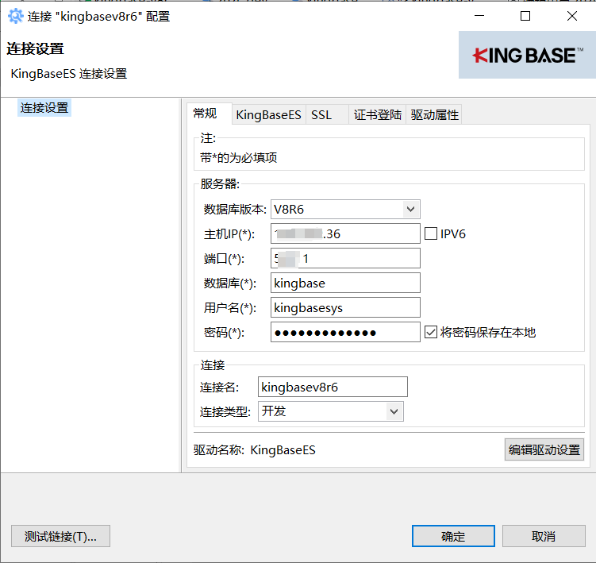
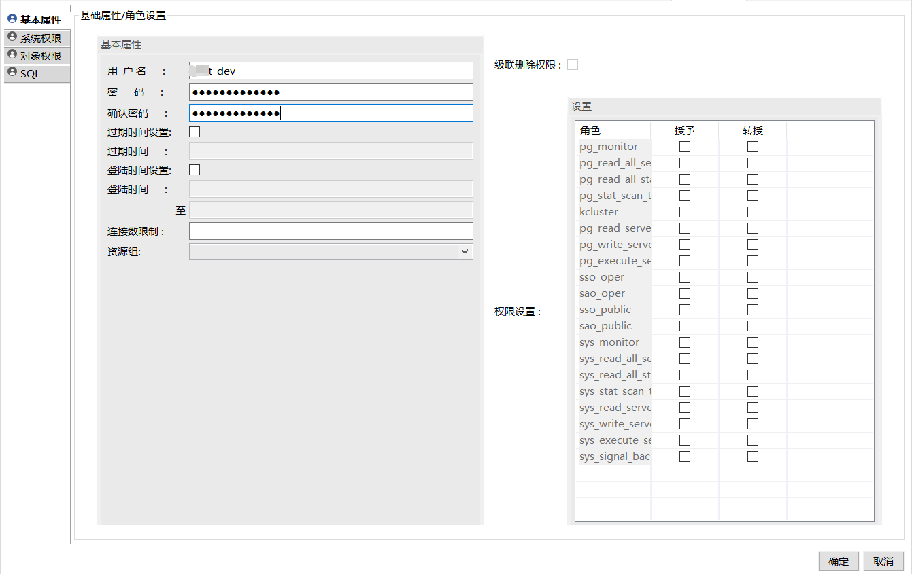
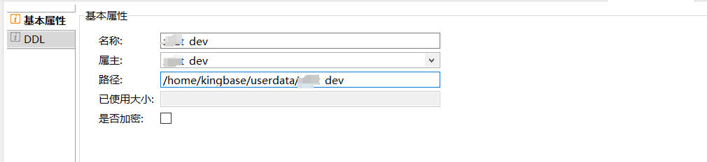
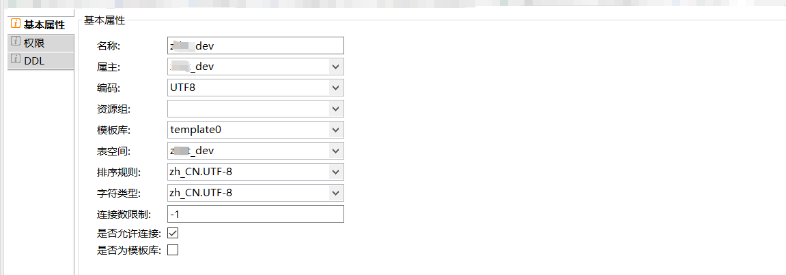
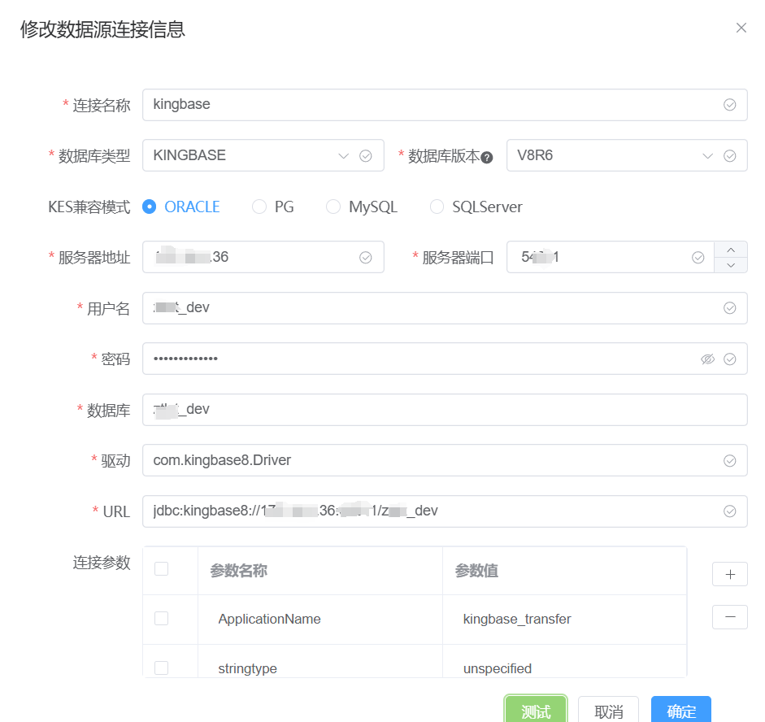

# 人大金仓

人大金仓数据库、开发工具 KStudio（可视化工具）、迁移工具都在数据库安装包内，安装时选择即可。


# 开发工具 KStudio

### 连接

初次使用配置：

- 数据库：系统数据库 kingbase、test
- 用户名：安装时指定的用户
- 密码：安装时指定的密码



### 创建用户

一般填写用户密码即可，后面创建表空间、数据库属主选择该用户



```sql
CREATE USER "xxxx_dev" PASSWORD '******';
```


### 创建表空间

路径一般填数据目录 + 表空间名字

> [!NOTE]
>
> 注意 docker 安装时，应为容器内路径



```sql
CREATE TABLESPACE "xxxx_dev" OWNER "xxxx_dev" LOCATION '/home/kingbase/userdata/xxxx_dev';
```

### 创建数据库

属主、表空间配置为上述所创建的用户、表空间。



```sql
CREATE DATABASE "xxxx_dev" WITH OWNER = "xxxx_dev" ENCODING 'UTF8' TEMPLATE "template0"
 TABLESPACE = "xxxx_dev"
 lc_collate = 'zh_CN.UTF-8'
 lc_ctype = 'zh_CN.UTF-8'
 connection_limit = -1
 allow_connections = TRUE
 is_template = FALSE;
```

# 常用操作

```sql
-- 查看所有表名及注释
SELECT DISTINCT t.TABLE_NAME AS F_TABLE_NAME,c.COMMENTS AS F_TABLE_COMMENT, 0 AS F_TABLE_SUM FROM information_schema.TABLES AS t LEFT JOIN (SELECT TABLE_NAME,COMMENTS FROM DBA_TAB_COMMENTS)AS c ON upper(t.TABLE_NAME) = upper(c.TABLE_NAME) 
WHERE TABLE_SCHEMA = 'xxxx_dev'

-- 授权视图dba_tab_comments
GRANT SELECT ON dba_tab_comments TO xxxx_dev;
```

> [!NOTE]
>
> 上述`查看所有表名及注释`的SQL与连接的数据库有关，它只会在当前所连接的数据库下查询，与用户权限高低无关。

# 迁移工具 KDTS

可执行文件一般为`C:\Program Files\Kingbase\ES\V9\KESRealPro\V009R001C002B0014\ClientTools\guitools\KDts\KDTS-WEB\bin`

### 术语

pid 文件：位于 bin 上层目录，用于记录迁移服务进程号，方便判断关闭、判断是否正在运行等

### 注意事项

- 修改 startup.bat 中 pid 文件路径带空格导致 bat 报错问题

```bat
if exist %PID_FILE% (
```

修改为：

```bat
if exist "%PID_FILE%" (
```

- 以管理员身份运行：由于运行过程中会在安装目录产生日志文件，直接运行没有写入权限
- 如果提示正在运行：关闭54523端口进程、删除 bin 上层目录的 pid 文件

```bash
# 查询端口占用
netstat -ano | findstr 54523
```

### 访问

1. 使用谷歌浏览器进行访问
2. 访问地址： http://localhost:54523/
3. 默认用户名及密码：kingbase / kingbase
4. 会话保存策略：会话保存时间为一天

### 迁移

目标数据库

> [!NOTE]
>
> 所填写的数据库很关键，数据迁移到这个数据库中。



## 测试

完美迁移：

- mysql 8 -> kingbase V8R6
- kingbase V9 -> kingbase V8R6

部分不成功：

- kingbase V9 -> mysql 8