# OpenWRT

WAN：广域网，接光猫

LAN：局域网，接家用设备

### uboot

引导加载程序，用于路由器刷机，每种路由器会有对应的大神开发的 uboot，会有多种版本，比如不死 uboot

刷入 uboot 后，修改电脑 ip 为`192.168.1.2/24`，浏览器访问`http://192.168.1.1`。

# 固件

### 精简

系统 - 软件包，切换到已安装，在筛选中输入关键字，卸载多余的软件包。

卸载时注意，有些包被别的包依赖，报错内容会告知依赖的软件包名，如果确实没用，根据依赖顺序删除即可。

搜索关键字：

无线：ath、wireless、wlan、wifi、wpad、802、iw

> ```bash
> # CONFIG_ATH11K_NSS_SUPPORT is not set
> # CONFIG_DRIVER_11AC_SUPPORT is not set
> # CONFIG_DRIVER_11AX_SUPPORT is not set
> # CONFIG_KERNEL_PREEMPT_RCU is not set
> # CONFIG_NSS_DRV_WIFIOFFLOAD_ENABLE is not set
> # CONFIG_NSS_FIRMWARE_VERSION_12_5 is not set
> # CONFIG_PACKAGE_apk-mbedtls is not set
> # CONFIG_PACKAGE_apk-openssl is not set
> # CONFIG_PACKAGE_ath11k-firmware-ipq6018 is not set
> # CONFIG_PACKAGE_ath11k-firmware-qcn9074 is not set
> # CONFIG_PACKAGE_hostapd-common is not set
> # CONFIG_PACKAGE_ipq-wifi-cmiot_ax18 is not set
> # CONFIG_PACKAGE_ipq-wifi-jdcloud_re-cs-02 is not set
> # CONFIG_PACKAGE_ipq-wifi-jdcloud_re-ss-01 is not set
> # CONFIG_PACKAGE_ipq-wifi-qihoo_v6 is not set
> # CONFIG_PACKAGE_ipq-wifi-redmi_ax5 is not set
> # CONFIG_PACKAGE_ipq-wifi-redmi_ax5-jdcloud is not set
> # CONFIG_PACKAGE_ipq-wifi-xiaomi_ax1800 is not set
> # CONFIG_PACKAGE_ipq-wifi-zn_m2 is not set
> # CONFIG_PACKAGE_iw is not set
> # CONFIG_PACKAGE_kmod-ath is not set
> # CONFIG_PACKAGE_kmod-ath11k is not set
> # CONFIG_PACKAGE_kmod-ath11k-ahb is not set
> # CONFIG_PACKAGE_kmod-ath11k-pci is not set
> # CONFIG_PACKAGE_kmod-cfg80211 is not set
> # CONFIG_PACKAGE_kmod-crypto-aead is not set
> # CONFIG_PACKAGE_kmod-crypto-ccm is not set
> # CONFIG_PACKAGE_kmod-crypto-cmac is not set
> # CONFIG_PACKAGE_kmod-crypto-ctr is not set
> # CONFIG_PACKAGE_kmod-crypto-gcm is not set
> # CONFIG_PACKAGE_kmod-crypto-gf128 is not set
> # CONFIG_PACKAGE_kmod-crypto-ghash is not set
> # CONFIG_PACKAGE_kmod-crypto-hmac is not set
> # CONFIG_PACKAGE_kmod-crypto-manager is not set
> # CONFIG_PACKAGE_kmod-crypto-michael-mic is not set
> # CONFIG_PACKAGE_kmod-crypto-null is not set
> # CONFIG_PACKAGE_kmod-crypto-rng is not set
> # CONFIG_PACKAGE_kmod-crypto-seqiv is not set
> # CONFIG_PACKAGE_kmod-crypto-sha3 is not set
> # CONFIG_PACKAGE_kmod-crypto-sha512 is not set
> # CONFIG_PACKAGE_kmod-hwmon-core is not set
> # CONFIG_PACKAGE_kmod-i2c-core is not set
> # CONFIG_PACKAGE_kmod-mac80211 is not set
> # CONFIG_PACKAGE_kmod-mhi-bus is not set
> # CONFIG_PACKAGE_kmod-qrtr-mhi is not set
> # CONFIG_PACKAGE_kmod-qrtr-smd is not set
> # CONFIG_PACKAGE_libopenssl-conf is not set
> # CONFIG_PACKAGE_libopenssl-legacy is not set
> # CONFIG_PACKAGE_ucode-mod-digest is not set
> # CONFIG_PACKAGE_ucode-mod-nl80211 is not set
> # CONFIG_PACKAGE_ucode-mod-rtnl is not set
> # CONFIG_PACKAGE_ucode-mod-uloop is not set
> # CONFIG_PACKAGE_wifi-scripts is not set
> # CONFIG_PACKAGE_wireless-regdb is not set
> # CONFIG_PACKAGE_wpad-openssl is not set
> # CONFIG_TARGET_ROOTFS_INITRAMFS is not set
> # CONFIG_USE_APK is not set
> # CONFIG_MBEDTLS_ARIA_C is not set
> # CONFIG_MBEDTLS_CAMELLIA_C is not set
> # CONFIG_MBEDTLS_CCM_C is not set
> # CONFIG_MBEDTLS_CIPHER_MODE_OFB is not set
> # CONFIG_MBEDTLS_CIPHER_MODE_XTS is not set
> # CONFIG_MBEDTLS_DEBUG_C is not set
> # CONFIG_MBEDTLS_DEPRECATED_WARNING is not set
> # CONFIG_MBEDTLS_ECP_DP_BP256R1_ENABLED is not set
> # CONFIG_MBEDTLS_ECP_DP_BP384R1_ENABLED is not set
> # CONFIG_MBEDTLS_ECP_DP_BP512R1_ENABLED is not set
> # CONFIG_MBEDTLS_ECP_DP_CURVE448_ENABLED is not set
> # CONFIG_MBEDTLS_ECP_DP_SECP192K1_ENABLED is not set
> # CONFIG_MBEDTLS_ECP_DP_SECP192R1_ENABLED is not set
> # CONFIG_MBEDTLS_ECP_DP_SECP224K1_ENABLED is not set
> # CONFIG_MBEDTLS_ECP_DP_SECP224R1_ENABLED is not set
> # CONFIG_MBEDTLS_KEY_EXCHANGE_DHE_PSK_ENABLED is not set
> # CONFIG_MBEDTLS_KEY_EXCHANGE_DHE_RSA_ENABLED is not set
> # CONFIG_MBEDTLS_KEY_EXCHANGE_ECDH_ECDSA_ENABLED is not set
> # CONFIG_MBEDTLS_KEY_EXCHANGE_ECDH_RSA_ENABLED is not set
> # CONFIG_MBEDTLS_KEY_EXCHANGE_RSA_ENABLED is not set
> # CONFIG_MBEDTLS_KEY_EXCHANGE_RSA_PSK_ENABLED is not set
> # CONFIG_MBEDTLS_PLATFORM_C is not set
> # CONFIG_MBEDTLS_RIPEMD160_C is not set
> # CONFIG_MBEDTLS_SELF_TEST is not set
> # CONFIG_MBEDTLS_SSL_RENEGOTIATION is not set
> # CONFIG_MBEDTLS_VERSION_C is not set
> # CONFIG_MBEDTLS_VERSION_FEATURES is not set
> ```
>
> 参考大佬的无 wifi 配置，无线包含在这里面的包都可以放心卸载了
>
> [openwrt-ci/configs/ipq60xx-6.12-nowifi.config at main · breeze303/openwrt-ci](https://github.com/breeze303/openwrt-ci/blob/main/configs/ipq60xx-6.12-nowifi.config)


quickstart：quick

istore：store

lucky：lucky

mosdns：mosdns

smartdns：smartdns

adGuard：adguard

samba：samba

passwall：passwall

KMS服务器：vlmcsd

自动重启：autoreboot

# 修改局域网网段

网络 - 接口 - LAN - 修改，IPv4 地址中填写路由器地址，这也决定了局域网的网段

# 拨号上网

> [!NOTE]
>
> 需要光猫桥接模式

网络 - 接口 - WAN

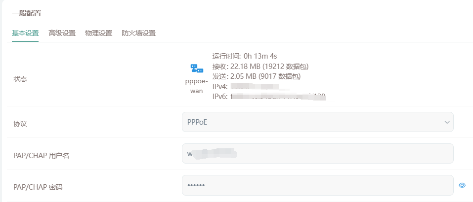

# 公网访问局域网设备

> [!NOTE]
>
> 前提：需要跟运营商开通公网 IP，光猫使用桥接模式

就算防火墙放开，使用路由器或者电脑的公网 IPv6，也无法访问设备，经过多方查找，终于找到大佬的帖子[通过IPV6或者IPV4远程访问家里的Openwrt（奶妈级教程）_存储设备_什么值得买](https://post.smzdm.com/p/awkqv4dp/)。

> ### 什么是 IPv6
>
> IPv6 与 v4 不同。v4 时代运营商一般只给用户分配最多 1 个公网 ip，然后用户自己的路由器通过 NAT 再给局域网设备分配内网 IP，也就是 `192.168.x.x` 这种。这种情况下内网设备没有独立的公网 IP，要想从公网访问必须配置路由器端口转发。随着 v4 资源枯竭，现在运营商默认已经不再分配公网 IP 了。要想正常从外部访问，必须做内网穿透。
>
> IPv6 有无数个地址可供分配，“可以给地球上的每一粒沙子都分配一个 IP 地址”。因此运营商分配的策略也会变化。v4 分配的是一个地址，而 v6 分配的是一个前缀，也就是所谓的 `pd`，相当于是一整个网段，我们可以自己继续往下分配，从而使得每一个局域网设备都能获得公网 IP 地址，甚至可以划分自己的多层子网。
>
> 典型的 IPv6 地址由 8 组十六进制数字表示，一共有 128 bits (16B)。
>
> ```bash
> |----- 网络号 ------| 子网号|--------- 主机号 ---------| 前缀长度|
> 0123 : 4567 : 89ab : cdef : 0123 : 4567 : 89ab : cdef /64
> ```
>
> 通常习惯上只有子网号是我们可以自行往下划分的部分，即前缀长度应该在 49~64 范围内。
>
> IPv6 每组的前缀 0 可以省略，多组连续的 0 也可以省略，但要用 `::` 表示，例如下面两种写法等价：
>
> 复制
>
> ```bash
> 204e:0000:0000:0000:0000:0000:0000:1
> 204e::1
> ```
>
> ### Scope
>
> 与 v4 不同，一个接口可以同时具有多个 v6 的 IP 地址，并且多数情况下都会超过一个。因为 v6 地址分为不同的 Scope，也就是说有效范围不同，常见的（不是全部）包括：
>
> - **Global**：全局地址，全局可路由，相当于「公网 IP」。
> - **Unique Local**：只在网关内部使用，相当于 `192.168.x.x` 之类的局域网地址。多个子网可以通过此类地址互相访问（通过路由器）。
> - **Link Local**：每个接口自动生成的链路地址，永远不被路由。只在本地链路（冲突域）中使用。
>
> 其中只有「Link Local」在 IPv4 中没有明确对应，因为它的存在主要为了解决 IPv6 特有的一个问题：一个接口有多个地址，那么建立路由时很可能学习到重复的下一跳，所以需要一个唯一标识来区分设备，这就是 Link Local 地址。
>
> [OpenWrt 开启 IPv6 公网访问全指南 - 晨鹤部落格](https://chenhe.me/post/openwrt-config-ipv6-public-access)

路由器获得了一个网段，下面要做的就是给每一个设备都分配一个公网地址。有两种方案，可以单独选择也可以同时使用，分别是 SLAAC 与 DHCPv6。由于 Android 只支持 SLAAC，所以下面都使用这种方式。

### 术语

RA：Router Advertisement，路由通告服务

> - **定义**：RA报文是IPv6协议中的一种ICMPv6消息，由路由器发出，用于向本地链路上的节点通告网络配置信息。
> - **作用**：
>   - **自动地址配置**：节点使用RA报文中的网络前缀信息，结合自身的接口标识符，生成全局唯一的IPv6地址。
>   - **网络参数配置**：RA报文中包含默认网关地址、MTU（最大传输单元）等网络参数，节点通过RA报文获取这些信息。
>   - **网络前缀通告**：RA报文通告网络前缀信息，帮助节点了解当前网络的地址范围。

配置项 dhcp：/etc/config/dhcp

配置项 network：/etc/config/network

> [!TIP]
>
> 通过配置文件，可以在用 openwrt 时，了解新的配置项对应旧版的那些配置。
>
> 修改配置保存后，右上角会展示修改的配置项。
>
> 可以在系统 - 备份/升级中，导出当前的配置文件。

### 内核版本 4/5

##### WAN6

基本设置

- 传输协议：DHCPv6 客户端
- 请求 IPv6 地址：try
- 请求指定长度的 IPv6 前缀：自动

高级设置

- 使用内置的 IPv6 管理：勾选

物理设置

- 接口：@wan（wan6）

防火墙设置

- 防火墙区域：wan

##### WAN

高级设置

- 使用内置的 IPv6 管理：不勾选

##### LAN

高级设置

- 使用内置的 IPv6 管理：不勾选

DHCP 服务器 - IPv6 设置

- 路由通告服务：混合模式
- DHCPv6 服务：已禁用
- NDP 代理：已禁用
- 总是通告默认路由：勾选

> [通过IPV6或者IPV4远程访问家里的Openwrt（奶妈级教程）_存储设备_什么值得买](https://post.smzdm.com/p/awkqv4dp/)

##### 对应的配置文件

network.lan.delegate：使用内置的 IPv6 管理：0：不勾选

dhcp.lan.ra: 路由通告服务：hybrid: 混合模式，server: 服务器模式

dhcp.lan.ra_default: 总是通告默认路由：0：不勾选，1：勾选

dhcp.lan.dhcpv6: DHCPv6 服务：已启用

### 内核版本 6

##### LAN

高级设置

- 委托 IPv6 前缀：不勾选

DHCP 服务器 - IPv6 设置

- RA 服务：服务器模式
- DHCPv6 服务：已禁用

DHCP 服务器 - IPv6 RA 设置

- 默认路由器：自动
- 启用 SLAAC：勾选
- RA 标记：无

> [OpenWrt 开启 IPv6 公网访问全指南 - 晨鹤部落格](https://chenhe.me/post/openwrt-config-ipv6-public-access)

##### 对应的配置文件

network.lan.delegate：委托 IPv6 前缀：0：不勾选

dhcp.lan.ra: RA 服务：hybrid: 混合模式，server: 服务器模式

dhcp.lan.ra_default: 默认路由器：0：自动，1：在可用前缀上

dhcp.lan.dhcpv6: DHCPv6 服务：已启用

##### ？

相对于旧版，新版：

- 路由通告模式为服务器模式
- 在 wan 接口中配置委托前缀
- 默认路由器配置为自动

暂不明白为何。

### 局域网设备固定 IP

##### IPv4

我们希望电脑、电视等使用固定的 IP 地址

网络 - DHCP/DNS，注意不是`IP/MAC绑定`，它指的是静态 ARP 绑定

> 静态租约用于给 DHCP 客户端分配固定的 IP 地址和主机标识。只有指定的主机才能连接，并且接口须为非动态配置。
> 使用“添加”按钮来增加新的租约条目。“IPv4 地址”和“主机名”字段的值将被固定分配给“MAC 地址”字段标识的主机，“租期”是一个可选字段，可为每个主机单独设定 DHCP 租期的时长，例如：12h、3d、infinite，分别表示 12 小时、3 天、永久。

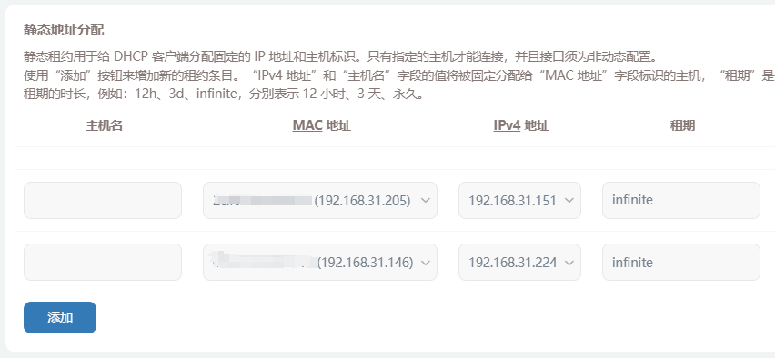

> https://www.right.com.cn/FORUM/forum.php?mod=redirect&goto=findpost&ptid=4059709&pid=10400455&fromuid=941728

##### IPv6

> 设备获得 IPv6 地址有三种方式：
>
> 1. 在设备上手动设置
> 2. 路由器周期广播包含前缀的路由通告，设备收到通告后，自己搞个后缀拼上（ SLAAC ）
> 3. 设备主动请求路由器要一个地址（ DHCPv6 ）
>
> 
> 显然，根据设备不同的获取 IPv6 地址的方式，路由器的控制能力各不相同：
>
> 1. 路由器不能控制设备地址的全部：既不能控制前缀，也不能控制后缀
> 2. 路由器能控制设备地址的一部分：只能控制前缀，不能控制后缀
> 3. 路由器能控制设备地址的全部：既能控制前缀，也能控制后缀
>
> Windows 系统默认同时启用了 SLAAC 和 DHCPv6 ，在存在路由器 RA 通告和 DHCPv6 服务器的环境中，能拿到两个 IPv6 地址。
> 但也有 Android 系统只支持 SLAAC ，无视 DHCPv6 ，对于这种设备，指定 DHCPv6 没用。
>
> [openwrt 如何优雅的指定 IPV6？有些设备总是不按预期分配。 - V2EX](https://www.v2ex.com/t/1036211)

1. 由于 Android 系统只支持 SLAAC，所以要么纯 SLAAC，要么混合（同时启用 SLAAC 和 DHCPv6）
2. 混合的情况下，电脑会同时获得两个 IPv6 地址，不利于 DDNS
3. SLAAC 由运营商前缀 + 电脑自己生成随机生成的后缀，不利于防火墙设置
4. 配置基于EUI-64的 SLAAC IPv6地址，即可获得运营商前缀 + 根据 MAC 生成的固定后缀

管理员权限打开PowerShell。

```bash
PS C:\Users\xxx> Get-NetIPv6Protocol

DefaultHopLimit               : 128
NeighborCacheLimit(Entries)   : 256
RouteCacheLimit(Entries)      : 4096
ReassemblyLimit(Bytes)        : 267974176
IcmpRedirects                 : Enabled
SourceRoutingBehavior         : DontForward
DhcpMediaSense                : Enabled
MediaSenseEventLog            : Disabled
MldLevel                      : All
MldVersion                    : Version2
MulticastForwarding           : Disabled
GroupForwardedFragments       : Disabled
RandomizeIdentifiers          : Enabled
AddressMaskReply              : Disabled
UseTemporaryAddresses         : Enabled
MaxTemporaryDadAttempts       : 3
MaxTemporaryValidLifetime     : 7.00:00:00
MaxTemporaryPreferredLifetime : 1.00:00:00
TemporaryRegenerateTime       : 00:00:05
MaxTemporaryDesyncTime        : 00:10:00
DeadGatewayDetection          : Enabled
```

- RandomizeIdentifiers：生成随机地址，禁用即可根据 MAC 生成的后缀
- UseTemporaryAddresses：使用临时地址，没啥用，可以关闭

```bash
PS C:\Users\xxx> Set-NetIPv6Protocol -UseTemporaryAddresses Disabled
PS C:\Users\xxx> Set-NetIPv6Protocol -RandomizeIdentifiers Disabled
```

重启网卡之后，即可获得固定后缀的 IPv6 地址，就可以愉快地配置防火墙了。

```bat
@echo off
netsh interface set interface "以太网" disabled
echo 正在重启网卡...
timeout /t 2
netsh interface set interface "以太网" enabled
echo 正在等待网卡...
timeout /t 7

:loop
ipconfig
pause
goto loop
```

### 防火墙配置

在公网中访问局域网中设备，如电脑。根据前面的科普，设备会有一个不变的 IPv6 的 4 组后缀，可以在电脑中`ipconfig`查看。

配置为：

- 来源 wan，任意IP
- 目标 lan，目标IP：`::aaaa:bbbb:cccc:dddd/-64`
- 目标端口：填写

> 若部分系统不支持这种缩写，可以回退到 IPv4 的掩码表示形式：`::aaaa:bbbb:cccc:dddd/::ffff:ffff:ffff:ffff`。

> [!NOTE]
>
> 不要漏写掩码中的负号，它表示**后 64 位**固定。

### 测试

在用手机流量能够访问电脑中的服务。

# DDNS


以 DNSPod 为例，访问 [管理控制台 - DNSPod](https://console.dnspod.cn/)，右上角头像 - 我的账号 - API密钥 - [DNSPod Token](https://console.dnspod.cn/account/token/token) - 创建密钥

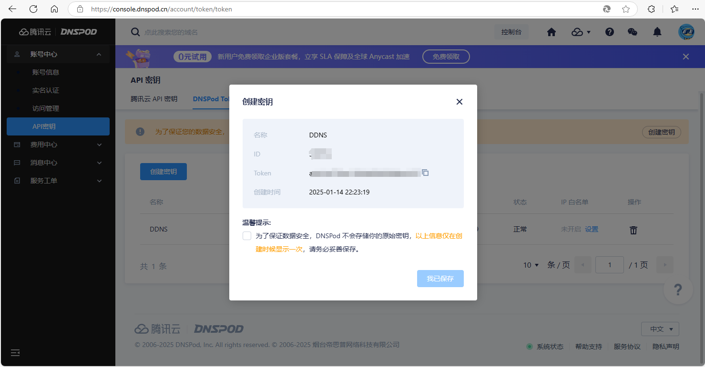

### QWRT

OpenWRT 中，服务 - 动态DNS - 添加

主机名和域名填域名或子域名，用户名对应`ID`，密码对应`token`

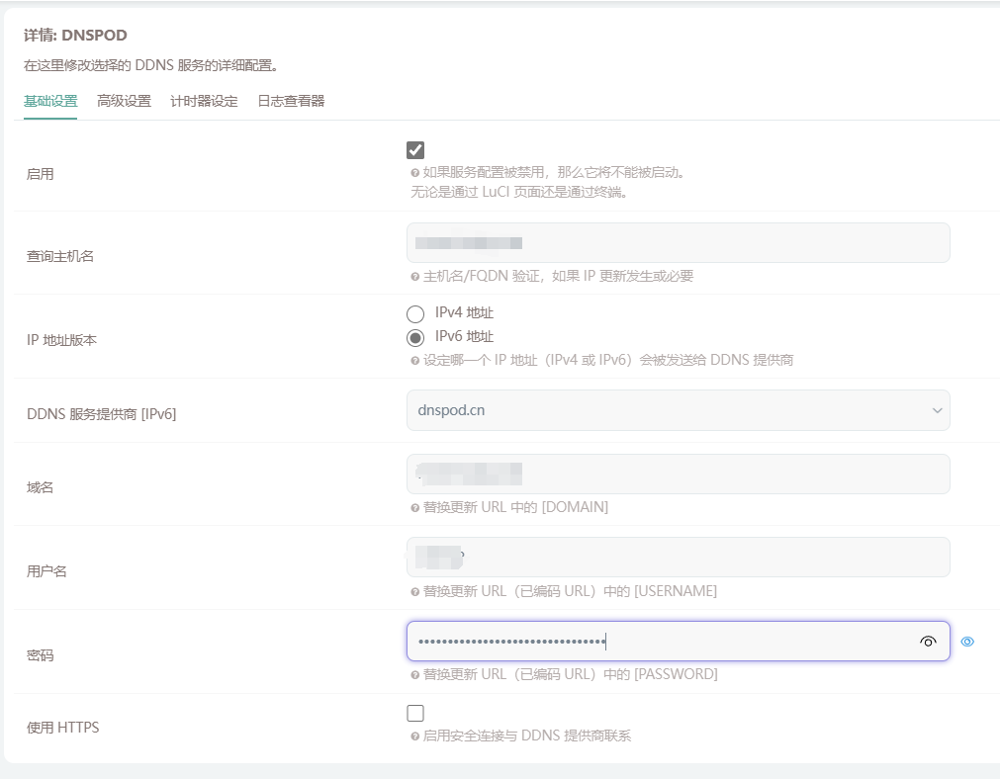


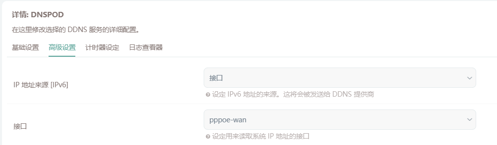

### DDNS-GO

> [GitHub - jeessy2/ddns-go: Simple and easy to use DDNS. Support Aliyun, Tencent Cloud, Dnspod, Cloudflare, Callback, Huawei Cloud, Baidu Cloud, Porkbun, GoDaddy, Namecheap, NameSilo...](https://github.com/jeessy2/ddns-go)

安装后访问 http://localhost:9876

选择服务商，填入ID、token，根据需要开启 IPv4 或 IPv6。


### 问题

通过域名访问不到

- 通过 IPv6 地址 + 端口方式访问
- 在 DDNS-GO 日志或者服务商后台查看解析的 IPv6 地址是否已发生变化
- 检查防火墙是否放通端口
- 对比防火墙中放通的 IP 后缀是否已发生变化

无外乎是以上几个问题，不要怀疑是玄学问题:dog:

# Lucky

> 目前已经实现/集成的主要功能模块有
>
> - 端口转发
> - 动态域名(DDNS)
> - Web服务
> - Stun内网穿透
> - 网络唤醒
> - 计划任务
> - ACME自动证书
> - 网络存储
>
> [介绍 | Lucky](https://lucky666.cn/docs/intro)

[安装运行&升级备份 | Lucky](https://lucky666.cn/docs/install#自动脚本安装)

```bash
# 注意修改后面的版本号
root@QWRT:/tmp# curl -o /tmp/install.sh   http://6.66666.host:66/files/golucky.sh  && sh /tmp/install.sh http://6.66666.host:66/files 2.14.0
  % Total    % Received % Xferd  Average Speed   Time    Time     Time  Current
                                 Dload  Upload   Total   Spent    Left  Speed
100 15365  100 15365    0     0  28655      0 --:--:-- --:--:-- --:--:-- 28666
当前CPU架构:arm64
*************************************************
**                 欢迎使用                    **
**                Lucky 管理脚本               **
**                             by  古大羊      **
**                          2022.08.01 15:49   **
*************************************************
 1 安装Lucky
 2 卸载Lucky
-----------------------------------------------
 0 退出脚本
请输入对应数字 > 1
安装Lucky...
目标文件下载链接:http://6.66666.host:66/files/2.14.0/lucky_2.14.0_Linux_arm64.tar.gz
-----------------------------------------------
安装lucky至少需要预留约6MB的磁盘空间
 1 在/etc目录下安装(适合root用户)
 2 在/usr/share目录下安装(适合Linux设备)
 3 在当前用户目录下安装(适合非root用户)
 4 手动设置安装目录
 0 退出安装
-----------------------------------------------
请输入相应数字 > 1
目标目录/etc空间剩余：342.9M
确认安装？(1/0) > 1
luckdir:/etc/lucky.daji
######################################################################### 100.0%
-----------------------------------------------
开始解压文件！
LICENSE
scripts/lucky.service
scripts/luckyservice
scripts/misnap_10k_init.sh
scripts/misnap_init.sh
lucky
已解压到 /etc/lucky.daji
Profile:/etc/profile
设为init.d方式启动
lucky已成功运行
```

> [!TIP]
>
> 卸载也是用这个脚本

默认登陆地址 : http://\{IP地址\}:16601
默认账号：666
默认密码：666

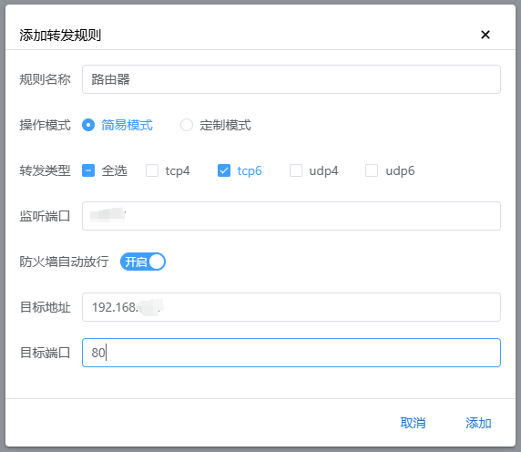

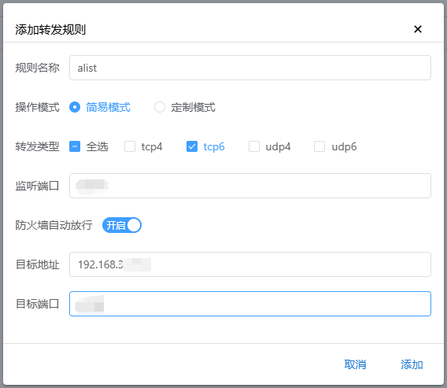

# Tailscale

常用的组网工具 Tailscale、Zerotier、Cloudflare Tunnel。

> Tailscale 基于 [WireGuard](https://www.wireguard.com/) 协议在您的计算机、VM 或容器（WireGuard 称为“端点”，我们称之为“节点”）和网络中的任何其他节点之间创建一组极其轻量级的加密隧道，实现安全、快速的异地组网。
>
> [Tailscale · Best VPN Service for Secure Networks](https://tailscale.com/)

### 安装 Tailscale

可以在 iStore 中安装。

### 开启子网路由

```bash
# 启动服务
/etc/init.d/tailscale start
# 开启子网路由
tailscale up --accept-dns=false --advertise-routes=192.168.31.0/24 --advertise-exit-node

# 开机启动
/etc/init.d/tailscale enable
```

- --netfilter-mode=off：关闭自动添加防火墙功能，因为该功能会影响新版本的防火墙配置。
- --accept-dns=false：关闭接受 dns 通告，不接受服务器的dns。
- --accept-routes：接受其他子网路由器以及作为子网路由器的任何其他节点的通告路由。
- --advertisse-routes：将物理子网路由公开到整个 Tailscale 网络。
- --advertise-exit-node：作为Tailscale网络出口节点。

开启后控制台提示点击链接认证

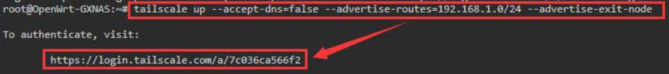

在浏览器中打开链接，登录账号，点击`Connect`按钮，页面提示成功后，控制台会打印`Success`。

### 添加接口

网络 - 接口 - 添加新接口

- 名称：Tailscale
- 协议：静态地址
- 设备：tailscale0
- 防火墙设置 - 分配防火墙区域：lan

### 配置 openwrt 子网

在 Tailscale 控制台，可以看到已加入的 openwrt 设备，点击右侧的三个小点图标 - Edit route settings。

两个勾选分表表示：

- 可以通过声明的 IP 段（advertise-routes）访问子网中的设备
- 允许作为 tailscale 网络的出口端点

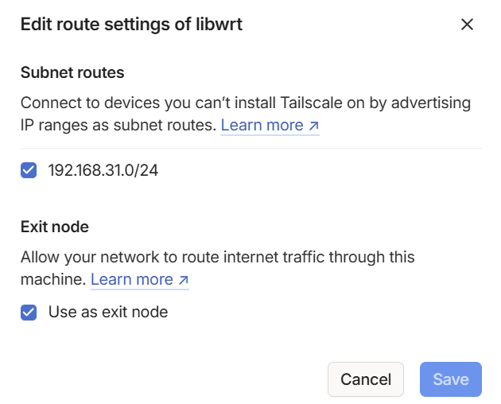

> [OpenWrt安装Tailscale设置内网穿透+科学出国+外网互访局域网设备 - GXNAS博客](https://wp.gxnas.com/14248.html)
>
> [OpenWrt安装配置Tailscale实现内网穿透，异地组网 – 老胡的博客](https://iqotom.com/?p=1873)
>
> [tailscale两台openwrt(双lan)网对网(site to site)互通 - 孟夏十二の天空孟夏十二の天空](https://www.aprdec.top/tailscale两台openwrt双lan网对网site-to-site互通/)

### 在其他设备访问子网

下载客户端：

- [Download | Tailscale](https://tailscale.com/download)
- Android：[GitHub - tailscale/tailscale-android: Tailscale Android Client](https://github.com/tailscale/tailscale-android)

### 问题

##### 网络访问很慢，延迟高

延迟高是没有打洞成功，采用中转方式，网络速度很慢。

测试在 Tailscale 中重新打开连接开关并不管用，可以尝试退出客户端，重新进，一般是可以解决问题的。

### 科学上网

在 openwrt 中配置并启用科学上网后，在客户端选择出口端点（Exit Node）为 openwrt 设备。

# ZeroTier

组网工具，私有协议

> ZeroTier is a way to connect devices over your own private network anywhere in the world. You do this by creating a network and then joining *two or more devices* to that network. You can use ZeroTier to play games, connect to remote business resources or even as a cloud backplane for your enterprise.
>
> [ZeroTier | Global Networking Solution for IoT, SD-WAN, and VPN](https://www.zerotier.com/)

### 创建网络

注册 zerotier 账号，创建网络（Create A Network）

- Network ID：网络的唯一标识，用于客户端加入网络
- Members：客户端列表，可在此处授权客户端
- Access Control：访问控制，一般选`Private`，表示通过`Network ID`加入网络后，需要授权才能访问
- Managed Routes：路由管理，创建网络时，需要选择一个网段，每个客户端会被自动分配一个地址，添加`192.168.31.0/24 via 192.168.192.221`，即`192.168.31.0/24`子网由设备`192.168.192.221`（openwrt）处理，实现异地访问局域网。

### 添加接口

网络 - 接口 - 添加新接口

- 名称：zerotier
- 协议：不配置协议
- 设备：ztfxxxxxxx（z开头的网卡）
- 防火墙设置 - 分配防火墙区域：lan

# Netbird

组网工具，标题为再见Tailscale、Zerotier的组网神器:dog:

> NetBird combines a WireGuard®-based overlay network with Zero Trust Network Access, providing a unified platform for reliable and secure connectivity.
>
> NetBird将基于WireGuard网络与零信任网络访问相结合，为可靠和安全的连接提供统一平台
>
> [NetBird - Connect and Secure Your IT Infrastructure in Minutes](https://netbird.io/)

### 安装

##### 方式1：官网二进制

```bash
curl -fsSL https://pkgs.netbird.io/install.sh | sh
netbird up
```

> [Getting Started - NetBird Docs](https://docs.netbird.io/how-to/getting-started)

##### 方式2：opkg（非官方）

貌似没有这个必要，测试官方的方式也没有报错

> [GitHub - tbc0309/openwrt-netbird: OpenWrt package for netbird](https://github.com/tbc0309/openwrt-netbird)

### 添加节点（Peer）

##### 方式1：sso

用于简单添加

```bash
netbird up
```

会打印一个地址，复制到浏览器打开，登录 netbird 账号，确认添加

##### 方式2：setup key

需要先到 netbird 控制台生成一个`setup key`，通过 key 添加的设备，无需经过确认即可加入，用于无法打开浏览器的，快速批量添加

```bash
netbird up --setup-key xxxxxx-xxxxxx-xxxxxx-xxxxxx
```

### 添加路由

在控制台添加路由

- Network：子网，192.168.31.0/24
- Routing Peer：处理上述子网的设备，选择 openwrt 路由器
- 其他选择`all`，即默认分组

### 添加接口

安装 netbird 后，系统中会出现一个名为`wt0`的设备（网卡）。

网络 - 接口 - 添加新接口

- 名称：netbird
- 协议：静态地址
- IPv4 地址：100.xxx.xxx.xxx（netbird 控制台看自动分配的地址）
- 分配防火墙区域：lan

> [分享一款可替代tailscale和zerotier远程控制插件——netbird-OPENWRT专版-恩山无线论坛](https://www.right.com.cn/forum/thread-8306894-1-1.html)

### 卸载

官网竟然貌似没有卸载方法

```bash
# 卸载服务
netbird uninstall
# 二进制
rm -f /usr/bin/netbird
# opkg
opkg remove netbird
# 删除配置文件
rm -rf /etc/netbird
```

# EasyTier

一个简单、安全、去中心化的内网穿透 SD-WAN 异地组网方案，使用 Rust 语言和 Tokio 框架实现。

> [EasyTier - 简单、安全、去中心化的异地组网方案](https://easytier.cn/)

本教程以公共服务器为例，也可以使用热心网友提供的服务器，或是自建服务器。

### web 控制台组网方式

EasyTier 支持使用 [Web 控制台](https://easytier.cn/web#/) 来管理 EasyTier 节点，包括查看节点状态、配置节点参数、查看节点日志等。打开控制台，注册账号。

##### openwrt插件

- 勾选启用
- 启动方式：WEB配置

保存，重启，后，可以在web控制台看见这个设备。

##### 网络配置

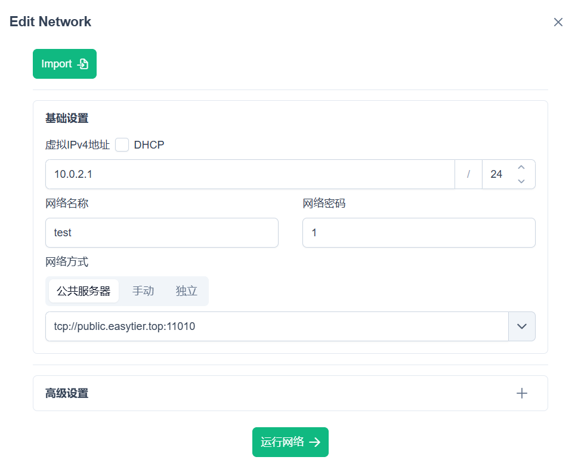

##### 路由配置

点击高级设置，子网代理CIDR中填入要路由的子网网段，如`192.168.2.1/24`。这样其他设备就可以用 IP 直接访问到这个子网内的设备。

### 其他设备加入组网

基本上填入用户名、密码就可以加入组网

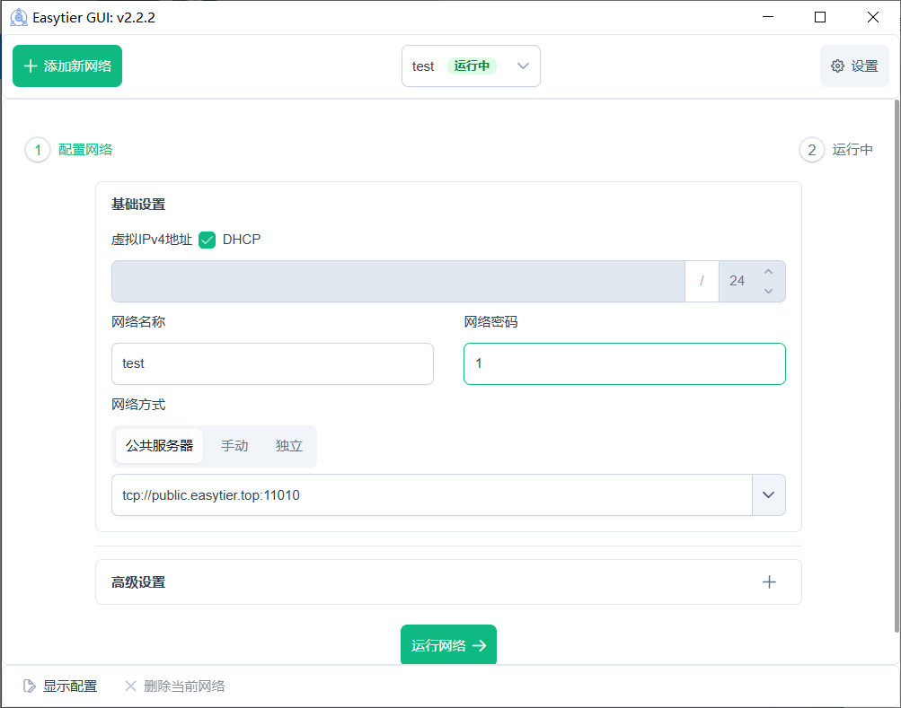

### 疑惑

##### 关于安全性与去中心化组网

web 方式配置的时候，只需要配置用户名，而不用配置密码，设备就添加到 web 配置页面了。。

当前，仅添加设备是无法连接到任何其他设备的，只是如果别人乱来连接，总是有点不好

去中心化组网的关键是进行网络配置，只有多个端在网络配置中配置了相同的网络账号和密码，才能实现组网，安全性上是完全没有问题的。

# 组网方式实测

三大组网方式配置方式差不多，基本都是添加节点、添加路由、添加接口，不需要配置防火墙，下载客户端连接即可。

均使用免费套餐时各软件表现：

|                | Tailscale    | zerotier   | netbird      | EasyTier     |
| -------------- | ------------ | ---------- | ------------ | ------------ |
| 测试版本       | 1.80         | 1.14.2     | 0.36.5       | 2.2.2        |
| 连接速度       | **很快**     | **很快**   | 一般         | **很快**     |
| 宽带打洞成功率 | 很低         | 需要几次   | **一次成功** | **一次成功** |
| 4G打洞成功率   | **一次成功** | 需要几次   | 一般         | **一次成功** |
| 打洞成功后速率 | **很快**     | **很快**   | 一般         | **很快**     |
| 设备数         | 100          | 10         | 100          | **无限**     |
| 路由           | **无限**     | 一条       | **无限**     | **无限**     |
| 出口端点       | **支持配置** | 不支持配置 | **支持配置** | **支持配置** |

> [!TIP]
>
> 上述路由条数即点对网数量，理论上只要支持多条，那么使用两个网络的**网关**（路由器）作为节点加入组网，各自配置**到它子网的路由**（EasyTier 术语：代理子网），即可实现网对网。
>
> EasyTier 文档中对网对网有具体描述：[网对网 | EasyTier - 简单、安全、去中心化的异地组网方案](https://easytier.cn/guide/network/network-to-network.html)

综上，作为组网工具，网络质量是最主要的考量标准，在稳定性面前，一切花里胡哨的功能和良心配置都只能靠边站😭，~~zerotier 成为最终选择~~，没想到还有高手，easytier 堪称完美🥰。

关于 zerotier

- 对免费用户：仅支持3个网络，LAN外仅支持一条路由，如果有两个局域网需要配置，在免费计划下，只能分别创建两个网络，将需要连接的设备分别加到两个网络下，需要连不同的网时，就在客户端切换一下，也算勉强可以，毕竟如远程连接、访问局域网内的网络服务，更多时候是一对多，而不是多对多。
- 出口端点：可以参考网上教程配置全隧道模式：[有的人想通过zerotier节点上网（全隧道模式），手把手教你如何操作，贼简单-OPENWRT专版-恩山无线论坛](https://www.right.com.cn/forum/thread-8395369-1-1.html)

关于 Android 客户端

- Tailscale：apkmirror 等 xapk 总是安装失败，不过 github 中提供了 apk，参考上文
- zerotier：apk 获取比较方便
- netbird：apkmirror 等 xapk 总是安装失败，只能安装旧版 apk，网上有讨论说访问慢可能是 Android 客户端的锅，Android 客户端版本为 0.24，可能开发确实没有跟上版本，值得期待

关于 EasyTier

- 没有收费项目，完全免费，无限制使用
- 功能性、连接速度、稳定性方面完虐其他几款
- 堪称完美、良心！
- 唯一的缺点可能就是文档不够完善，要不是玩过其他几款还真不一定玩得来

# 命令

查看软件进程

```bash
root@LibWrt:~# ps | grep netbird
10721 root     1241m S    /usr/bin/netbird service run
17545 root      1392 S    grep netbird
root@LibWrt:~# cat /proc/10721/status
Name:   netbird
Umask:  0022
State:  S (sleeping)
Tgid:   10721
Ngid:   0
Pid:    10721
PPid:   1
TracerPid:      0
Uid:    0       0       0       0
Gid:    0       0       0       0
FDSize: 64
Groups:
NStgid: 10721
NSpid:  10721
NSpgid: 1
NSsid:  1
Kthread:        0
VmPeak:  1270936 kB
VmSize:  1270936 kB
VmLck:         0 kB
VmPin:         0 kB
VmHWM:     50164 kB
VmRSS:     49240 kB
RssAnon:           23864 kB
RssFile:           25376 kB
RssShmem:              0 kB
VmData:    65252 kB
VmStk:       132 kB
VmExe:     28160 kB
VmLib:       744 kB
VmPTE:       172 kB
VmSwap:        0 kB
CoreDumping:    0
THP_enabled:    0
untag_mask:     0xffffffffffffff
Threads:        10
SigQ:   0/3956
SigPnd: 0000000000000000
ShdPnd: 0000000000000000
SigBlk: fffffffc3bba3a00
SigIgn: 0000000000000000
SigCgt: fffffffc7fc1feff
CapInh: 0000000000000000
CapPrm: 000001ffffffffff
CapEff: 000001ffffffffff
CapBnd: 000001ffffffffff
CapAmb: 0000000000000000
NoNewPrivs:     0
Seccomp:        0
Seccomp_filters:        0
Speculation_Store_Bypass:       vulnerable
SpeculationIndirectBranch:      unknown
Cpus_allowed:   f
Cpus_allowed_list:      0-3
Mems_allowed:   1
Mems_allowed_list:      0
voluntary_ctxt_switches:        11
nonvoluntary_ctxt_switches:     83
root@LibWrt:~# kill -9 10721
```

- VmSize：虚拟内存占用
- VmRSS：常驻内存占用

搜索、卸载软件包

```bash
root@LibWrt:~# opkg list | grep bird
netbird - 0.36.4-1
root@LibWrt:~# opkg remove netbird
Removing package netbird from root...
```


# ~~修改 SSH 和管理网页用户名密码~~

> [!WARNING]
>
> 修改 root 用户名会导致一堆问题，亲测保存 DDNS 和防火墙保存会一直卡在正在应用

假设修改为`name`

```bash
# 修改用户名
vim /etc/passwd
name:x:0:0:root:/root:/bin/ash

vim /etc/shadow
name:...:19991:0:99999:7:::

vim /etc/config/rpcd
config login
        option username 'name'
        option password '$p$name'

vim /usr/lib/lua/luci/controller/admin/index.lua
e.sysauth="name"

# 修改密码
passwd

# 重启
reboot
```

