# 京东云亚瑟

亚瑟采用高通 IPQ6018，4核 A53，力压一众联发科 MT7981B 双核 A53，咸鱼价格60左右，可谓是性价比拉满。

### 刷机路线

uboot → 刷第三方固件

进入 uboot 方法：

1. 断电
2. 按住 reset 按钮
3. 插入电源，红灯闪烁，直至变为蓝灯，松开 reset
4. 电脑修改固定 IP 192.168.1.2，浏览器访问 192.168.1.1

访问不通，可以尝试：

- IP 与光猫网段冲突，拔掉 WAN 口线
- 电脑换个 LAN 口
- 重新进入 uboot

### 刷机流程

登录路由器之后，可以在底部查看系统版本号，各版本刷 uboot 方式：

- 1.5.40.r2181：SSH
- 4.0.0.r4015：TTL、9008
- 4.3.0.r4211：9008
- 更高：未测试
- 直接硬改 EMMC

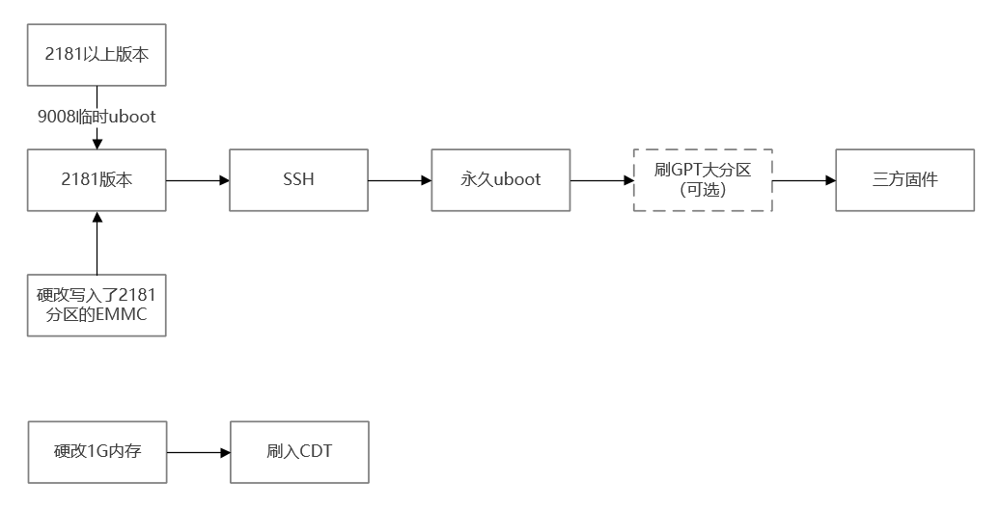

### 文件上传

开启后 SSH 后，即可使用 WinSCP 等工具，将文件上传到路由器

- 协议：SCP
- IP：路由器 IP，官方：192.168.68.1，三方固件可查看固件介绍，或者自动获取 IP 从网卡查看
- 端口：22
- 密码：路由器密码

# 固件

### lean - QWRT

- 闭源
- 内核版本 5.x
- 

俗称的大雕固件，总体用下来非常 OK


# SSH 刷入 uboot

登录路由器，F12 打开控制台，输入以下命令回车

```javascript
$.ajax({
    url: "/jdcapi",
    async: false,
    data: JSON.stringify({
        jsonrpc: "2.0",
        id: 1,
        method: "call",
        params: [
            $.cookie("sessionid"),
            "service",
            "set",
            {
                "name": "dropbear",
                "instances": {"instance1": {"command": ["/usr/sbin/dropbear"]}}
            }
        ]
    }),
    dataType: "json",
    type: "POST"
})
```

> [!TIP]
>
> 如果浏览器控制台无法粘贴的话，直接在 Console 输入 allow pasting 后 Enter 即可开启粘贴功能

使用 putty 等 SSH 连接到路由器（192.168.68.1:22），账号 root/管理页面密码：

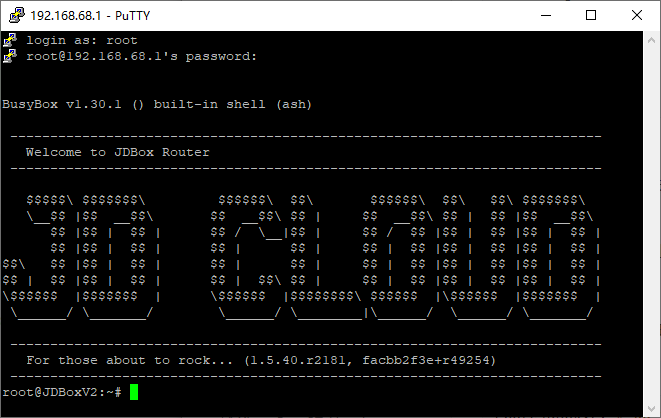

WinSCP 连接：

**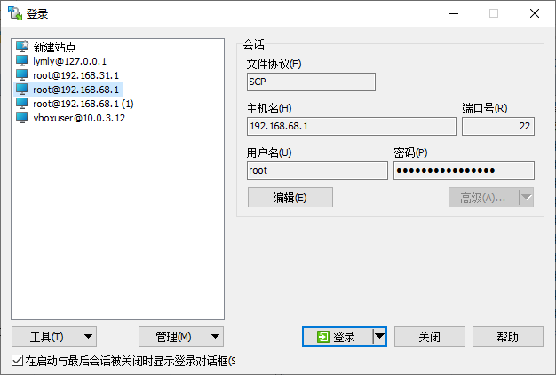**

将 uboot 文件（不死 uboot：uboot-JDC_AX1800_Pro-AX6600_Athena-20240510.bin）上传到路由器

刷写uboot到0:APPSBL和0:APPSBL_1分区：

```bash
root@JDBoxV2:~# dd if=/tmp/uboot-JDC_AX1800_Pro-AX6600_Athena-20240510.bin of=$(blkid -t PARTLABEL=0:APPSBL -o device) conv=fsync
1280+0 records in
1280+0 records out
655360 bytes (640.0KB) copied, 0.048256 seconds, 13.0MB/s
root@JDBoxV2:~# dd if=/tmp/uboot-JDC_AX1800_Pro-AX6600_Athena-20240510.bin of=$(blkid -t PARTLABEL=0:APPSBL_1 -o device) conv=fsync
1280+0 records in
1280+0 records out
655360 bytes (640.0KB) copied, 0.048341 seconds, 12.9MB/s
```

输入命令检查分区md5 hash值，和我这版2024.05.10编译的md5一致即可：

```bash
root@JDBoxV2:~# md5sum $(blkid -t PARTLABEL=0:APPSBL -o device) && md5sum $(blkid -t PARTLABEL=0:APPSBL_1 -o device)
5e1817f795ada48335fda9f22545a43e  /dev/mmcblk0p13
5e1817f795ada48335fda9f22545a43e  /dev/mmcblk0p14
```

> [Actions-OpenWrt/Tutorial/JDCloud-AX1800-Pro_AX6600-Athena.md at main · lgs2007m/Actions-OpenWrt · GitHub](https://github.com/lgs2007m/Actions-OpenWrt/blob/main/Tutorial/JDCloud-AX1800-Pro_AX6600-Athena.md)

# 降级刷入 uboot

已知最高 4211 版本可以利用高通 9008 从 uboot 刷入官方固件降级

1. 安装高通驱动 Qualcomm USB Driver v1.0.10061.1.exe

2. 双公头 USB 线连接电脑，USB短接主板背面触点，路由器通电，如果成功，设备管理器会出现`端口（COM 和 LPT）`

   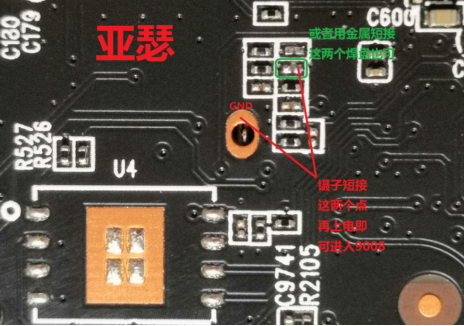

3. 执行`USB命令.bat`输入com口（设备管理器查看 9008 com 端口），回车，第一次执行成功的输出；观察“设备管理器”那里会刷新两次，再次出现 9008

4. 继续回车，第二次执行成功的输出（这次执行应该只需要几秒钟）。同时看灯，只要变红，立刻按住reset，闪烁的红灯变蓝灯，松开reset

5. 浏览器输入192.168.1.1 即可进入 uboot

6. 上传 2181 版本官方固件，刷入

7. 红灯常量后，修改电脑为自动获取 ip，访问 192.168.68.1

8. 执行[SSH 刷入 uboot](#SSH 刷入 uboot)中的步骤

> [!TIP]
>
> 由于此处刷入的是临时 uboot，所以最好降级后，用 SSH 方式刷入永久 uboot，方便后续刷三方固件。

> [【新提醒】亚瑟4211拆机9008免TTL刷uboot教程-京东云、网心云、玩客云等PCDN云设备-恩山无线论坛](https://www.right.com.cn/forum/thread-8386067-1-1.html)
>
> [【新提醒】京东云亚瑟&雅典娜恢复官方固件4.0.0.4015或者1.5.70.2242以及亚瑟原始分区文件-京东云、网心云、玩客云等PCDN云设备-恩山无线论坛](https://www.right.com.cn/FORUM/thread-8379578-1-1.html)
>
> [【新提醒】京东云亚瑟/雅典娜 通用的官方原厂固件-OPENWRT专版-恩山无线论坛](https://www.right.com.cn/forum/thread-8341657-1-1.html)

# 刷 GPT 大分区

此处大分区特指`rootfs`分区，系统固件就是刷入这个分区，原厂的分区只有60MB大小，不够刷入某些固件 + 后续安装软件。所以需要输入 GPT 分区表，将这个分区扩大，目前有现成的512MB、1024MB、2048MB分区表。

上传 GPT 分区表到路由器

```bash
# 检查md5
root@JDBoxV2:~# md5sum /tmp/gpt-JDC_*_dual-boot_rootfs*M_no-last-partition.bin
# 亚瑟gpt md5
9d9e3803ba541ff38449acd181026b28  /tmp/gpt-JDC_AX1800_Pro_dual-boot_rootfs512M_no-last-partition.bin
5aaf1b606458fbffc72342540db9bc52  /tmp/gpt-JDC_AX1800_Pro_dual-boot_rootfs1024M_no-last-partition.bin
b93b4823af2b4fc31d22c25468181e7a  /tmp/gpt-JDC_AX1800_Pro_dual-boot_rootfs2048M_no-last-partition.bin

# 刷入2G大分区
dd if=/tmp/gpt-JDC_AX1800_Pro_dual-boot_rootfs2048M_no-last-partition.bin of=/dev/mmcblk0 bs=512 count=34 conv=fsync
dd if=/dev/mmcblk0 bs=512 count=34 | md5sum

# 实际执行情况
root@JDBoxV2:~# md5sum /tmp/gpt-JDC_*_dual-boot_rootfs*M_no-last-partition.bin
b93b4823af2b4fc31d22c25468181e7a  /tmp/gpt-JDC_AX1800_Pro_dual-boot_rootfs2048M_no-last-partition.bin
root@JDBoxV2:~# dd if=/tmp/gpt-JDC_AX1800_Pro_dual-boot_rootfs2048M_no-last-part
ition.bin of=/dev/mmcblk0 bs=512 count=34 conv=fsync
34+0 records in
34+0 records out
17408 bytes (17.0KB) copied, 0.001628 seconds, 10.2MB/s
root@JDBoxV2:~# dd if=/dev/mmcblk0 bs=512 count=34 | md5sum
34+0 records in
34+0 records out
17408 bytes (17.0KB) copied, 0.000194 seconds, 85.6MB/s
b93b4823af2b4fc31d22c25468181e7a  -
```


# 分区备份

挂载最后的大分区（27）

```bash
mkdir /mnt/mmcblk0p27
mount -t ext4 /dev/mmcblk0p27 /mnt/mmcblk0p27
```

备份分区（1-26）到最后的大分区

```bash
dd if=/dev/mmcblk0 bs=512 count=34 of=/mnt/mmcblk0p27/mmcblk0_GPT.bin conv=fsync
dd if=/dev/mmcblk0p1 of=/mnt/mmcblk0p27/mmcblk0p1_0SBL1.bin conv=fsync
dd if=/dev/mmcblk0p2 of=/mnt/mmcblk0p27/mmcblk0p2_0BOOTCONFIG.bin conv=fsync
dd if=/dev/mmcblk0p3 of=/mnt/mmcblk0p27/mmcblk0p3_0BOOTCONFIG1.bin conv=fsync
dd if=/dev/mmcblk0p4 of=/mnt/mmcblk0p27/mmcblk0p4_0QSEE.bin conv=fsync
dd if=/dev/mmcblk0p5 of=/mnt/mmcblk0p27/mmcblk0p5_0QSEE_1.bin conv=fsync
dd if=/dev/mmcblk0p6 of=/mnt/mmcblk0p27/mmcblk0p6_0DEVCFG.bin conv=fsync
dd if=/dev/mmcblk0p7 of=/mnt/mmcblk0p27/mmcblk0p7_0DEVCFG_1.bin conv=fsync
dd if=/dev/mmcblk0p8 of=/mnt/mmcblk0p27/mmcblk0p8_0RPM.bin conv=fsync
dd if=/dev/mmcblk0p9 of=/mnt/mmcblk0p27/mmcblk0p9_0RPM_1.bin conv=fsync
dd if=/dev/mmcblk0p10 of=/mnt/mmcblk0p27/mmcblk0p10_0CDT.bin conv=fsync
dd if=/dev/mmcblk0p11 of=/mnt/mmcblk0p27/mmcblk0p11_0CDT_1.bin conv=fsync
dd if=/dev/mmcblk0p12 of=/mnt/mmcblk0p27/mmcblk0p12_0APPSBLENV.bin conv=fsync
dd if=/dev/mmcblk0p13 of=/mnt/mmcblk0p27/mmcblk0p13_0APPSBL.bin conv=fsync
dd if=/dev/mmcblk0p14 of=/mnt/mmcblk0p27/mmcblk0p14_0APPSBL_1.bin conv=fsync
dd if=/dev/mmcblk0p15 of=/mnt/mmcblk0p27/mmcblk0p15_0ART.bin conv=fsync
dd if=/dev/mmcblk0p16 of=/mnt/mmcblk0p27/mmcblk0p16_0HLOS.bin conv=fsync
dd if=/dev/mmcblk0p17 of=/mnt/mmcblk0p27/mmcblk0p17_0HLOS_1.bin conv=fsync
dd if=/dev/mmcblk0p18 of=/mnt/mmcblk0p27/mmcblk0p18_rootfs.bin conv=fsync
dd if=/dev/mmcblk0p19 of=/mnt/mmcblk0p27/mmcblk0p19_0WIFIFW.bin conv=fsync
dd if=/dev/mmcblk0p20 of=/mnt/mmcblk0p27/mmcblk0p20_rootfs_1.bin conv=fsync
dd if=/dev/mmcblk0p21 of=/mnt/mmcblk0p27/mmcblk0p21_0WIFIFW_1.bin conv=fsync
dd if=/dev/mmcblk0p22 of=/mnt/mmcblk0p27/mmcblk0p22_rootfs_data.bin conv=fsync
dd if=/dev/mmcblk0p23 of=/mnt/mmcblk0p27/mmcblk0p23_0ETHPHYFW.bin conv=fsync
dd if=/dev/mmcblk0p24 of=/mnt/mmcblk0p27/mmcblk0p24_plugin.bin conv=fsync
dd if=/dev/mmcblk0p25 of=/mnt/mmcblk0p27/mmcblk0p25_log.bin conv=fsync
dd if=/dev/mmcblk0p26 of=/mnt/mmcblk0p27/mmcblk0p26_swap.bin conv=fsync
sync
```

将备份文件拷贝到电脑保存

# 刷入问题

##### 刷入 uboot 或者固件后访问不通

- 访问 uboot 需要修改电脑 IP 为`192.168.1.2`，刷入固件需要设置自动获取 IP
- 电脑需要插在 LAN 口，可以尝试换一个 LAN 口
- 重启路由器

# 硬改

### 所需工具😭

| 工具       | 大洋  |
| ---------- | ----- |
| 镊子       | 5     |
| 读卡器     | 3.09  |
| emmc转tf   | 10.73 |
| 热风枪     | 60.35 |
| 硬毛刷     | 7     |
| 助焊膏     | 13.8  |
| emmc锡网   | 12    |
| 锡桨刮刀   | 2     |
| 软毛刷     | 1     |
| 锡膏       | 10.5  |
| 隔热垫     | 9.9   |
| 吸锡带     | 5.13  |
| emmc芯片   | 6.49  |
| 内存芯片   | 19    |
| 不锈钢刷   | 5.14  |
| USD读卡器  | 25.64 |
| emmc芯片   | 6.51  |
| 内存锡网   | 3     |
| 无尘布     | 2.4   |
| 导热硅胶片 | 37.9  |
| 99%酒精    | 12.9  |
| 弯头镊子   |       |
| 电烙铁     |       |

### 芯片型号

| 芯片 | 型号                                       | 大小 |
| ---- | ------------------------------------------ | ---- |
| EMMC | KLM8G1GETF-B041 FBGA-153 5.1               | 8GB  |
| 内存 | MT41K512M16HA-107:A 印丝 D9SDQ  DDR3L-1866 | 1GB  |

> 因为这个机子和AX5 JDC很像，就是多了一个USB3.0，所以大概率是可以改内存的，索性现在就改了内存。看原厂内存是Nanya NT5CB256M16DP-EK，B代表1.5V，应该是1.5V DDR3-1866 BGA96的颗粒。 可以用镁光单晶1G颗粒D9STQ D9SDQ，颗粒是兼容1.5V和1.35V的。 
>
> D9STQ MT41K512M16HA-125:A DDR3L-1600 
>
> D9SDQ MT41K512M16HA-107:A DDR3L-1866 
>
> 我更换了D9SDQ，因为是1866的哈
>
> 大佬的帖子已无法打开

### EMMC 转 tf

要仔细阅读卖家的说明，过程中多询问卖家

> 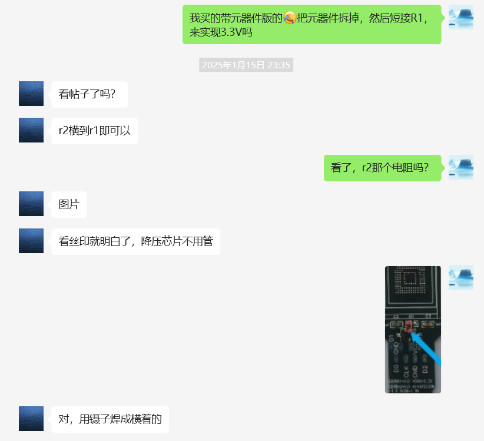
>
> 朋友圈帖子：
>
> EMMC-153/169-TF转接板：已往出货是不带元器件，应广大客户要求部分带元器件出货，至此有两种版。
>         首先简单普及一下EMMC芯片的基本知识，EMMC芯片核心供电电压vccq有两种1.8v和3.3v，根据个人使用情况90%的都是3.3V（代表品牌三星 闪迪 金士顿 国产的江波龙等）很少一部分是1.8v（典型代表东芝 ）随着5.1版本的普及会有很多1.8V甚至1.2V的出现。在此说的电压不是严格的电压，而是定义电平比较好，有个区间范围，灵活运用。
>         不是说你购买贵的就好，适合自己的最好。不带元器件版是默认3.0V，简单粗暴锡疙瘩短接r1=0 r2=∞就👌，带元器件版本是默认1.8V，r2=0 r1=∞根据自己实际需要反之；转接板可以让你的硬盘免开卡变成内存卡，焊盘多次焊接使用费了以后，还可以当isp飞线板已做了预留

原本 1.8V：

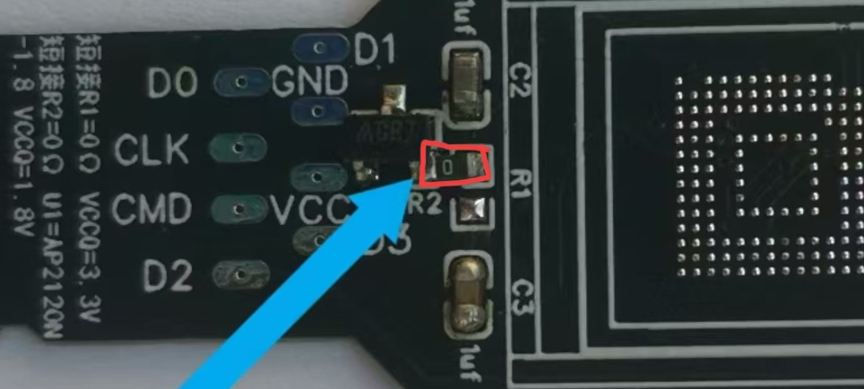

改 3.3V：

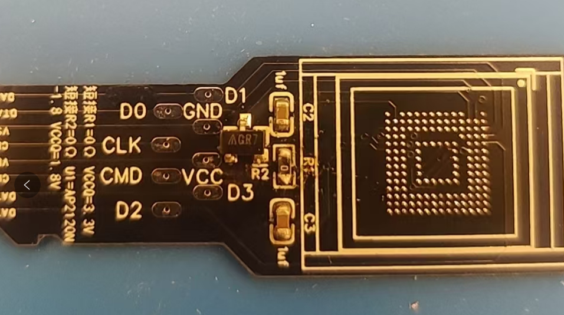

### 参考教程

> [请教一些亚瑟换emmc的问题-京东云、网心云、玩客云等PCDN云设备-恩山无线论坛](https://www.right.com.cn/forum/thread-8402119-1-1.html)
>
> 帖子讲的非常详细，我就是按照大佬的教程给设备接TTL备份完整固件，然后降级SSH开门，之后更换EMMC，中间有个EMMC容量不一致的问题困扰了我很久，最后研究很久(一度怀疑是自己EMMC没焊接好，反复焊接都是开机亮下红灯就灭)，后来将EMMC通过TF转接卡在diskgenius上查看发现有报分区表错误，然后醒悟应该是我原固件的前34扇区备份的分区表最后的数据分区是256G的，写入64G的EMMC中不适用导致报错了，通过diskgenius增减分区保存分区表解决此问题，按照这个方法理论上原固件可以在其它各种容量的EMMC中还原使用了
>
> [亚瑟（JDC AX1800PRO）折腾历程分享，适合有一定动手能力的同学-京东云、网心云、玩客云等PCDN云设备-恩山无线论坛](https://www.right.com.cn/forum/thread-8308574-1-1.html)
>
> [Actions-OpenWrt/Tutorial/JDCloud-AX1800-Pro_AX6600-Athena.md at main · lgs2007m/Actions-OpenWrt · GitHub](https://github.com/lgs2007m/Actions-OpenWrt/blob/main/Tutorial/JDCloud-AX1800-Pro_AX6600-Athena.md)


# 硬改 EMMC

### 查看 EMMC 寿命

```bash
root@JDBoxV2:~# var="$(cat /sys/kernel/debug/mmc0/mmc0\:0001/ext_csd)"
root@JDBoxV2:~# eol=${var:534:2};slc=${var:536:2};mlc=${var:538:2}
root@JDBoxV2:~# echo "EOL:0x$eol SLC:0x$slc MLC:0x$mlc"
EOL:0x01 SLC:0x04 MLC:0x01
```

EOL:0x01代表eMMC状态正常
SLC:0x04代表已使用30%-40%的寿命，预计剩余60%。
MLC:0x01江波龙这个型号的这个参数好像不变，不用看

貌似会先使用 SLC，SLC 用尽（0x0F），后，再开始用 MLC。SLC 性能高于 MLC。

### 合并分区文件

通过分区合并工具，将备份的26个分区文件合并为一个，实测几个工具的效果一致：

- bin merge

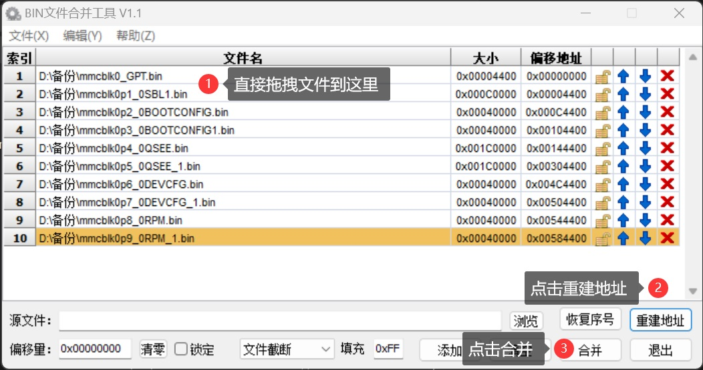

- WinHex（工具 - 文件工具 - 文件合并）

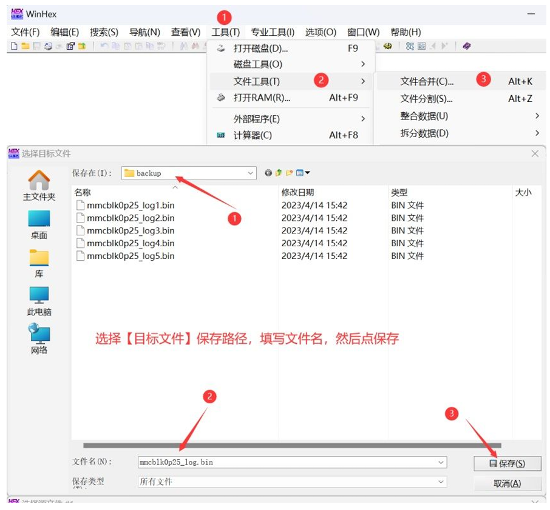

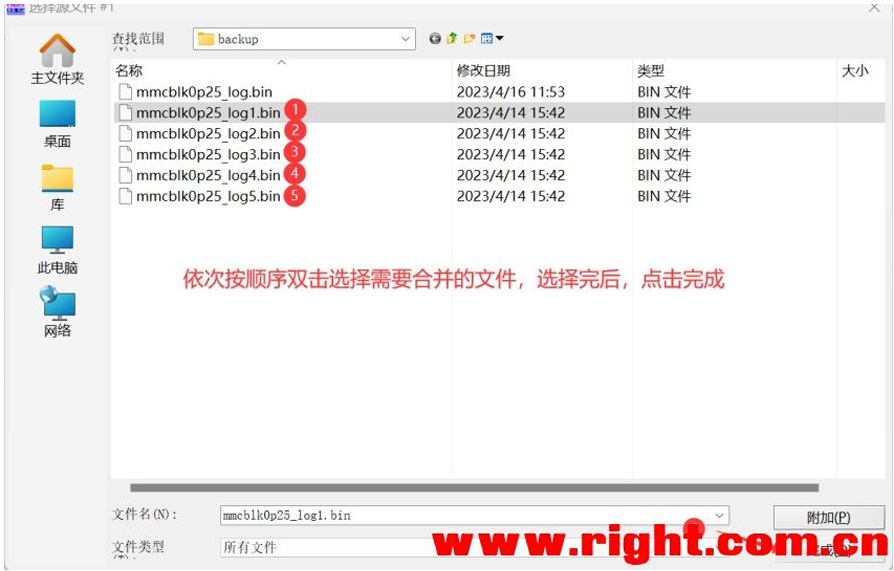

### 写入分区数据

将新的 emmc 焊接到 emmc 转 tf 上，插入 USD 读卡器（可能一般读卡器也行），插入电脑。此时读卡器灯亮，如果没亮，尝试换 USB 2.0 接口、重插 emmc 转 tf。

打开 WinHex，工具 - 打开磁盘，弹出窗口中看到 emmc，说明焊接没有问题。

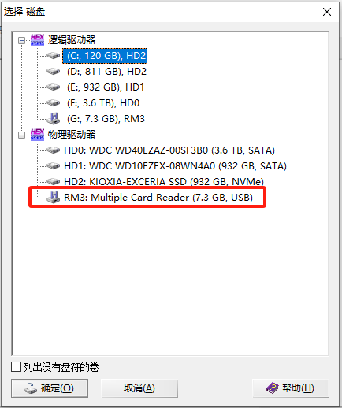

打开 WinHex，磁盘工具 - 磁盘克隆

- 源盘：合并后的分区文件
- 目标：emmc

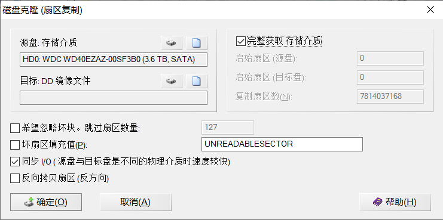

成功写入后，可以看到系统中出现了很多盘符

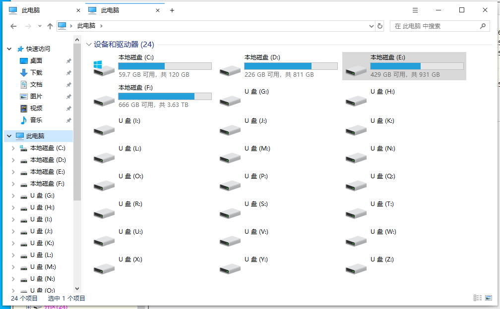

### 修复分区表

由于备份的分区文件来自原厂8G EMMC，直接写入64G EMMC 肯定是有问题的。

最简单的方式是，打开 Diskgenius，点击 RD3 盘，它会提示分区表有问题，点击更正即可，然后保存更改。

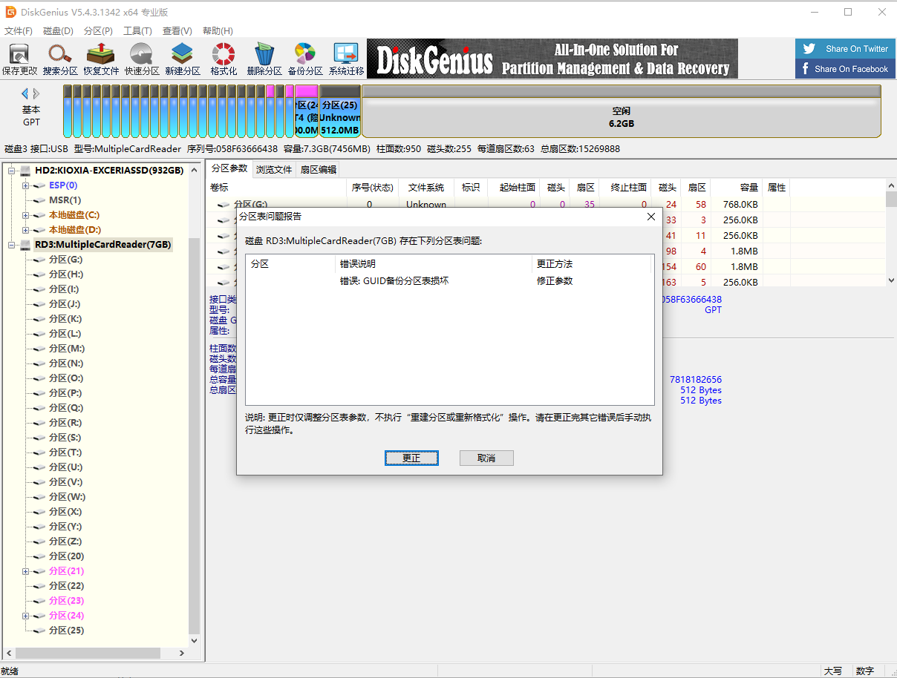

### 替换 EMMC

将 emmc 转 tf 和路由器上的 EMMC 取下，清洗焊盘/芯片后，将新 EMMC 焊接到 路由器。

冷却后插电开机测试，如果自动进入 9008，说明焊接或分区写入有问题。

# 硬改内存

直接用新的芯片替换旧芯片，冷却后插电开机测试，如果灯亮，说明没有问题。进入系统只能识别512MB，需要刷入CDT。

### 刷入 CDT

上传 CDT 文件到路由器

```bash
root@JDBoxV2:~# md5sum /tmp/cdt-Arthur_1G_DDR3.bin
6b0e4dd64171c6934e10255722bce062  /tmp/cdt-Arthur_1G_DDR3.bin
root@JDBoxV2:~# dd if=/tmp/cdt-Arthur_1G_DDR3.bin of=/dev/mmcblk0p10
1+1 records in
1+1 records out
548 bytes (548B) copied, 0.001859 seconds, 287.9KB/s
root@JDBoxV2:~# dd if=/tmp/cdt-Arthur_1G_DDR3.bin of=/dev/mmcblk0p11
1+1 records in
1+1 records out
548 bytes (548B) copied, 0.001867 seconds, 286.6KB/s
root@JDBoxV2:~# sync
```


# 焊接操作

### 风枪温度！！

风速：10（最低档）

温度：330，包括植锡、焊接到 emmc 转 tf、焊接到主板

拆原装芯片，原厂高温锡需要更高的温度：

- 拆 emmc：400
- 拆内存：420

> [!WARNING]
>
> 根据查阅资料温度不要超过 420，实测 480 温度焊盘掉点😭

温度比较玄学，但总体原则是：

- 拆芯片、洗焊盘、芯片要放助焊剂，有热传导、润滑的作用
- 风枪把周围吹几圈预热
- 拆芯片时，原厂高温锡可能需要吹一分钟左右；看到助焊剂比较干时，补助焊膏；看到助焊剂到处涌动时，用镊子轻推芯片，如果可以推动，保持吹风，把芯片夹下来，如果无法推动，
- 拆芯片、植锡时切忌对芯片硬拔

### 固定芯片

为防止小焊盘或者芯片在拖锡时移动，可使用固定夹具。

如果没有：

- 在纸板上，贴一条 1mm 厚的纸板条，这样可以在一个方向上限制它移动
- 可以在放芯片的位置点一点助焊剂（少点就行），用风枪吹化，这样芯片放上去会被粘住，有利于操作

### 拖锡

吸锡带的处理：

- 将吸锡带前端取一小段对折
- ~~用烙铁在其上面化一点锡，有利于热量传导~~
- ~~用烙铁将吸锡带压在纸板上几秒钟，给吸锡带预热~~
- 在焊盘上放一点助焊膏，可以非常丝滑地拖锡

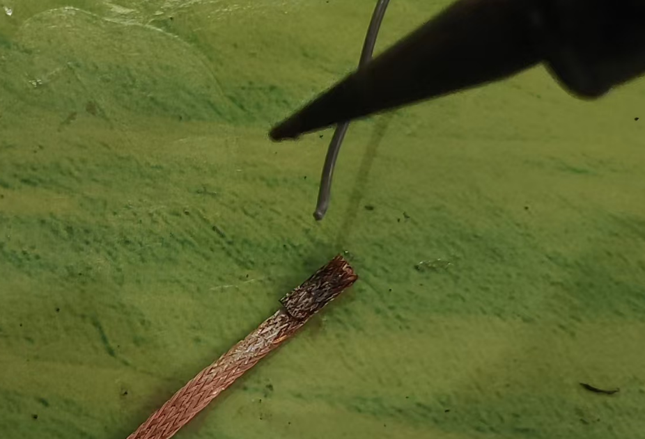

拖锡：

- 将焊盘或芯片放在纸板条旁边，往上面挤一些助焊剂（如果上面已经残留较多，可以不用）
- 一手拿吸锡带，一手拿烙铁，拖动方向与纸板条垂直。由于有纸板条的阻挡，拉的时候可以稍用力下压，推的时候就要减少下压。
- 拖锡时要根据阻力调整两手的力度，正常拖锡时，会感觉拖动非常顺滑，芯片也不容易被带着拖动。如果阻力较大，说明助焊剂不够，或者吸锡带热量不够、下方的锡点还没有融化，此时可以停在锡点上两三秒，如果有锡点融化、下沉的感觉，就可以正常拖锡了。
- 整个拖动过程力度都要轻，如果感觉吸锡带被锡粘住了，不可以硬拉，否则会把焊点拉掉，应该用烙铁头给他继续加热（最好用热风枪吹），将它轻轻的拿下来。

### 植锡

- 可以借助上面的纸板条，这样植锡网就能更好的跟芯片在同一平面。
- 最好使用弯头镊子，可以更好地压住植锡网。
- 焊锡膏一定不能太湿，抹焊锡膏的时候，呈现的样子应该是像玩具黏土一样，只是感觉是湿的，但是刮刀压没有雪花状的痕迹，方法：刮刀取焊锡膏之后，用纸包住按压 2-3次
- 风枪先往周围吹几圈，然后从一个角开始慢慢吹过去（左手持风枪，应该从右上角开始）
- 用嘴吹 10 下，抬起植锡网，正常情况，植锡网不会与芯片有任何粘连，如果有粘连，切忌硬翘下来，应抬起植锡网，用风枪将芯片吹掉下来。
- 观察到每个焊点都植锡成功了，如果有部分稍微有点歪，或者有一些像碎屑一样的薄薄的锡片，不要用镊子处理，用风枪一吹就可以完美解决

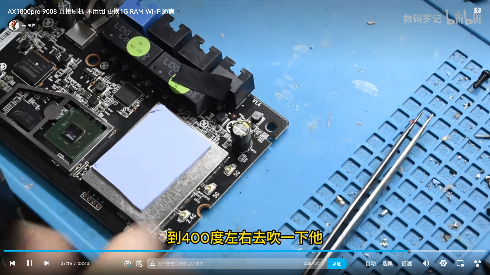

### 焊接

- 焊盘必须清理干净，往焊盘上挤一些助焊膏，用热风枪吹一下，尽量流到所有焊点上
- 根据 PCB 上的线框准确放上芯片，注意根据芯片右上角小圆点或触点辨别方向
- 使用热风枪竖直向下吹，注意另一只手拿镊子，防止芯片跑偏
- 看到芯片有一个下落的感觉，可以轻轻用镊子推芯片，如果有回弹，说明焊好了

> [!TIP]
>
> EMMC 可以根据触点判断方向，内存只能根据右上角原点判断，亚瑟摆放呈：PCB 正面朝上、内存离自己近的一侧，则内存右上角原点放于电路板右上角
