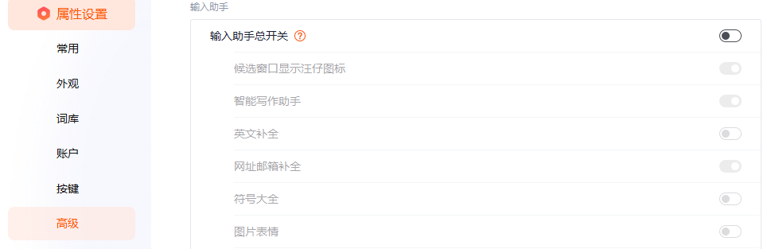

# 重装系统

# 备份

Sunshine：`C:\Program Files\Sunshine\config`，还原时可能仍然要新创建用户

Clash For Windows：`C:\Users\lymly\.config`

Maven：`C:\Users\lymly\.m2`

ssh：`C:\Users\lymly\.ssh`

桌面：个人文件

文档：微信、QQ聊天记录、游戏存档

# Windows Defender

在 Windows Defender 中排除所在目录`D:\tools`

# 激活

[GitHub - abbodi1406/KMS_VL_ALL_AIO: Smart Activation Script](https://github.com/abbodi1406/KMS_VL_ALL_AIO)

# Atlas

[AtlasOS - An optimized modification of Windows, designed for enthusiasts.](https://atlasos.net/)

下载：


包含一：


安装方法：[Installation - Atlas Documentation](https://docs.atlasos.net/getting-started/installation/)

1. Windows 更新中完成更新，并再次检查更新确认
2. 将 Microsoft Srore 中的应用更新
3. 下载 watt，开启 github 加速
4. 运行 AME，将 Playbook 拖入，根据提示下一步即可

> [!NOTE]
>
> 如果一直卡在`Installing utilities`或者`reticulating splines`，可能是卡在安装微软运行库，可以在一下路径查看日志：
>
> ```
> C:\ProgramData\AME\Logs\[2024-11-30 (X.XX 下午)] AtlasOS
> ```
>
> 实在不行尝试添加 hosts，IP 查询：[download.microsoft.com: DNS, IP, & Website Info](https://www.ipaddress.com/website/download.microsoft.com/)
>
> ```
> 2600:1408:ec00:887::317f download.microsoft.com
> ```
>

# Typora

文件 - 偏好设置


# 7z

[Download](https://www.7-zip.org/download.html)


搜狗输入法





删除 Components 文件夹，如果提示被进程占用，注销，进入系统后立马去删除


创建 Components 文件，没有权限就在桌面创建好拖进去，修改权限，应用、保存


同样方式配置`C:\Program Files (x86)\SogouInput\14.11.0.1351`下常驻进程的 exe（注意先在任务管理器结束进程再配置）：

- SGWangzai.exe
- SogouCloud.exe
- SGTool.exe

# Edge

### 同步

**先更新 Edge 浏览器，否则登录后，一直正在同步。**

### 设置

设置，搜索后台


搜索边


扩展开启开发人员模式，不然油猴脚本不正常


关闭共享资料，不然开始菜单中显示浏览记录:dog:


# IrFanView

下载：[IrfanView - Official Homepage - One of the Most Popular Viewers Worldwide](https://www.irfanview.com/)

语言：[IrfanView Languages](https://www.irfanview.com/languages.htm)，注意版本，选择安装版更方便，安装完成后，`Options - Set Language`

- 图标太丑，参看 [工具/ResourceHacker - 替换-360-文件夹应用图标](工具/ResourceHacker?id=替换-360-文件夹应用图标)

windows 照片应用图标：<a target="_blank" href="杂谈/assets/icon-microsoft-photo.ico">icon-microsoft-photo.ico</a>

### 设置


# Sunshine

打开 watt github 加速，安装过程会自动下载`ViGEmBug`。

安装可能卡在关于`ViGEmBug`的报错，不用管等一会就好。（如果用到 Moonlight 的虚拟手柄不正常的话，手动下载安装一下[Releases · nefarius/ViGEmBus](https://github.com/nefarius/ViGEmBus/releases)）

### VDD 虚拟显示器

[GitHub - itsmikethetech/Virtual-Display-Driver: Add virtual monitors to your windows 10/11 device! Works with VR, OBS, Sunshine, and/or any desktop sharing software.](https://github.com/itsmikethetech/Virtual-Display-Driver)

下载 beta 版本、名称为 VirtualDisplayDriver 的版本

1. 下载后解压到`C:\VirtualDisplayDriver\`
2. 管理员权限运行其中的 bat
3. 开始菜单右键 - 设备管理器，点击显示适配器，点击操作 - 添加过时硬件 - 下一步 - 手动安装 - 选择显示适配器 - 下一步 - 从硬盘安装 - 浏览选择`C:\VirtualDisplayDriver\`下的inf文件 - 确定 - 一直下一步
4. 在`D:\tools\multimonitortool-x64`目录，exe 中可以查看新增的显示，根据`Monitor Short Id`，修改各个脚本中的虚拟显示器id

# 电源 bat

```
powercfg /list
```

在`D:\tools\multimonitortool-x64`目录，将脚本中的电源计划 UUID 进行核对。

### 开始菜单快捷方式

bat - 右键 - 创建快捷方式，将快捷方式移动到`C:\Users\lymly\AppData\Roaming\Microsoft\Windows\Start Menu\Programs`，即可在开始菜单看到

# Steam

### 恢复已安装的游戏

steam 设置 - 存储空间，添加驱动器或自定义的 SteamLibrary 位置。

### 运行手柄助手


> [!NOTE]
>
> 初次运行，xbox 键位置会提示已绑定到游戏工具栏，点击提示上的禁用：否则 steam 大屏幕中按 xbox 按钮后，菜单无法控制（当然按 B 也可以呼出菜单，而且是是受控的）

> [!TIP]
>
> 键位是会自动同步的，不用重新设置。


### 控制器配置

steam 设置 - 控制器 - 非游戏控制器布局

- 桌面布局：禁用 steam 输入
- 导航键组合键布局：即大屏幕模式，启用 steam 输入，并选择手柄 - 官方布局


# Epic

### 恢复已安装的游戏

由于在 Epic 中直接安装游戏到原目录会提示目录必须为空，所以：

1. 找到 Epic 游戏安装目录，将所有游戏目录名后都加个1
2. 在 Epic 库中搜索这些游戏，点击安装到原安装目录
3. 开始下载后，关闭 Epic，删除新的游戏目录，删掉原目录名后的1
4. 打开 Epic，找到游戏，点击安装，此时它不会提示目录非空，而是会开始验证原来的游戏文件

> [!TIP]
>
> 第 3、4 步看情况，如果游戏很小的话，就直接删掉原游戏目录，重新下载更方便

# 远程桌面


### 允许无密码

运行`secpol.msc`


# nssm 后台服务

D:\tools\nssm-2.24\win64，cmd，执行`nssm install 自定的服务名`后打开创建窗口，一般只用选择可执行文件，填写参数即可，默认开机自启


AList：alist server

iperf：iperf3 -s

> [!NOTE]
>
> 注意第一次添加服务后，需要手动到`services.msc`启动一下

# ~~Qttabbar~~

[GitHub - indiff/qttabbar: QTTabBar is a small tool that allows you to use tab multi label function in Windows Explorer. https://www.yuque.com/indiff/qttabbar](https://github.com/indiff/qttabbar)

各种设置一番操作猛如虎，一看不如 360 文件夹，弃之。

# 360 文件夹

美化修改参看：[工具/360文件夹](工具/360文件夹.md)

### 安装


### 关闭自动更新

打开安装目录：`C:\Users\lymly\AppData\Roaming\360FileBrowser`，将360FileUpdate.exe 各个用户的权限都设置为拒绝。


### 设置


> [!WARNING]
>
> 不可设为开机启动，否则开机第一次打不开 360 文件夹，只能通过打开原资源管理器打开。


# Visio

> [!NOTE]
>
> 零售版不支持使用 KMS_VL_ALL 激活，下载时应下载 VOL 版本：
>
> 


# WPS

[WPS Office 雨糖科技特别版 – 雨糖科技](https://raincandy.tech/wpsoffice_umrse/)


### 重装 wps

左下角提示试用期 30 天时


删除`C:\ProgramData\Kingsoft\office6\license2.dat`，如果删除提示需要 Administrators 的权限，右键 - 属性 - 安全 - 高级 - 更改所有者 - 输入 Users - 检查名称 - 确认 - 打开 Everyone - 改权限为允许，此时已可以删除。

# host

```
192.168.2.11  www.cloud.cn
192.168.2.11  docs.cloud.cn
192.168.2.11  code.cloud.cn
192.168.2.11  bi.cloud.cn
```


# git

```bash
lymly@DESKTOP-45JL3D5 MINGW64 /d
$ git config --global user.name 'haiyiya'

lymly@DESKTOP-45JL3D5 MINGW64 /d
$ git config --global user.email 'xxxx@qq.com'

lymly@DESKTOP-45JL3D5 MINGW64 /d
$ git config --global --list
user.name=haiyiya
user.email=xxxx@qq.com

# 允许不安全的https
git config --global http.sslVerify false
```

# node

```bash
npm config set registry https://registry.npmmirror.com
node -v
npm -v

# yarn
npm install -g yarn
yarn config set registry https://registry.npmmirror.com
yarn -v

npm install -g docsify-cli
docsify --version
```

# IDEA

File - settings


# PuTTY

参看 [工具/SSH - putty](工具/SSH?id=putty)
