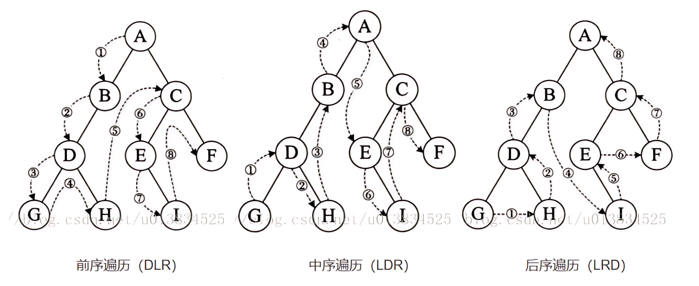

# 二叉树

- 二叉树：一个节点有左右两个孩子
- 二叉搜索树（BST：Binary Search Tree）：二叉树**左 < 根 < 右**，且严格小于（即不允许重复值）
  - 查询、插入、删除时间复杂度O(log n)
  - 中序遍历升序

> [!NOTE]
>
> - 上述复杂度是**平衡**时的情况；如果插入序列有序，会退化成一条链，复杂度变为 **O(n)**。
> - 因此实际工程中常用 **AVL**、**红黑树** 等**自平衡 BST**。

二叉树的搜索方式：

- 深度优先搜索（DFS：Depth-First Search）：尽可能深地访问子节点，先深入再回头
  - 前序遍历：根 → 左 → 右，处理自顶向下的场景
    - 构造：构造 BST、构造二叉树（非BST时需已知中序遍历）
    - 复制
    - 路径搜索
  - 中序遍历：左 → 根 → 右，**最核心意义**：**可以得到一个升序排列的节点序列**
    - 验证是否为 BST
    - 查找第 k 小的元素
    - 范围查询、排序输出
  - 后序遍历：左 → 右 → 根，**处理子树结果决定父节点行为的场景**
    - 删除树/释放内存：必须先删除左右子树，最后删除根节点
    - 子树信息汇总：如判断子树是否为 BST、计算子树高度、累加子树和等
    - 最近公共祖先（LCA）问题：需要先知道左右子树是否包含目标节点，再决定当前节点是否为 LCA
- 广度优先搜索（BFS：Breadth-First Search）：也称层序遍历，层层推进，借助队列（FIFO）保证“当前层”节点全部出队后，再把“下一层”节点全部入队

LeetCode 节点定义：

```java
public class TreeNode {
    int val;
    TreeNode left;
    TreeNode right;

    TreeNode() {
    }

    TreeNode(int val) {
        this.val = val;
    }

    TreeNode(int val, TreeNode left, TreeNode right) {
        this.val = val;
        this.left = left;
        this.right = right;
    }
}
```

# DFS 深度优先搜索




### 前序遍历

<div class="hai-panel-container">
<div class="hai-panel-1-2">
递归法：

```java
public List<Integer> preorderRecursive(TreeNode root) {
    List<Integer> ans = new ArrayList<>();
    dfsPre(root, ans);
    return ans;
}
private void dfsPre(TreeNode node, List<Integer> list) {
    if (node == null) return;
    list.add(node.val);           // 根
    dfsPre(node.left, list);      // 左
    dfsPre(node.right, list);     // 右
}
```

</div>

<div class="hai-panel-1-2">
迭代法（堆栈）：


```java
public List<Integer> preorderIterative(TreeNode root) {
    List<Integer> ans = new ArrayList<>();
    Deque<TreeNode> stack = new ArrayDeque<>();
    if (root != null) stack.push(root);
    while (!stack.isEmpty()) {
        TreeNode cur = stack.pop();
        ans.add(cur.val);                    // 根
        if (cur.right != null) stack.push(cur.right); // 右先压，后出
        if (cur.left  != null) stack.push(cur.left);
    }
    return ans;
}
```
</div>
</div>

### 中序遍历

<div class="hai-panel-container">
<div class="hai-panel-1-2">

递归法：

```java
public List<Integer> inorderRecursive(TreeNode root) {
    List<Integer> ans = new ArrayList<>();
    dfsIn(root, ans);
    return ans;
}
private void dfsIn(TreeNode node, List<Integer> list) {
    if (node == null) return;
    dfsIn(node.left, list);   // 左
    list.add(node.val);       // 根
    dfsIn(node.right, list);  // 右
}
```

</div>

<div class="hai-panel-1-2">

迭代法（堆栈）：


```java
public List<Integer> inorderIterative(TreeNode root) {
    List<Integer> ans = new ArrayList<>();
    Deque<TreeNode> stack = new ArrayDeque<>();
    TreeNode curr = root;
    while (curr != null || !stack.isEmpty()) {
        while (curr != null) {        // 一路向左
            stack.push(curr);
            curr = curr.left;
        }
        curr = stack.pop();           // 弹出左
        ans.add(curr.val);            // 访问根
        curr = curr.right;            // 转向右子树
    }
    return ans;
}
```

</div>
</div>

### 后序遍历

<div class="hai-panel-container">
<div class="hai-panel-1-2">

递归法：

```java
public List<Integer> postorderRecursive(TreeNode root) {
    List<Integer> ans = new ArrayList<>();
    dfsPost(root, ans);
    return ans;
}
private void dfsPost(TreeNode node, List<Integer> list) {
    if (node == null) return;
    dfsPost(node.left, list);   // 左
    dfsPost(node.right, list);  // 右
    list.add(node.val);         // 根
}
```

</div>

<div class="hai-panel-1-2">

迭代法（堆栈）：


```java
public List<Integer> postorderIterative(TreeNode root) {
    List<Integer> ans = new ArrayList<>();
    Deque<TreeNode> s1 = new ArrayDeque<>();
    Deque<TreeNode> s2 = new ArrayDeque<>();
    if (root != null) s1.push(root);
    while (!s1.isEmpty()) {
        TreeNode cur = s1.pop();
        s2.push(cur);                 // 根-右-左 逆序
        if (cur.left  != null) s1.push(cur.left);
        if (cur.right != null) s1.push(cur.right);
    }
    while (!s2.isEmpty()) ans.add(s2.pop().val);
    return ans;                       // 左-右-根
}
```

</div>
</div>

递归法要简单直观的多，迭代法比较复杂，需迭代顺序与堆栈相互配合，可以作为一种定式记忆：

- DLR：堆栈，弹根入右入左
- LDR：堆栈，从根开始，尽可能入左，弹，换从右开始
- LRD：双堆栈，栈1弹入栈2，栈1入左入右

递归法和迭代法的对比：

| 维度         | 递归 DFS                   | 迭代 DFS（手动栈）                   |
| ------------ | -------------------------- | ------------------------------------ |
| **代码量**   | 极少，逻辑直观             | 多几行，需自己维护栈                 |
| **思维难度** | 与定义直接对应，好写       | 需转换“隐式递归”为“显式栈”           |
| **速度**     | 有函数调用开销             | 省去调用，常数更快                   |
| **内存**     | 系统调用栈，深度大时易爆栈 | 自己控制，可换成显式堆，**不怕爆栈** |
| **可控性**   | 系统托管，难中断/暂停      | 可随时中断、回溯、加限速、多线程     |
| **调试**     | 栈帧深时堆栈信息杂乱       | 栈在堆里，调试清晰                   |
| **语言限制** | Python/Java 递归深度有限   | 无深度限制                           |

# BFS 广度优先搜索

层序遍历


<div class="hai-panel-container">
<div class="hai-panel-1-2">

仅值序列

```java
public List<Integer> levelOrder(TreeNode root) {
    List<Integer> ans = new ArrayList<>();
    if (root == null) return ans;

    Queue<TreeNode> q = new LinkedList<>();
    q.offer(root);

    while (!q.isEmpty()) {
        TreeNode cur = q.poll();
        ans.add(cur.val);          // 访问当前节点
        if (cur.left  != null) q.offer(cur.left);
        if (cur.right != null) q.offer(cur.right);
    }
    return ans;
}
```

</div>

<div class="hai-panel-1-2">


分层的值序列：


```java
public List<List<Integer>> levelOrderBottom(TreeNode root) {
    List<List<Integer>> ans = new ArrayList<>();
    if (root == null) return ans;

    Queue<TreeNode> q = new LinkedList<>();
    q.offer(root);

    while (!q.isEmpty()) {
        int size = q.size();          // 当前层节点数
        List<Integer> level = new ArrayList<>();
        for (int i = 0; i < size; i++) {
            TreeNode cur = q.poll();
            level.add(cur.val);
            if (cur.left  != null) q.offer(cur.left);
            if (cur.right != null) q.offer(cur.right);
        }
        ans.add(level);               // 一层结束
    }
    return ans;                       // 如果想自底向上，最后 Collections.reverse(ans);
}
```

</div>
</div>

两者的主要区别是：后者通过`Queue.size`获得当前层的元素个数，通过`for`循环将本层的所有元素出栈（下层元素也同步入队，但因 size 的控制，本轮不会处理到它们）后，下一轮再处理下层元素。

# 创建二叉树

### 直接构造二叉树

```java
TreeNode root = new TreeNode(1, new TreeNode(2), new TreeNode(3));

/*            5               
            /   \          
          4      8             
         /      /  \       
       11     13     4          
      /  \            \    
     7    2            1        */
TreeNode root = new TreeNode(5,
        new TreeNode(4, 
                     new TreeNode(11, 
                                  new TreeNode(7), 
                                  new TreeNode(2)), 
                     null),
        new TreeNode(8, new TreeNode(13), new TreeNode(4, null, new TreeNode(1))));
```

### 根据序列创建平衡 BST

<div class="hai-panel-container">
<div class="hai-panel-2-5">
BST 的中序遍历是升序序列，中序遍历为：

`[left ...] 根 [right...]`

根据升序、平衡规则，我们可以直接从各段的最中间取得根节点。

1. 序列升序
2. 取中间节点为根，左段和右段同理

</div>

<div class="hai-panel-3-5">

```java
class Solution {
    public TreeNode sortedArrayToBST(int[] nums) {
        return addNode(nums, 0, nums.length - 1);
    }
    
    public TreeNode addNode(int[] nums, int fromi, int toi) {
        if(fromi > toi) {
            return null;
        }
        int mid = (toi + fromi) / 2;
        TreeNode node = new TreeNode(nums[mid]);
        node.left = addNode(nums, fromi, mid - 1);
        node.right = addNode(nums, mid + 1, toi);
        return node;
    }
}
```

</div>

</div>

### 根据前序遍历和中序遍历创建二叉树

<div class="hai-panel-container">
<div class="hai-panel-2-5">
根据 DFS 的遍历规则：

前序遍历为：`根 [left ...] [right...]`，可以首先获得根节点，但不知道左右子树长度

中序遍历为：`[left ...] 根 [right...]`，若知道根节点，便可以从两边获得左右子树长度

结合两者：

1. 对中序遍历索引做 hash 映射`Map<值, 索引>`，方便后续获得根节点索引
1. 从前序遍历中取第一位，即为根节点
1. 从 hash 映射获得根节点在中序遍历中的索引，从而获得左右子树长度
1. 根据长度从前序遍历中取出左右子树，从 2 开始递归

</div>

<div class="hai-panel-3-5">


```java
class Solution {
    Map<Integer, Integer> inis = new HashMap<>();
    public TreeNode buildTree(int[] preorder, int[] inorder) {
        for (int i = 0; i < inorder.length; i++) {
            inis.put(inorder[i], i);
        }
        return findNode(preorder, inorder, 0, inorder.length - 1, 0,  inorder.length - 1);
    }

    public TreeNode findNode(int [] preorder, int[] inorder, int perf, int pert, int inf, int intx) {
        int rootv = preorder[perf];
        TreeNode root = new TreeNode(rootv);
        int rootini = inis.get(rootv);
        int leftCount = rootini - inf;
        int rightCount = intx - rootini;
        
        if(leftCount > 0) root.left = findNode(preorder, inorder, perf + 1, perf + leftCount, rootini - leftCount, rootini - 1);
        if(rightCount > 0) root.right = findNode(preorder, inorder, perf + leftCount + 1, perf + leftCount + rightCount, rootini + 1, rootini + rightCount);
        return root;
    }
}
```

</div>

</div>


# 验证是否 BST

<div class="hai-panel-container">
<div class="hai-panel-2-5">


递归法：

根据 BST 定义：左边子树严格小于根节点，右边子树严格大于根节点

1. 对于左边子树来说，父节点是它的上界
2. 对于右边子树来说，父节点是它的下界

> [!TIP]
>
> 不能单纯比较根与左右子的大小，而是要带上边界递归判断，反例：
>
> ```
>         10             
>        /  \             
>       9   14           
>      / \             
>     7  11            
> ```
>
> 11 对于它的子树来说是合法的，但是对于整个树是不合法的。

</div>

<div class="hai-panel-3-5">


```java
class Solution {
    public boolean isValidBST(TreeNode root) {
        return isValidBST2(root,  null, null);
    }

    public boolean isValidBST2(TreeNode root, Integer min, Integer max) {
        if(root == null) {
            return true;
        }
        if((max != null && root.val >= max) || (min != null && root.val <= min)) {
            return false;
        }
        return (root.left == null || root.left.val < root.val)
                && (root.right == null || root.right.val > root.val)
                && isValidBST2(root.left, min, root.val)
                && isValidBST2(root.right, root.val, max);
    }
}
```

</div>

</div>

##### 

<div class="hai-panel-container">
<div class="hai-panel-2-5">


中序遍历：

根据 BST 定义：中序遍历是一个升序序列

1. 中序遍历过程中，如果有不严格大于的情况即为非 BST

</div>

<div class="hai-panel-3-5">


```java
class Solution {
    public boolean isValidBST(TreeNode root) {
        Deque<TreeNode> stack = new LinkedList<TreeNode>();
        double inorder = -Double.MAX_VALUE;

        while (!stack.isEmpty() || root != null) {
            while (root != null) {
                stack.push(root);
                root = root.left;
            }
            root = stack.pop();
              // 如果中序遍历得到的节点的值小于等于前一个 inorder，说明不是二叉搜索树
            if (root.val <= inorder) {
                return false;
            }
            inorder = root.val;
            root = root.right;
        }
        return true;
    }
}
```

</div>

</div>

# 第 k 小元素

<div class="hai-panel-container">
<div class="hai-panel-2-5">


中序遍历：

根据 BST 定义：中序遍历是一个升序序列

1. 中序遍历过程中，返回第 k 个元素

扩展：如何频繁查找第 k 小的元素？

1. 使用哈希表缓存各节点子元素个数
2. 从根节点开始，如果根节点元素个数等于 k，根节点就是第 k 小的元素；如果小于，则在左子树；如果大于，则在右子树

扩展：如何查找第 k 大元素？

中序遍历通常指 LDR，BST 的 LDR 为升序序列，故 RDL 为降序序列，两个是一种遍历方式，稍微修改程序即可。

</div>

<div class="hai-panel-3-5">


```java
class Solution {
    public int kthSmallest(TreeNode root, int k) {
        Deque<TreeNode> stack = new ArrayDeque<TreeNode>();
        while (root != null || !stack.isEmpty()) {
            while (root != null) {
                stack.push(root);
                root = root.left;
            }
            root = stack.pop();
            --k;
            if (k == 0) {
                break;
            }
            root = root.right;
        }
        return root.val;
    }
}
```

</div>

</div>

# 路径总和问题

子节点影响父节点的情况，通常思路是将树简化为左子树/节点、根、右子树/节点，分析所求值与三者的数量关系，通过后序遍历的方式进行计算处理。

### 二叉树的直径

<div class="hai-panel-container">
<div class="hai-panel-2-5">

相邻两节点中间的连线称为 1 条边，求任意两节点间的最大边数。

首先需要理解边这个概念，边与节点的关系为：`边 = 路径的节点数 - 1`。

简化分析：

记子树最大路径节点数为 L、R，则根节点两边组成的路径最大节点数为`L + R + 1`。

而左子树的最大路径节点数 L 为：它自己的两个子树中最大的一个加1，即`Max(L, R) + 1`

所以每层递归，我们要计算两个东西：

1. 节点两边构成的最大路径节点数`L + R + 1`，与最大值进行比较
2. 向上层返回`Max(L, R) + 1`（选取左右子树中路径较长的一个），用于上层节点的`1`的计算

</div>

<div class="hai-panel-3-5">


```java
class Solution {
    int maxLength = 0;
    public int diameterOfBinaryTree(TreeNode root) {
        maxDiameter(root);
        return maxLength - 1;
    }

    public int maxDiameter(TreeNode node) {
        if(node == null) return 0;
        int l = maxDiameter(node.left);
        int r = maxDiameter(node.right);
        maxLength = Math.max(maxLength, l + r + 1);
        return Math.max(l, r) + 1;
    }
}
```

</div>

</div>

### 二叉树的最大路径和

<div class="hai-panel-container">
<div class="hai-panel-2-5">

路径上的节点和的最大值

其实跟上题求直径是很像的，只是我们对子树的处理方式不一样。

记子树最大路径节点数为 L、R，则根节点两边组成的路径最大节点数为`L + R + 1`。

而左子树的最大路径节点数 L 为：它自己的两个子树中最大的一个加1，即`Max(L, R) + 1`

每层递归，我们首先要计算两个东西：

1. 节点两边构成的最大路径和`L + R + node.val`，与最大值进行比较
   1. 题设并不一定需要从叶子开始或结束，也就是路径和从中途开始，如果一个左右子树提供了负值，那么我们应该丢弃他：L = Max(0, L)
2. 向上层返回`Max(L, R) + node.val`（选取左右子树中路径和较大的一个），用于上层节点的`1`的计算

</div>

<div class="hai-panel-3-5">


```java
class Solution {
    int max = Integer.MIN_VALUE;
    public int maxPathSum(TreeNode root) {
        pathSum(root);
        return max;
    }

    public int pathSum(TreeNode root) {
        if(root == null) return 0;
        int l = Math.max(0, pathSum(root.left));
        int r = Math.max(0, pathSum(root.right));
        max = Math.max(l + r + root.val, max);
        return Math.max(l, r) + root.val;
    }
}
```

</div>

</div>


### 二叉树的公共祖先

对于有根树 T 的两个节点 p、q，最近公共祖先表示为一个节点 x，满足 x 是 p、q 的祖先且 x 的深度尽可能大（一个节点也可以是它自己的祖先）。

简单来说就是计算离节点 p、q **最近**的公共祖先。。

**本题其实隐含了两个重要题设**：

1. 节点是唯一的
2. p、q 都一定存在树中

下文的思路都建立在这两个条件之下，下文中的 “pq” 包含了 p、q、p 且 q 的情况。

<div class="hai-panel-container">
<div class="hai-panel-2-5">


LeetCode 官解：

公共祖先：顾名思义即是 p 的祖先、也是 q 的祖先，它可以有很多个。

而最近公共祖先是唯一的，如果 root 是最近公共祖先，它的限定条件是：

```java
(left是pq祖先 && right是pq祖先) || ((left是pq祖先 || right是pq祖先) && (root等于p || root等于q))
```

很好理解：

- 左右各是 pq 的祖先，根就是最近公共祖先
- 左右其中一个是pq祖先，根又是pq之一，

</div>

<div class="hai-panel-3-5">


```java
class Solution {

    private TreeNode ans;

    public Solution() {
        this.ans = null;
    }

    private boolean dfs(TreeNode root, TreeNode p, TreeNode q) {
        if (root == null) return false;
        boolean lson = dfs(root.left, p, q);
        boolean rson = dfs(root.right, p, q);
        if ((lson && rson) || ((root.val == p.val || root.val == q.val) && (lson || rson))) {
            ans = root;
        } 
        return lson || rson || (root.val == p.val || root.val == q.val);
    }

    public TreeNode lowestCommonAncestor(TreeNode root, TreeNode p, TreeNode q) {
        this.dfs(root, p, q);
        return this.ans;
    }
}
```

</div>

</div>


<div class="hai-panel-container">
<div class="hai-panel-2-5">

从官解巧妙简化的方法：

- 左右各是 pq 的祖先，根就是最近公共祖先
- 如果左右仅一个节点是 pq 的祖先，那么应当返回该节点
  - 情况1：该节点是 p 且 q 的祖先，上层递归的另一分支子树中必然无法再找到 p 或 q，所以都会满足本条件，该节点会被上层递归层层返回，成为最终返回值
  - 情况2：该节点仅是 p、q 中一个的祖先，该节点被层层返回，直到上面某一层中另一分支树是另一个的祖先，两个分支树都满足，返回该层的根节点，然后回到情况1

</div>

<div class="hai-panel-3-5">


```java
public TreeNode lowestCommonAncestor(TreeNode root, TreeNode p, TreeNode q) {
    if(root == null) return null;
    TreeNode l = lowestCommonAncestor(root.left, p, q);
    TreeNode r = lowestCommonAncestor(root.right, p, q);
    if(root.val == p.val || root.val == q.val || (l != null && r != null)) return root;
    return l != null ? l : r;
}
```

</div>

</div>

### 路径总和

> 给定一个二叉树的根节点 `root` ，和一个整数 `targetSum` ，求该二叉树里节点值之和等于 `targetSum` 的 **路径** 的数目。
>
> **路径** 不需要从根节点开始，也不需要在叶子节点结束，但是路径方向必须是向下的（只能从父节点到子节点）。
>
> 
>
> [437. 路径总和 III - 力扣（LeetCode）](https://leetcode.cn/problems/path-sum-iii/description/?envType=study-plan-v2&envId=top-100-liked)

<div class="hai-panel-container">
<div class="hai-panel-2-5">

两重递归法：

- 第一重：递归每一个节点
- 第二重：以该节点为根，计算它到每一个叶子的路径和

> [!TIP]
>
> 第二重递归中传递减法的用意：
>
> 路径和等于 targetSum，也就是`n前缀 + n下层 = targetSum`，移项就是`n下层 = targetSum - n前缀`，可以减少不必要的参数传递。

</div>

<div class="hai-panel-3-5">


```java
class Solution {
    public int pathSum(TreeNode root, int targetSum) {
        int ret = 0;
        if(root == null) return ret;
        ret += rootSum(root, targetSum);
        ret += pathSum(root.left, targetSum);
        ret += pathSum(root.right, targetSum);
        return ret;
    }
    
    public int rootSum(TreeNode root, long targetSum) {
        int ret = 0;
        if(root == null) return ret;
        
        int val = root.val;
        if(val == targetSum){
            ret ++;
        }
        ret += rootSum(root.left, targetSum - val);
        ret += rootSum(root.right, targetSum - val);
        return ret;
    }
}
```

</div>

</div>

<div class="hai-panel-container">
<div class="hai-panel-2-5">

前缀和：                    

首先需要理解前缀和的核心思路：

1、例子：一个单链的树为`2->3->4`，targetSum 为 7

- 递归到节点 4 时，前缀和为 9，哈希表（`Map<值, 计数>`）为：`{2: 1, 5: 1, 9: 1}`，`当前的前缀和 - targetSum`即`9 - 7 = 2`，使用 2 从哈希表取出前缀和计数1，即`[3,4]`计数和满足
- 若后面还有一个节点`->3`，前缀和为 12，哈希表为：`{2: 1, 5: 1, 9: 1, 12: 1}`，`12 - 7 = 5`，使用 5 从哈希表取出前缀和计数1，即`[4,3]`计数和满足

跟双重递归法中的减法有异曲同工之妙，这里的思路是：

递归到当前节点时，如果存在某个连续子串的路径和为 targetSum，那么：`前面的一段前缀和 + targetSum = 当前前缀和`，成立的条件就是`前面的一段前缀和`能够在哈希表中找到，也就是`当前前缀和 - targetSum`能够在哈希表中找到。

> [!TIP]
>
> 你可能会问是否存在这个情况呢：`前面的一段前缀和 + targetSum + 某一段路径和 = 当前前缀和`？
>
> 这种情况在之前的节点就已经处理了，仔细看例子1中的第一点到第二点的过程。

2、例子：一个单链的树为`2->3->4`，targetSum 为 9

- 递归到节点 4 时，前缀和为 9，哈希表（`Map<值, 计数>`）为：`{2: 1, 5: 1, 9: 1}`，`当前的前缀和 - targetSum`即`9 - 9 = 0`，使用 0 从哈希表中无法取到计数，但子串`[2,3,4]`是满足的

考虑到整个串路径和刚好为 targetSum 的情况，可以一开始固定在哈希表中放入一个`{0: 1}`

3、前缀和的缓存哈希表并非所有子节点都可用，一个节点的前缀和仅用于它的子节点

```
         1                 
        / \                
       3   5               
      / \                 
     6   7                      
```

`[1, 3]`的前缀和哈希表`{1: 1, 4: 1}`可以用于节点  6，7，但不可以用于5，在退出节点时，应该将当前节点的前缀和移除：

```java
prefix.put(curr, prefix.getOrDefault(curr, 0) + 1);
ret += dfs(root.left, prefix, curr, targetSum);
ret += dfs(root.right, prefix, curr, targetSum);
prefix.put(curr, prefix.getOrDefault(curr, 0) - 1);
```

</div>

<div class="hai-panel-3-5">


```java
class Solution {
    public int pathSum(TreeNode root, int targetSum) {
        Map<Long, Integer> prefix = new HashMap<Long, Integer>();
        prefix.put(0L, 1);
        return dfs(root, prefix, 0, targetSum);
    }

    public int dfs(TreeNode root, Map<Long, Integer> prefix, long curr, int targetSum) {
        if (root == null) {
            return 0;
        }

        int ret = 0;
        curr += root.val;

        ret = prefix.getOrDefault(curr - targetSum, 0);
        prefix.put(curr, prefix.getOrDefault(curr, 0) + 1);
        ret += dfs(root.left, prefix, curr, targetSum);
        ret += dfs(root.right, prefix, curr, targetSum);
        prefix.put(curr, prefix.getOrDefault(curr, 0) - 1);

        return ret;
    }
}
```

</div>

</div>

# 层序遍历

### 二叉树的右视图

<div class="hai-panel-container">
<div class="hai-panel-2-5">

在层序遍历的分层中，取最后一个。

> [!TIP]
>
> 不能单纯递归右子树，因为在左子树深度很深，右子树深度很浅时，右视图看到的是左子树的节点，所以应该用层序遍历的方式取节点。

</div>

<div class="hai-panel-3-5">


```java
class Solution {
    public List<Integer> rightSideView(TreeNode root) {
        List<Integer> ans = new LinkedList<>();
        if(root == null) return ans;
        Queue<TreeNode> queue = new LinkedList<>();
        queue.add(root);
        while(!queue.isEmpty()) {
            
            int size = queue.size();
            for(int i = 0; i < size; i++) {
                TreeNode node = queue.poll();
                if(node.left != null)queue.add(node.left);
                if(node.right != null)queue.add(node.right);
                
                if(i == size - 1) {
                    ans.add(node.val);
                }
            }
        }
        return ans;
    }
}
```

</div>

</div>